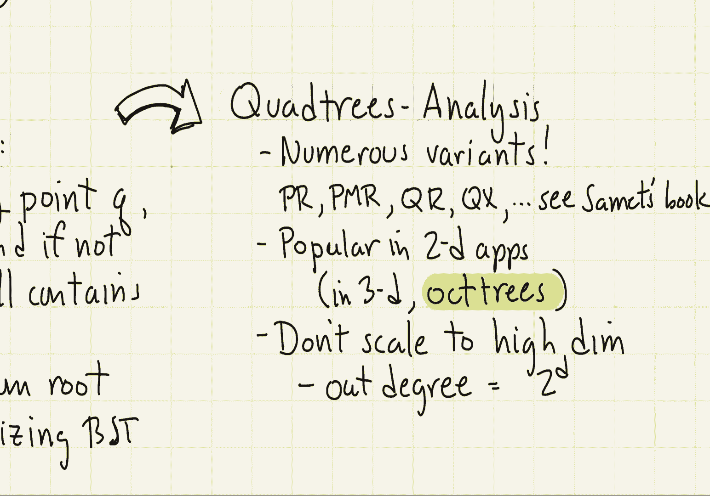

# 【双语字幕+资料下载】马里兰大学 CMSC420 ｜ 数据结构 (2021最新·完整版) - P39：L15- 四叉树与KD树 2 - ShowMeAI - BV1Uh411W7VF

let's continue our discussion of，geometric data structures by talking。

first let's talk about quadtrees in an，abstract way there are actually a lot of。

different data structures that go under，the name of quad trees and we're going。

to present one of them called a point，quad tree，generally speaking a quadtree is a。

partition tree but it is not a binary，partition tree it partitions space up，into a number of cells。

the cells in this case are going to be，axis parallel rectangles or what are。

sometimes called aabbs for axis align，in the two-dimensional case the way this。

works is a splitter consists of two，lines，horizontal and vertical and that splits。

the cell into four rectangles the，rectangles are called let's say，northwest northeast southwest and。

southeast and that gives rise to a node，that has four children。

in general what happens is the splitter，is going to split the cell using let's。

say planes or hyperplanes，into，two to the d where d is the dimension，different hyper rectangles。

now let's talk about a point quadri in，particular，in a point quad tree each internal node。

is going to store a point，the way in which we are going to split。

the cell then is we are going to pass a，horizontal and vertical line through，this point。

okay so for example，in this case let's say we have a，rectangle that is running from let's say。

0 to 9 along x and from 0 to 6 along y，and suppose our splitting point is the。

point with coordinates 5 comma 4 okay x，coordinate 5 y coordinate 4。

so what we do in this case is we pass a，horizontal and vertical line through。

that point and that gives rise to four，subrectangles right northwest north east，southwest southeast。

now recursively then we could continue，to do the splitting for example in the。

southwest corner if we have the point 2，2，we could use that to split，right into four more sub boxes。

let's say in the southeast corner we，have the 0。73 we could again use that to，split the。

you know that quadrant into，four other sub quadrants and the 0。41 so，on and so forth，so notice。

if i was to draw the resulting tree and，in particular to draw the extended tree。

by adding let's say the，external nodes where you know we，essentially have null pointers。

each one of these external nodes is，going to correspond to an empty region。

of space that is one of these rectangles，that we get in our final decomposition。

next let's consider how we perform a，simple operation，suppose we wanted to locate a point in。

our quad tree okay so given a query，point q，how do we know whether or not it's in，the tree。

well let's take a look at this example，by considering a point q that is oh。

perhaps placed somewhere down in the，southeast quadrant of that 4 1 cell。

how do we proceed well what we're going，to do is we're going to follow the path。

from the root down to the appropriate，you know，cell that contains this point。

in this particular case right，you're going to be in the，you know relative to the point 5 4。

you're going to be less than 5 less than，4 so you're going to be in the southwest。

quadrant relative to 2 2，you're going to be bigger than the x，coordinate 2 smaller than the y。

coordinate so that puts you in the，southeast quadrant relative to 4 1 q has，a smaller x。

and a you know smaller y so it's going，to be in the southwest quadrant so in。

other words the path just leads us to，the external node that's going to，contain the point q。

okay as we mentioned earlier this is，sometimes called point location you're。

essentially identifying the leaf node，that contains the point q。

next let's consider how to analyze the，quadtree there actually are numerous。

variants of the quad tree and they go，under various kind of acronyms the pr。

quadtree the pmr quad tree the qr quad，tree the qx quad tree，if you want to find out all about quad。

trees i'd refer you to hanan sammitt's，book on the subject he has he studies。

basically all the variants of these of，this data structure and which variants。

are you know particularly well suited to，which applications，we're only going to talk about the。

simplest of these things which is，something called the point quad tree，but quad trees are very。

widely used in especially two and three，dimensional applications in 2d of course。

this is where the term quadri comes from，if you're in 3d they're called octrees。

and because people don't know what to，call you know four-dimensional and。

five-dimensional trees usually they just，use the word quad tree for any dimension。

even though the number of children，you're going to have is generally going。

to grow as 2 raised to the power of d，one of the issues here has to do with。

scalability if the dimension gets to be，very high notice that the out degree of。

every node in the tree is going to be 2，to the d so if i wanted to try this in。

dimension let's say you know i don't，know，20 right the out degree of every node。

would be 2 to the 20 that is close to a，million so obviously you know these are。

not going to be practical in very high。

dimensions，well what would you do if you had higher。

dimensional data sets this gives rise to，the idea of what's called the katy tree。

okay the katy tree is a binary variant，of the quad tree，now rather than。

at each point splitting in all the，possible directions that is according to。

each of the different axes we're just，going to choose one of the splitting。

directions either horizontal or vertical，in 2d or for example if you were in 3d。

right you would have a plane which is，either let's say orthogonal to the x。

orthogonal to the y orthogonal to the z，axis in general there are d different。

ways in which you can split a point，a cell is still going to be an axis。

align bounding box that is it's going to，be a generalized version of a rectangle。

and so let me draw a little picture of，what a typical kd tree might look like。

what i'm going to do is starting with an，initial rectangular cell right i'm going。

to split let's say the root splits，vertically and i'm going to indicate，that by drawing a。

cell with a vertical line through it，let's say at the next level each of。

those cells is split horizontally so i'm，going to draw horizontal lines through。

those little nodes okay and，again in this manner what's going to。

happen is i'm going to get a binary tree，okay so i'm going to avoid this kind of。

nasty curse that quadri has of course i，have to determine you know。

how do you decide which direction you're，going to split in how do you decide。

where that splitting you know line is，going to go and these are all things。

that we're going to talk about later on，okay，um，by the way when i split vertically it's。

rather obvious you know the left subtree，is going to be the points on the left。

and the right subtree the points on the，right how about when i split。

horizontally well the convention we're，going to use is basically the smaller。

coordinates are going to go on the left，side，the larger coordinates are going to go。

on the right side so in this case if i，have a horizontal splitting line the。

left is going to contain the things that，are below right the lower y coordinates。

and the right subtree are going to，contain the points that lie above the。

splitting plane that is those that have，the larger y coordinates the history of，katy trees is。

quite interesting they were designed by，john bentley a very famous algorithm，designer back in 1975。

the nomenclature for katy tree is kind，of unusual so bentley referred to his。

trees as 2d for two-dimensional trees，right and if you do them in 3d then he。

called them 3d trees okay and obviously，if you do it in dimension 38 they would，be 38 d trees。

over time people got tired of calling，them you know 2d 3d 4d trees and so they。

just generally adopted the term kd tree，where k would be whatever the dimension。

is that you're working with，okay so sometimes you'll hear these。

things called 2d trees or 3d trees but，most of the time they're just referred。

to as katy trees and someone will just，say it's a katy tree in dimension six，let's say。

okay so as i said before，the two the important question with kd，trees is how do you decide where to。

split and in which direction to split，and we're going to talk about that next。

