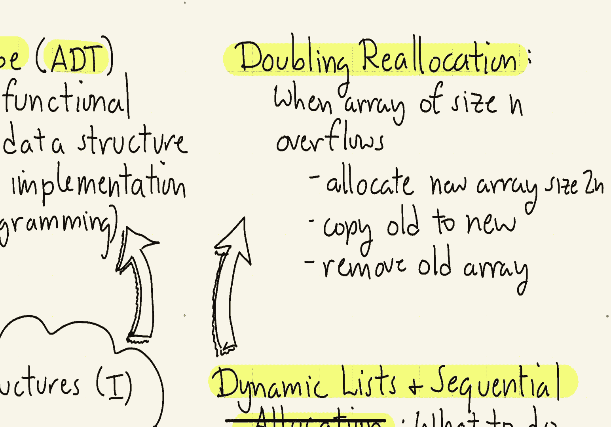
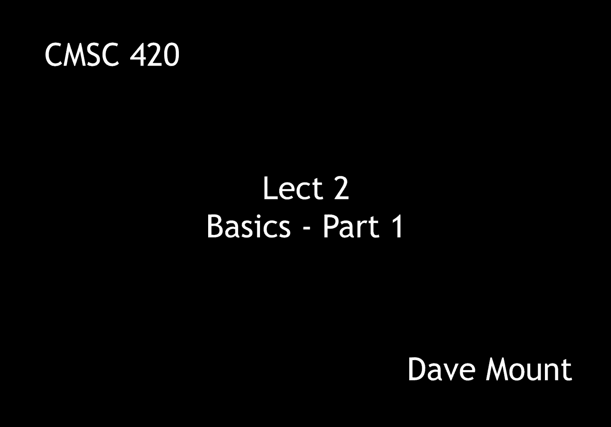

# 【双语字幕+资料下载】马里兰大学 CMSC420 ｜ 数据结构 (2021最新·完整版) - P3：L2- 基础数据结构 1 - ShowMeAI - BV1Uh411W7VF

hello everyone in this segment we're，going to talk about basic data，structures。

in particular we're going to talk about，abstract data types，talk about a few typical examples。

including linear lists stacks queues and，decks and we'll talk a little bit about。

dynamic aspects of sequential allocation，so let's get started。

in any study of data structures the very，first thing we should be talking about。

is the notion of an abstract data type，as the name suggests an abstract data。

type abstracts away the functional，elements of a data structure that is the。

mathematical or formal aspects of that，data structure as，distinguished from its implementation by。

which we mean either the algorithmic or，even more concretely the programming。

aspects of the data structure，as an example of this let's consider the。

linear list abstract data type，the linearlist abstract data type just。

stores a sequence of elements call them，a1 a2 up to a sub n，examples of operations include the。

initialization operator init that just，creates an empty list think of this as a，constructor in java。

the accessor function get i just returns，the ith element of the list the set。

function replaces the ith value a sub i，with the value x，the insert operation inserts the element。

x just prior to the ith element which，causes all the elements following this。

to be slid down one position further，the delete operation removes the item。

from the list and then all the items，that follow it will then slide up one。

position the length operation just，returns the current number of items that，are in the list。

the operations that we've just listed，define the semantics that is the。

behavior of the data structure however，they don't explain how the data。

structure is to be stored or how the，operations are to be carried out this is。

the function of the implementation let's，talk about two possible implementations。

the first is a sequential allocation，where we just store the elements inside。

of a one-dimensional array so here's an，example notice that the number of。

elements in the array being dynamic is，not necessarily going to fill the entire，array。

for this reason it's necessary to have，an auxiliary variable that tells us how。

many elements of the array are actually，being used another way to store the list。

is to use a linked allocation，this way we have a collection of nodes。

that are joined together either singly，linked or doubly linked for example in a。

singly linked list we're going to have a，head pointer that will point to a first。

note containing a1 that'll have a link，pointing to the element a2 that'll have。

a link pointing to the element a3 and so，on and so forth until we get down to the。

element a sub n and the last pointer，here will be a null pointer。

i'm going to use this notation of having，a little，t shape figure to indicate my null。

pointers an alternative representation，would be to use a doubly linked list。

here again we're going to have a head，pointer that points to the first element。

of the list and then after that each，element will point both to its。

successor in the list that is the，following element and its predecessor in。

the list and again the first element，will have a null predecessor link and。

then the last element will have a null，successor link，of course the performance of the data。

structure is going to depend on the，choice of implementation，and。

this last sentence effectively sums up，the entire course this entire course is。

going to be devoted to looking at，different ways of implementing data。

structures and what the impact of those，implementation choices are on the。

performance of the resulting data，let's consider three very basic abstract。

data types the stack the queue and the，deck，the stack is a data type which stores a。

linear list of elements and all accesses，occur from one side of the list which is。

called the top the two basic elements，are push and pop push inserts an element。

on the top and pop removes an element，from the top，the canonical example of a stack i guess。

is a stack of plates at a cafeteria，plates are added to the top of the stack。

and then they're also removed from the，top of the stack in the queue data。

structure this is sometimes called a，fifo list first in first out。

insertions occur by enqueuing things at，the tail of the list and elements are。

dequeued by removing them from the head，of the list i guess the canonical。

example here is a line of people who are，waiting for service at some facility。

like the dmv so people line up they，enqueue with the tail of the list and。

then they're removed from the head of，the list，the last data structure is called a deck。

although it has this funny spelling it，is pronounced like d-e-c-k like a deck，of cards。

this generalizes the stack in the queue，because you can insert or delete from。

either end of the linear list，the cutest thing about the deck is its，name。

the name is kind of a play on words，you can either think of it as a double。

ended queue that is d e q which explains，the first spelling of the name。

or you can think of it something like a，deck of cards where you can either deal。

cards or add cards off the top of the，deck or you can deal cards if you're。

unscrupulous off the bottom of the deck，so like a deck of cards it is easy to。

add things from either end，the last topic i want to talk about in，this segment is dynamic lists and。

sequential allocation the issue is the，following when you have a data structure。

that is using a linked allocation you，can always go out and get more nodes。

from your memory management system，however if you have a single array when。

you fill up the array and someone asks，to insert an additional item the problem。

is you now overflow your array capacity，and you have to do something about that。

and the question is what should you do，the approach that i want to discuss is。

used in a lot of data structure，libraries it's called doubling，reallocation here's the idea。

suppose you have a data structure that's，being stored in an array of size n and。

you run out of space let's say someone，is asked to push or enqueue an。

additional element and that would take，you beyond the available space that you。

have the idea is pretty simple what，we're going to do is we'll allocate a。

brand new array of twice the size that，is of size 2 times n，we'll copy all the old contents into the。

new one and then we'll remove the old，array，in the next segment we're going to。

explore the efficiency of this method。

and contrast it with some other possible。

