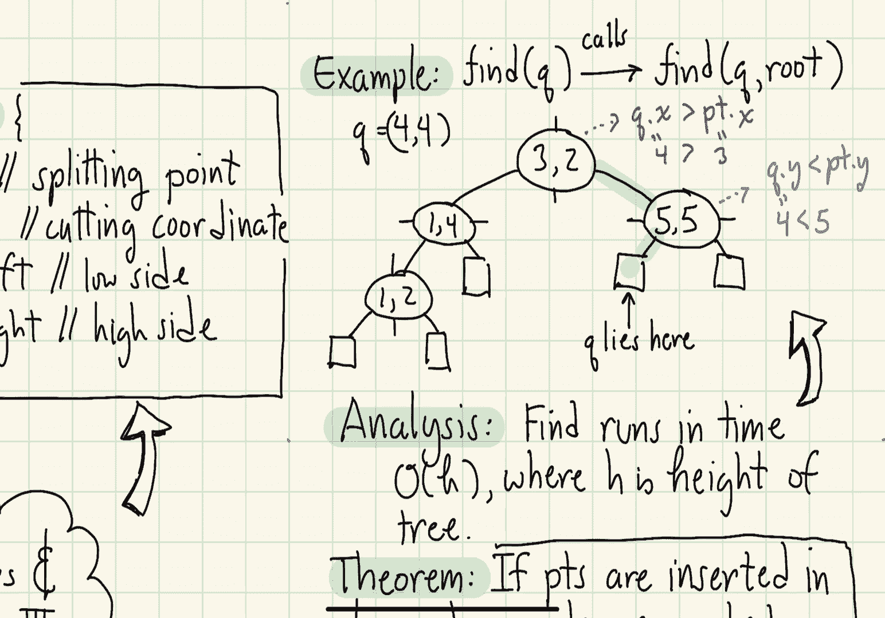

# 【双语字幕+资料下载】马里兰大学 CMSC420 ｜ 数据结构 (2021最新·完整版) - P40：L15- 四叉树与KD树 3 - ShowMeAI - BV1Uh411W7VF

in this segment we're going to delve，deeper into how it is that katy trees，are defined。

so first off let's take a look at the，node structure for a kd tree。

every node is going to contain the，following things，first off it's going to contain a point。

and this is essentially going to be the，point at which we are going to you know，split space about。

next we have to know whether the，splitting is going to be done you know。

vertically or horizontally and the way，we do that is we're going to have an。

integer called the cutting dimension，okay so the cutting dimension is going，to be a number。

basically from well 1 to d or 0 to d，minus 1 depending on how you index your。

coordinates which is going to indicate，the dimension on which we're using the。

cutting so for example if we index，points you know if 0 is x 1 is y and 2，is z。

then a cutting dimension of 1 is going，to mean we're going to be cutting along，the y direction。

or using the y coordinate to cut things，with，when we cut the space what's going to。

happen then is going to be some points，will fall on the left side of the。

cutting plane some points are going to，fall on the right side and this will。

call the low side and the high side the，lower coordinates on the cutting。

dimension will be put in the left，subtree the higher coordinates along the。

cutting dimension will be placed in the，right subtree，so let's take a look at an example of，this。

the way i'm going to illustrate this in，the two-dimensional case is i'm going to。

draw a little circle for every internal，node and i'm going to place a line。

through it either a vertical line，indicating that x is the cutting。

direction right we're cutting along the，x-coordinate or a horizontal line。

indicating that i'm going to be using，the y coordinate and again left will be。

for the lower coordinates along the，cutting dimension and right will be for，the higher coordinates。

okay so let's start with this box that，goes from 0 to 6 in each of the two，directions。

and let's suppose our first point is the，point 3 2。 so what we're going to do is。

we're going to start let's just assume，we're we decide that we're going to cut。

that along the x coordinate so we'll put，a vertical line through the point 3 2。

right that'll split plane into x，coordinates smaller than 3 that will go。

in the left subtree and points that are，larger than 3 in the right subtree。

next the point 1 4 comes along because 1，is smaller than 3 it's going to go in。

the left subtree okay let's create a，node for that let's suppose we decide in。

this case we're going to split along the，y coordinate okay so in this case we put。

a horizontal line through the point okay，and i indicate that when i draw the node。

by putting a horizontal line through the，node okay and again y coordinates that。

are smaller than the 4 are going to go，in the left subtree y coordinates that。

are larger than 4 are going to go in the，right subtree and again in order to get。

into the sub tree your x coordinate，already has to be smaller than 3。next let's suppose the 0。

55 comes along，we're going to put that in the right，subtree because 5 is bigger than 3 right。

along the x-coordinate we then create，let's say we decide to do in this case a。

split along the y-direction so we're，going to create a y-splitter through the。

point with the coordinate 5 the y，coordinate 5。 again values y values。

smaller than 5 are going to go in the，left subtree y values bigger we'll go in，the right subtree。

next let's say the point 1 2 comes along，okay so 1 two is that's to the left of。

the point the root three two right it's，below the point one four okay so it's。

going into that um you know to the left，child of one four we insert that note。

there let's suppose we decide that it's，going to be an x splitter and again i'm。

actually applying a very simple rule i，just alternate between x and y at every。

level and then when that point comes in，i create a again it's a vertical line。

going through that point so values，smaller than one will go on one side。

values larger will go on the other side，okay and then notice if i draw in the，external nodes。

for this tree each external node is，going to be in one-to-one correspondence。

with one of the rectangles in my final，subdivision you know the external nodes。

below the node one two correspond to，those little two sub-rectangles on。

either side of that vertical line，passing through one two，uh so the question that i left open here。

is well how do we choose the cutting，dimension，uh the standard method for doing this is。

to just cycle through，the various axes right x then y then x。

then y or if you're working in let's say，three dimensional space x then y then z。

x then y then z okay so obviously i，don't actually have to store the cutting。

dimension what i can do is i can just，keep track of whatever the depth of the。

node that i'm working with right i just，know based upon that what the cutting。

direction is going to be when bentley，suggested the kd tree he suggested this。

method of simple cycling but he also，suggested that you know if your point。

distribution is not perfectly uniform，you may prefer to select the cutting。

dimension in a different manner and he，called this the optimized kd tree the。

idea is what you do is you look at your，points in the current cell and you see。

along which direction are they most，spread out okay if they're for example。

if the if the points are most widely，spread out along the x-coordinate then。

what you're going to do is you're going，to split，orthogonal to the x-coordinate that is。

you're going to use the x-coordinate to，perform the split-on and his proposal。

was that where you should split is，actually through the median point this。

is nice because it's going to guarantee，that you're going to obtain a you know a。

tree of log logarithmic height at the，end of the day，if your points are more spread out along。

the y-coordinate then you're going to，choose the y-coordinate as the splitter。

okay and then again you're going to pick，the point that has the median y。

coordinate as the splitting point so if，you're given the points in advance this。

produces a tree of guaranteed，logarithmic height and it actually，performs very well in practice next。

let's talk about how you perform a find，operation，using a kd tree，okay well it doesn't matter which。

particular variant of the kd tree you，decide to use right in both cases the。

find is going to operate in exactly the，same way what we're going to do is we're。

going to start at the root node we're，going to descend the tree。

at each point we look at our query point，right and we look at the current cutting。

dimension if our query point along the，cutting dimension is smaller than the。

point that is stored in this node along，that cutting dimension right then we。

branch to the left otherwise we branch，to the right so here's a simple function。

that we can use maybe a simple utility，function that will help us out。

we call this function on left and so，what the function does is it's going to。

decide whether a point q，is going to be on the left subtree or。

the right subtree the way the function，works is we check the point q。

that coordinate along the cutting，dimension for this node and we compare。

it against sort of the point that is，being stored in the node along its。

particular cutting dimension if q is，smaller the convention is we go to the。

left if q is greater than or equal then，the convention is we go on the right you。

might say equal are you going to allow，points to be equal wouldn't that mean。

duplicate points well notice points can，have duplicate x-coordinates as long as。

they have a different y-coordinate they，will be a different point so you do have。

to be careful about allowing for points，having duplicate x-coordinates as long。

as both coordinates are not duplicated，you're okay so using this，little utility function。

we can define our find operation as，follows so we're given two things we're，given the point q。

that we want to find and we're given our，current kd node and here's our helper。

function obviously if we fall out of the，tree well we just return null or。

in general as i have described it to you，before，a better approach would be to use an。

extended tree and when you get to an，external node you return a pointer to。

that external node that you landed up at，if the point q is identical to the point。

that's being stored here then i could，just return the value of that point。

otherwise i check my on left function if，i if q is on the left of p right then i。

apply the search on the left side if q，is on the right side of p in contrast。

then i perform the search on the right，subtree what is the running time of this。

procedure well um it kind of depends on，the height of the tree obviously we're。

just going to simply perform a constant，amount of work at every one of the nodes。

and i drop down a level of the tree so，whatever the height is that's going to。

be the running time if you insert the，points in random order then this behaves。

very much like a random binary search，tree and you can show the height is。

going to be an expectation of log n by，the way if，rather than inserting the points one by。

one you instead，you know just take a batch of points and，insert them all into the tree but you。

use bentley's you know optimize katy，tree where you are constantly using the。

median point as the location of the，split now you actually get a tree that。

is exactly you know basically ceiling of，log n in terms of height so that is even。

better performance but the catch there，is you have to have all the points in。

advance right you're not just inserting，them one by one as as points come along。

okay so let's take a look at a little，example here consider the quatre i'm。

sorry consider the katy tree that i've，shown below here and suppose we want to，search for the 0。

44 so we're going to，call our helper at the root the root，node is an x splitter。

right so we're going to branch since 4，the query points x coordinate is bigger。

than the root's x coordinate 4 is bigger，than 3 we're going to branch to the，right。

when you get to 5 we compare，q's y coordinate because the node 5 5 is。

a y splitter as indicated by that，horizontal line right 5 5 is a y。

splitter so we do is we are going to，compare the four，y coordinate for q against the five y。

coordinate in that node well four is，less than five so we branch to the left，child。

okay and then boom we wind up in that，little external node so when i describe。

the procedure i describe the procedure，you know using standard trees in other。

words at this point we would just hit，null but like i said in practice you。

oftentimes like to use this extended，representation so that rather than。

hitting null which you actually just hit，is the external node that contains the。

point q this is all about how to the，basic definitions for kd trees and how。

to perform the find operation in the，next segment we're going to talk about。

how to perform the operations of。

