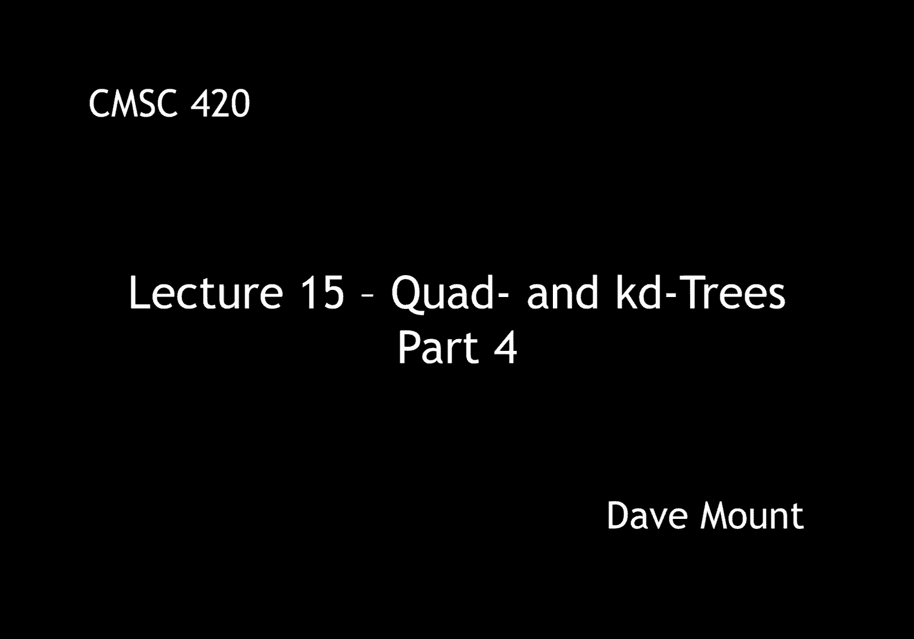
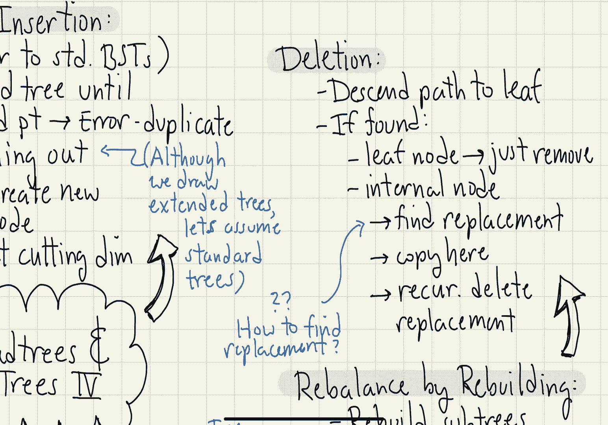

# 【双语字幕+资料下载】马里兰大学 CMSC420 ｜ 数据结构 (2021最新·完整版) - P41：L15- 四叉树与KD树 4 - ShowMeAI - BV1Uh411W7VF

in this next segment we're going to，continue talking about quad trees and。

katy trees and in particular we're going，to talk about insertion。

so let's talk about kd tree insertion，the process is fairly similar to。

insertion in standard binary search，trees，to begin with we're going to descend the，tree。

until we either find the point in which，case we report an error because we have，a duplicate key。

or we fall out of the tree，let me note that in some of my drawings。

i am going to draw the tree as if it's，an extended tree，with external nodes but when i give the。

code i'm going to pretend as if we have，a standard tree with just regular null，pointers。

when we fall out of the tree we're going，to create a new node and we're going to。

set the cutting dimension of this node，so let's take a look at how this is，going to work。

our insert procedure is going to take a，point x，a value v that's going to be associated。

with this point，um as usual we're going to pass in a，pointer to the note of the kd tree that。

we are currently working with，and we're going to pass in the current。

cutting dimension for this node let's，assume the cutting dimensions are just。

going to alternate between x and y as we，descend through the tree well the first。

case as with binary search trees is if，we if p is equal to null meaning that we。

fell out of the tree if so we create a，brand new kd tree node initialize it，with。

the point x the value v and the current，cutting dimension and assign this to p，the next case is。

if we discover that the point that's，being stored here has the identical。

coordinates as the point x that we're，inserting we're going to throw an error。

meaning that we have a duplicate point，next if this is not the case then the。

point is either going to be on the left，side or the right side of the splitting。

the splitting line remember that we have，this function on left that checks this，for us。

if we're on the left hand side relative，to the splitting line，then what we're going to do is we're。

going to invoke the insert procedure，recursively on the left side and we're。

going to set that value to p。left to，cycle the cutting dimension what we're。

going to do is we're going to increment，the cutting dimension and then we're。

going to take that modulo the current，the dimension of our space so for。

example dimension 2 this will just go 0，1 0 1 in dimension 3 this will go 0 1 2，0 1 2。

 in other words every time we drop，down a level in the tree we advance to。

the next cutting dimension cyclically，if we're not on the left side then we。

must be on the right side so then we，apply the，insertion procedure recursively on the。

right finally at the very end we're just，going to return a pointer to the current。

node notice we haven't bothered to do，any rebalancing or anything like that in。

our kd tree so the kd tree is in some，sense behaving very much like a standard。

unbalanced binary search tree the only，addition is the use of the cutting，dimension。

okay so let's take a look at a little，example，let's consider this rectangle。

going from you know 0 to 6 along the y，and 0 to 8 along the x，and let's initialize it with a few。

points，okay so given this tree let's insert the，point 3 comma 4。 how do we proceed well。

first off we find the path from，the root down to the appropriate leaf。

node in this case again we're going to，draw it as an external node the 0。34，will be to the。

right of the root node so we'll go to，its right child it will lie above 6 2 so。

we'll go to its upper child or right，child it will lie to the left of five。

five okay and then we finally hit the，external node that contains this new，point。

okay and as you like i said looking back，at the code that's actually going to be。

reflected by that line you know if p，equals null，what we do at this point is we replace。

that external node with a new internal，node containing the，key 3 4。

because the parent was an x splitter，this node is going to become a y。

splitter that is it's going to be split，based upon the y coordinate 4。and then in our little。

picture what we're going to do is we're，going to insert the point 3 4 there and。

draw a horizontal line through that，indicating the direction in which we're。

splitting next let's analyze the running，time of this insertion procedure what's。

fairly clear is that the running time is，going to be on the order of the height。

of the tree because we simply descend，the tree and perform a constant number。

of operations at each node we visit one，question that you might imagine is well。

we you know talked about various ways in，which to balance standard binary search。

trees can we balance katy trees，the problem here is that the notion of。

rotation that we used in trees right，left rotation right rotation double。

rotations doesn't make sense in the，context of a kd tree to give you some。

idea of why you know imagine that you，have a little katy tree here let's。

suppose i have a root note a and a right，child b and i were to ask the question。

what does it mean to perform a rotation，on this tree well in the binary sense。

you know we would rotate the node b up，and we'd rota rotate the node a down。

well the first issue to observe is well，what happens to the directions in which。

we're splitting things，now would b become a vertical splitter。

and a become a horizontal splitter well，notice the structure of the sub trees is。

entirely different right the the，subdivision is different and hence the。

points that would belong to the various，children is going to be different。

well you might say oh okay the right way，to do it is to still perform the。

rotation but keep the sense in which the，notes have been，you know split the same in other words b。

is still going to be horizontal a is，still going to be vertical but notice in。

this case as well the subdivision is，still going to be different in other。

words the points that are going to fall，into the various sub-trees are not going。

to correspond to the structure of the，decomposition that we're drawing。

geometrically therefore even though we，can rotate the tree itself。

it just doesn't make sense with respect，to the geometric meaning of the data。

structure is there a way of rebalancing，kd trees well it turns out there is。

the idea is related to something called，the scapegoat tree um the scapegoat tree。

we haven't discussed yet but this is a，data structure which is based upon the。

idea of whenever a subtree gets out of，balance you simply throw away that。

subtree and build a brand new perfectly，balanced subtree containing all the same。

you know the same keys to replace it，scapegoat trees，are can be proved to be efficient in an。

amortized sense so you can actually show，that if you do this with katy trees you。

can have a data structure that is，efficient，that is to say all the operations can be。

performed in login time but it is login，amortized that is to say that any one。

operation actually might be relatively，slow，next let's consider how to perform。

deletion from a kd tree，first thing we're going to do is we're。

going to descend the path you know until，we get to the node that contains the um。

you know the point let's assume for now，that the node containing it is a leaf。

if we find it at this leaf node then of，course we're happy and we're just going。

to remove the leaf node here，the other possibility however is when we。

find the point that we want to delete，it's sitting in an internal node if this。

is the case then similar to binary，search trees what we have to do is we。

have to find an appropriate replacement，node to，you know whose contents will replace the。

node that we are that we are deleting，here when we find the replacement node。

we're going to copy everything over and，then we're going to recursively delete，the replacement node。

now the interesting question here is how，do you find the replacement node and um。

that question is covered in the latex，lecture notes i'll mention the idea。

though if you have for example a，vertical splitter，the，key that you want to find is for example。

the leftmost key in the right subtree or，the rightmost key in the left subtree。

but notice that key is not necessarily，going to be the inorder predecessor or。

successor you're actually going to have，to perform a search in which to find in。

order to find this node，okay that's basically all we have to say。

about katy tree and kd tree operations。

in the next lecture we're going to start，talking about how to perform queries on。

