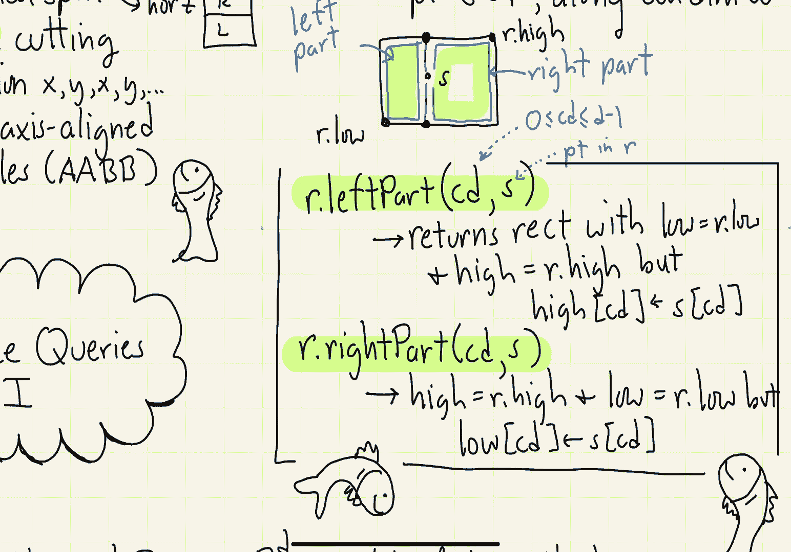
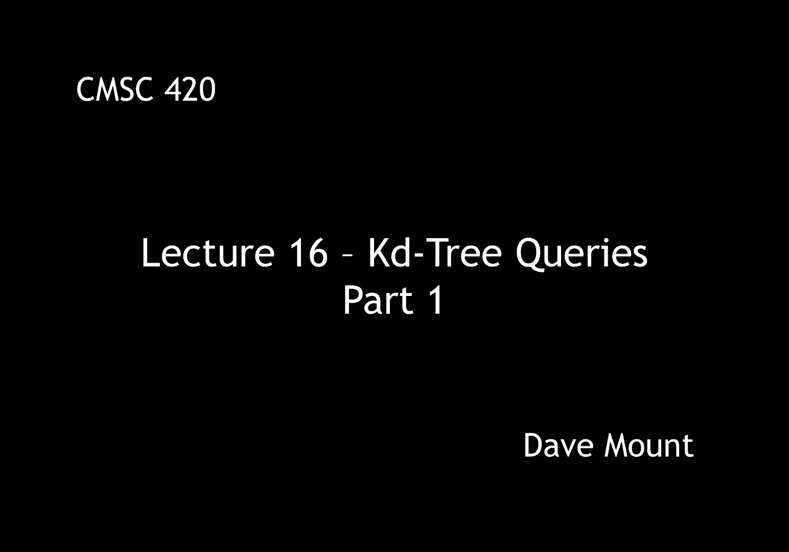

# 【双语字幕+资料下载】马里兰大学 CMSC420 ｜ 数据结构 (2021最新·完整版) - P42：L16- KD树中的检索 1 - ShowMeAI - BV1Uh411W7VF

hi everyone，in this segment we're going to continue，talking about katy trees and in。

particular we're going to talk about how，to perform queries on kd trees。

well let's provide a little recap，regarding katy trees remember katy trees。

are partition trees they're based upon，making，orthogonal splits either vertical splits。

or horizontal splits when you're working，in two-dimensional space or in general，the splits will be。

orthogonal to one of the coordinate axes，second remember that we alternate or。

generally speaking we cycle through the，axes so for example in two dimensions we。

would first cut based upon the，x-coordinate then based upon the。

y-coordinate then based upon the x then，based upon the y as you go down through。

the levels of the tree assuming that we，start with a original axis align。

bounding box as our initial cell for the，root node the resulting cells that you。

get by chopping up space in this manner，will always be axis aligned rectangles。

or what we call aabbs for axis of line，bounding boxes，so given these five points in the plane。

a b c d and e here's an example of a，possible kd tree for them assuming we。

inserted them in the order from a b c d，and then e，notice that a is the root of the tree。

it's a vertical splitter which we，indicate by putting this little these。

little vertical lines through the node，its left child is going to be b。

right which we indicate as a horizontal，splitter by the uh horizontal lines。

going through the node b has got two，children，which we're going to indicate well。

basically they're null pointers but，we're going to show them as if they are。

little external nodes on the right side，we have c which has a horizontal。

splitter on its lower or left side is，going to be d which is a vertical。

splitter and um to its high side is，going to be e which is going to be a。

horizontal splitter remember，each one of these leaf cells in the tree。

is going to correspond to one of the，rectangular cells in my final。

subdivision what sorts of queries would，we like to answer using our kd tree data。

structure well the first one would be，something called an orthogonal range。

query here the query consists of a，rectangle which is axis parallel that is。

an aabb and what we want to do is to，count or report all the points of our。

data set that lie within this rectangle，okay so for example suppose we've stored，these points。

in a katy tree data structure and the，user gives us a rectangle r and what we。

want to do is we want to count how many，points lie within r in this particular。

case there's going to be seven points，there's lots of other different range。

queries we could deal with for example，instead of rectangles we could have。

circular disks or in general euclidean，balls in higher dimensional space。

another example would be have planes or，in general half spaces that is the set。

of all points that lie to one side of a，line again with both of these types of。

queries what we'd like to do is either，to count how many points lie within the。

range or to perhaps give a list of all，those points another type of query is。

called a nearest neighbor query here the，query consists of a single point let's。

call it q and what we want to do is，return the closest point in our set to。

the point q there's lots of variations，on the idea of doing nearest neighbor，queries。

one is in addition to given q we also，give you an integer k and we want to。

find the kth closest point something's，called the k nearest neighbor a special。

case of this is when k is equal to n in，this case what you're asking to find is。

the farthest neighbor that is the point，that is farthest away from the query。

point q in this lecture what we're going，to do is present a o of square root of n，time algorithm。

for answering orthogonal range queries，for kd trees assuming that we're working。

in the plane in general if we apply this，algorithm in dimension d we're going to。

get a running time of n raised to the，power of 1 minus 1 over d before we talk。

about our algorithm for doing this it'll，be nice to introduce the notion of a。

rectangle data structure an axis aligned，rectangle，let's do this in general in d。

dimensional space an axis parallel，rectangle can be defined by two points a。

low point and a high point，think of the low point as the lower left。

corner in dimension two and the high，point is the upper right corner a point。

q in d dimensional space is contained in，our rectangle if and only if。

its ith coordinate lies b lies above the，i coordinate of the low point and the i。

coordinate of the high point for every，one of my dimensions i。

remember for a mathematical purposes we，think of i as running from one to d。

however when we actually index arrays in，java we're going to go from zero up to d。

minus one so in addition to the private，data elements of low and high there's。

going to be a number of useful public，members that we're going to add in our。

rectangle class for these examples let's，think of r and c as being rectangles and。

let's think of q as being a point all of，these are going to be in d dimensional。

space the first method determines，whether a given point q lies within the。

rectangle r the second method r contains，a rectangle c this generalizes the。

notion from single points to actual，rectangles what we want to know is is。

the rectangle c completely contained，within r，another method is going to be to check。

whether a given rectangle c is，completely disjoint from r that is to。

say c lies entirely outside of r note by，the way if a rectangle c is not。

contained in r and it is not entirely，disjoint from r then it means the。

boundary of these two rectangles must，overlap each other let's also introduce。

some methods that will be useful for，designing algorithms for the kd tree。

these these methods are particularly，used for manipulating cells in kd trees。

the basic thing that we need to do is，suppose we have a cell associated with a。

given node okay and we want to split，this cell by some data point of ours。

okay so let's let r denote the cell that，we're working with let's let s denote。

the splitting point and let's let cd，denote the cutting dimension right。

that'll be an integer well in the case，of java from zero through d minus one。

okay so let's suppose our rectangle has，the defining points r dot low and r dot。

high and let's assume that the point s，lies inside of here what we're。

interested in producing for the left，child and the right child are something。

we call the left part and the right part，these are the two rectangles that you。

get by splitting the rectangle according，to the cutting dimension so a rectangle。

class r is going to support a method，called left part which is given as its。

first argument an integer the cutting，dimension and a second argument a point。

s the splitter this function is going to，return a rectangle that's defined by two。

points the low point is going to be the，same as the low point of r。

the high point is almost going to be the，same as the high point of r but with one，exception。

along the cutting dimension cd，we're going to set the，high value for that dimension to be，the。

cd coordinate of our splitting point s，notice for example in this case。

because the line is vertical the cutting，dimension is the x axis and so what i've。

done is i've set the high point，to be，basically it has the same x coordinate。

as s and it has the same y coordinate as，r dot high the other function is called。

the right part and it's going to be，symmetrical the high point is going to。

be exactly the same as the high point of，the original rectangle the low point is。

going to be the same except for the fact，that along the cutting dimension we're。

going to set its low coordinate sub cd，to be the the cd coordinate of the s，point okay。

so in this particular case the low point，is going to be this point that lies。

directly below s right its x coordinate，is going to be the same as the x。

coordinate of s and its y coordinate is，going to be the same y coordinate as the。

original low point okay in the next，segment we're going to talk about why。

these functions are going to be useful。

