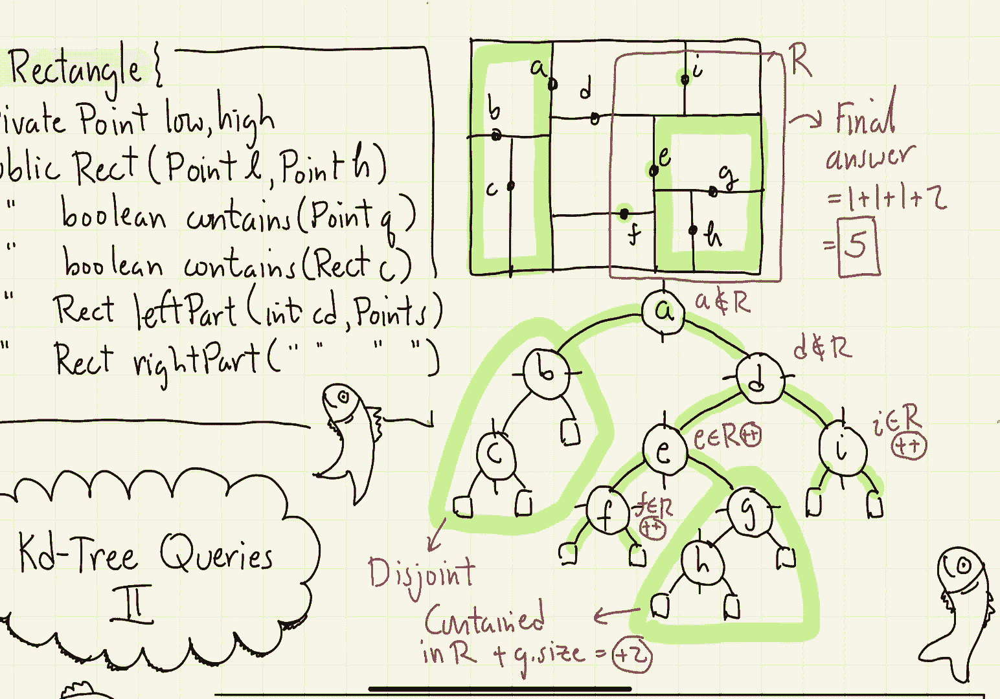
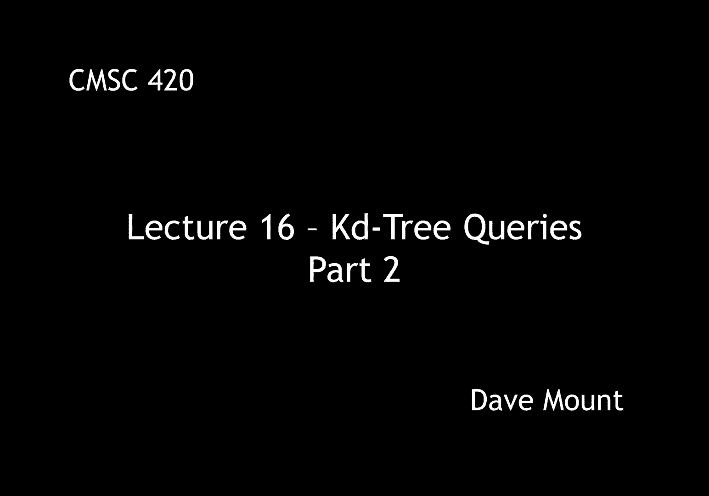

# 【双语字幕+资料下载】马里兰大学 CMSC420 ｜ 数据结构 (2021最新·完整版) - P43：L16- KD树中的检索 2 - ShowMeAI - BV1Uh411W7VF

let's continue our discussion of kdtree，queries，so when we entered the last segment we。

were talking about the rectangle class，let's take a more，formal look at what the rectangle class。

consists of，so the private data members are going to，be the two corner points low and high。

we'll have a constructor，for short i'm going to say rect instead。

of rectangle and it's going to take two，points l for low and h for high i'm not。

going to give the function you know，definitions here just give the，signatures。

next we're going to have a public，function a boolean that tests to see。

whether a given point q lies inside or，is contained inside of the rectangle。

next we're going to have a，similar function but now this one's，going to check to see whether a given。

rectangle c is entirely contained within，our give with our current rectangle and。

finally we're going to have two public，functions that are going to implement。

the kd tree splitting functions that is，giving the left part of the cell and the。

right part of the cell which are going，to be given a splitting point s and a，cutting dimension cd。

okay now armed with our rectangle class，let's see how we can use the kd tree in。

order to answer orthogonal range queries，remember the job that we want to do is。

to count the number of points that lie，in an axis aligned，rectangle。

okay let's recall what we assume about，every node p in our kd tree it's going。

to store a data point call that pt，that's going to be our splitting point。

it's going to store a cutting dimension，write an integer between 0 and d minus，one。

and it's going to store a size which，similar to trees that we've seen in the。

past this just stores the number of，points on the total number of points in。

p's subtree the tree is going to store，two things it's going to store a root of。

course to the kd tree itself and we also，need an initial cell that we can use for。

our algorithms and so that initial cell，is just going to be a bounding rectangle。

for all the points in our data set，we're going to define a recursive helper。

function as we do with most of our data，structure algorithms。

it's going to store the following things，the，current node p that we're adding our kd。

tree and it's going to keep track of the，cell of that node the algorithm is going。

to break up into a series of cases，the first case is easy if we get to a。

null pointer that is if we drop out of，our tree we're just going to return the，value 0。

 in other words there are no，points in a null tree the next case is，also pretty easy。

if we see that the query rectangle is，completely disjoint from，p's cell。

then we can infer that no point of p，could possibly contribute to our query。

rectangle and therefore we can return 0，in this case，next，if the query rectangle completely。

contained pcel，in this case we're going to return the，entire size of p that is all the points。

of p because we know that since every，point of p lies within its cell。

therefore every single one of the points，in p's subtree is going to contribute to。

the answer rather than going through the，subtree and visiting the points one by。

one we can just take them take the count，of p dot size and just add that into the。

the final result well the final case is，if the cell is not disjoint and if the。

cell is not completely contained within，r then it follows that the cell and the。

query rectangle r have a partial overlap，in this case we're just going to bail。

and we're going to recurse on each of，the two，subtrees of p the left and the right。

okay so now let's present the pseudo，code for our function let's call it。

range count it's going to be given three，arguments the query rectangle capital r。

the current node that we're visiting p，and the rectangular cell that's。

associated with this node well first off，if p is equal to null that is if we've。

fallen out of the tree let's just return，the value 0。 next case if the query。

rectangle is disjoint from the cell，we can also return 0 because again none。

of the points of the cell can can，basically uh contribute to the answer。

next if the cell is completely contained，within r，then we know that every single point。

inside of p subtree will contribute so，we're going to return the total size of。

this subtree p dot size，finally we've gotten to the case of the。

partial overlap right the cell and the，query partially overlap each other。

in this case we have to maintain a count，of everything that is going to。

contribute so we're going to create an，integer variable count which we，initialize to 0。

 next we check to see，whether p's point itself lies within the，query rectangle it might or might not。

because there's a partial overlap if it，is contained within the query rectangle。

we increment our counter，next we recurse on the left subtree p，dot left。

and we update our cell the cell is now，going to be the left part of the。

existing cell based upon p's cutting，dimension and p's splitting point and。

then finally we're going to do the same，thing on the right side of p we're going。

to recurse on its right side again using，the right part of the cell。

in each case we take the count that we，get we add it to our counter variable at。

the end of the day we return the count，let's illustrate this on a simple tree。

so consider the subdivision that i've，drawn here with the points a running，through a through i。

okay so i've illustrated a possible kd，tree storing these points down below。

again from each of the points i either，draw for that node i either draw a。

vertical line going through the node，indicating that it's a vertical splitter。

or i draw a horizontal line going，through the node indicating that it's a。

horizontal splitter so a is a vertical，splitter b and d are horizontal。

splitters and again this alternates，level by level okay we've got our tree。

now let's consider this query rectangle，r that's given to us by the user。

remember the tree stays fixed but the，user can ask us many queries involving，different rectangles。

the goal of any good geometric query，algorithm is to visit as few nodes of。

the tree as we can get away with and，still give an accurate answer to the，query。

okay so since the rectangle，partially overlaps the uh you know the，root cell we have to start off by。

visiting the um the root node a，we check to see whether a is inside of。

the rectangle uh the query rectangle r，well it's not so it's not going to。

contribute to the count but then we have，to visit each of its two，sub trees the left and right。

when we come to the left subtree that is，the one rooted at b we notice that its。

cell is completely disjoint from r，therefore we don't have to go down and。

recurse any deeper into that tree we can，simply return zero because there's no。

possible overlap between any of the，points in that left subtree namely the b，and c with respect to r。

okay we come back to a and now we，recurse on its right subtree that's the，d。

d has a partial overlap so we check to，see whether d is inside the query。

rectangle it's not so we don't count it，and then we recurse on its two children。

the low child below and the high child，above，when we go to the low child that's。

rooted at e we again have a partial，overlap between this cell and r so we。

check to see whether e is in the，rectangle it is so we increment our，count。

next we recurse on its two children，first we recurse on the low side that's，the f。

again there's a partial overlap with f，so we check to see whether f is inside。

of the rectangle it is so we increment，our count again，finally we make a recursive call to f's。

two children well they're both null so，nothing's going to happen we're just。

going to return from there we come back，to e and now we make a recursive call to。

e's right child that's going to be the g，notice when we get to the g its cell。

that is shown in yellow here is，completely contained in the rectangle r。

so we don't need to make individual，recursive calls to its sub trees instead。

we can just take the entire size of that，subtree well there's just two points but。

the g dot size of two then just gets，contributed to our total count。

finally we return from the g call to the，e we return from e to d and from d we。

make a recursive call on its right child，that's the i again there's a partial。

overlap so we check to see whether i is，inside the query rectangle it is so we。

increment our count finally we make，recursive calls to eyes two children。

well they're both null and they just，return zeros and then we return all the。

way back up to the root and the query，algorithm is finished what's the final。

answer the final answer is going to be，the sum of basically all the individual。

points that were counted that's the e，the f and the i that gives us 1 plus 1，plus 1。

and the size of all the sub trees that，were completely contained in r that's。

the g sub tree that contributed to for，the g and the h，okay so that gives us a total count of。

five points that lie within the query，rectangle okay that's everything for how。

the query is processed in the next，segment we're going to talk about。

analyzing the running time of this。

