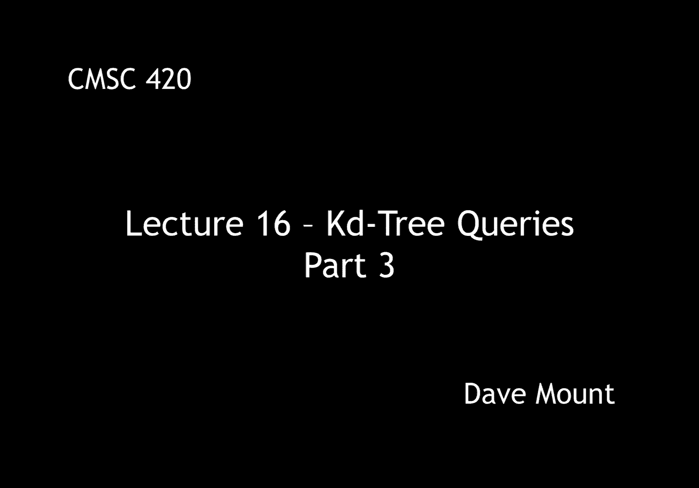
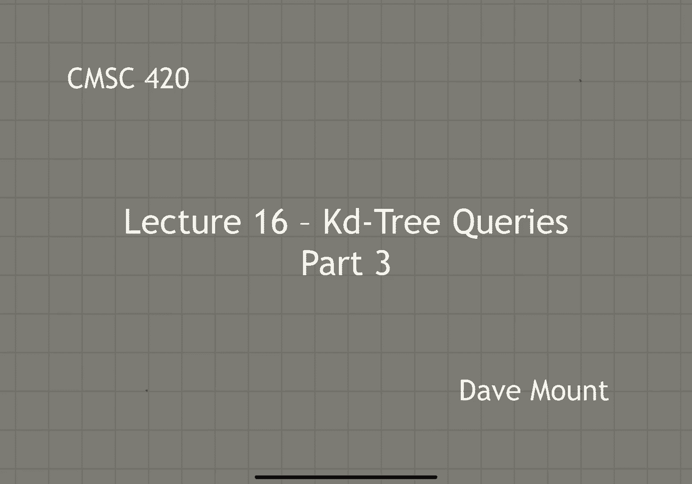
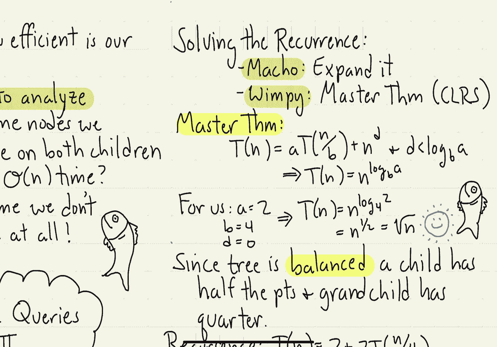

# 【双语字幕+资料下载】马里兰大学 CMSC420 ｜ 数据结构 (2021最新·完整版) - P44：L16- KD树中的检索 3 - ShowMeAI - BV1Uh411W7VF

okay in this final segment on answering，kdtree queries we're going to analyze。

the running time of our orthogonal range，search algorithm，so again this segment is going to focus。

on the analysis of the query time，algorithm how efficient is this，algorithm well it turns out the。

algorithm is a bit tricky to analyze the，reason for this is at some node we。

recurse on both of the children，remember that when this happens with。

something like a you know traversal，algorithm this results in a linear。

running time on the other hand at some，nodes we don't recurse at all right。

remember if the node cell is completely，contained or is completely disjoint from，the query range。

in this case we do nothing，well our main result is going to be to。

prove the following theorem suppose，you're given a balanced katy tree that。

is one that has logarithmic height，that stores end points in the plane that。

is real two-dimensional space，let's say we use the rule of alternating。

the splitting dimension between x and y，then we claim that the orthogonal rain。

searching algorithm we just presented，answers queries in time square root of n。

notice that an algorithm running in，square root of n time is not as good as。

an algorithm that runs in log n time on，the other hand it's better than an。

algorithm that runs in linear time it，turns out the analysis all has to do。

with the violent subject of stabbing，recall that there's basically three。

cases that the query algorithm considers，first case is when the cell of the。

current node is completely disjoint from，the query region this is easy we don't。

have to do anything because none of the，points are going to contribute the next。

case is when the cell is completely，contained inside of the query region。

this case is also easy because we just，add all the points in a single step and。

don't have to do any recursion the，tricky case is when the cell partially。

overlaps the query region and in this，case we say that the query region stabs。

the cell in this case we make the two，recursive calls and so these are the。

cases that we have to focus on in our，analysis so this raises the question in。

the worst case how many cells could be，stabbed by any given query range。

so i've drawn a little illustration here，the range is shown，with this little red rectangle r okay。

and i want to think of the cells of the，katy tree as being drawn here in blue。

and the question is how many such cells，might there be assuming that i have n uh。

points inside of my katy tree we're，going to analyze this by replacing the。

rectangle by its four sides right two，horizontal sides and two vertical sides。

and what we're going to analyze is the，number of cells that could intersect。

each of those four infinite lines right，two infinite vertical lines and two。

infinite horizontal lines this sounds，like a lot of overkill but in fact this。

will give us the square root of n bound，that we're looking for，okay so here's going to be our main。

lemma，assuming we're given a katy tree you，know balanced using alternating。

dimensions as shown in the theorem，and suppose we're given any line l which。

is horizontal or vertical again this is，all in two dimensional space，then。

at most square root of n o a square root，of n cells of the katy tree can be。

stabbed by this line because of the，horizontal vertical symmetry of katy。

trees we can assume that l is a，horizontal line and just analyze that，case。

there are two cases that arise given any，node p of the tree，if p is split vertically then observe。

that both of the cells the left cell and，the right cell are going to be stabbed。

by the line l assuming that you know the，line l stabs p cell at all on the other。

hand if the node p is a horizontal，splitter，then observe that the line l is either。

going to stab the upper cell or the，lower cell but it's not going to stab。

both let's consider any two consecutive，levels of the cell that is starting at a。

node p we consider its children two，children and its four grandchildren。

observe that in any such circumstance，the line l no matter where it's。

positioned can intersect at most two out，of the four grandchildren of this node。

below i've drawn a picture illustrating，how this works，so in each case you're going to visit。

both the left and right cells that is，you're going to stab both the left and，right cells。

however no matter how the horizontal，cells are arrayed you're only going to。

intersect two of those out of the out of，the total of four next we're going to。

exploit the fact that we assume that the，tree to be balanced in fact let's assume。

that it is absolutely perfectly balanced，meaning that whenever i look at a node。

containing let's say n，points，its left and right sub trees each。

contain exactly n over two points and，what that implies is that my four。

grandchildren each contain precisely n，over four points，okay if this is obviously a very pure。

assumption but it turns out the general，case，as long as the tree has let's say a，logarithmic height。

this，this result is still going to go through，it's just a little bit messier to argue。

in the general case so this gives us the，following recurrence。

if i have n points in my tree the number，of cells that are stabbed which i'm。

going to denote by t of n，consists of well the two cells that i，stab looking down to the grandchild。

level，okay，plus i make two recursive calls on each，of the cells that is being stabbed。

okay and each of those grandchild cells，has it most n over four points in it so。

i get two plus two times t of n over，four，that recurrence describes the total。

number of cells that could be stabbed in，my tree，of course there's going to be a basis。

case for this recurrence when we get，down to a single point you know t of 1。

is just going to be 1 itself，okay so how do we solve this recurrence。

well um i suppose if we were macho about，this we could actually solve it by you。

know expanding out the recurrence and，you know finding out what the pattern is。

going to be and if you look at the latex，lecture notes that's exactly what i do，however it turns out。

you can wimp out for this one and just，use the master theorem from clrs，so。

what does the master theorem say in this，particular instance well recall the。

master theorem says if you have a，recurrence of the form t of n equals a，times t of n over b。

plus n raised to the power d，and，well there are three different cases but。

in our case the key thing is going to be，that d is going to be less than the。

value of log base b of a，in particular for us，a is going to be equal to 2。

b is going to be equal to 4。 and because，the additional term here is just a，constant it's 2。

d is actually going to be the same as，being 0。okay well 0 is certainly less than the，log base 4 of 2。

okay and so therefore the master theorem，tells us that the solution to the，recurrence is。

n raised to the log base b of a，that is it's n raised to the log base 4，of 2。

okay and well what is 2 relative to 4 2，is the square root of 4 in other words。

it's 4 raised to the power of 1 half，that is，the log base 4 of 2 is one half so the。

recurrence solves to n to the one-half，and that's just the square root of n so。

voila we've now proved our lemma，which says that every one of those four。

lines that bound the query rectangle，stabs o of square root of n cells。

okay if i combine all those cells，together，the total number of cells that will be。

stabbed will be at most four times，larger and so that will also be square，root of n。

okay and that's what's going to bound，the running time of our query algorithm。

okay pretty cool well that's all i have，to say about orthogonal range searching。

notice that we made explicit use of the，fact that the ranges are orthogonal that。

is their vertical and horizontal if you，were to try to use this with ranges that。

were not described by horizontal and，vertical elements it turns out the。

analysis would not go through and the，worst case running time for kd trees is。

actually going to be much higher it's，going to be o of n in general but for。

the case of orthogonal range searching。

