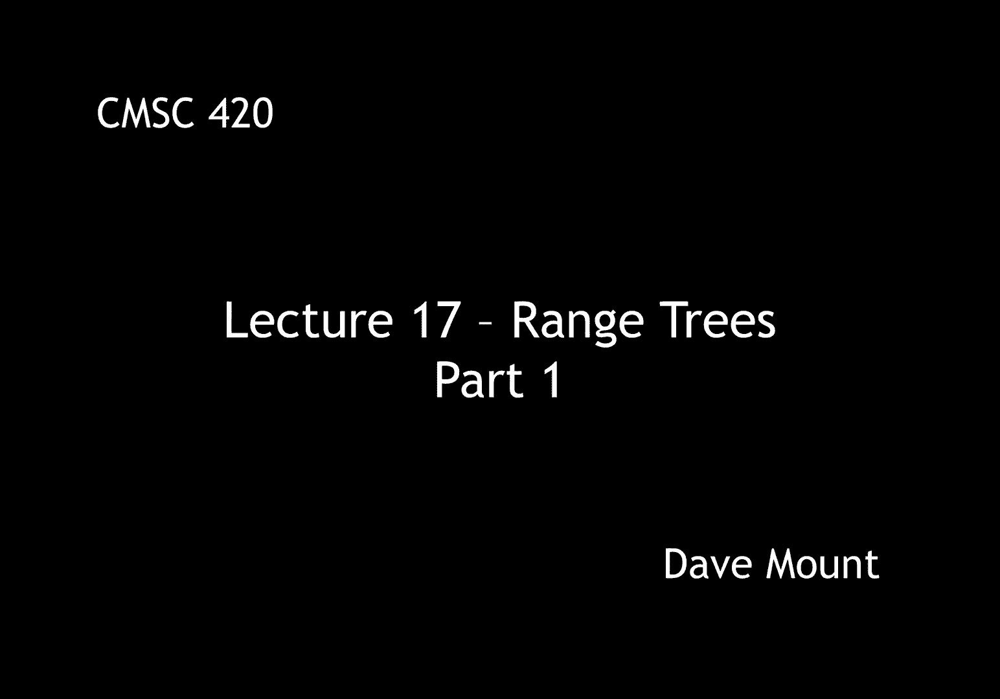
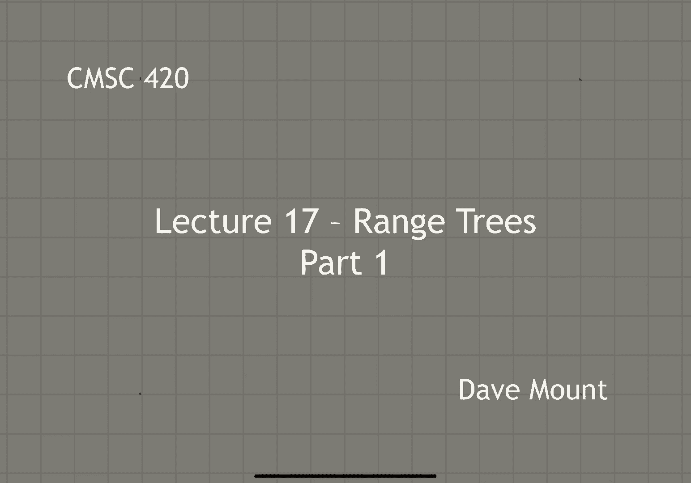
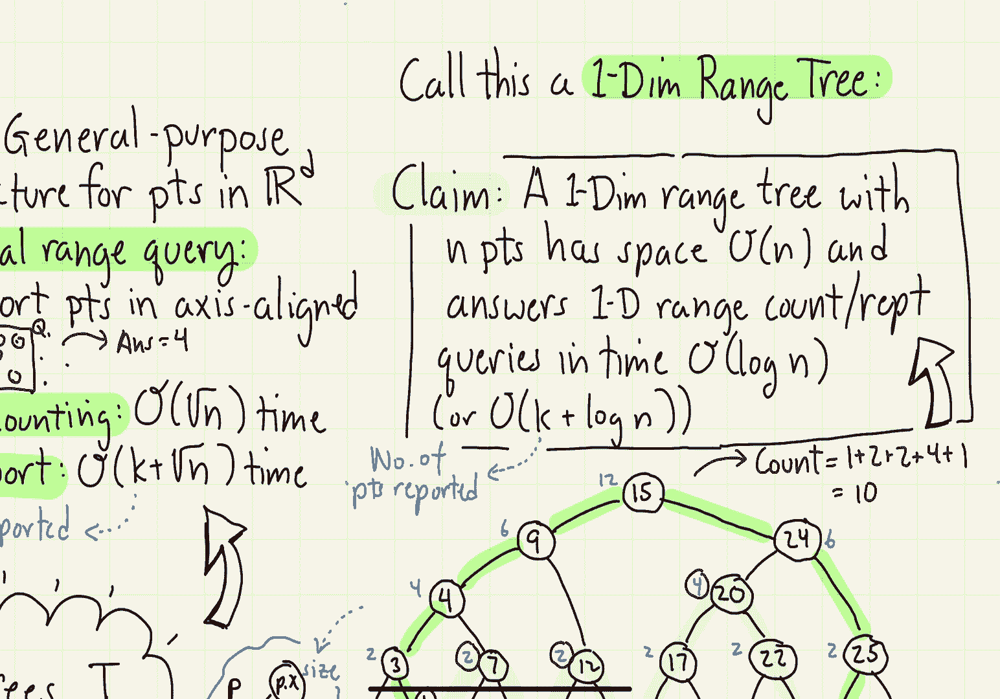

# 【双语字幕+资料下载】马里兰大学 CMSC420 ｜ 数据结构 (2021最新·完整版) - P45：L17- 区域树(range trees) 1 - ShowMeAI - BV1Uh411W7VF

in this segment we're going to talk，about a new data structure called range。

trees let's begin with a little recap，so far for the purposes of geometric。

query answering we've discussed the kd，tree that is a general purpose data，structure for。

storing points in d dimensional space，real d dimensional space with respect to。

the kd tree we discussed how to perform，an orthogonal range searching query in。

such a query we want to either count or，report all the points that lie within an。

axis aligned rectangle so in this little，example there are four points of our。

data set that lie in the rectangle and，we'd return the answer of 4。 remember，that，using a kd tree。

orthogonal range counting queries can be，answered in o of square root of n time。

where n is the number of points in the，tree and range reporting queries can be。

answered in k plus square root of n time，where k is the number of points being。

reported well the question we want to，consider is whether we can do better。

than square root of n the solution is，going to be a new data structure called。

range trees the space needed by the，range tree data structure is going to be，n。

times the log raised to the power of d，minus 1 times n where remember d is our。

dimension the query time for the range，tree is going to be o of log to the，power d of n。

for counting queries and it's going to，be k plus log，raised to the power d of n for reporting。

queries where again d is the dimension，and k is the number of points reported。

for example in the plane right，two-dimensional space，this gives us a query time of log base。

log squared of n which is going to be，much better than square root of n。

assuming n is a large value compared to，kd trees however i'll mention that range。

trees are more limited they are just，good for answering orthogonal range。

searching queries and queries that can，be posed in that particular form whereas。

kd trees can be used for lots of other，things the basic idea behind range trees。

is something that can be called layering，that is combining search structures to。

perform various operations，here's the idea，suppose that you wanted to answer a。

composite query that involves multiple，criteria for example suppose you had，medical data and。

you wanted to count the number of，subjects that satisfy certain criteria。

for example the age lies between some，range a low to a high the weight lies in。

some range w low to w high we can，obviously think about this then as an。

orthogonal range searching query where，the x-axis represents the age the y-axis。

represents the weight and we're looking，for points that lie in sort of the。

rectangle that's defined by these two，intervals here's the idea behind range。

trees what we're going to do is we're，going to design a data structure that。

answers each one of the criteria，individually，next we're going to layer these trees。

one on top of the other to get a global，data structure that will answer the full。

query and this gives rise to the general，technique which is called multi-layer。

data structures and perhaps that's the，most interesting aspect of the idea。

behind range trees is learning about，this multi-layering concept，well，before we start talking about。

complicated layering of data structures，let's talk about the simplest case that。

is a one-dimensional range tree so let's，take a look at this little example i've。

got these points sitting on the，one-dimensional line like you can just。

think of these as regular key values，right over some you know totally ordered。

domain and let's suppose my range is，given by an interval q low to q high and。

i want to report all the points or count，all the points that lie in this interval。

in this case there are five points that，lie within the interval g a c and e we。

already know of techniques for solving，this problem we can build a balanced。

binary search tree right an avl tree red，black tree or what have you let's assume。

that this is an extended tree that is to，say that all the data is stored at the。

leaves of the tree let's also assume，that each note of the tree stores the。

number of points that lie within this，subtree rooted at this node and we're。

going to denote this by p dot size next，let's introduce the important concept of。

canonical subsets our goal is to express，the answer to the query in terms of the。

disjoint union of subsets of points how，do we do this well our approach is going。

to be to search for qlo and q hi in our，binary search tree and then if you look。

at the sort of region between these two，search paths there is a collection of。

maximal sub trees that cover all the，points that is all the leaf nodes that。

lie between qlo and q high as i've，let's take a look at an example，consider a tree with the。

the following keys from 1 up to 25，let's build a balanced binary search。

tree structure on top of these external，nodes and let's label each node with its。

size that is the number of external，nodes that are descended from that node，in the tree so as usual。

for every internal node points that are，smaller than the key values stored in。

the internal node are going to be stored，in the left subtree points greater than。

or equal are going to be stored in the，right subtree and the blue value。

associated with the node is just going，to be the size that is the number of。

points that are descended now let's，consider the interval ranging from q low。

equals 2 up to q high equals 24。 let's，identify the search paths going from the。

root down to q low and from the root，going to q high next let's identify all。

the subtrees that sort of lie in between，those two，you know those two paths i want to take。

the largest sub-trees that i can to，cover everything so that will include。

the sub-tree rooted at seven the，sub-tree rooted at the internal node。

twelve and the sub-tree rooted at the，internal node 20。 next let's add up all。

the points so first off i've got the，external node 3 right，next i've got the。

subtree rooted at the internal node 7。that contains two points subtree rooted。

at the internal node 12 that contains，two points the internal assuming the，subtree。

rooted at the internal node 20 that，contains four points and finally i have，the external node 24。

 all of those lie，within the interval from q low to q high，they completely partition the interval。

right all the points in the interval，will be contained in exactly one of。

those subtrees and so therefore if i add，up all of those sizes i will get the，total。

number of points in that interval，particularly 1 plus 2 plus 2 plus 4 plus，1 or 10。

 so this idea we refer to as，the one-dimensional range tree the。

important claim is going to be this a，one-dimensional range tree storing。

endpoints has space o of n and answers，one-dimensional range。

counting slash reporting queries in time，o of log n and in the case of reporting。

it would be k plus log n where k is the，number of points being reported how do。

we see this fact well the important idea，is because the tree is balanced that it。

has o of log n height，the lengths of the search paths that i'm，looking at is going to be o of login。

right the search path down to pulo is，going to be login the search path down。

to q high is going to be login and，notice that the number of subtrees that。

we pick up is basically not going to be，any more than the number of nodes along。

each of these paths notice that each of，the blue sub trees in my previous。

picture was the child either a right，child or the left child of one of the。

nodes along the green search path，since there are basically two times o of。

log n nodes on the search path the，number of subtrees i'm talking about is。

also going to be roughly two times o of，log n or just o of log n okay so this is。

the basic thing about how you implement，a one-dimensional range tree。

in the next lecture we're going to talk。

about how to layer these to answer more。

