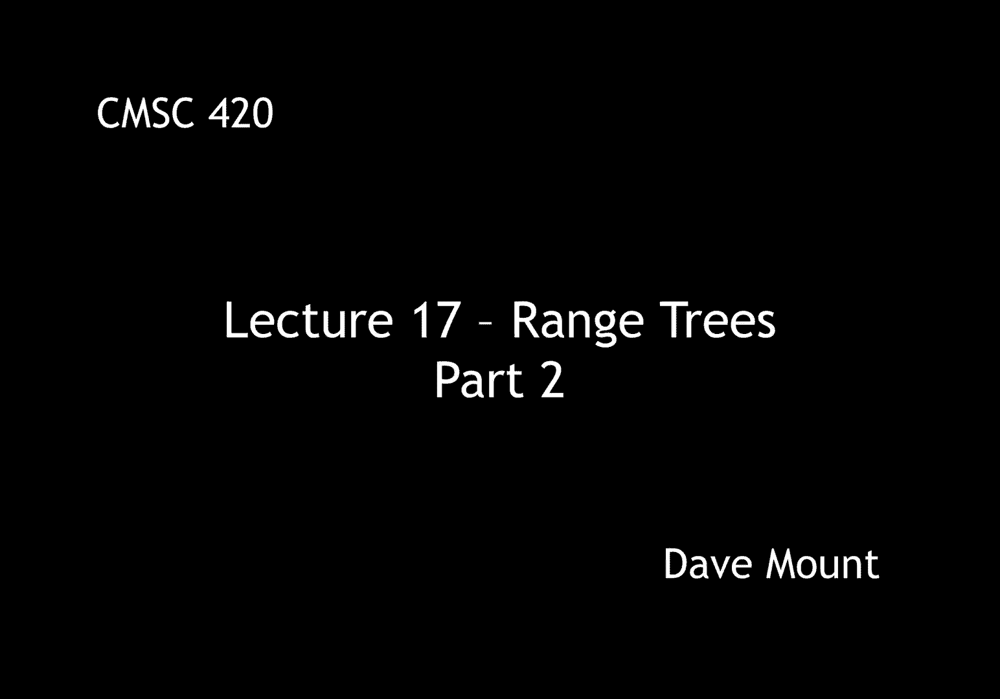
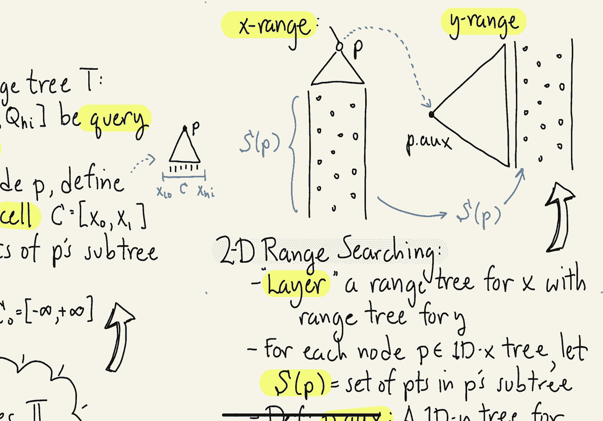

# 【双语字幕+资料下载】马里兰大学 CMSC420 ｜ 数据结构 (2021最新·完整版) - P46：L17- 区域树(range trees) 2 - ShowMeAI - BV1Uh411W7VF

in this segment we're going to continue，our discussion of range trees。

so let's provide more details about this，data structure，suppose we're given a one-dimensional。

range tree let's call that t，let q，be the interval from q low to q high。

let that denote our query interval，next for each node p of our tree we're。

going to define a interval called p's，cell to be denoted by capital c and。

that'll be an interval from x0 to x1，this interval will have the property。

that all the points in p subtree and，remember this is an extended tree so。

those points are going to be at the，external nodes are going to lie within，this interval c。

for example if i draw this little，subtree here right，think of those little dashes as being。

the points of p they are all going to，lie within this interval c。

basically which is going to extend from，the you know lowest point in。

p sub tree to the highest point in p sub，tree，and of course for our entire tree we can。

think of it as having a cell which i'll，call c0 our initial cell which we can。

think of as just extending from minus，infinity to plus infinity or whatever。

the minimum and maximum values are in，your data set，so let's describe the recursive helper。

function for answering one-dimensional，range queries，this function is going to be called。

range 1dx because it's going to work on，the x-axis，later on we're going to introduce a。

range query that's going to work on the，y-axis it's going to be called range 1dy。

it's going to be exactly the same except，instead of x coordinates it's going to。

work with y coordinates，this function returns an integer that is。

the number of points that are inside of，let's say the range intersected with the。

points in this particular node，the first argument is just the node p，itself。

the second argument is going to be the，query that is the，you know the interval for the query。

range q low to q high and the third，argument is also going to be a interval。

that's going to be for the cell right，that's going to reflect the。

interval containing basically where all，of the descendants of p lie。

and we're going to call that c which，runs from x0 to x1 to answer the query。

for the entire tree my initial call is，going to be range one dx，starting at the root right given the。

query q，and given the initial cell c0 which，contains all the points right and then，this function。

assuming that all the recursive，functions are going to be correct is。

going to return the global number of，points in the entire data set that lie，within q。

how does this work well of course，there's going to be cases，first case is going to be if p is an。

external node that is it just contains a，single data point well this is easy all。

we have to do is check to see whether，the，point associated with p that is p dot，point。

check its x coordinate if the x，coordinate lies within the interval that，is it's you know。

greater than uh or equal to q low less，than or equal to q high if that's the。

case then we're going to return one that，is we're going to count the point。

otherwise we're going to return 0。 we're，not going to count the point。

next what happens if p is internal，well we're going to check to see first。

off if the cell associated with this，node is completely contained in q。

if that's the case then all of p's，points lie within the range or lie。

within the query in which case we're，just going to return p dot size no need。

to make any recursive calls and i've，just illustrated that in this little，picture here below。

the cell is contained entirely within，the query interval and therefore all the。

points can be returned as valid answers，for the query，next case that's easy to consider is。

what happens if the cell associated with，p is disjoint from q，in this case again this is easy to to。

process because that mean that means，that none of p none of the points that。

are descended from p could possibly，contribute to the query therefore we can。

just return 0 and not have to make any，recursive calls if we have a partial。

overlap then in this case we're going to，need to make the recursive calls we're。

going to recurse on p's children，we're going to of course trim the。

current cell the cell was designed for p，but now it has to be trimmed down to。

work for p's children and the way we do，that is we simply trim the cell by。

cutting it at the point p dot x that is，the point associated with p。

okay so now we can present a kind of，pseudo code representation for this。

one-dimensional range search，first remember if p is external we're。

just going to check to see whether the，associated p dot point lies within our。

query if so we return 1 otherwise we，return 0。 otherwise p is going to be an。

internal node and we consider each of，the three cases we described before if。

the cell is completely contained within，the query we return its size that is all。

the points of p lie within the query，range，if the，query and the cell are disjoint from。

each other we return 0 because nothing，in this subtree could possibly，contribute。

and finally if not we're going to，recurse on the left and right subtrees。

right and in each case we're going to，pass into query range q and we're going。

to trim the cell so on the left side，we're going to take the portion of the。

cell from x0 up to p dot x and on the，right side we're gonna trim this cell by。

taking p dot x up to x one okay remember，p dot x is the，coordinate of the point that's。

associated with p，let's give the analysis of this little，query algorithm this is based on the。

following lemma the lemma says given a，one-dimensional range tree storing，endpoints，and given any。

interval q is our query interval，we can compute o of log n sub。

whose union in fact whose disjoint union，is the answer to the query。

given this lemma it follows that given，any one-dimensional range tree again。

given endpoints we can answer，range queries queries of the form of。

let's say these interval queries in time，o of log n for counting queries and o of。

log n plus k where k is the number of，reported points for，reporting queries by the way i have been。

you know focusing mostly on the counting，case but the reporting case is easy。

rather than returning p dot size what we，do is we just simply do a traversal of。

the tree and report all of the leaf，nodes that we come across，now that we have seen how to solve the。

easy case of one-dimensional range，searching and by the way you probably，knew this up to now。

let's consider how to solve，two-dimensional range searching queries。

here's the idea we are going to layer a，range tree for the x data together with。

a range tree for the y data and what do，i mean by layering well let me define。

that so here's the idea，for each node p in our one dimensional x，based range tree。

let's define s sub p，to be the set of points that are stored，inside of this sub tree next let's。

define，p dot aux aux that's are going to be our，auxiliary tree let's define this to be a。

one-dimensional，y based tree that stores all of the，points in s sub p。

okay so the idea is i want to think of，my set of points now as being。

two dimensional points okay they both，have x and y-coordinate i'm going to。

store one tree that is based entirely on，x，and then for every node of that tree i'm。

going to store an auxiliary tree，that's going to be associated with just。

the points stored within that subtree，but it's going to be sorted based on y。

well let me illustrate this idea，let's，think of a，node p in our one dimensional x range，tree。

and let me draw the set of points that，are being stored in there right it's。

being based only on the x coordinates so，every point whose x coordinate is in a。

certain interval will be stored inside，of this tree and we call that set of。

points s sub p what we're going to do is，we're going to take all of these points。

now we're going to order them by their y，coordinates right rather than their x。

coordinates and we're going to construct，a y range tree storing just these points。

not all the points in the data structure，just the points descended from p，sorted by y。

okay and this is going to be our，auxiliary y range tree，notice it is just the auxiliary tree for。

the node p in fact every internal node，in my tree is going to have an。

associated auxiliary tree going with it，in the next segment we're going to talk。

about how to use these auxiliary trees，to answer two-dimensional range。

