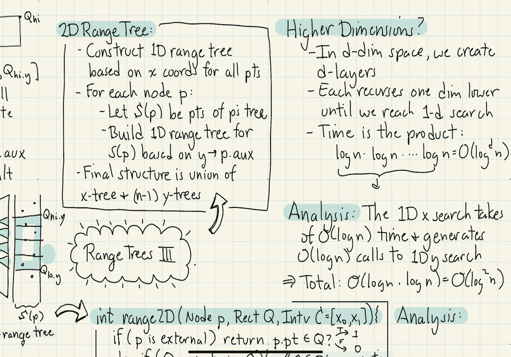

# 【双语字幕+资料下载】马里兰大学 CMSC420 ｜ 数据结构 (2021最新·完整版) - P47：L17- 区域树(range trees) 3 - ShowMeAI - BV1Uh411W7VF

in this final segment on range trees，we're going to put all the pieces，together in order to answer。

two-dimensional orthogonal range，searching queries，our two-dimensional range tree is going。

to consist of the following elements，first we're going to construct a。

one-dimensional range tree based on the，x-coordinates for all the points in our。

two-dimensional data set，for each node p，let's let s of p denote the points that。

are descended from p remember this is an，extended binary tree so these points are。

going to be essentially the points，stored in p's external nodes，for each。

of the nodes p in my tree actually each，of the internal nodes in my note in my。

tree p we're going to build a，one-dimensional range tree for the set。

of points in my associated set s of p，and that's going to be based upon the，y-coordinates the。

node p is coming from a tree that is，sorted based upon x，but the y tree is going to be taking the。

points that lie within p's subtree and，then building a tree that is based upon。

y and we call that p dot aux auxiliary，tree，the final structure is going to be a。

combination of these trees we're going，to have one x tree and we're going to。

have one y tree for every single node in，my tree so there's going to be basically。

n minus one of these y trees，how do we answer queries from such a。

data structure suppose we're given a two，dimensional range now the range is going。

to be given by let's say two intervals，qlo x q high x that is the interval。

along the x axis and q low y q high y，the interval along the y axis。

step one let's run the one dimensional，range tree that we discussed in the。

earlier segment to find all the sub，trees that are going to contribute right，in the previous。

you know the previous segments whenever，we found such subtrees we just return p。

dot size while all of those points lie，within the x interval we don't。

necessarily know that the associated y，values lie within the y interval and so。

we're going to actually have to do a，little bit more work now，for each such node p。

we're going to now，run the one dimensional，y range query that is the range from q y，to q high y。

using the auxiliary tree p dot aux，because that tree is sorted by y。

coordinates finally we're going to，return the sum of all the results over。

all the auxiliary trees so let's take a，look at an illustration of this idea。

first off let's draw the x-range tree，okay and remember that when we answered。

queries using the range tree what we did，was we looked at the search path going。

down to qlo x we looked at the search，path going down to cue high x and we。

selected all the maximal subtrees that，sort of lie between those two search。

paths let's illustrate those sub trees，in blue now if you think about it。

for each node p for one of these，subtrees the set s p refers to the set。

of all the points whose x coordinates，lie，within sort of that projection of that。

sub-tree so in other words each of these，sub-trees sort of represents a infinite，vertical，interval。

and it contains all the points that lie，within that interval however。

not necessarily all of these points lie，within our y interval so to further。

filter those points what we're going to，do is we're going to come over to the。

auxiliary tree for that node p，remember the auxiliary tree is sorted by。

the y coordinates and we're going to，repeat the same idea but now we're going。

to search on qlow y and q high y，to find，the，maximal subtrees that effectively cover，that interval。

once we have found all of those，maximal subtrees right we add up all the。

points that are there and then we're，going to return that value back to the。

node p that's going to reflect all of，the points that of p's subtree that lie。

within both the x interval，as well as the y interval and then。

finally we're going to add this up over，all the blue subtrees in my x range tree。

so here's the overall intuition，the x layer of our data structure that。

is the x one dimensional x range tree，finds all the sub trees p。

that essentially are contained in the x，portion of the range and the union of。

these trees is going to essentially，cover the entire x portion of the range，each auxiliary tree。

filters out the points based upon the y，coordinates that is whatever the y，interval is going to be。

okay so this is the notion of layering，right we have an x layer and a y layer。

so now we can describe the procedure for，the general two-dimensional range tree。

we're going to be given a，right this is the helper function so，we're going to be given a node p。

we're going to be given a query，rectangle q an axis parallel rectangle。

we're going to be given the interval，that is the x interval，you know for the node p and by the way。

this is just going to be for essentially，the x portion，of the query so the process is going to。

be pretty much the same as what we had，before，if p is an external node then what we're。

going to do is we're just going to check，to see whether p's point lies within the。

query range here however instead of just，checking the x coordinate we're going to。

check both the x and the y coordinates，both of them have to be in range if they。

are we return a one if a either of them，is not in the range we return a zero。

okay otherwise we're going to consider，our three cases but now constrain just，to the x axis，if q's。

you know the x portion that is the x，interval of the query range completely。

contains the associated cell c that is，x0 to x1 then essentially all the points。

lying within this subtree are going to，satisfy，right the x portion of the query okay so。

to answer the query we need to go to our，auxiliary tree，let's let y 0 y 1 be the。

initial um you know cell for the y tree，we can think of that again as just。

covering the entire space from negative，infinity to positive infinity along the。

y axis and then we're going to invoke，a one dimensional query but now in the y。

space on our auxiliary tree which is，sorted by y coordinates right p dot aux。

we're going to pass in again，our，query rectangle and we're going to pass。

in our initial y interval that is our，initial y cell the next case to consider。

is what happens if the query interval，along x that is q dot x is completely。

disjoint from the cell in the one，dimensional x tree if this is the case。

then we can just return 0 because，obviously if there's no overlap along x。

then i don't even need to look at the，y-coordinates finally i get to a。

situation where there's some kind of a，partial overlap in the x-coordinates and。

remember in the previous case we made，two recursive calls one for the left。

child and one for the right child and in，each case what we had to do is we had to。

cut the cell down we had a you know，basically split the cell from x zero x。

one now it goes from x zero to p dot x，and p dot x to x1 so it's exactly the，same as before。

in fact the only difference to note，between our two dimensional range search。

in our previous range searching data，structure is the situation where you。

completely can where the query，completely contains the cell，previously we just added in all those。

points now we have to invoke the data，structure on the auxiliary tree what's。

the running time of this procedure let's，analyze it the first thing to observe is。

how many times do we invoke，range searches on the y auxiliary trees，remember。

that we do this for each one of those，sort of blue subtrees in my previous。

example and we argued before that，these canonical subtrees that i'm。

working with there were most o of log n，of them okay so there's a o of log n。

calls that is going to be made to our，one-dimensional，y search for。

various auxiliary trees the other thing，to observe is，that we're going to be performing o of。

log n calls for each of the recursive，calls within our one-dimensional x-tree。

that is the p dot left and the p dot，write recursive calls the overall。

analysis is the x portion of the search，is exactly the same as before it's going。

to take o of login time，however it's going to generate，potentially as many as o of login calls。

that have to be performed on our，one-dimensional y search each of those。

could take o of log n time so therefore，the total running time is going to be o。

of log n for the x portion of the search，times o of log n for each of the y。

portions of the search and that's going，to lead to an overall running time of o，of log squared of n。

by the way you might protest and you，might say well you know when we make。

calls on the auxiliary sub trees you，know some of those auxiliary sub trees。

have relatively small numbers of points，and so therefore using o of log n is。

kind of a you know crude over estimate，however if you do a more refined over a。

more refined uh analysis of the running，time of the algorithm you'll find that。

actually it is o of log squared of n you，really you know can't get a better。

running time by just assuming the fact，that you know subtrees are are not as，large as they might be。

so what we have seen is how do you apply，a range search data structure in a。

two-dimensional setting right in this，case we had two layers one layer for x，one layer for a y。

how do we apply this in higher，dimensions well we've already seen that。

in two dimensions we're going to have，two layers to our data structure one for，x and one for y。

we also got a running time of log，squared of n，log in for the x portion of the tree but。

each node that we visited in the x tree，might have to make a recursive call to。

the y tree and that's why we got log n，times log n or log squared of n。

how does this happen in d dimensional，space well in d dimensional space we're。

going to effectively create d layers one，for each of the dimensions imagine you，have x y and z。

right you start in the x tree，as you're visiting the log n nodes in。

the x tree you may then have to visit an，auxiliary node in the y tree，okay。

when you get to the y tree for every，node you visit in the y tree you may。

have to then visit an auxiliary node in，the z tree in each case you're visiting，log n。

nodes and so this is going to lead to，log times log times log or log cube，okay so the idea is。

each time we do this we are recursing，one dimensional lower until we。

eventually arrive at a one-dimensional，search so therefore the overall running。

time is just going to be the product of，these various log factors right log log，log log log。

that's going to give you log raised to，the power d of n or log to the d of n。

that's the basic story about range，search trees now i'll mention that。

there's lots of different ways in which，you can apply these data structures to。

queries and we're going to see a number。

