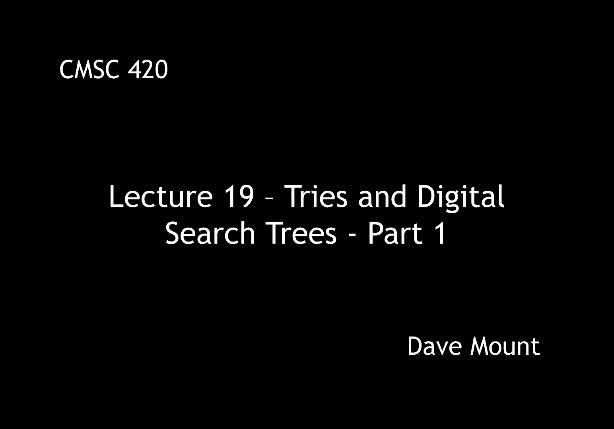
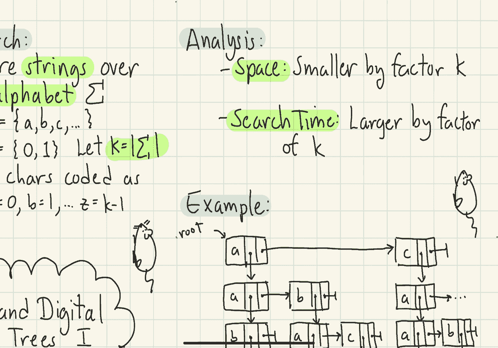
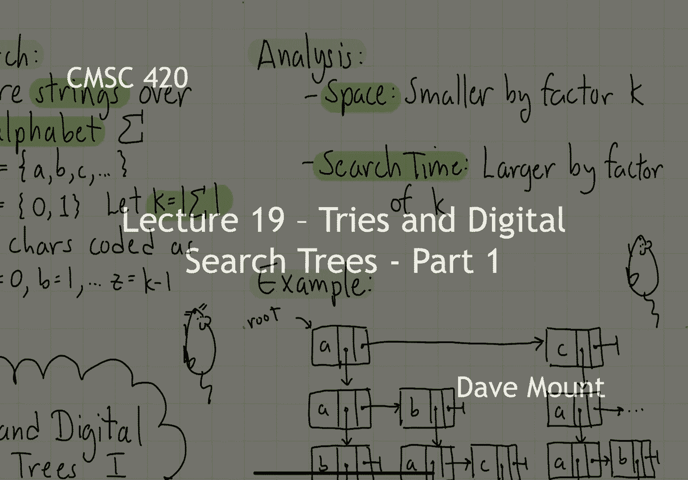

# 【双语字幕+资料下载】马里兰大学 CMSC420 ｜ 数据结构 (2021最新·完整版) - P48：L19- 前缀树／字典树 1 - ShowMeAI - BV1Uh411W7VF

hi everyone，in today's lecture we're going to talk，about a new type of search structure。

these are called tries sometimes called，digital search trees and variants on。

this idea the common theme of all the，data structures we're going to talk。

about is what is called digital search，up until now searches have been based。

upon comparisons less than or greater，than，in a digital search tree the idea is。

that our keys are going to be strings，over some alphabet，let's call that alphabet capital sigma。

for example the alphabet might be a b c，etcetera etcetera or it might be a。

binary alphabet such as 0 and 1。in general let's let k denote the size，of our alphabet。

we're also going to assume that our，characters and our alphabet can be。

encoded as integers you know for example，a equals 0 b equals 1 etc up to z equals，k minus 1。

 what this means is that，rather than making comparisons whenever，we want to you know。

perform a search in our data structure，we can branch based upon that。

value using it as an index into an array，this gives rise to the idea of what is。

called a tri data structure，tries are very venerable data structures，they date back to 1959。

by renee de la briande，um，de la briande invented the idea of the，try，later。

fredkin came up with the sort of the，name，t-r-i-e which he which came from the，word retrieval。

apparently fredkin actually pronounced，it tree but this caused too much。

confusion and later on people changed，the pronunciation from tree to try a。

node in a try is going to be a multi-way，node of order k that is it's going to be。

an array with one entry per character in，our alphabet and the way in which i。

access this is by using the character in，my search string to actually do a table。

look up and branch to the appropriate，subtree so let's take a look at a little。

example to see how this works let's，consider the alphabet abc where a is，encoded as 1 b is。

a is encoded is 0 b is 1 and c is 2。 and，let's suppose we want to store the。

following keys a a b a b a etc here is a，picture of the try that results that，stores these keys。

notice that this is very much like an，extended tree in the sense that all of。

the keys are going to be stored at the，leave level and the internal nodes are。

merely going to be um you know used for，as an index to find my way to the。

appropriate leaf entries the way in，which you determine where a leaf is。

going to be placed is just by following，it character by character through the，tree so for example。

let's take a look at the the very last，string cbc right what i'm going to do in。

this case is starting at the root i look，at the first character of that string。

that's a c i follow the c link，that takes me down to the right most。

child of the root node okay next i look，at the character b that's going to take。

me to the middle child of that node okay，and then finally the character c that's。

going to take me to the rightmost child，of the right right grandchild，of the。

of the root node and that's going to，take me to the leaf node cbc。

so as you can see it's almost trivial to，search for an element inside of this，tree。

and notice as well there's no issue of，balancing or things like that right when。

i want to insert something into my try i，just simply walk it level by level。

through the try and as needed i'll，create new nodes until i finally have。

you know reached the level at which i，can store the um，you know the leaf node there tries are。

nice because they are very simple which，is one of their main appeals。

one of the issues i'm going to have with，the drawing that i just made above is。

it's kind of a pain to draw these large，very very wide nodes right especially if。

i have a large alphabet，so i'm going to adopt a different method，of drawing my tries。

but i want to emphasize this is exactly，the same data structure it's represented。

internally in exactly the same manner it，is just a more convenient way for me to。

draw pictures on the slides，at every node rather than storing the。

entire array right of pointers many of，which might be null，instead what i'm going to do is i'm just。

going to create edges for the non-null，child pointers inside the node and i'm。

going to label each one of these，edges according to the character that's。

involved if i look at my previous，example，the root node had only two non-null。

links to its children one for a and one，for c and in my picture i'm going to。

have two edges coming out of my root one，labeled a and one labeled c again i want。

to emphasize though that this is merely，a alternate drawing the data structure。

is represented in exactly the same，manner as shown above that is every node。

is going to be an array of length k，let's analyze the query time and space。

for our try what does the search，consists of well whenever i want to。

perform a search i'm simply going to，walk the search key right character by，character。

down through my tree so clearly in the，worst case the amount of time it takes。

to search for a node is just going to be，the length of the query string how about，the space。

first off what is the total number of，nodes in my tree，if i'm storing n keys in the tree the。

number of nodes actually might be much，larger for example，even if i'm only storing one。

key in my string but that key has a，hundred characters that means i have got。

to create a hundred nodes to get to that，you know to that leaf node for that。

character so the total number of nodes，in my tree will actually be equal to the。

total number or at least proportional to，the total number of characters over all。

the strings that i'm storing in my data，structure let me mention this is a worst，case bound the。

space requirements for the tree are，therefore going to be k that is the，width of each node。

times the number of nodes in the tree，this is quite large and a lot of the。

effort that we're going to expend in，looking at variants of tries is going to。

be seeing how to reduce the space，requirements let's consider the first。

idea for how to save space this idea was，suggested by the inventor of tries de la。

briande we're going to store only one，character for every node rather than。

having these very wide nodes and we're，going to have two pointers the。

horizontal pointer that goes to the，right is going to be the link that we're。

going to follow if the character in our，search tree in our search，string does not match the current。

character x if that's the case then what，we're going to do is we're going to。

compare the next character in sequence，that is we're just going to go through。

the alphabet comparing one character，after another until we get a match。

if we do get a match with our query，string then we're going to take the。

vertical link going down and then that，means that we can advance to the next。

character of our query string if this，node structure looks familiar you might。

say hey this looks kind of like what we，did with the first child next sibling。

representation and in fact that is，exactly what we're doing here so let's，take a look at an example。

i'm going to give a partial drawing of，the try that we had drawn earlier using，the de la briande。

representation notice again，the um，you know this is like an extended tree。

because the keys themselves are being，stored at the leaf level okay and the。

internal nodes are just going to be used，as an index，to see how this works let's suppose that。

i wanted to search for the string abc，okay so when i start at the root i check。

the first character of my search string，okay，that matches the a so i go down from，here。

now i'm at the let's say the child，immediately below the root i check to。

see the next character of my search，string well that's a b well it doesn't。

match the a so i go horizontally to the，b entry it does match there so i drop，down。

when i drop down it now says check the，character to see if it matches the a。

check the next character that'll be my，third character or my c in my query。

string it doesn't match the a so i take，a horizontal step to the right and then。

it says does it match a c it does and so，i drop down and i wind up at the leaf，level abc。

okay the leaf level node abc so notice，by，operating in this manner。

i can essentially navigate my way down，to any of the leaf nodes in my tree well，let's analyze the。

you know the space and query time for，this data structure，the key thing about the space is we've。

replaced our very wide nodes with very，you know skinny nodes which is great so。

now our space requirements are，essentially going to be smaller by a。

factor of k i'm still going to have the，same number of nodes but。

the nodes themselves are begin are going，to become smaller the search time。

however is going to suffer because now，you know if you imagine i have a 26。

character alphabet rather than just，spending constant time per node to do a。

table lookup what i have to do is i have，to compare you know is it equal to。

character a is it equal to b is it equal，to c and so forth until i get a match so。

basically i'm saving a factor of k in my。

space but i'm losing a factor of k in my，search in the next segment we're going。

to see whether we can even do better。

