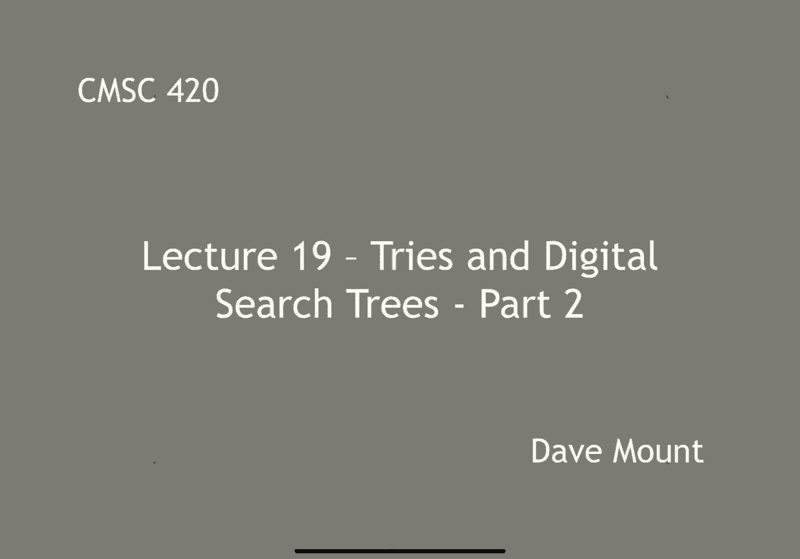
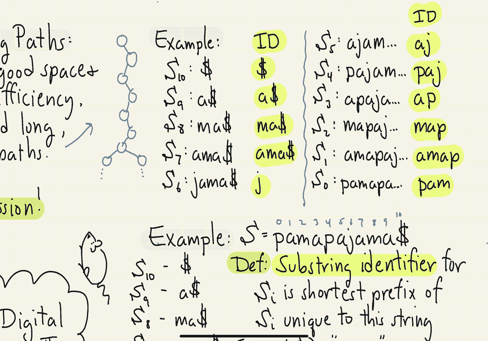
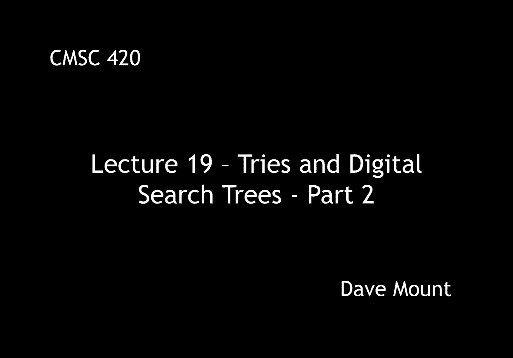

# 【双语字幕+资料下载】马里兰大学 CMSC420 ｜ 数据结构 (2021最新·完整版) - P49：L19- 前缀树／字典树 2 - ShowMeAI - BV1Uh411W7VF

Let's continue our discussion of，Fries and digital search trees。

Remember that we ended the last segment with the question of。

How do we reduce the amount of storage that we need for tries。

You know causing the search time to increase too much。

What are the main issues that we're going to have to deal with，Is the。

The problem with having long degenerate pass，I want to get both good space and good query time efficiency。

I need to avoid these degenerate，Zuercher，Whatever stick situation where I have，Words that share。

Very long prefixes with one another，Trick to dealing with this is going to be something called path compression。

Compress long pass in our tree，Data structure that does this is called a Patricia tree。

It improves upon the tries data structure，By compressing degenerate pads。

You might wonder where Patricia comes from is it the name of the inventor the answer is no Patricia was actually。

Sane acronym，The acronym is，Practical algorithm，To retrieve information，Coded in alphanumeric。

This data structure was invented in the late 1960s by Morrison。

I think she was the one who gave it the name，And it was independently discovered by someone named Graham Burger。

Rather than having to look at，Each individual character one by one。

What each note of our data structure is going to store an addition is something called an index finger。

When does index field，Tells us，Which character position in the query string to look at next。

Pictures were going to illustrate this by putting these this index inside of the just a label inside of each node。

Like I said，Sing this index I means，Look at，Position I within that is the character a position I in my query string。

In order to perform the next discrimination，Take a look at a little example of this。

Suppose we want to store these，Essence essential estimate，Sublease Sublime and subliminal Anaya。

Choosing these two have lots of common you know，Substrings and prefixes，The right here。

Let me show an illustration of what the，Patricia try will look like。

And let me remind you that I am using the alternative drawing method。

Did I presented in the previous segment，Which one of the nodes here is actually going to be a Wynonna right it's going to be a。

Note that has k-elements splitting according to each Eric character of my alphabet。

The root note here that was just going to have two non-null children，One for the Ian one for the s。

Let's see how this works，So starting at the root，Reuters label with zero remember that we're going to do all of our indexing as with Java。

Starting a 10000 means the first character of our search string，This case。

First character of each one of the keys that we have is either going to be a letter e or is going to be a letter s so I only have two links。

Hunan no links coming out of here，11414 s，Suppose I'm on the east side。

So that's going to identify the，The treat the three strings Essence essential an estimate。

Those Alegria position one right they all contain an acid position 1，They disagree a position to。

Opposition to，Either have an S or a have a Tissot，The next the left child of that root note。

Contains the two，Who says now for these notes，Take a look at that second position。

If it's an S go to the left child if it's a t go to the right Child by the way。

In general of course these are multi-way trees so they're not just binary tree's you could be splitting many ways but I'm just trying to keep the。

Example simple here，Okay，The essence and essential are going to go off on the left side，Estimate。

It's going to be on the right side here，And then，Listen to the essential。

Don't agree all the way out to the，Supposition，At the fifth position，Justin's has a c。

Essential has a t，I noticed my drawing here I haven't eaten should be a sea that I have there。

How to correct that in the in the slide，If I go to the other side now let's look at the the right child of the route。

Right that's the s，Again I have all of my eskes，Agree in the first positions S U B & L。

At the fourth position is what I get the first difference，Sublease has an e，I haven't。

Nando entry that says a physician for，Check the character if it's an ego to the left，Davidson died。

The right，The ones on the right that Sublime and subliminal，They next different at position 6。

I checked those if it's a letter e，And it's Sublime and if it's a letter I then it subliminally。

So notice，Essentially stored just the minimum amount of，Discriminations that need to be made。

In order to，Distinguish，Between the various，No keys of my data structure。

Patricia tries our much-loved in fact the general idea。

Compressing degenerate pleasantries is sort of called the Patricia trick it's a very common。

Idea that is，That is important，Whenever you have data structures that might have long degenerate pads。

As we did with regular tries，Drawing Patricia trees in this manner is kind of counterintuitive。

In particular，If someone says we'll look at index 5 you know I have to go back to my strings in to see what index 5 is。

This reason，Is coming to draw the Patricia try differently，I want to emphasize however。

This is merely a drawing technique and otherwise I'm going to use it in my slides when I drop Trisha tries。

The representation of the Patricia try，Is going to be as done above，Well I'm going to draw each Edge。

This follows，Going to put a substring on the edge，The first character。

That substring is going to be the character of the discriminating character that I'm going to look at。

And the remainder，That string，Are going to be the common。

Characters that are shared by all of the entries inside of this subtree，Give an example of this。

Here's a picture，Of the alternative drawing，The Patricia try that I just drove，Earlier，Noticed。

Same leaves appear in exactly the same order，The only difference is how I label the edges。

For example，Look at the route，Who has two children，Eastside in the SI。

But all the subtrees on the Eastside share the ES，Prefix in common so I just label bes。

Physics along the edge，OVI，The strings on the right side the other side，NDSU BL prefix in。

I just labeled that with subl，Working my way down the tree。

This is nice because if I want to for example，You know，Find my way to you know any。

Leaf node in the tree let's，Example essential，As I read the labels along the edges，Yes。

I'm going down to the left side Sen，Going to the right side tial，I can actually just read off。

Characters of The Leaf node，I'm looking at the labels along the edges。

This is why I like using this method for drawing the trees，I said before。

This is not a different day to structure it's just an alternative way of drawing exactly the same tree as before。

Let's do an analysis of the Patricia tree，The query time is essentially the same as it was for the standard try。

I just have to，A constant time for every note that I visit，The current time in the worst-case。

Is just going to involve，Alyssa it could be as long as the length of the query string itself。

Of course it actually might be smaller，If there are，Characters that you're skipping over。

You don't need to actually even inspect those character。

But of course in the worst-case you might have to inspect every one of your characters in your query string。

Space，Space is going to be much better，In particular the number of nodes in the tree。

It's going to be equal to the number of strings，In my dataset irrespective of their legs。

When you see this is to observe that every node in my try is going to split at least two ways。

Easy proof by induction，Chose，Anytime you have a tree in which every node is at least two splitting。

Total number of nodes，Is never going to be bigger than the number of leaves。

Okay we actually proved a result earlier about this you when we were talking about。

Extended binary tree，This works with any tree that is splitting either，Two ways are higher。

So this implies，The total space required by my data structure。

It's just going to be K that is my alphabet size，Times the number of knows I guess to be proper I should say k + 1。

This is just an asymptotic results，Let me add that I'm usually going to assume that Kate is a constant write the alphabet size is a constant independent of him。

Santa's being a number in the Millions，Is a very small number，Ranging from baby to，Perhaps you know。

256 or something，Our next topic，Going to be something called suffix trees。

And this is a very cool data structure that is very widely used in the context of。

String data structure，This we're going to assume we're giving a whole series of。

You know keys that we want to store，Rather that we're giving a single large texturing。

We want to represent，Let's imagine for example that the Tech Spring that I'm looking at。

Consists of you know all of the lecture notes in cmsc424 this semester。

Kind of creepy that we would like to answer，Is，I would like to look up。

Substrings within this large text and furthermore I'd like to answer questions，Such as。

How many times，Does a certain substring occur within the large Tech，Example。

How many occurrences of the word tree，Are there in the cmsc422 lecture，First off。

What's the point of little bit of notation，Our text，Is going to be designated as a。

Character string of length n，Here's how it works，Take the text that you want to store and I want to think of us as being a very large drink。

The cast is going to be denoted by the characters a0 A1 A2 up to Ace of N - 1，Unity in characters of。

And to this I'm going to upend，A very special symbol call the terminal symbol。

Amanda's going to be indicated by a dollar sign，Just have to be any symbol that does not appear anywhere else inside of the text。

Define the suffix Essa by where I could be any index from you know zero up to n，Tubi。

The substring a1air by a Supply Plus one。 All the way out to the end of the string another words a suffix。

Is just any substring that starts at a position I，Goes all the way to the end of the string。

Telescopic street is going to store or encode efficiently all of these suffixes。

Right there at like I said they're going to be in plus one suffixes，Let's go to encode all of them。

The question is going to be important in the design of the suffix tree。

What is the minimum size substring needed，To identify a given set。

Make this a little bit more concrete above here，Let's take a look at an example。

Suppose that my string s is，Llama pajama，Okay with the dollar sign added Athea，Again remember that。

The number of characters and is going to do no just the regular word and I'm going to add this extra character dollar sign at the end to make nplusone character's overall。

Even my suffixes are going to be，Swallow，Desitin is going to be just a dollar sign alone。

Sf9 is going to be the A and the dollar sign s of 8，Man the dollar sign，Someone in so4。

Define a substring identifiers，Suffix sob，Be the shortest prefix of this，Suffix，Uniquely identifies。

How to make a more concrete，Suppose I look at the suffix S1。

What is S1 well it's AMA pajama dollar sign，If I want to identify that substring uniquely。

All I have to give you is the AMA，Because there's no place else in my string，It has。

This substring appearing，Only if I wanted to identify this substring sm7，What is that。

That is AMA dollar sign，If I gave you a m a dollar sign，That would uniquely identify this suffix。

If I just gave you the AMA that would not uniquely identify any suffix cuz there are two suffixes that begin with that。

The idea behind a substring identifier，Shortest prefix，Uniquely identifies any sub。

Let's give some examples of what the，Substring identifiers would be。

Let me write out for our text ring，Llama pajama，Let's write all the suffixes and let's see what the IDS are。

Astounded that's the dollar sign right well it's identifier is itself just a dollar sign。

S9 that is a dollar sign well I can't just listen ta because they're many eggs in my string so a dollar sign uniquely。

Is this，Satma dollar sign S7 am a dollar sign，Birthday Christine one comes when we get to S6。

Essex is the suffix，J a m a dollar sign，Only one J in my string，So if I tell you，Substring J。

That uniquely identifies S6，There's no other place，In my string，Garcia letter j。

Therefore if you know if you see the substring J，You know that you must be talking about。

Suffix Essex，Escalon from here，Suffix S5 that is Aja whenever you know am a dollar sign。

That is identified by this substring AJ once I see an A&J right there is no other place in my screen 。

where I see this combination so I know that the suffix starting there is S5，Next。

Suffix S4 that is pajam，That one is identified by paj right because once I've seen the PBA and the Jay I know。

They must be at suffix as for，For the rest of，Cenotes in each case if I look at these IDs。

Every one of the IDS occurs only once inside of my text ring。

And therefore it uniquely identifies the suffix that begins with that，Starting your character。

We talked about now with the suffix identifiers are，In the next segment。

Going to talk about how do you build a suffix tree based upon these。

