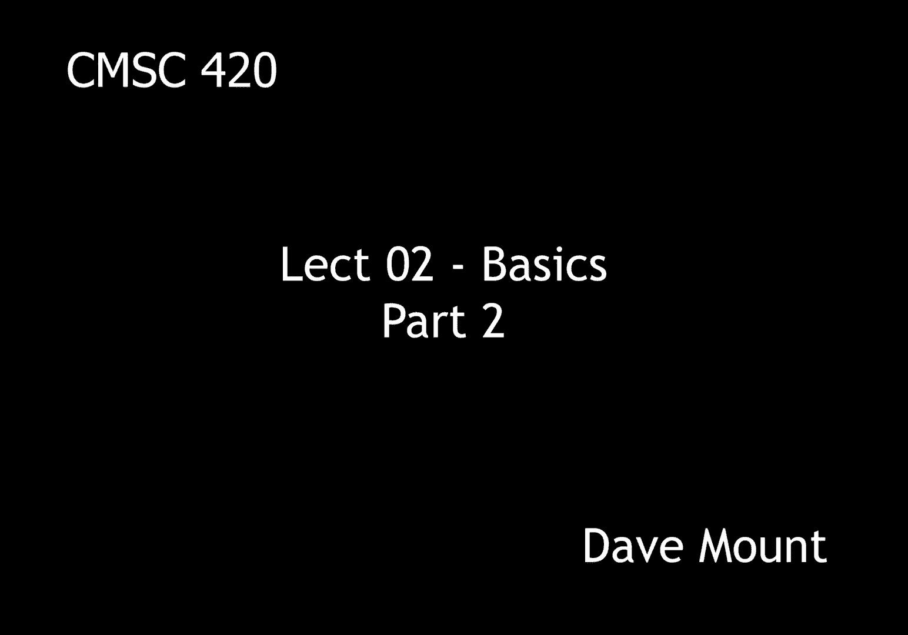
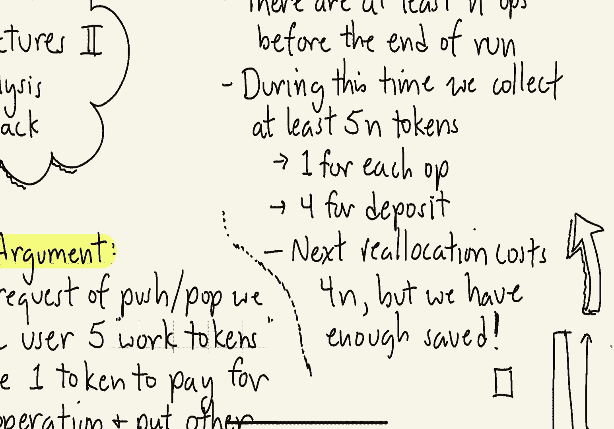

# 【双语字幕+资料下载】马里兰大学 CMSC420 ｜ 数据结构 (2021最新·完整版) - P4：L2- 基础数据结构 2 - ShowMeAI - BV1Uh411W7VF

hey everyone in this segment we're going，to talk about the amortized analysis of，dynamic stacks。

in the previous segment we talked about，the idea of dynamic sequential。

allocation this means that we're going，to use an array to store things but when。

we overflow the array what we do is we，double the size of the array and copy。

so suppose we have a stack containing，three elements that's stored in an array，of size four。

suppose at this point that the user asks，us to push the element 11。 no problem we。

just add it to the top of the stack okay，but now the array contains exactly as。

many elements as the size of the array，and if we attempt to push another。

element say 23 we're in big trouble we，have no space for that so what we're。

going to do is we're going to allocate a，new array of twice the size that is 8。

elements we will copy each of the old，elements over the 7 the 3 the 9 and the。

11 and then we'll add or push the，element 23 onto the new stack，what we want to do is to study the。

efficiency of this particular approach，of repeatedly doubling the size of the，array。

to do this we need to establish first a，formal cost model that is what are the。

actual costs that are incurred by each，of these operations，the first type of an operation is what。

we call a cheap operation this is an，operation that doesn't result in any。

reallocation of the array we charge each，of these exactly one unit。

the other kind of an operation is going，to be called expensive this is one in，which we do allocation。

we assume we have an array of size n for，some value n，and this array is then going to be。

reallocated into an array of size 2，times n the total cost is going to be 2，times n plus 1。

2n to set up the new array and plus 1 to，perform the push operation on this array。

so let's take a look at this on an，example suppose we start with an empty。

stack and an array of size exactly one，and we perform 17 consecutive push，operations。

the first push operation is just going，to add that element onto our one element，array no problem。

the second push operation is going to，create a overflow and that's going to。

result in the allocation of a new array，of size 2。so the cost of these first two。

operations each push is going to cost us，one unit，and because we reallocated the array to。

an array of size 2 that's going to cause，us an allocation cost of 2。

next let's push the third element on the，stack，at this point we've overflowed our array。

of size two and so we're going to，allocate an array of twice the size of，size four。

so the cost for this operation is going，to be one unit for the push operation。

and four units for essentially setting，up this new array of size four。

the fourth push operation is not going，to have any problem because we already。

have an array of size four and so we，have enough elements，in the array in order to store the。

elements we need on our stack，the fifth push operation is going to。

result in an overflow causing us to，allocate an array of size eight so。

that's going to cost us eight units and，in order to do the actual push of the。

fifth operation that's going to cost us，an additional plus one，the sixth the seventh and the eighth。

push operations are only going to cost，us plus one each because no reallocation。

is needed we have enough elements in our，stack to store them the ninth push again。

is going to result in an overflow，this is going to cause us to allocate a。

new array of size 16 doubling the，previous size，we're going to have to take 16 units of。

actual cost to initialize that array，copy everything over and whatever。

and we're going to charge one unit for，the actual push operation following this。

push operations 10 through 16 are all，going to be cheap because we have enough。

space in our array to store each of them，finally push number 17 is going to，result in an overflow。

that's going to cause us to，allocate a new array of size 32 doubling。

our previous size of 16 copying all the，elements over which gives us a cost of，32。

and we're going to charge one unit for，the actual push itself，so let's take a look and see what the。

total cost of all these operations is so，we have，17 individual plus ones for each of the。

push operations okay and the allocation，costs are basically this geometric。

series 2 plus 4 plus 8 plus 16 plus 32，because every single time we're going to。

be doubling the size of the array so if，we never had to worry about overflows we。

would have paid a cost of exactly 17 in，other words all the operations would，have been cheap。

the price that we have paid for the，luxury of having this dynamically sized。

stack is going to be 79 clearly that's a，lot more but the question is how much。

more is it can we put a formal bound on，how large that will be，and to do this。

we'll want to take a look at the notion，of an amortized cost，amortization is a concept that arises。

from economics it involves the idea of，evening out payments over a long period。

of time by paying in installments，instead of paying in let's say bulk。

in the case of algorithm design an，amortized cost is defined as follows。

starting from an empty data structure，suppose that we perform a sequence of m。

operations of whatever kind you like in，the case of a stack it'll be pushes and，pops。

okay suppose that we analyze the total，actual time as being t of m so t i want。

to think of as being just some function，of the number of operations that i'm。

performing and think of this as a worst，case，then we define the total amortized cost。

to be t of m divided by m in other words，i want to think of this as the average，cost per operation。

so in the remainder of this segment，we're going to prove the following。

theorem starting from an empty stack，the amortized cost of each of our stack。

operations is at most five，in other words what we're saying is that，in any sequence of m。

push and pop stack operations，the total cost of all these operations。

is going to be at most five times m，we're going to prove this theorem by。

playing a little account and trick，when we do this in computer science this。

is called a charging argument at the，heart of the charging argument is every。

time the user requests us to perform an，operation either a push or a pop we。

charge the user five work tokens，to extend this accounting analogy here's。

the way in which our mathematical，analysis is going to work we're going to。

use one of the tokens that we've，collected from the user to pay the。

actual cost of the operation and we're，going to put the other four tokens in a，bank account。

most of the operations we're going to，perform are going to be cheap ones and。

so we're going to tend to accumulate，these tokens over time but whenever we。

get to an expensive operation that is a，reallocation we are going to need to。

access our bank account to pay the，actual cost，we will show that whenever we come to an。

expensive operation there's always going，to be enough tokens in our bank account。

to pay the actual costs，okay so let's illustrate this on a，little example。

suppose i start with a stack that，contains five elements that's being。

stored in an array of size eight this is，not a coincidence by the way how do we。

get to an array of size 8 well it，happened because we doubled an array of，size 4。

 why did we double an array of，size 4 because we tried to add the fifth。

element to an array that already had，four elements inside of it okay，so。

but let's assume that this operation has，already taken place and let's consider。

the very next push operation so when we，perform a push to add the sixth element。

to the stack that costs us that is a，cheap operation so it costs us only one。

unit of actual cost however we collect，in our little accounting game five units，from the user。

next let's consider what happens when we，push the seventh element into the stack。

again this is a cheap operation because，we have enough space in our stack so it。

only costs us one unit of actual work to，do this however as part of our little。

accounting trick we are charging the，user five units to pay for this so then。

with the next push we still have enough，space right so there's only going to be。

one unit of actual costs but we're still，collecting five units of tokens from our，user。

finally what happens when we push the，element that brings us up to nine at。

this point we overflow our array of size，8 okay so now we have to allocate an，array of size 16。

 that costs us 16 units，for the reallocation，plus we have one additional unit to pay。

for the actual push operation for a，total of 17。 so the actual work we've。

done here is 17 and again we only，collect five tokens from the user。

finally let's compare our costs we paid，an actual cost of one plus one plus one。

plus 17 for a total of 20，and in our little accounting game we。

have collected five plus five plus five，plus five tokens for also for a total of。

twenty thus in other words these two，costs match the actual cost which is。

this very bursty function sometimes very，low sometimes very high and the。

amortized cost which is a very even，installment plan are coming out to。

exactly the same value which is just，what we want to have，okay so let's present the proof of this。

theorem，the first thing we're going to do is，we're going to break our entire sequence。

of m push and pop operations into a，collection of subsequences which we're。

going to call runs the way we do this is，we look at the sequence and every single。

time we perform a reallocation we，essentially cut the sequence right after。

that operation that caused the，reallocation so for example if we look，at the。

sequence of 17 pushes that we did，earlier in the segment we did a。

reallocation after the second the third，the fifth the ninth and the seventeenth。

pushes so after each one of those we are，going to break this entire sequence into。

a run and so hence we're going to get，one two three four five different runs。

from this entire sequence so let's see，what happens whenever we start a new run。

we have just reallocated elements into a，new array of twice the size so there if。

the previous array size had been n we，now have n plus one items in the stack。

because we just overflowed and we have，just created a new array whose size is，2n。

so the recurrent run is going to end，when we overflow our current array of。

size 2n okay that is we have 2n plus 1，total elements so we started with n plus，1。

 to get up to 2n plus 1 there's a，difference of n elements we have to have。

a net of at least n additional pushes，over pops in the worst case if we get。

nothing but pushes it's going to take at，least n pushes to get us up to that，point。

during these n operations we collect，five tokens for each one of them that is。

we have a total of at least five n，tokens perhaps more，one of these tokens we're going to use。

to pay for the actual operation and that，means we're able to bank four tokens for。

each operation that is we have a total，of four n at least tokens in our bank，account。

finally when we come to the end of the，run we're going to have to reallocate。

our 2n size array into double the size，that is an array of size 4n so that'll。

cost us 4 times n in order to do this，however observe that we have saved 4。

times n in our bank so we know that we，have enough to pay for this operation。

so in summary what we have shown is by，charging five tokens for every operation。

right and this is just kind of a funny，money uh accounting trick that we're，doing。

the total amount that we have saved up，in the process is enough to pay for all。

the actual costs of our operations so if，t of m represents the total cost what we。

have shown here is that。

t of m is at most five times m。

