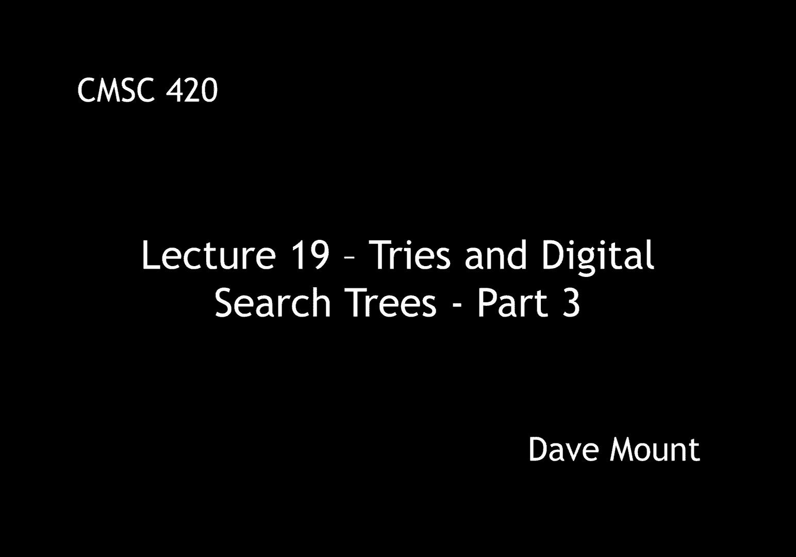
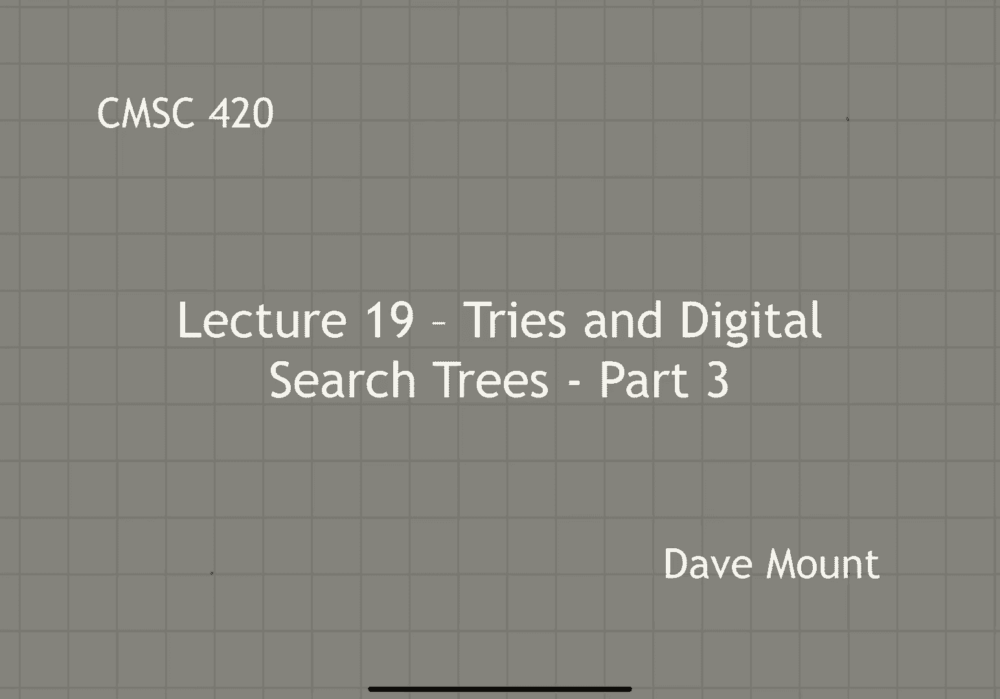
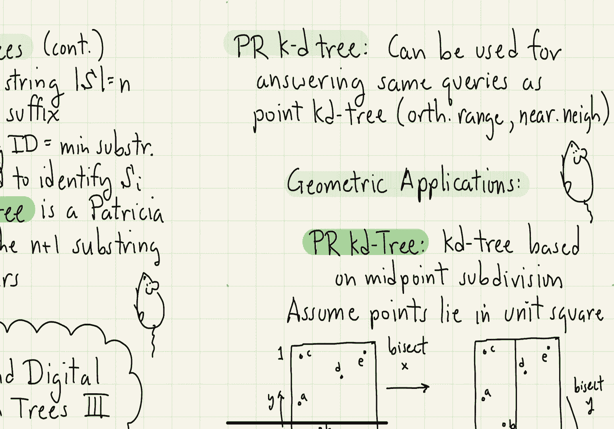

# 【双语字幕+资料下载】马里兰大学 CMSC420 ｜ 数据结构 (2021最新·完整版) - P50：L19- 前缀树／字典树 3 - ShowMeAI - BV1Uh411W7VF

in this segment we're going to continue，talking about digital search trees and。

tries in particular we're going to，finish up the discussion of suffix trees。

let me just remind you kind of where we，were with suffix trees，we had a text string s。

which i wanted to think of as a very，large you know document that just been。

encoded as a single string let's let n，denote its total size，and also remember that we tacked on an。

additional n plus first character that，is a dollar sign or something special。

that doesn't occur anywhere in the，string we define s of i to be the i。

suffix that is everything from position，i all the way out to the end of the。

string and remember that we index from，zero so s sub zero is the entire string，s of n。

plus one is going to be i'm sorry s of n，is going to be just the dollar sign。

itself we can now define a suffix tree，to be a patricia tri，that stores the n plus one substring。

identifiers，for all the suffixes，okay well that sounds like a kind of a。

weird thing to define but we'll see in，just a minute that this data structure。

is very useful for answering，you know substring queries in my，original text。

let's go back to our previous example，let's let s our text be the string palma。

pajama that we had mentioned before okay，that string has 10 characters in it。

and we attacked on an 11th character for，the dollar sign in the previous segment。

we get listed out all the substring，identifiers let's insert those all into。

a patricia try and here is what i get as，a result i have labeled each one of the，leaf nodes with the。

sub the suffix that corresponds to this，so for example，well if i look at the leaf node labeled。

10 that is the right most leaf node here，right that is associated with the suffix。

s sub 10 and s sub 10 is just dollar，sign and its i substring identifier was。

just the dollar sign itself let me give，a couple more interesting examples，though。

remember that the substring identifier，for s1 was amap right s1 was。

a-m-a-p-a-j-a-m-a dollar sign okay but i，only need the characters amap to。

uniquely identify it so if i go into my，tree，and i follow，right the pathway a to m a to p it leads。

me to the leaf node labeled 1 so this is，the substring identifier for suffix s1。

similarly if i wanted to find the，substring identifier for s7 so what is。

s7 that's ama dollar sign well its，substring identifier was，the also just am a dollar sign and if i。

follow that path a then to m a then to，dollar sign i wind up with the node。

labeled seven okay so you can see now，that for every substring identifier。

there's going to be a path in my，patricia try leading to that，let me also remind you that i'm using。

the，the alternative drawing method for，patricia tries that i described earlier。

so how do i perform substring queries in，my tree well let's recall that a。

substring query has the following form，i'd like to know how many occurrences in。

the text is there of a certain target，string let's call this target string t。

so what we do is we're going to go，through our，suffix tree our patricia try and search。

for this target string t，there's one of two things that can，happen。

the first is we could end our search at，an internal node of the patricia try。

okay by the way in fact you can not only，end at a node but you could actually end。

in the middle of a node but if you end，in the middle of a node well that's fine。

you essentially are just going to you，know pretend that you're falling down to。

the next node beneath you okay if this，happens then what you do is you look at。

the subtree of the node that you've，wound up at，and you look at how many external nodes。

are basically，stored inside of this subtree that，number of external nodes is going to be。

equal to the number of matching subtrees，and we'll or the matching number of sub。

strings and we'll see this in just a，second，the other possibility is you actually。

fall off the end the bottom of the tree，and if you fall off the bottom of the。

tree it is possible that you well at，this point in time there's only going to，be a unique。

substring in the text that you could，match and what i do is i go back to the。

text and i just check character by，character whether the target string that。

i'm looking for matches with the，substring that i have there okay if you。

match then you report that there is，indeed one occurrence if it doesn't。

match well then you report that there，are no occurrences of the target so let。

me give you an example here let's，suppose i want to search for the string。

ama in my original text by the way ama，appears twice right it appears，at the。

right in the position s1 and it appears，at position s7 in my tree，okay。

so what i'm going to do is i start the，search ama running down my tree and i，wind up with a node。

right that has two children it has the p，and the dollar sign coming out of it。

the p led to a leaf node with a label，one in it the dollar sign led to a leaf。

node with a label seven what this，indicates to me is ama occurs twice in，my text string。

one time at suffix s1，right and in a second time at suffix s7，and indeed that's the case so in this。

case what i'll do is inside of this node，i'll record the size of the subtree that。

is the number of external nodes in this，subtree is two and i'll just report that。

number or if i actually wanted to，enumerate all the instances i could do a。

traversal of this subtree and list out，basically all the indices of the。

external nodes that i have here let's，suppose i search for ama paj。

in this case i'm going to make it all，the way through my patricia tree and i'm。

going to end at an external node，the external node is amap okay well。

there's still two more characters to，check that is the last a and j。

to do this i'm going to go back to my，original text and i'm going to verify。

that the characters following the amap，are aj in this case they do match and so。

i'm going to report that there's one，occurrence on the other hand if the。

characters did not match then i would，report that this target string does not。

occur inside of my original text the，reason people like suffix trees is。

they're very efficient both with respect，to space and query time so，remember that。

if i have a patricia tree storing n，strings the total number of nodes that i。

need to store them is going to be，basically o of n，since the original string has n。

characters actually n plus 1，asymptotically the number of nodes that。

i'm going to have is going to be on the，order of o of n these are going to be。

wide nodes so each one is going to have，you know k entries or o of k entries in。

it so that's going to lead to a total，space of n times k but remember we think。

of k as being a constant so the actual，space requirements are going to be n。

times k what's the search time well，because i spend a constant time at each。

node of my patricia try it's just going，to be in the worst case as long as the。

length of the target string okay and，that's basically the best that i could，possibly hope for。

how long does it take to build the，suffix tree well um，you know you might say look the number。

of characters in each suffix right if i，look at suffix i the number of。

characters in that suffix is going to be，you know roughly n minus i。

the total sizes of all the suffixes is，pretty big it's quadratic in n however。

it turns out you can build the suffix，tree very efficiently the time to build。

the tree is essentially just o of n，you know plus an additional factor times。

the size of your alphabet which as i，said before we assume that the alphabet。

size is going to be a constant，finally i'd like to talk about a rather。

unexpected application of digital search，trees and this is to a problem in，geometric search。

um let me begin by talking about a data，structure called the pr kd tree pr。

stands for point region katy tree and we，talked about kd trees before remember a。

katy tree is a geometric data structure，which is binary where you split you know。

alternately on the x coordinate and the，y coordinate or you know if you're in a。

higher dimensional space you cycle，through the splitting coordinates in the。

previous point katy tree data structure，that we saw we use a point of our data。

set to decide where to split in the prkd，tree what you do is you always split。

through the midpoint of the cell so in，other words you don't even need to look。

at a point you always split at the same，location to begin with we assume that。

the points lie in a unit square，0 1 up to 0 1。 in particular we're going。

to assume that all of our coordinates，lie in the range between zero and。

strictly less than one now you might say，well what happens if my coordinates。

don't lie in that range well you can，always perform a scaling transformation。

to map them into this range right you，just you know you add a sufficiently。

large number to make them all positive，and then you take the maximum value and。

divide by that and then you can，basically map everything in the range to。

zero to one this is done mostly as a，convenience and you'll see why when i。

start talking about the splitting，properties of the tree it's convenient。

to assume that everything is inside of，this unit square so let's take a look at。

this little example i've drawn these，points a b c d e inside of my unit，square。

what's the first operation well you，split through the bisector along the x。

coordinate that is x equals one half，okay that puts the a b and c on the west。

side of the tree and the d and e go on，the east side of the tree，okay next。

i take each of the two cells right the，west side and the east side and i split。

each of those along the y coordinate，again at the midpoint y equals one half。

so now on the you know west side i split，into a southwest and northwest side the。

southwest has the a and b the northwest，has the c and on the east side i split。

into the south east and the northeast，well the southeast is empty the。

northeast is going to have the d and the，e and then，i come back again and now the next level。

i'm going to split again on x right at，this point again i'm going to bisect，each of these cells。

by the way i only bisect a cell if it，has two or more points so the southwest。

side has the a and b i split that，through the midpoint that is x equals。

one quarter on the north east side i had，two points d and e and then again i。

split that right through the bisector，along the x axis that's going to be at x。

equals three quarters d is on one side，and e is on the other side now every，cell has。

strictly fewer than two points and i'm，done in my decomposition，so let's see what the final tree。

structure will look like so as we did，with kd trees before whenever i draw a。

node i'm either going to draw a little，vertical you know indicator or。

horizontal indicator to indicate whether，it's an x or y splitter here's a picture。

of the tree that we get the tree again，is going to be an extended tree that is。

the points are going to appear at the，leaf level of the tree a b c d and e。

because one of my cells was empty it is，actually possible that you could have。

leaf nodes that have no point in them，that's just simply a you know。

an issue of degeneracy that you have to，face when you have prkd trees so why is。

this discussion of pr katy trees，occurring inside of a lecture on digital。

search trees the claim that i want to，make to you，is the prkd tree is actually a try。

okay it is actually a digital search，tree and，this is kind of an unexpectedly cool。

fact because so far we have been talking，about storing strings and tries right。

strings are one-dimensional entities and，now we're talking about a。

two-dimensional data structure for，storing you know points that have real。

coordinates how could these two things，be possibly related to one another but。

that is what i want to finish up the，lecture by talking about let me say a。

few more things about pr kd trees pr kd，trees just like regular point kd trees。

can be used for solving you know，answering queries in exactly the same。

manner that we had before we can answer，orthogonal range queries we can answer。

nearest neighbor queries and so forth so，they're very practical very general data，structures the。

nice thing about them is because they，can be represented as tries all the。

algorithms that can be used for tries，can be applied to pr kd trees as well。

okay so in the next segment we're going，to finish up talking about the。

relationship between prkd trees and the。

