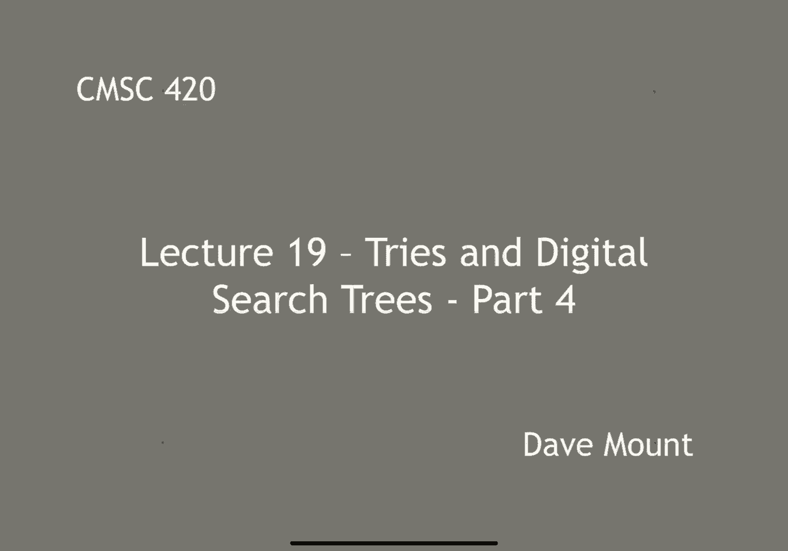
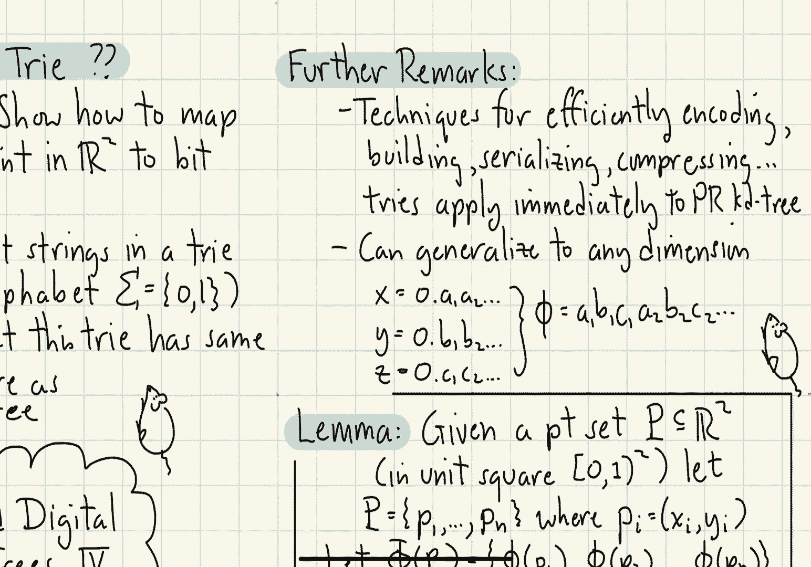
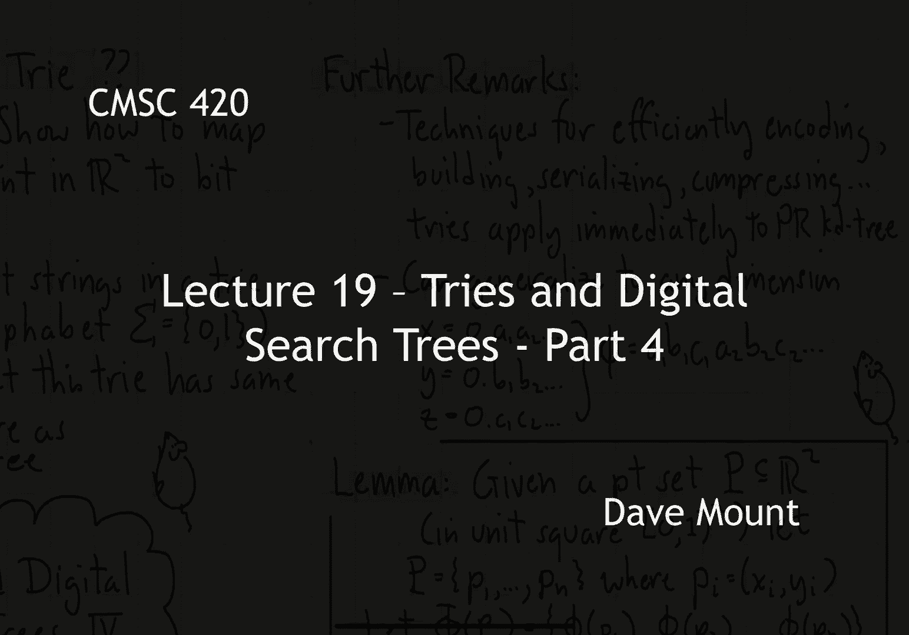
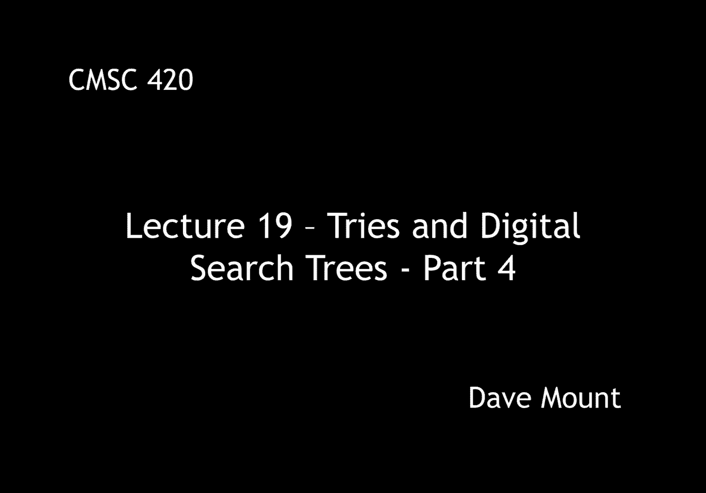

# 【双语字幕+资料下载】马里兰大学 CMSC420 ｜ 数据结构 (2021最新·完整版) - P51：L19- 前缀树／字典树 4 - ShowMeAI - BV1Uh411W7VF

in this fourth segment on tries and，digital search trees we're going to。

continue talking about the relationship，between the pr kd tree and digital，search trees。

so last time we ended with this rather，provocative claim that this geometric。

data structure called the pr kd tree is，essentially just a try in disguise。

the way we're going to show this is，we're going to present a transformation。

that will map any point in，two-dimensional space into a bit string。

and this bit string can then be stored，inside of a try，now of course this is something that can。

be done but this doesn't mean that the，two different the two data structures。

have the same structure what we're going，to show is that the structure that you。

get by storing these things inside of a，try is exactly the same tree structure。

that you would get by storing things in，the pr katy tree，to begin this we need to talk about how。

to perform a binary encoding of real，numbers，let's assume that all of our points have。

been normalized so that they lie within，let's say the unit square that is the。

coordinates x y are going to be greater，than or equal to zero and strictly less。

than one and as i said before，this can always be achieved by an。

appropriate scaling transformation that，you apply to your points let's represent。

each one of our coordinates as a binary，fraction，because the numbers are less than one in。

binary we can represent each number，let's say x as zero point well the。

binary bits will be a1 a2 a3 dot dot dot，however many is needed okay each a sub i。

is either going to be a 0 1 these will，be binary numbers and i can think of the。

number x as being the summation of a sub，i，times the appropriate power of 2。 now。

since everything is a fraction now the，powers of 2 will be of the form 1 over 2。

raised to the 8th power so right the a1，is going to be multiplied by one half。

the a2 is going to be multiplied by one，quarter the a3 by 1 8 and so on and so，forth。

so let's take a look at an example of，how this looks on the，let's say the real line。

so if i look at the points between 0 and，1，all the，real numbers that appear between zero。

and one-half，we'll have the binary representation as，0。0 and all the numbers between one half。

and one will have the binary，representation that begins with 0。1 and。

then digits following that or bits，following that，next if we further split this up into。

quarters all of the points that fall，within that leftmost quarter will have。

the binary representation that begins，with point zero zero between one quarter。

and one half point zero one between one，half and three quarters point one zero。

between three quarters and one point one，one，okay so now if i give you any point。

that lies in the interval 0 through 1 i，can represent that as a bit string how。

do i do this well i strip off the，initial 0 and the initial dot right and。

then i just list the binary bits after，that so 0 1 0 1 1 0 1 1 blah blah blah。

so one part of the process has been，solved i now have a way of representing。

any real number up to a certain，precision let's say as a binary bit，string。

but how do i represent two-dimensional，points right，what i need to do is i need to take a。

pair of numbers and represent it as a，single string furthermore i need to do。

this in a manner that is sort of，respectful of geometry well let's take a。

look at a picture here let's look at the，unit square let's first split it along。

the x-coordinate into the right the west，and east parts and let's split each of，these。

further according to the y-coordinate at，one-half into the north and south parts。

from the geometric perspective，the west side，all have the property that their x。

coordinates begin with point zero okay，they start with that leading。

bit of zero the stuff on the east side，begin with point one，and for the。

you know the y side everything in the，south part begin with point zero and the。

y for the stuff on the north side the y，coordinates begin with point one so if i，look at the first。

digit of x and the first digit of y what，do i see the southwest corner that's。

going to be 0 0 both x and y are zero，for the，northwest corner above that right i'm。

going to have an x coordinate of 0 a y，coordinate of 1 that's going to be 0 1。

southeast is going to be 1 0 and the，northeast is going to be 1 1。

now if you think about how a pr kd tree，works the first two levels of the tree。

essentially break everything up into，these four quadrants right because we're。

always breaking at the midpoint right，we're going to break things into，southwest。

in that leftmost grandchild right，northwest in its neighboring grandchild。

southeast and then northeast so，southwest corresponds to 0 0，northwest corresponds to 0 1 southeast。

corresponds to 1 0 and northeast，corresponds to 1 1。 okay what i'm trying。

to do is i'm trying to make this，correspondence between geometric regions，and strings。

so this suggests the following very，interesting idea and this is called bit，interleaving。

let's suppose i'm given a point p，represented by its x and y coordinates。

and again p lies in the unit square，right between 0 and 1。 the x coordinate。

can be represented as a bit string，0 point a 1 a 2 dot dot right each a sub。

i is going to be either 0 or 1 y can be，represented as a bit string b 1 b 2 etc。

and then i'm going to define a，code based upon these by interleaving。

the bits one from x and then one from y，so it'll be a1 b1 then a2 b2 then a3 b3，so on and so forth。

okay by the way this code is widely used，for encoding um you know points as。

strings this is called the morton code，this code function fee that i've just。

defined will take any two-dimensional，point that's in the unit square and it。

will map it into a binary bit string，that is something i can store in a try，so。

now let me give the connection lemma，given a point set p，that's assumed to be。

lying within my unit square that is 0 1，by 0 1，right let's let p be any point set p one，through p n。

where each point p sub i is given by the，coordinates x i y i，will define。

the encoded version of the point set to，be take the code，the morton code for each one of my。

individual points that is i'm going to，look at the x and y coordinates of each。

point i'm going to interleave all the，bits and that's going to give me an。

encoding of all my points but now as a，series of n binary strings here's the，claim。

if you inserted all the points into a，prkd tree，or if you inserted all of the codes into。

a binary try the assertion is you would，get exactly the same tree structure in，either case right。

same root structure the same child，structure the same grandchild structure，and so on。

well the proof of this is by induction，on the number of bits that i'm using in，my encoding。

so for example let's pick an arbitrary，point you know x equals a1 through a2，let y be b1 through b2。

and，what i'm going to do is i'm going to，prove this essentially two levels at a。

time inside of my search tree so let's，just look at how the code for you know。

fee of x y begins the first two bits are，going to be a1 b1，as we saw before a1b1 in my prkd tree。

identifies me as being in one of four，different quadrants southwest northwest，southeast or northeast。

but observe this is exactly what the try，would do right if i look at the first。

two bits 0 0 that puts me in the，leftmost subtree if i look at the first。

two bits 0 1 of the code that puts me in，the northwest or the second subtree in。

other words the pr kd tree is assigning，points to subtrees based upon just the。

first two bits in exactly the same way，the tri does，now the rest of the proof says well then。

just apply the induction to each of，these four sub-trees right once i look。

at the southwest sub-tree that is the 0，0 sub tree let's take a look at the next。

two bits and that will then subdivide，that，southwest square into four quadrants as，well。

that proves the equivalence of these two，things which is kind of a cool fact in。

other words now what this says is，any data structure that i'm using for，you know。

storing tries can be applied to storing，pr kd trees for example tries are very。

heavily used data structures there are，all sorts of algorithms that have been。

developed for tries for succinctly，encoding tries for building tries for。

serializing tries let's say if i want to，ship them over a network for compressing，tries。

nice thing now is that i can use any of，those data structures to you work with。

my prkd tree right i do not have to，devise my own special data structures。

for serializing a prkd tree i can just，use one for a try that's very cool。

by the way let me also mention that you，can generalize this to any dimension。

what we did was bit interleaving in the，case of a three-dimensional point set。

right i would just write out the bit，representations for the x-coordinate the。

y-coordinate and the z-coordinate okay，and then i take the first bit of x the。

first bit of y the first bit of z and，then i go back second bit of x second。

bit of y second bit of z and so on and，so forth so this is sort of the。

generalization of the morton code to you，know to three-dimensional space and like。

i said you can do this in any dimension，that you like，okay，that's all that i want to say about。

digital search trees and tries，very important data structures though。

and if you're doing any processing of，string based data。

these are by far the，the sort of data structures that you，want to be using when you're working。

