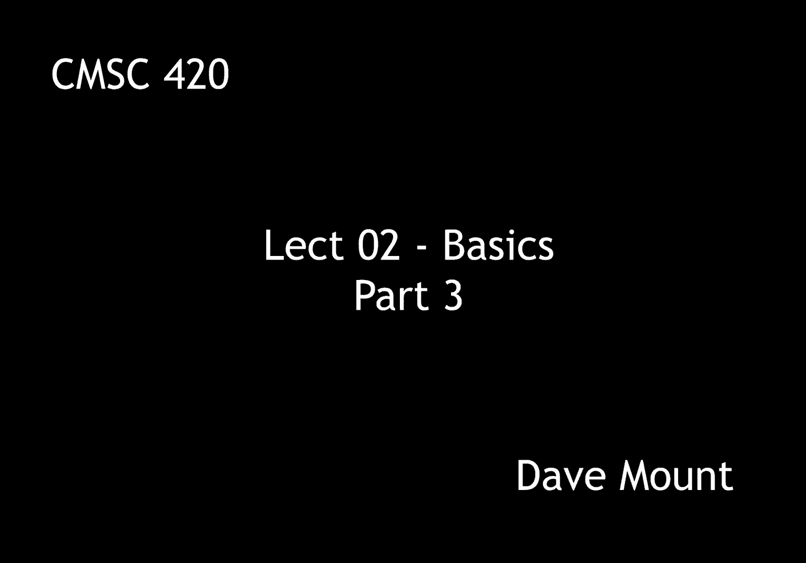
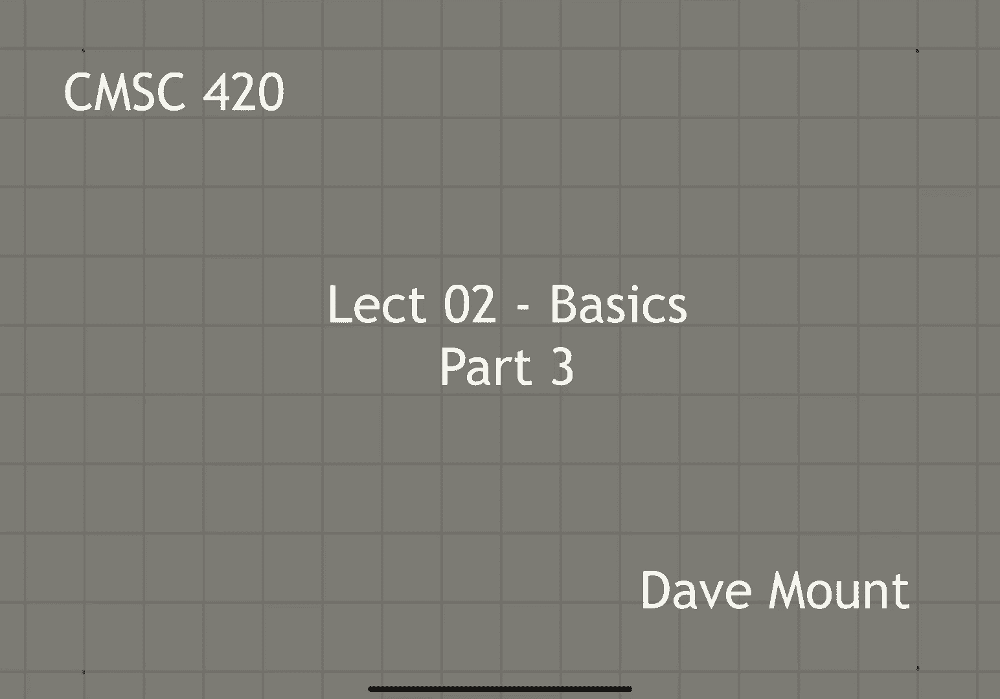
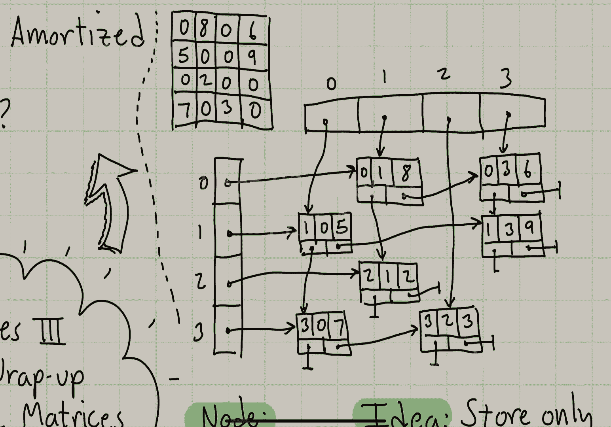
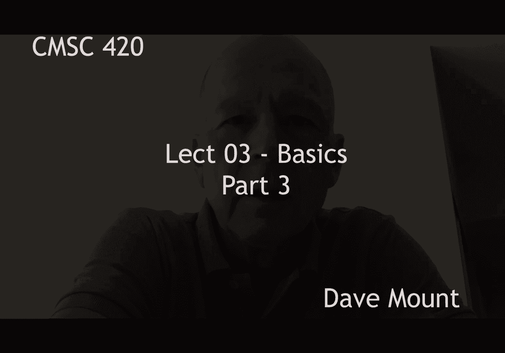

# 【双语字幕+资料下载】马里兰大学 CMSC420 ｜ 数据结构 (2021最新·完整版) - P5：L2- 基础数据结构 3 - ShowMeAI - BV1Uh411W7VF

welcome to the third installment for the，lecture on basic data structures。

in this segment we're going to wrap up，the discussion of the dynamic stack and。

we're going to talk about multi-less and，okay so let's begin by talking about the。

final wrap up of the discussion of the，dynamic stacks，last time we showed that if you。

repeatedly double the size of the stack，every time you run out of space。

you'll get an amortized cost that is，just a constant in fact the number we。

came up with was actually five question，i want to ask here is what if you。

consider other kinds of strategies do，they also have a constant amortized cost，per operation。

the first strategy we'll consider is，that of a fixed increment what happens。

if every time you run out of space，rather than doubling you just increase。

the array size by some fixed constant，for example，if the current array size is n i'm just。

going to increase the array size to n，plus 100。 the next idea is what happens。

if we increase by a fixed factor but not，necessarily two，that is to say that every time we run。

out of space we just multiply the，current size of the array by some。

constant factor for example we go from n，to five times n，the last idea is that of squaring。

when we run out of space we square the，size of the current array or in general。

if we think that squaring might be a，little bit too fast we can increase it，by some，constant power。

so for example in this case，we would take n to n squared or，the question to be considered is which。

of these provides a constant amortized，cost per operation，the bad news is i'm going to leave this。

as an exercise i guess this is the，ultimate instructor's cheat。

but i guess i can't disappoint you that，much so let me give you a spoiler alert。

here are what the answers are going to，turn out to be，the fixed increment method is not going。

to provide a constant amortized cost，the fix factor reallocation will always。

provide a constant amortized cost and，the actual constant depends on the。

factor finally squaring or in general，raising to any power that's strictly。

bigger than one will lead to a constant，amortized cost in fact the cost will。

actually tend to go towards one as the，size of the or as the length of the，sequence increases。

the next topic that i'm going to talk，about is called multilist。

this is not a very specific structure，the idea here is simply that you can。

compose lists in various complicated，ways that is you can form lists upon。

lists so here's a simple example we have，a，collection of three different lists okay。

one containing a b one containing，nothing and the other one containing c d。

e and we link these together under a，common list of headers let's say the。

zeroth list the first list and the，second list，my main motivation for introducing the。

concept of a multi-list is to talk about，a linked representation for sparse。

matrices two-dimensional matrices are，used a lot in numerical calculation。

an n by m matrix has n times m entries，and if you store it in the standard。

manner takes n times m space，the naive representation for matrices is。

not usually the preferred one and the，reason is because in a lot of。

applications matrices tend to be very，large and almost all the entries of the，matrix are zero。

consequently using the naive，representation is not very space，efficient。

so our idea is going to be we're going，to store only the non-zero entries of。

the matrix and we're going to link them，together according to their row and，column。

so the entries in our matrix are going，to store the following values each will。

store the row that the entry is in the，column the entry is in the value that is。

here and we'll have two links one，pointing to the next element in this。

column and the next element in this row，so let's see how we would use our。

representation to store this particular，matrix，first we'd have a pair of arrays to。

store the headers for the columns and，the rows，next we'd create a node for each one of。

the non-zero entries in our matrix and，label each with the，current row number the current column。

number and the value，next using the row next links，let's link all the rows together。

finally using the column next links，let's link all the columns together。

thanks for watching the lecture，and remember any reuse re-transmission。

or rebroadcasting of the lecture without，the express written consent of major。

