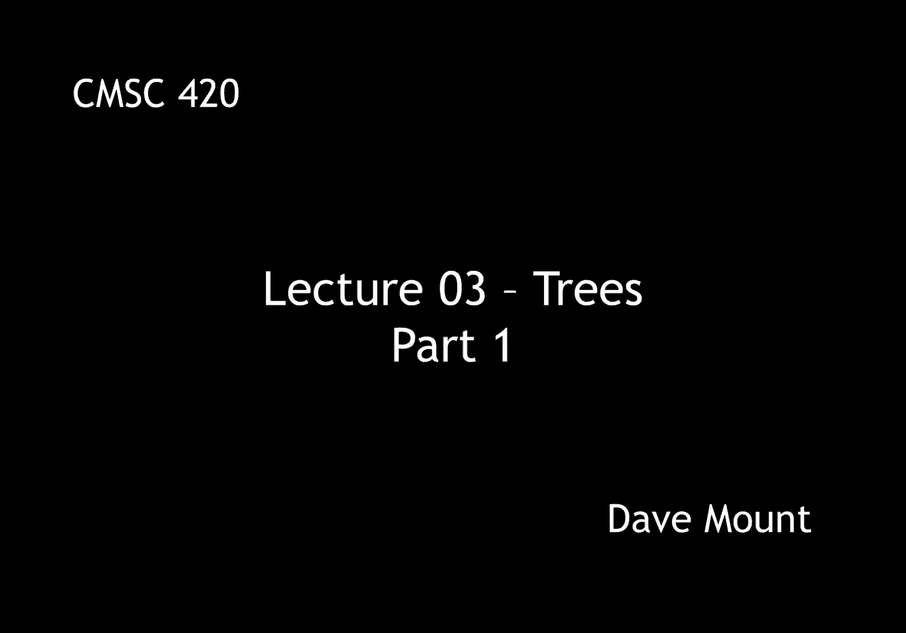
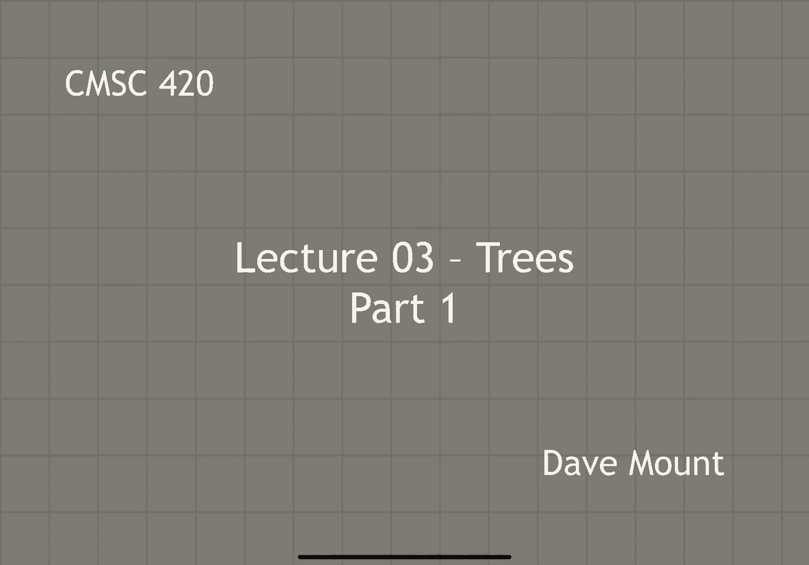
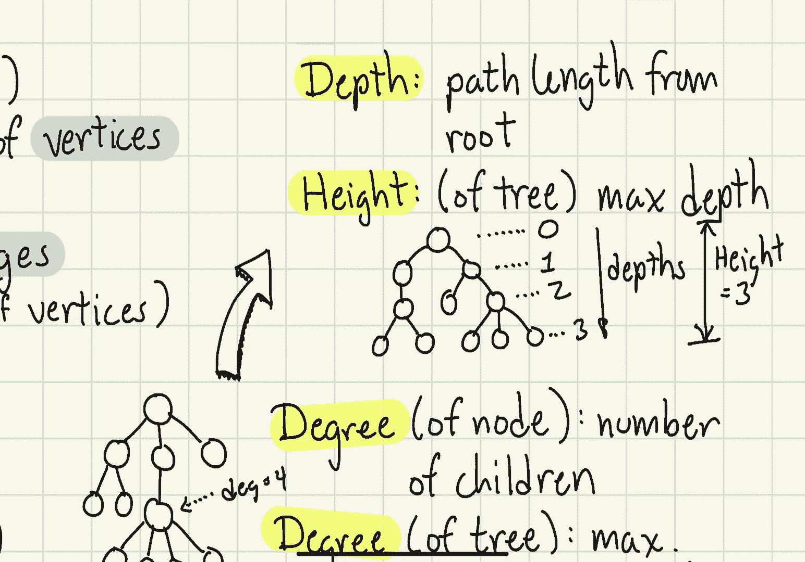

# 【双语字幕+资料下载】马里兰大学 CMSC420 ｜ 数据结构 (2021最新·完整版) - P6：L3- 有根树与二叉树 1 - ShowMeAI - BV1Uh411W7VF

hello everyone in this segment we're，going to talk about trees basic concepts，and definitions。

trees are going to be fundamental to the，design of data structures because。

almost all the data structures we're，going to look at are going to be based。

upon trees in particular rooted trees so，let's get started before talking about。

trees let us introduce a more general，concept that of graphs，a graph is basically a collection of。

vertices or what we call nodes connected，together by edges so for us。

let's think of a graph as being a，combination of two things v and e v。

will be a finite set of vertices，or，what we'll usually just call nodes and e。

is a set of edges by which we mean pairs，of vertices graphs come in two different。

varieties undirected and directed in an，undirected graph each edge is an。

unordered pair of vertices which means，there is no direction to it，here for example is a drawing。

of a rather typical undirected graph，when i use the word graph by default。

we'll be referring to undirected graphs，in contrast in a directed graph each。

edge is an ordered pair of vertices，so i can think of the edges as being。

directed from the first vertex to the，second vertex directed graphs for short。

will be called digraphs we can now，define a tree or if i want to emphasize。

the difference from rooted trees i'll，call them free trees，it is a graph that is undirected。

connected and acyclic，connected means that between any two，nodes there exists a path between them。

and acyclic means the graph does not，contain any cycles，so here's a drawing of a typical free，tree。

notice if we were to remove one of the，edges from the，then the resulting graph would not be。

connected because there would not be a，path joining let's say a vertex，over here。

to a vertex over here，on the other hand if we were to add an，extra edge to the tree we would find。

that we would create a cycle and the，we can now define a rooted tree to be a。

free tree with a designated root node，here's a drawing of a rooted tree notice。

it is really just a tree but i have，drawn it in a particular way i've placed。

the root node at the top and all the，other nodes are sort of dangling down。

computer scientists are not very good at，botany because we draw our trees upside。

down with the root on the top and the，leaves at the bottom we can now give a。

formal definition of what a rooted tree，is，the definition is recursive a rooted。

tree is either a single node that is，just the root itself，or it consists of a set of one or more。

rooted trees which we can call subtrees，that are joined together under a common。

root node so here's an illustration of，this definition on the left hand side i。

have just a trivial tree that consists，of a single root node，and on the right hand side what we have。

is a collection of sub trees t1 t2 up to，tk and usually when i draw trees。

abstractly i'll just draw them as little，triangles，and we join them under a common root。

node one of the things that we're going，to want to do is to define the。

relationship between various nodes in，our rooted trees，this is traditionally done by thinking。

of the tree as a sort of family tree，so let's look at a kind of a typical。

looking tree as an example here and，let's consider a node v in this tree。

so here we've illustrated the parent of，v，and the grandparent of v here i've also。

illustrated the one of the children of v，has three children in this case and。

and of course the child of a child would，be a grandchild in a similar way if two。

nodes share a common parent then we call，them siblings，finally the definition of a leaf is a。

note in the tree that has no children，next the concept of a degree。

can be defined in one of two ways either，of a single node or of the tree when we。

talk about the degree of a node we're，referring to the number of children that。

it has and when we talk about the degree，of the tree what we mean is the maximum。

degree of any node in the tree，so for example in this little tree that。

i've drawn here the degree of the node，that i've highlighted is going to be。

four because it has four children and in，fact because this node has the highest。

degree of any node in the tree the，degree of the entire tree is 4。

in order to describe where nodes are in，a tree we often do this in terms of a，concept of depth。

we define the depth to be the path，length that is the number of edges from，the root to this node。

we also define the height of a tree as，so for example in this little picture。

we've illustrated the depths of the，nodes the root is at depth zero and then。

its children are at depth one，grandchildren are at depth two great。

grandchildren are of depth three and，because three is the maximum depth this。

tree has a height of three we don't talk，about the depth of a tree we usually。

