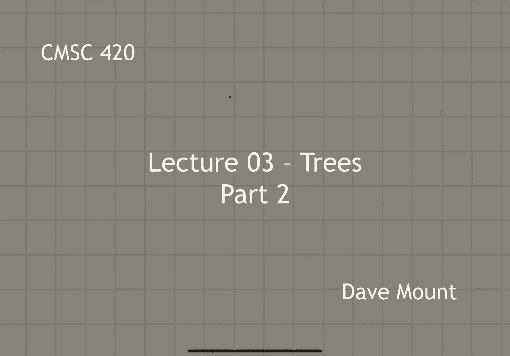
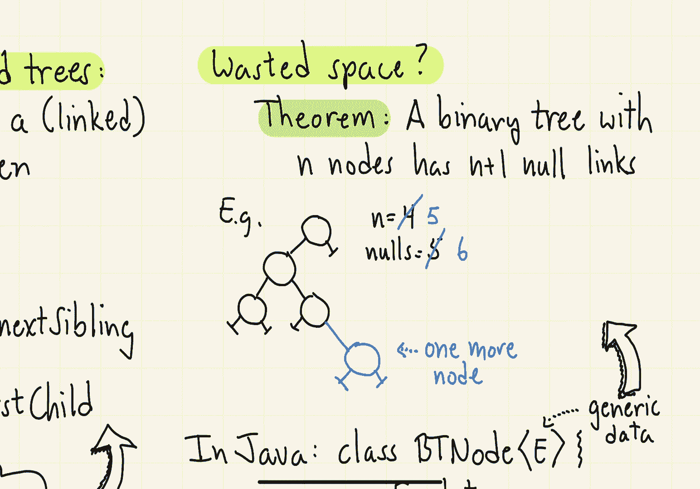
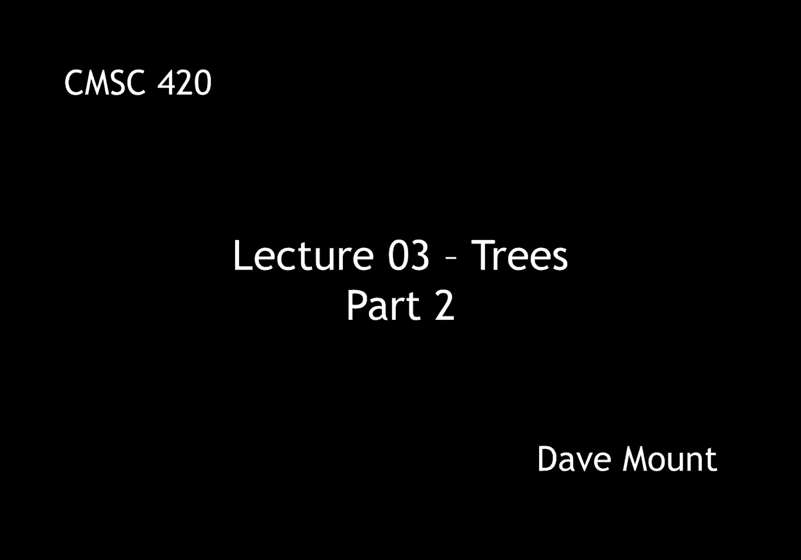

# 【双语字幕+资料下载】马里兰大学 CMSC420 ｜ 数据结构 (2021最新·完整版) - P7：L3- 有根树与二叉树 2 - ShowMeAI - BV1Uh411W7VF

in this segment we're going to continue，talking about trees we're going to。

discuss how to represent rooted trees，and we're going to begin discussion of。

binary trees which will be very，important in the design of data，structures。

let us first consider how to represent，an arbitrary rooted tree the way we're。

going to do this is we're going to，represent every node of the tree by its。

own data structure node where the data，structure node can be thought of as，storing a linked list。

to the nodes of its children the node，structure is going to consist of three，things。

the first is a data element which will，just depend on the application at hand。

the other two links consist of a first，child link that points to the head of a。

linked list of the children of this node，and the next sibling link which is。

essentially the next pointer in the，linked list for the，children。

so here's a drawing of a rather typical，the root in our data structure is going。

to reference our root node a，okay so，the data element will just contain that。

value a whatever that means for our，application here，notice that the root has no siblings and。

so its next sibling link is just going，to be null and i'm going to indicate。

null by this little you know t shape，symbol here a has three children namely，b c and d。

and so a's first trial link will point，to the head of that linked list b。

and then the next sibling links will，each be indicating the next on that。

linked list so b's next sibling points，to c，c's points to d and d's next sibling。

value will just be null because it's the，last of the children，b has just one child which is e so。

b points to ease node notice that e has，no children and it has no。

siblings as indicated by these two null，pointers similarly c points to its only。

child f which has no other siblings d's，first child then is going to be g。

and then g has a next sibling pointer to，h and finally f has two children i and j。

which again we link to each other in the，same manner，and so that's the representation of our。

general rooted tree from above，this representation is sometimes called。

the binary representation of a tree，because notice that we have represented。

a multi-way tree a tree in which any，node can have an arbitrary number of，children with，a。

node structure in which each node has，just two pointers that is binary。

this leads us to the question of what is，a binary tree，a binary tree is a rooted tree of degree。

2 where every node has two possibly null，children which are called left and right。

here's a picture of a typical binary，tree，i want to point out one thing if you，look at the nodes。

b versus the node e notice that each of，them has only one child however there is。

an important distinction here in the，case of b its child is its left child in。

the case of e its child is its right，child，so even when a note has just a single。

child we distinguish whether it is the，left or the right child and that's。

something that's not true for general，rooted tree an interesting class of。

binary trees are called full binary，trees a binary tree is said to be full。

if every non-leaf node has exactly two，children note that the tree that i've。

just drawn is not a full tree because，the nodes b and e，are internal nodes that is to say they。

are non-leaf nodes but they each only，have one child，in contrast here's a drawing of a full。

binary tree，the node structure for a binary tree is，remarkably similar to the node structure。

we used for the general trees but now，the meaning of the links is different as。

before there is a application dependent，data element and the two links point to。

the left child and the right child and，let's see an example of this on the tree，we just drew before。

so the root will reference node a，a will then reference its two children b，and c。

b will reference its two children d and，e，notice that c's children links are going。

to be null which is the same for d，and finally e will reference its two。

children f and g both of which have no，children and hence their their links are，going to be null。

in java we could represent this node，using a standard class representation。

um let's call this bt node for binary，tree node，we will make it a templated type which，means the。

the data type which we'll just call e，for entry will be left as a template，parameter。

inside of the class we'll have three，things and i'm not going to specify。

whether they're public private or，protected let's say let's you can figure。

that out in your particular，implementations，so the data element will be of type e。

whatever that happens to be，the，left and right，pointers will be references to bt nodes。

before closing off this segment i want，to talk about one issue that we're going。

to pick up in the next segment that has，to do with the amount of wasted space we，have here。

if you go back and look at the trees，that we've drawn so far and put in all。

the null pointers one of the things that，you'll notice is there are a lot of null。

pointers in a typical binary tree，in particular we can prove a theorem。

that says in a binary tree with n nodes，there are n plus 1 null links so in。

other words almost half of the links，that we're using which is about 2 times，n。

are going to be null for example take a，look at this rather typical looking。

binary tree we have four nodes and the，number of null links that we're storing。

is five this theorem is easily proved by，induction and we'll give a formal proof。

in the lecture notes but here's an easy，way to see it take any tree that。

satisfies the induction hypothesis let's，say okay and add one new node to it what。

happens well the number of nodes n，increases by one and the number of null。

links will increase by a net of one why，well because you're removing one，old。

null pointer to add the new node but you。

