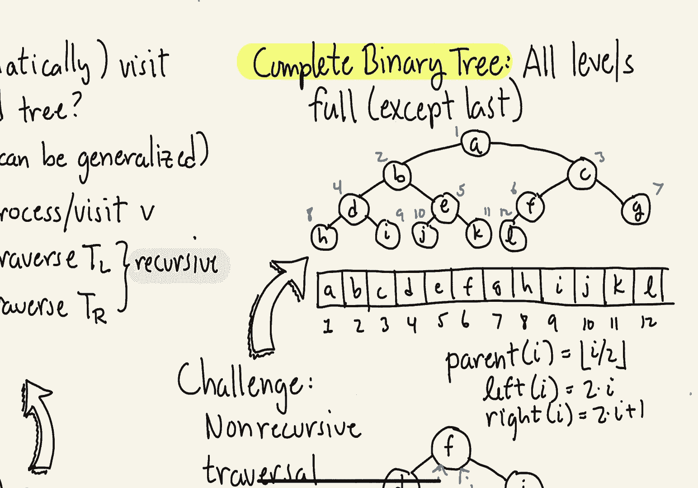
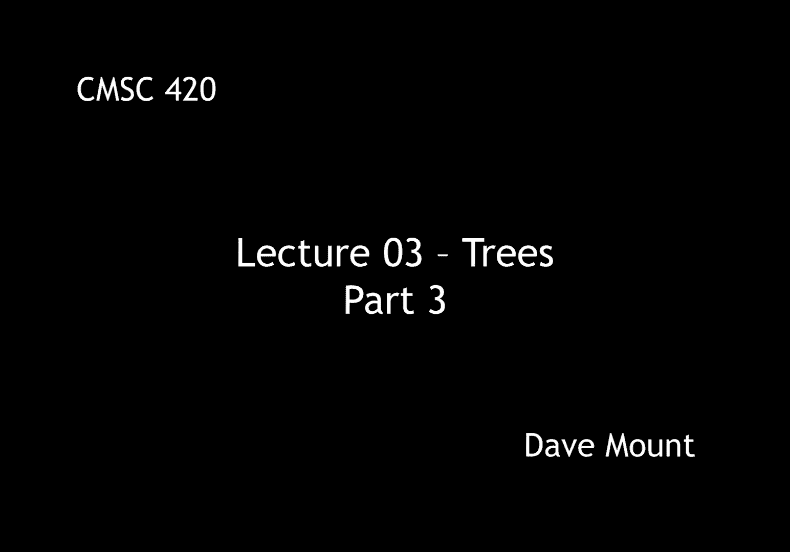

# 【双语字幕+资料下载】马里兰大学 CMSC420 ｜ 数据结构 (2021最新·完整版) - P8：L3- 有根树与二叉树 3 - ShowMeAI - BV1Uh411W7VF

let's continue our discussion of binary，trees we're going to talk about tree。

traversals extended binary trees and a，lot more，so let's get started。

our first question is going to involve，traversals namely how do you visit the。

nodes of a binary tree in a systematic，manner we're going to look at the。

problem in the simple case of binary，trees first and generalizations to。

arbitrary rooted trees is going to be，fairly straightforward。

so if i look at this in a rather generic，context i've got a binary tree let's，suppose it's non-empty。

let's let v denote the root node in，order to visit the tree systematically。

we're going to have to do three things，basically we're going to have to。

visit or process the root node v，whatever that means for the particular，application。

and then we're going to have to visit，the two sub trees tl and tr so let tl be。

the left subtree and tr be the right，subtree how do we visit them well the。

natural approach is to do whatever we，are going to do and just apply it。

so let's give a little pseudo code for a，possible traversal algorithm。

the traversal algorithm is called，traverse，it is given as its argument a reference。

to a note in our tree call that v，it proceeds as follows，if v is null then there's nothing to do。

and we just return，otherwise let's，process or visit the node whatever is。

appropriate to our application for，example it might just be printing out。

the node or maybe adding a label of the，node to a list，then we're going to recursively invoke。

the traverse function on the left，subtree，that's going to then proceed make。

recursive calls do whatever it has to do，to visit the various nodes and then。

we're going to make a recursive call to，visit everything in the right subtree。

a natural question that arises is why，did we decide to visit the root node。

before the subtrees well you might say，that only makes sense you know let's。

think of doing this in a top-down manner，however there may be some applications。

where we want to actually visit the root，node after we visit the subtrees for。

example perhaps we're propagating，information up from the bottom of the，tree to the root。

on the other hand it might also be the，case that we want to process the root。

node between the left and right subtrees，depending on which choice we make we get。

three different styles of traversals the，one we've listed here where we visit the。

root node first is called a pre-order，traversal，if on the other hand we place the。

processing of v between the left and，right sub-trees we call this an in-order。

traversal if on the other hand we had，placed the processing of v after the two。

calls we would call this a post order，traversal，okay let's try these traversals out on a。

little example consider the following，tree which is actually derived from。

compiler design this would be an example，of what's called an expression tree when。

you type in an expression to a language，like java or c the compiler will convert。

it into a tree-like form before，converting it into code，so let's first consider the case of a。

pre-order traversal，and，let's assume that our visiting operation。

just simply prints out the contents of，the node，so let's first see how a pre-order。

traversal would work for this tree we，begin with the root we visit that by，writing the slash down。

then we recursively visit the left sub，tree，this first visits the root that gives，the star。

then we do its left subtree that would，be plus a and，b okay then we return to that root node。

and then visit the right subtree that，gives us the c，so let me encircle。

the entire sub tree there star plus a b，c，okay that's the traversal of the left。

subtree and then for the right subtree，we visit its，root node that's the minus。

and then the d and then the e and then，we return and so let me circle that。

combination as well okay and so this，final list ignoring those little circles。

that i've drawn is the pre-order，traversal，next let's take a look at a post-order。

traversal so to do this we first recurse，on the left subtree that'll be the star。

then we recurse on its left subtree，that's the plus tree we recurse on its，left subtree that's the a。

we return we then go to the right，subtree the b，we then return and then do the plus so。

this completes that lower left subtree，now having finished that lower left sub。

tree we come back to the star we visit，its right sub tree recursively that's，just the c。

and then we return to the root of that，sub tree and that's the star so now。

we're done with the left sub tree of the，root and now we recurse on the right，subtree of the root。

on the right side we first recurse all，the way down to the leftmost subtree，that's the d。

we then return，go to the right subtree that's the e and，then we do the minus sign finally we are。

able to return to the root having，process both its left subtree and its。

right subtree and then we print out the，slash notice that the post order。

processing does everything in sort of a，bottom-up manner and this is oftentimes。

useful when you want to collect，statistics from a tree you want to，collect them from the leaf level。

propagate them up to the root level，finally let's do the inorder traversal。

so first we recurse and do an inorder，traversal of the left subtree that is。

the star that will involve doing a，recursion on its left subtree that's the。

plus tree and that end order recursive，will say first let's visit the left，subtree a，then the plus。

then the right sub tree b okay and then，we return from there now we're back to，the star。

we visit the star printing that out and，then we visit its right subtree that。

prints out the c and now we're done with，the left sub tree of the root。

now we return to the root and print its，value that is the slash，and then finally we visit its right。

subtree the minus tree there we visit，the left subtree d，then the minus sign then the right。

subtree e and now we return back and，we're done，notice this last one，looks the most like the actual。

arithmetic expression that was you know，intended by this expression tree and。

indeed if we had replaced our little，circles with parentheses we would get。

exactly the same expression that is，represented by the tree so in some sense。

the compiler's job was to take the，expression and produce the tree and our。

traversal we've actually sort of，now let's return to the question that we。

raised in the previous segment of those，wasteful null links，remember in that segment we proved that。

in a tree with n nodes there are n plus，one null links，okay，that is to say that among the two end。

links that we have in our tree almost，half of them are null pointers now with。

these little you know 10 element node，trees that i've been drawing that's。

nothing important but if you imagine，you're creating a major data structure。

or a database with hundreds of millions，of nodes wasting that many pointers for。

null pointers is going to be a huge，wastage of space in your data structure。

and so the question is how do we deal，with that，well，i'm going to talk about a couple of。

ideas the first is the notion of what we，call an extended binary tree。

the idea behind the extended binary tree，is to replace each of the null links in。

the original tree with a special leaf，node we call this leaf node an external。

node and the original nodes we're going，to call internal nodes so let's see how。

to make an extended binary tree out of，the tree that i'm drawing here。

in this particular case i've drawn out，explicitly all the null links in the，tree。

so i've just gone through and replaced，each one of my null links with a brand。

new little tiny leaf node its own little，external node，you might ask。

how is this saving you any space you're，just replacing null pointers with little。

nodes right well the reason is you can，actually store useful information in。

these nodes for example one of the ways，in which a lot of large database trees。

are stored is you use the internal nodes，for storing index information to help。

you locate information but the actual，information is going to be stored just。

in the external nodes now you might say，what about the null pointers for the。

external nodes ah the external nodes，don't have any children so i don't need。

to store null links inside of them i can，well if you recall our theorem from last。

time that said that the number of null，links in a binary tree is going to be n。

plus one we have as an immediate，corollary the following fact an extended。

binary tree with n internal nodes that，is the black ones that i've drawn in my。

previous picture has exactly n plus one，external nodes the ones that i've shown，in blue。

let me point out by the way what happens，when n is equal to zero actually that is。

allowed if n is equal to zero then the，tree just consists of a single external。

node and so the result holds，as an easy observation，we can see that every extended binary。

tree is a full binary tree remember a，full binary tree is defined to be one。

where every node has either two children，or zero children the internal nodes have。

exactly two children the external nodes，here's another idea for how to save。

space by avoiding those null pointers，this is called a threaded binary tree。

the idea is to store useful information，in the null pointers，now observe because some of the links。

are going to be actual left and right，child links and others are going to be。

these kind of special purpose links，we're going to insert a mark bit，for each one of the。

children left child and right child to，indicate whether it's a regular left。

right child link or whether it's being，used as one of these threads。

so here's a very common example of how，to thread a binary tree it's called in，order threads。

what we're going to do is every time we，have a null left child pointer we're。

going to have that point to our in order，predecessor that is it's going to be a。

thread that points to our inorder，predecessor and if we have a null right。

link we're going to have that point to，here's a binary tree and i have。

carefully labeled all the nodes，according to the in order traversal you，can verify this a b c d e f。

g h i j i visit the left sub tree then i，do the，middle node and then i visit everything。

in the right subtree so let's start with，node a，a has two null links both on the left。

and the right side on the left side the，thread that's going to be there which。

i'm going to show in blue will point to，a's in order predecessor but since a is。

the first node in order there is no，predecessor so we just put a null value，there。

in the case of a's right child it will，go to a's in order successor and that is，b。

okay next let's consider the node c，again it has two null children its left。

null child is going to be replaced with，a thread that goes to its inward，predecessor that's b。

and its right null child is now going to，point to its inorder successor that is d。

next we have e right its in order，predecessor is going to be d and its in。

order successor is going to be f the，next node that has a null pointer is g。

and it only has a null left child and，that will point to the inorder，predecessor namely f。

and finally let's end with h and j，h has two threads，the left thread goes to its inorder。

predecessor g，and its right thread goes to its in，order successor i and j has again two。

threads its left thread goes to its，predecessor i and its right thread。

because it is the last node in the，inorder goes to null because there is no。

node that follows it so what i've shown，here is in the blue links are all the。

threads associated with this tree，remember again in order to know whether。

a given link a left or right link is，going to be a real regular。

you know link as in the black ones here，or whether it's going to be a thread。

we're going to need to install a marked，bit inside of each one of these well。

actually two marked bits one for the，left child and one for the right child。

indicating whether it's a regular link，or whether it's going to be a thread。

so to see if you understand how threads，work in a binary tree here's a little。

challenge can you write a traversal，algorithm either pre-order in order or。

post order but make it non-recursive，okay my claim is that if you have。

threads in a binary tree you can do all，three of the traversals。

as a hint the inorder traversal is the，easiest one and we actually have code。

for that in the lecture notes，the last topic i want to talk about with。

respect to binary trees is something，called a complete binary tree，in a complete binary tree。

every single level of the tree and by，level what i mean is all the nodes at a。

given depth are full that is to say they，have as many nodes as they possibly can。

the only exception is the last level of，the tree and that level will be filled，from left to right。

okay so here's an example of a complete，binary tree notice levels 0 that is。

depth 0 depth 1 depth 2 are completely，filled right depth 0 has 1 node depth 2，has 2 depth 3 has 4。

 in general you have，2 to the i nodes at depth i and the last，level i filled up with nodes from left。

to right until i ran out of nodes，the cool thing about complete binary。

trees is you don't need to store any，links at all you don't need any node。

structure in fact you can just store，them in the elements of a。

one-dimensional array the way you store，them in a one-dimensional array is well。

first off let's ignore the zeroth，element of the array and let's start。

storing them according to the index，order that i've given here that is first。

level then the second level and the，third level and so forth always storing。

things from left to right of course this，representation wouldn't be very useful。

if we couldn't store information such as，parent-child information however observe。

that we can get that information for，example if you want to compute the。

parent of any given node you just take，its index and divide it by 2 and then。

take the floor of that quantity so for，example the parent of node d in location。

4 is going to be 4 over 2 that is，2 and similarly the parent of node e in。

location 5 is just going to be 5 over 2，taking the floor of that that will be 2，as well。

and you can observe for every single one，of the nodes here if you take half its。

index you will actually just get its，parent，by a similar token you can get the left。

child by doubling the index right，observe in the case of c if i double the。

index 3 i get 6 that is its left child f，and you can get the right child by。

doubling the index and adding 1。 so，again in case of c，double 3 add 1 you get 7 and that's。

going to be its right child g，how do i know when i have a null pointer。

well if you index beyond the end of the，array then you essentially can treat。

