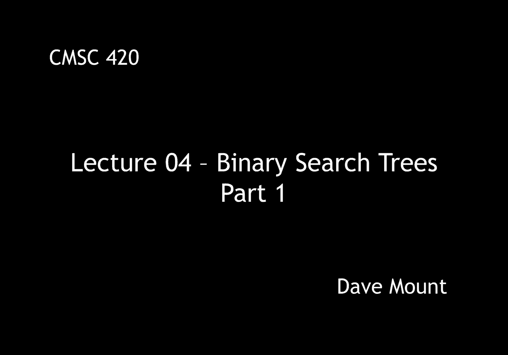
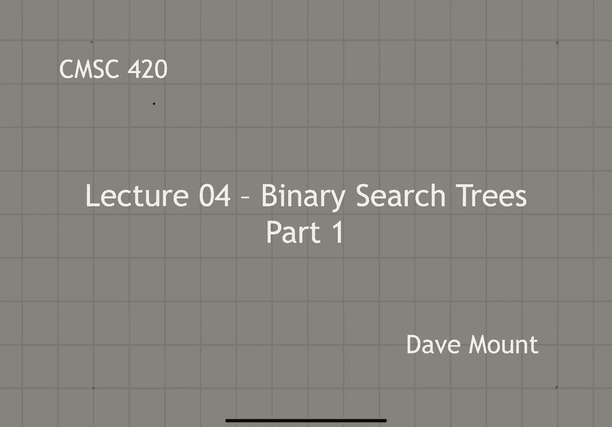
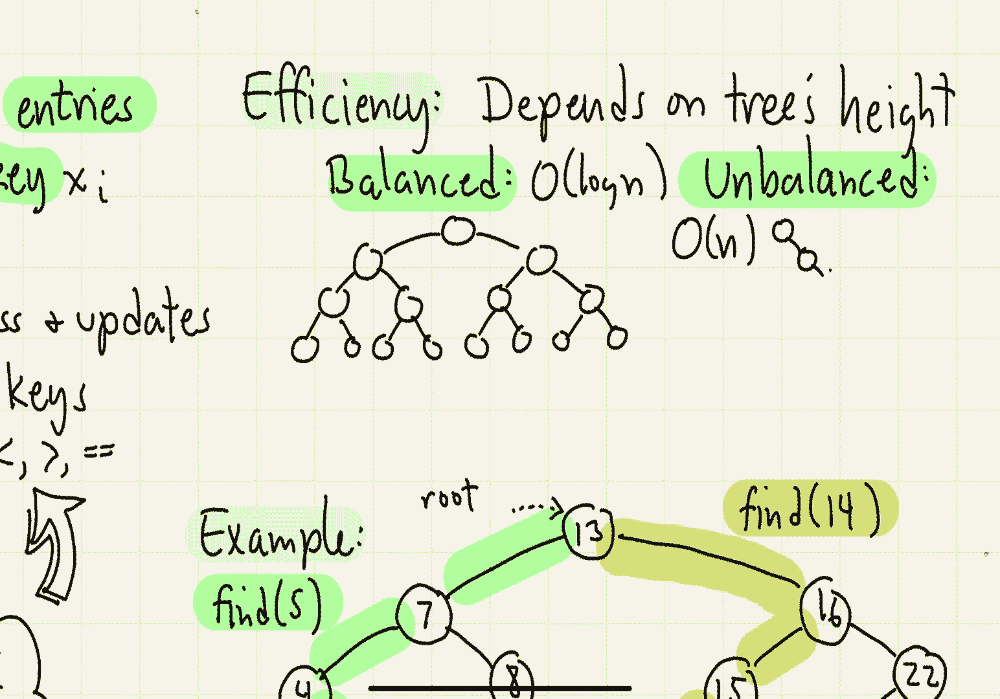

# 【双语字幕+资料下载】马里兰大学 CMSC420 ｜ 数据结构 (2021最新·完整版) - P9：L4- 二叉搜索树 1 - ShowMeAI - BV1Uh411W7VF

hey everyone today we're going to talk，about binary search trees。

for this first segment i'm going to give，the basic definitions for the trees and。

we're going to talk about how to，in any search problem we assume that，we're given a set of entries。

abstractly each entry is going to be，thought of as involving two different。

things a search key which is what we're，going to use for locating the entries。

and a value v sub i we're not going to，actually use the values they're just。

going to be used by whatever application，our objective is to store these so we。

can quickly access the elements and，quickly update them by update them i。

mean things like inserting and deleting，finally we're going to assume that the。

keys are drawn from a totally ordered，domain this means that we can perform。

operations like less than greater than，we're going to encapsulate this idea in。

terms of an abstract data type that，we're going to call a dictionary。

the dictionary is going to support three，basic operations the first one is called。

insert it's given a key value x，and an associated value v，this inserts the key value pair xv in。

the dictionary，we assume that there are no duplicate，key values because we need to be able to。

uniquely identify every entry according，to its key，the next operation is delete it's given。

a key x to delete，this deletes the key x and its，associated value from the dictionary。

if x is not in the dictionary this，generates a exception of some form an，error。

the last operation is find，find is given a key value x，so if x，is in the dictionary it returns a。

reference to the associated value v，and it returns a special value null if x。

is not present in the dictionary，well our main objective is going to be。

to talk about binary search trees but i，guess we should explore the simplest。

idea which is just to store the elements，sequentially inside of an array。

in order to make the find operations go，efficiently let's assume that we sort。

the elements of the array according to，the key values in this case the find。

operation will be quite efficient we can，do find and o of login time by binary，search。

unfortunately insert and delete are，going to be unacceptably slow running an。

o of n time the reason is because you，know once we insert or delete an entry。

let's say in the middle of the array，we're going to have to shift the entries。

around in order to accommodate that，element，so the question we want to consider is。

is it possible to achieve o of login，time for all three of the operations，insert delete and find。

so the answer is going to be a，resounding yes and we're going to do。

this using a data structure called，binary search trees in fact a large part。

of what we're going to talk about the，first half of the semester is going to。

be various ways in which to implement，binary search trees so this is going to。

be a major topic of this course，the basic idea is we're going to put all。

of the entries into a binary binary tree，and we're going to order this tree so。

that if you read the tree or traverse，the tree nodes according to an inorder。

traversal that will be equivalent to，listing the entries according to。

increasing order by their key values，an equivalent way to think about this is。

for every node of my tree if i label it，with the key value then。

the key values that are smaller than x，will be stored in the left subtree and。

the key values that are bigger than x，are going to be stored in its right sub。

tree remember there are no duplicate，keys so i never have to worry about what。

i do if i have two keys that have the，same value，so here's a little example of a kind of。

a typical looking binary search tree so，notice for example my root is associated。

with the key value seven all the keys，that are smaller than seven are stored。

in its left subtree all the keys that，are bigger than seven are stored in its。

right sub tree okay there's no，particular structure that i assume for。

this tree it's just any old binary tree，will work of course as we'll see later。

on the structure of the tree is going to，impact the performance and that's one of。

the things that we're going to have to，consider is how do you actually build。

binary trees that have nice structures，so we'll need to talk about how to。

perform each of the individual，operations let's start with the find。

operation so assuming i've already got a，binary search tree how do i find a key，in the search tree。

so the find process is going to begin at，the root of the tree so let me associate。

a pointer p that is going to refer to，our current node and initially p will be。

assigned the root of the tree，okay so let's let x denote the key that。

i am searching for if x is less than the，key value that's stored in the current。

node then we search its left subtree，symmetrically if x is bigger than the。

current node's key value then we'll，search its right subtree of course if x。

is equal to the key value then we have，found it and we'll return the associated。

value associated with this node of，course it might be that the key is not。

present and how do we find this out well，what will happen is we'll keep visiting。

sub trees of the tree until we，effectively fall out of the tree in this。

case the value of p will be null so if，we find that p is ever null we simply。

return that the element does not appear，here and we return a null value。

okay so let's try to write out some，pseudo code for that sort of strategy，that we've just laid out。

our procedure is going to be a recursive，procedure in fact this is natural when。

dealing with binary trees，we will，basically，visit the subtrees of the tree in by。

making a recursive calls so the initial，call we're given two things we're given。

the key that we're searching for and，we're given the current node that we're。

visiting and we want to think of this as，try to see whether you can find x in the。

sub tree that is rooted at the node p，so as mentioned previously if we ever。

discover that p is null that means we've，effectively just fallen out of the。

bottom of the tree and if so we haven't，found the key and therefore we return a。

value of null for the associated value，next if x is smaller than the key value。

at this node then we search the left，subtree by recursively calling find。

of x on p's left subtree and then we，return whatever result that returns to，us。

symmetrically if x is bigger than the，key that is being stored at this node we。

recursively search the right subtree，well finally if x is not smaller than。

the key and if it's not bigger than the，key then it must be equal to the key in。

which case we just return the associated，value，for this node，okay so that completes our little。

recursive find procedure here by the way，the fine procedure needs a starting，point so。

the initial call to this procedure will，be find of x comma root where root is，the root of the tree。

okay so let's try this out in a little，example，um，let's consider this particular binary。

search tree and let's suppose we want to，perform the operation find on the。

so first off we know that 5 is less than，13 so we go to the left child of 13。

next we see that 5 is less than the key，value of 7 so we go to the left child of，7。

next we see that 5 is bigger than the，key value at 4 so we go to the right，child of 4。

and finally when we arrive at the node 5，we've discovered the key and so we。

return whatever is the associated value，you know parameter here i guess。

associated with this node again i don't，actually show the value parameters with。

the nodes but let's say whatever was，stored there with that value that is。

what we would return at this point and，notice now all the recursive calls would。

just unravel we'd return to the call at，four we would return to the call at。

seven we'd return to the call of 13 but，each of those is just passing in。

whatever value was coming up from that，node 5。let's also see what happens if we try to。

search for something that's not in the，tree suppose we try to do the operation，5 find on 14。

so 14 is bigger than 13 so we search its，right subtree，14 is smaller than 16 so we search its。

left subtree，14 is smaller than 15 so we'll make a，recursive call to find on 14 on。

15's left subtree that'll be null so，we're going to get a call find 14 null。

when we see this we know that the key is，not in the tree and so what we do is。

we're going to return the value null at，this point in time and then each of the。

recursive calls will then unravel each，of them will just be returning that null。

value all the way back up to the uh to，the topmost level，next let's consider the efficiency of。

this procedure，clearly the efficiency is going to，depend on the properties or the。

structural properties of the tree right，if the height of the tree is very high。

this is bad because it means that the，fine procedure may take a long time，before it locates the node。

on the other hand if the tree is very，nicely balanced，then the procedure is going to run very。

efficiently，so at one extreme i could have a，perfectly balanced tree and we've seen。

before that a perfectly balanced tree，with n nodes is going to have a height。

of let's say proportional to log of n so，the time for the find operation is going。

to be at most log n because that's the，maximum number of levels that you might。

go through before you either find the，node or you fall out of the tree。

of course the other side is the tree，could be very very badly，imbalanced right and when that happens。

the running time for your fine procedure，could be as bad as o of n um。

so a lot is going to depend upon how，well balanced the tree is and。

well of course that's going to depend on。

how we perform our deletion and，insertion operations which we're going。

