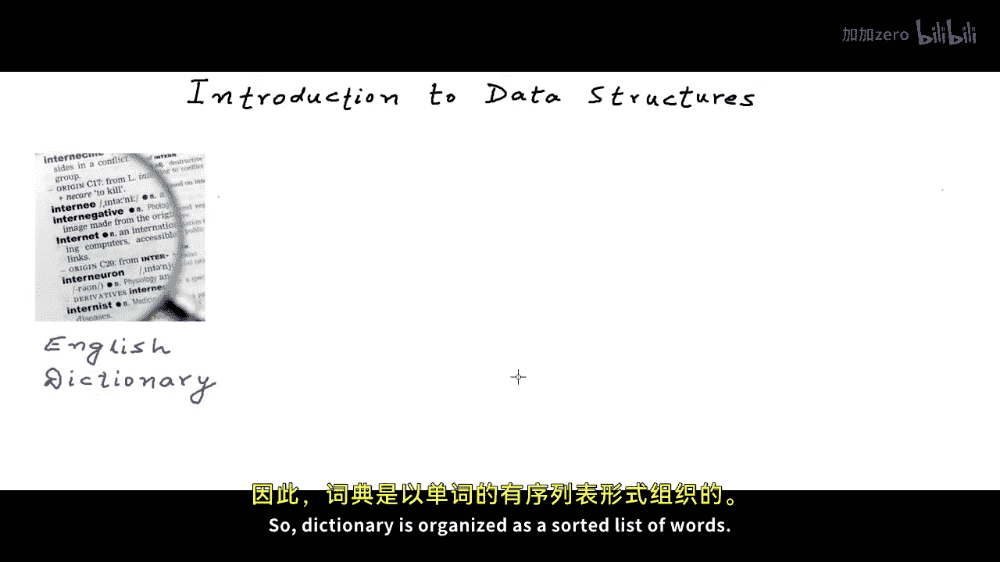

# 001：数据结构导论 🧱

在本节课以及本系列课程中，我们将向你介绍数据结构的概念。数据结构是计算机科学中最基础、最核心的构建模块概念。掌握良好的数据结构知识，是设计和开发高效软件系统的必要条件。

我们时刻都在处理数据，而如何存储、组织和分组数据至关重要。让我们从日常生活中选取一些例子，看看将数据组织成特定结构如何帮助我们。

## 生活中的数据结构示例

以下是几个例子，说明特定的数据结构如何帮助我们高效地处理信息。

*   **字典**：我们能够快速高效地在语言字典中搜索单词，是因为字典中的单词是**排序**的。如果字典中的单词没有排序，在数百万个单词中搜索一个单词将是不切实际甚至不可能的。因此，字典被组织成一个**有序的单词列表**。
*   **城市地图**：像地标位置和道路网络连接这样的数据，是以**几何图形**的形式组织的。我们将地图数据以这些几何图形的形式展示在二维平面上。地图数据需要这样结构化，以便我们拥有比例尺和方向，从而有效地搜索地标并获取从一个地方到另一个地方的路线。
*   **现金账簿**：对于企业每日的现金收支记录（在会计中也称为现金账簿），以**表格**的形式组织和存储数据最有意义。如果数据被组织在这些表格的列中，汇总数据和提取信息就会非常容易。

由此可见，不同类型的数据需要不同的结构来组织。

## 计算机中的数据组织

计算机处理各种数据：文本、图像、视频、关系数据、地理空间数据，以及我们在这个星球上拥有的几乎所有类型的数据。我们如何在计算机中存储、组织和分组数据至关重要，因为计算机处理的是**极其庞大**的数据量。

即使拥有机器的计算能力，如果我们不使用正确的结构、正确的逻辑结构，我们的软件系统也不会高效。

## 数据结构的正式定义

数据结构的正式定义是：**数据结构是一种在计算机中存储和组织数据的方式，以便数据能被高效使用**。

当我们研究数据结构作为存储和组织数据的方式时，我们从两个角度进行研究。

## 数据结构的两种视角

上一节我们介绍了数据结构的基本概念，本节中我们来看看研究数据结构的两种主要视角。

1.  **作为数学和逻辑模型（抽象数据类型）**：当我们将其视为数学和逻辑模型时，我们只关注它们的抽象视图。我们从一个高层次来看，是哪些特性和操作定义了那个特定的数据结构。现实世界中抽象视图的例子可以是：设备“电视机”的抽象视图是，它是一个可以打开和关闭的电子设备，可以接收卫星节目信号并播放节目的音视频。只要我有这样一个设备，我就不关心电路是如何嵌入来创建这个设备的，或者哪家公司制造了这个设备。这就是一个抽象视图。因此，当我们把数据结构作为数学或逻辑模型来研究时，我们只是定义它们的抽象视图，换句话说，我们有一个术语来描述它——我们将其定义为**抽象数据类型**。

    抽象数据类型的一个例子可以是：我想定义一个叫做**列表**的东西。它应该能够存储一组特定数据类型的元素，并且我们应该能够通过元素在列表中的位置来读取它们，也应该能够修改列表中特定位置的元素。我们是在定义一个模型。然后，我们可以用多种方式在编程语言中实现它。这就是抽象数据类型的定义，我们也称抽象数据类型为 **ADT**。如果你注意到，所有高级语言都已经以**数组**的形式提供了这种ADT的具体实现。所以数组是提供了所有这些功能的具体实现的数据类型。

2.  **作为具体实现**：谈论数据结构的第二种方式是谈论它们的**实现**。实现将是一些具体的类型，而不是抽象数据类型。我们可以在同一种语言中以多种方式实现同一个ADT。例如，在C或C++中，我们可以将这个列表ADT实现为一个名为**链表**的数据结构。如果你还没听说过它，我们将在后续课程中详细讨论链表。

## 抽象数据类型的正式定义

上一节我们区分了抽象模型和具体实现，本节中我们来正式定义一下抽象数据类型，因为这是我们经常会遇到的一个术语。

抽象数据类型是**数据和操作的定义实体，但没有实现细节**。它们只说明“是什么”，而不说明“如何做”。

## 本课程将涵盖的内容

在本课程中，我们将讨论许多数据结构。我们将把它们作为抽象数据类型来讨论，同时也会学习如何实现它们。

以下是一些我们将要讨论的数据结构：
*   链表
*   栈
*   队列
*   树
*   图
*   还有更多可以学习的结构

当我们研究这些数据结构时，我们将研究它们的逻辑视图，研究这些数据结构为我们提供了哪些操作，研究这些操作的成本（主要是在**时间**方面），并且我们肯定会研究它们在编程语言中的实现。

我们将在接下来的课程中学习所有这些数据结构。

## 总结

本节课中我们一起学习了数据结构的基本概念。我们了解到数据结构是高效存储和组织计算机数据的基础。我们通过日常例子理解了为什么需要数据结构，并给出了数据结构的正式定义。我们区分了研究数据结构的两种视角：作为抽象数据类型和作为具体实现，并正式定义了抽象数据类型。最后，我们预览了本课程将要涵盖的主要数据结构。在接下来的课程中，我们将深入探讨每一种结构。