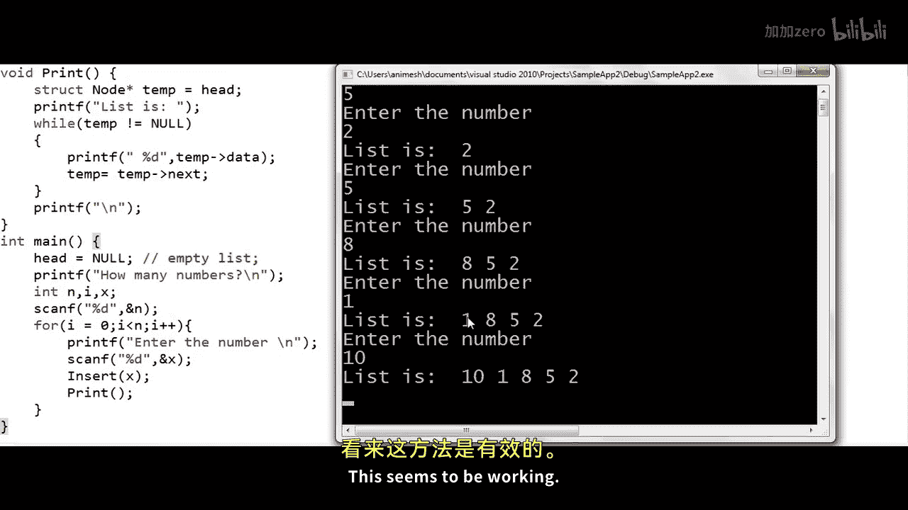
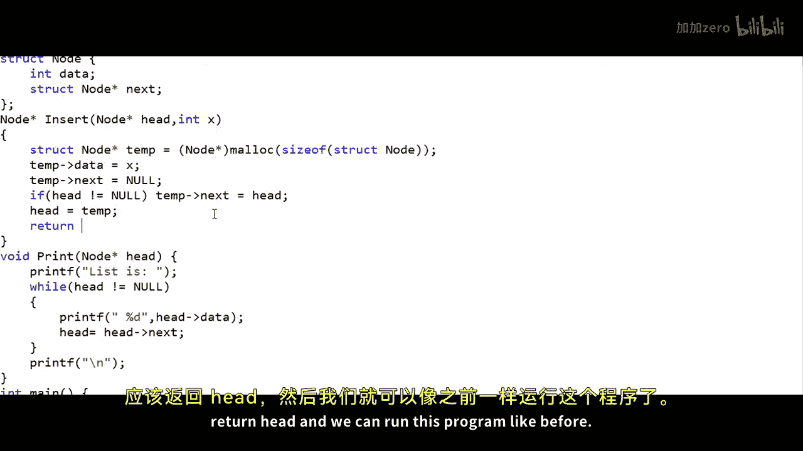
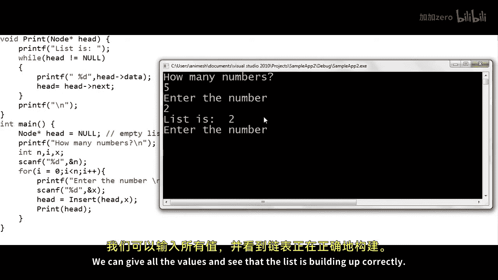
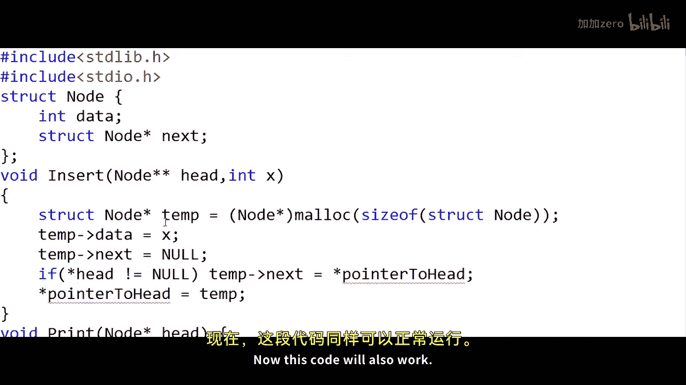

# 006：在链表头部插入节点 🧩

在本节课中，我们将学习如何在C或C++程序中，向一个链表的**头部**插入一个新节点。我们将从定义链表节点结构开始，逐步实现插入和遍历打印功能，并探讨不同作用域下（全局变量与局部变量）的代码实现差异。

---

## 链表节点定义

上一节我们介绍了如何将链表的逻辑视图映射到C/C++程序中。本节中，我们首先需要定义构成链表的基本单元——节点。

在C语言中，节点通常用一个结构体（`struct`）来定义。它包含两个字段：
1.  一个用于存储数据（例如整数）。
2.  一个用于存储指向下一个节点的地址的指针。

以下是节点定义的代码：

```c
struct Node {
    int data;           // 存储数据
    struct Node* next;  // 指向下一个节点的指针
};
```

**核心概念**：`struct Node* next;` 这个指针是链表连接各个节点的关键。在C++中，可以简写为 `Node* next;`。

---

## 创建链表头指针

定义了节点结构后，我们需要一个指针来跟踪链表的第一个节点，通常称为头指针（`head`）。

```c
struct Node* head = NULL; // 初始化头指针为空，表示链表为空
```

此时，`head` 指向 `NULL`，表示链表尚未包含任何节点，是一个空链表。

---

## 实现插入函数

现在，让我们实现核心的插入函数 `Insert`。这个函数的目标是在链表的**头部**添加一个新节点。

插入操作需要考虑两种情况：
1.  链表为空时（`head == NULL`）。
2.  链表不为空时。

以下是 `Insert` 函数的实现步骤：

```c
void Insert(int x) {
    // 1. 为新节点动态分配内存
    struct Node* temp = (struct Node*)malloc(sizeof(struct Node));

    // 2. 设置新节点的数据域
    temp->data = x;

    // 3. 关键步骤：将新节点的 next 指针指向当前的头节点
    temp->next = head;

    // 4. 更新头指针，使其指向新节点
    head = temp;
}
```

**逻辑解析**：
*   `temp->next = head;`：这行代码同时处理了链表为空和不为空的情况。如果链表为空，`head` 为 `NULL`，新节点的 `next` 自然指向 `NULL`。如果链表不为空，新节点的 `next` 就指向了原来的第一个节点，从而将新节点链接到链表前端。
*   `head = temp;`：最后更新头指针，使其指向这个新创建的节点，完成头部插入。

---

## 实现遍历打印函数

为了验证插入操作是否正确，我们需要一个能遍历链表并打印所有节点值的函数。

以下是 `Print` 函数的实现：

```c
void Print() {
    struct Node* temp = head; // 使用临时指针遍历，避免修改头指针
    printf("当前链表: ");
    while(temp != NULL) {
        printf("%d ", temp->data); // 打印当前节点数据
        temp = temp->next;         // 移动到下一个节点
    }
    printf("\n");
}
```

**关键点**：我们使用一个临时指针 `temp` 来遍历链表，而不是直接使用 `head`。这是因为 `head` 需要始终指向链表开头，如果用它来遍历，遍历结束后我们就“丢失”了链表的起点。

---

## 主函数与程序流程

了解了核心函数后，我们来看主程序如何组织。程序会提示用户输入一系列数字，并将它们依次插入链表头部，每次插入后打印当前链表状态。

```c
int main() {
    head = NULL; // 确保链表初始为空
    int n, x, i;

    printf("要输入几个数字？ ");
    scanf("%d", &n);

    for(i = 0; i < n; i++) {
        printf("请输入第 %d 个数字: ", i+1);
        scanf("%d", &x);
        Insert(x); // 调用插入函数
        Print();   // 调用打印函数
    }
    return 0;
}
```

**运行示例**：
假设依次输入数字 2, 5, 8, 1, 10，程序输出将如下所示，清晰展示了每次在头部插入后链表的变化：
```
当前链表: 2
当前链表: 5 2
当前链表: 8 5 2
当前链表: 1 8 5 2
当前链表: 10 1 8 5 2
```


---

## 作用域探讨：局部变量与参数传递

在上面的示例中，头指针 `head` 被声明为**全局变量**，因此 `Insert` 和 `Print` 函数可以直接访问它。然而，更好的编程实践是将其作为**局部变量**，并通过函数参数进行传递。这涉及到指针的传递方式。



### 方法一：通过函数返回值更新头指针

将 `head` 声明在 `main` 函数内，`Insert` 函数接收当前头指针并返回新的头指针。

```c
// 插入函数，返回新的头指针
struct Node* Insert(struct Node* head, int x) {
    struct Node* temp = (struct Node*)malloc(sizeof(struct Node));
    temp->data = x;
    temp->next = head;
    return temp; // 返回新节点的地址作为新的头指针
}

// 在主函数中调用
int main() {
    struct Node* head = NULL; // 局部变量
    head = Insert(head, 2);   // 接收返回值以更新head
    PrintList(head);
    return 0;
}
```

### 方法二：通过指针的指针（双重指针）传递

通过传递头指针的地址（即指向指针的指针），可以在函数内部直接修改 `main` 函数中的头指针变量。

```c
// 插入函数，参数为指向头指针的指针
void Insert(struct Node** headRef, int x) {
    struct Node* temp = (struct Node*)malloc(sizeof(struct Node));
    temp->data = x;
    temp->next = *headRef; // 解引用获取真正的头指针
    *headRef = temp;       // 解引用并修改头指针的值
}

// 在主函数中调用
int main() {
    struct Node* head = NULL;
    Insert(&head, 2); // 传递头指针的地址
    PrintList(head);
    return 0;
}
```





**核心概念**：`struct Node** headRef` 是一个指向指针的指针。使用 `*headRef` 可以访问或修改 `main` 函数中 `head` 指针本身的值。

---

## 总结

本节课中我们一起学习了如何在单链表的头部插入新节点。



我们首先定义了链表节点的结构，然后实现了核心的 `Insert` 函数，其关键逻辑在于将新节点的 `next` 指向原头节点，再更新头指针。接着，我们实现了 `Print` 函数来遍历验证链表。最后，我们探讨了更健壮的代码组织方式，即通过函数返回值或双重指针来管理局部头指针，这避免了全局变量的使用，使程序结构更清晰、模块化。


理解头部插入操作是掌握链表其他操作（如在特定位置插入、删除节点）的重要基础。