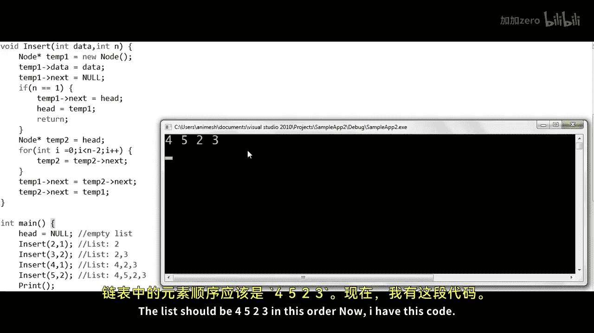

# 007：在链表中任意位置插入节点 🧩

在本节课中，我们将学习如何在一个链表的任意给定位置插入一个新节点。我们将从逻辑理解开始，然后逐步编写C++代码来实现这个功能，并深入探讨程序执行时内存的变化。

## 概述

在上一节中，我们编写了在链表**开头**插入节点的代码。本节中，我们将扩展这个功能，实现在链表**任意位置**插入节点。我们将处理创建节点、遍历链表到指定位置、以及重新连接指针等核心操作。

## 逻辑理解

假设我们有一个整数链表，包含三个节点，其内存地址分别为200、100和250。我们有一个名为 `head` 的指针变量，它存储链表中第一个节点的地址。

我们使用**1为起始**的索引来标记节点的位置：第一个节点是位置1，第二个是位置2，第三个是位置3。

我们的目标是编写一个 `Insert` 函数，它接收两个参数：要插入的数据和希望插入的位置。

**需要考虑的场景：**
*   链表可能为空（`head` 为 `null`）。
*   传入的位置 `n` 可能无效（例如，在只有3个节点的链表中，位置5是无效的）。为了简化实现，我们暂时假设传入的位置总是有效的。

**插入逻辑（以在位置3插入数据8为例）：**
1.  创建一个新节点，其数据域为 `8`。
2.  要插入到第 `n` 个位置，我们需要先找到第 `n-1` 个节点（本例中 `n=3`，所以是第2个节点）。
3.  将新节点的 `next` 指针指向第 `n-1` 个节点当前指向的节点（即原位置 `n` 的节点）。
    *   `新节点.next = 第(n-1)个节点.next`
4.  将第 `n-1` 个节点的 `next` 指针指向新节点。
    *   `第(n-1)个节点.next = 新节点`

对于在链表开头插入（位置1）这种特殊情况，我们需要单独处理。

## 代码实现

现在，让我们将上述逻辑转化为C++程序。

### 节点定义与全局变量

首先，我们定义链表节点的结构，并声明一个全局的 `head` 指针。

```cpp
struct Node {
    int data;
    Node* next;
};

Node* head; // 全局变量，指向链表头节点
```

将 `head` 声明为全局变量是为了简化初学者的理解，使其在 `main` 函数和 `Insert` 函数中都能被访问。在 `main` 函数开始时，我们将其初始化为 `null`，表示链表为空。

```cpp
int main() {
    head = nullptr; // 初始化为空链表
    // ... 其他代码
}
```

### 内存布局简介

在深入函数实现前，了解程序运行时的内存布局很有帮助。程序内存通常分为四个部分：
1.  **代码区**：存储执行的指令。
2.  **全局数据区**：存储全局变量（如我们的 `head`），其生命周期与程序相同。
3.  **栈**：用于函数调用，存储局部变量、参数和返回地址。其大小在编译时固定。
4.  **堆**：自由存储区，大小不固定，可以在运行时通过 `new` 或 `malloc` 动态申请内存（我们的节点就创建在这里）。

我们的全局变量 `head` 位于全局数据区。函数调用和局部变量（如 `temp1`, `temp2`）位于栈区。通过 `new` 创建的节点则位于堆区。

### Insert 函数实现

以下是 `Insert` 函数的完整实现，它处理了在位置1插入的特殊情况。

```cpp
void Insert(int data, int n) {
    // 1. 创建新节点
    Node* temp1 = new Node();
    temp1->data = data;
    temp1->next = nullptr;

    // 2. 特殊情况：在链表头部插入（位置1）
    if (n == 1) {
        temp1->next = head; // 新节点指向原头节点
        head = temp1;       // 更新头指针指向新节点
        return;             // 插入完成，直接返回
    }

    // 3. 一般情况：找到第 n-1 个节点
    Node* temp2 = head;
    for (int i = 0; i < n-2; i++) { // 循环 n-2 次
        temp2 = temp2->next;        // temp2 最终指向第 n-1 个节点
    }

    // 4. 插入新节点
    temp1->next = temp2->next; // 步骤 A: 新节点指向原第 n 个节点
    temp2->next = temp1;       // 步骤 B: 第 n-1 个节点指向新节点
}
```

**代码解释：**
*   **创建节点**：使用 `new` 在堆上分配内存，并初始化数据和指针。
*   **处理头部插入**：如果 `n==1`，直接将新节点的 `next` 指向当前 `head`，然后更新 `head` 指向新节点。**即使链表为空**（`head` 为 `null`），这段代码也能正常工作。
*   **遍历到第 n-1 个节点**：我们使用指针 `temp2` 从 `head` 开始遍历。循环执行 `n-2` 次后，`temp2` 将指向第 `n-1` 个节点。
*   **执行插入**：严格按照逻辑理解中的两步进行指针重定向。




### Print 函数与主程序

为了验证插入结果，我们还需要一个遍历打印链表的函数。

```cpp
void Print() {
    Node* temp = head; // 使用临时指针遍历，避免移动head
    while (temp != nullptr) {
        cout << temp->data << " ";
        temp = temp->next;
    }
    cout << endl;
}
```

在 `main` 函数中，我们进行一系列插入操作并打印链表。

```cpp
int main() {
    head = nullptr; // 空链表

    Insert(2, 1); // 链表：2
    Insert(3, 2); // 链表：2 3
    Insert(4, 1); // 链表：4 2 3
    Insert(5, 2); // 链表：4 5 2 3

    Print(); // 输出：4 5 2 3
    return 0;
}
```

## 执行过程与内存模拟

让我们跟踪第一次调用 `Insert(2, 1)` 时内存的状态：
1.  `main` 函数启动，栈上分配其栈帧。`head`（全局变量）被设为 `null`。
2.  调用 `Insert(2, 1)`，栈上分配新的栈帧，包含参数 `data=2`, `n=1` 和局部变量 `temp1`。
3.  `new Node()` 在堆上分配一块内存（假设地址为150），`temp1` 保存该地址。
4.  设置 `temp1->data = 2`，`temp1->next = nullptr`。
5.  由于 `n==1`，执行 `temp1->next = head`（即 `null`），然后 `head = temp1`。现在 `head` 指向地址150。
6.  `Insert` 函数返回，其栈帧被释放。堆上的节点（地址150）依然存在，并由 `head` 指向。

后续的 `Insert` 调用会重复类似过程，在堆上创建新节点，并通过调整 `next` 指针将它们链接起来，最终形成链表 `4 -> 5 -> 2 -> 3`。

`Print` 函数使用一个临时指针 `temp` 从头开始遍历，依次访问每个节点的数据并打印，直到遇到 `nullptr`。

## 关于 Head 指针作用的思考

`head` 指针至关重要，它是我们访问整个链表的唯一入口。在 `Print` 和 `Insert` 函数中，我们都使用了临时指针（如 `temp`, `temp2`）来进行遍历，以避免修改 `head` 本身，从而丢失链表的起点。

如果 `head` 不是全局变量，而是在 `main` 函数中声明的局部变量，那么为了在 `Insert` 函数中修改它，我们需要将其以**引用传递**的方式传入，或者让 `Insert` 函数返回新的头指针。这是我们未来可以探讨的进阶话题。

## 总结


本节课中，我们一起学习了如何在单链表的任意位置插入节点。我们首先从逻辑上理解了插入操作需要找到前驱节点并调整指针指向。然后，我们逐步实现了 `Insert` 函数，特别处理了在链表头插入的特殊情况。通过跟踪代码执行和内存变化，我们加深了对链表动态特性以及栈、堆内存管理的理解。最后，我们编写了 `Print` 函数来验证插入操作的结果，并强调了 `head` 指针作为链表入口的重要性。在下一节课中，我们将学习如何从链表中删除指定位置的节点。