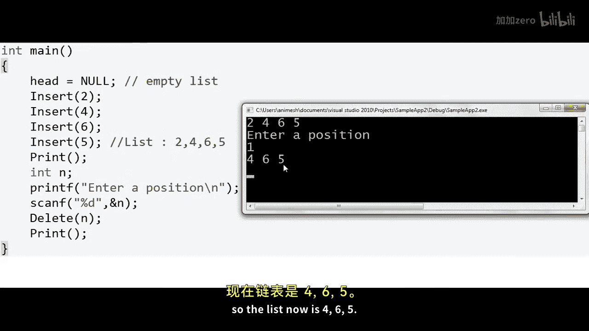
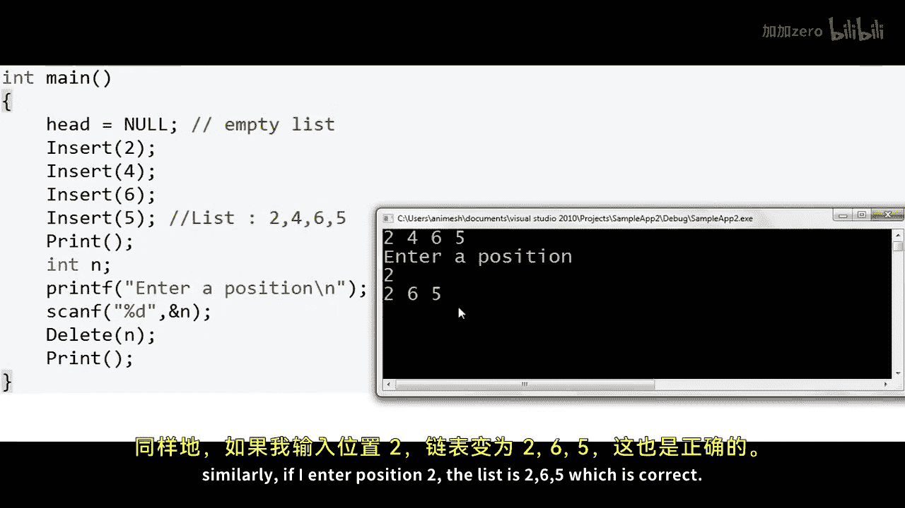
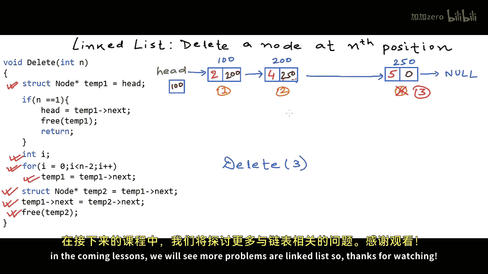

# 008：删除链表指定位置的节点 🗑️

在本节课中，我们将学习如何从链表中删除指定位置的节点。我们将理解删除操作的两个关键步骤：修复链表链接和释放节点内存，并通过C语言代码示例来演示整个过程。

## 概述

上一节我们介绍了如何在链表中插入节点。本节中，我们来看看如何从链表中删除一个位于任意给定位置的节点。

## 链表删除操作原理

我们以一个包含四个节点的整数链表为例。节点的地址分别为100、200、150和250。我们使用基于1的索引来标记位置：第一个节点、第二个节点、第三个节点和第四个节点。

删除链表节点需要完成两件事：

1.  **修复链接**：使目标节点不再属于链表。
2.  **释放内存**：释放被删除节点占用的内存空间。

### 删除中间节点

假设我们要删除第三个位置的节点（地址150）。我们需要找到其前驱节点（第二个节点，地址200），并将其 `next` 指针指向目标节点的后继节点（第四个节点，地址250）。这样，节点150就从链表链式结构中脱离。

### 删除头节点

如果要删除的是第一个节点（头节点），则是一个特殊情况。我们需要将 `head` 指针直接指向第二个节点，然后释放原头节点的内存。

我们的实现将涵盖所有这些情况。

## 代码实现

以下是用C语言实现的删除函数。我们假设链表节点结构体 `Node` 已经定义，包含 `int data` 和 `struct Node* next` 两个字段。`head` 是一个指向链表头节点的全局指针。

```c
void Delete(int n) {
    struct Node* temp1 = head;

    // 特殊情况：删除头节点
    if (n == 1) {
        head = temp1->next; // head 现在指向第二个节点
        free(temp1);        // 释放原头节点内存
        return;
    }

    // 一般情况：找到第 n-1 个节点
    for (int i = 0; i < n-2; i++) {
        temp1 = temp1->next; // 最终 temp1 指向第 n-1 个节点
    }
    // temp1 现在指向第 n-1 个节点

    struct Node* temp2 = temp1->next; // temp2 指向第 n 个节点（待删除节点）
    temp1->next = temp2->next;        // 将第 n-1 个节点的 next 指向第 n+1 个节点

    free(temp2); // 释放第 n 个节点的内存
}
```

### 代码逻辑分步解析

以下是代码执行过程的逻辑视图，以帮助你更清晰地理解。






**场景一：删除头节点 (n = 1)**
1.  `temp1` 被赋值为 `head`，指向第一个节点（地址100）。
2.  因为 `n == 1`，执行 `head = temp1->next`。`head` 现在指向第二个节点（地址200），链表链接被修复。
3.  执行 `free(temp1)`，释放第一个节点（地址100）的内存。
4.  函数返回，局部变量 `temp1` 被销毁。全局变量 `head` 指向新的链表头。

**场景二：删除中间节点 (例如 n = 3)**
1.  `temp1` 初始指向头节点（地址100）。
2.  因为 `n != 1`，进入 `for` 循环。循环执行 `n-2`（即1）次后，`temp1` 指向第二个节点（地址200），即第 `n-1` 个节点。
3.  `temp2 = temp1->next`，使得 `temp2` 指向第三个节点（地址150），即待删除的第 `n` 个节点。
4.  `temp1->next = temp2->next`，将第二个节点的 `next` 指针从150改为250（指向第四个节点）。至此，第三个节点已从链表链式结构中脱离。
5.  `free(temp2)` 释放第三个节点（地址150）的内存。
6.  函数返回，局部变量 `temp1` 和 `temp2` 被销毁。

## 主函数示例

以下是一个简单的 `main` 函数示例，展示了如何构建链表并调用删除函数。

```c
int main() {
    head = NULL; // 初始为空链表
    Insert(2);   // 链表：2
    Insert(4);   // 链表：2 -> 4
    Insert(6);   // 链表：2 -> 4 -> 6
    Insert(5);   // 链表：2 -> 4 -> 6 -> 5

    Print();     // 输出：List is: 2 4 6 5

    int position;
    printf("Enter a position to delete: ");
    scanf("%d", &position);

    Delete(position);
    Print();     // 输出删除后的链表

    return 0;
}
```

运行此程序，输入不同的位置（1, 2, 3, 4），可以验证删除功能的正确性。

## 总结

本节课中我们一起学习了如何从链表中删除指定位置的节点。关键点在于：
1.  处理两种主要情况：删除头节点和删除中间/尾节点。
2.  删除操作包含两个不可少的步骤：**修复前后节点的链接关系**，以及使用 `free()`（C语言）或 `delete`（C++）**释放被删除节点的动态内存**。
3.  通过临时指针变量遍历和操作链表是常见的实现方式。



你可以尝试扩展此功能，例如实现“删除具有特定值的节点”。在接下来的课程中，我们将探讨更多关于链表的习题和应用。