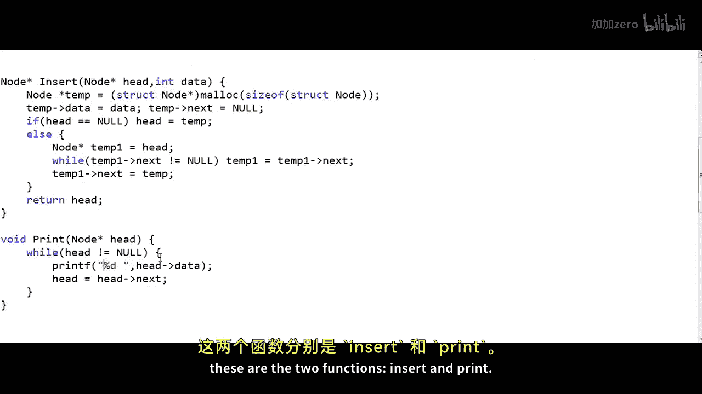
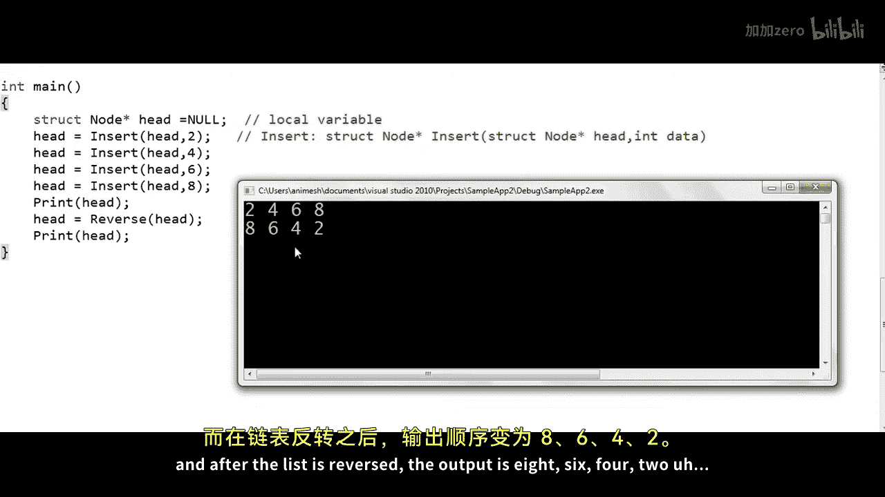

# 009：反转链表 - 迭代法 🔄

在本节课中，我们将学习如何使用迭代方法反转一个链表。这是面试中最受欢迎的问题之一，也是一个非常有趣的问题。

## 概述

在之前的课程中，我们已经实现了链表的一些基本操作，例如插入节点和删除节点。本节课，我们将编写代码来反转一个链表。我们首先需要明确问题定义。

## 问题定义

假设我们被给定一个整数链表，如下图所示。这是我们的输入链表。



这个链表有四个节点，地址分别为100、200、150和250。我们通常将地址写在逻辑视图中，因为这有助于我们可视化内存中的结构。第一个节点（也称为头节点）由一个名为 `head` 的变量指向。这个变量存储的是头节点的地址，它本身并不是头节点。除了头节点的地址，我们没有链表的其他标识。

给定这样一个链表，如果我们要反转它，这里的“反转”并不意味着移动数据（例如，我们不能将地址100处的数据5移动到地址250处）。我们实际上需要调整节点之间的链接。因此，我们的输出应该如下图所示。



头指针 `head` 应该指向地址250处的节点，链接顺序变为250 -> 150 -> 200 -> 100，而地址100处的节点的地址部分应为0或NULL。在每个节点中，红色的第一个字段是数据部分，第二个字段是地址部分。这就是反转链表后的结果。

解决此问题有两种方法：一种是迭代法，我们将使用循环遍历链表，并在每一步反转一个链接；另一种是递归法。本节课，我们将重点理解迭代解决方案。

## 迭代解决方案思路

回到我们的输入链表。迭代解决方案相对更容易理解。我们可以遍历整个链表，当访问每个节点时，调整该节点的链接部分，使其指向前一个节点，而不是下一个节点。

我们将从第一个节点开始。在每一步，我们都希望反转链接，使当前节点指向前一个节点。对于第一个节点，没有前一个节点，因此我们可以认为前一个节点是NULL。我们首先切断指向下一个节点的链接，然后建立指向前一个节点（NULL）的链接。接着，我们移动到链表中的下一个节点。当然，这里会有一个问题：如果我们已经切断了指向下一个节点的链接，我们如何移动到下一个节点？我们将在实现细节中回到这个问题。

假设我们能够遍历链表并访问每个节点。在每一步，我们将所有相关信息存储在一些临时变量中。

现在，在第二个节点（地址200），我们再次反转链接，将其地址部分设置为100。然后我们移动到地址150处的下一个节点，将其地址部分设置为200。接着，我们移动到地址250处的最后一个节点，将其地址部分设置为150。最后，当我们到达最后一个节点后，我们将调整 `head` 变量，使其指向地址250处的节点。这样，链表就被反转了。

## 代码实现

现在，让我们在真实的C语言程序中实现这个逻辑。我将重新绘制原始输入链表。

在我的C代码中，我将像下面这样定义一个节点结构体。这与我们之前所有课程中定义节点的方式一致。

```c
struct Node {
    int data;
    struct Node* next;
};
```

结构体有两个字段：一个用于存储数据（`int` 类型），另一个用于存储下一个节点的地址（`struct Node*` 类型），我们将其命名为 `next`。

假设 `head` 是一个全局变量，它是一个指向 `Node` 的指针，因此可以被所有函数访问，无需在函数间传递。

现在，我想编写一个 `reverse` 函数，用于反转由 `head` 指针指向的链表。

正如我们所说，我们将遍历整个链表，并在每一步修改节点的链接字段，使其指向前一个节点。

## 遍历与反转的实现细节

我们如何在C代码中遍历链表？通常我们会这样做：

```c
struct Node* temp = head;
while (temp != NULL) {
    // 处理当前节点 temp
    temp = temp->next; // 移动到下一个节点
}
```

但在我们的问题中，我们不仅需要遍历，还需要在遍历时反转链接。我们需要将特定节点的地址字段设置为前一个节点的地址，而不是下一个节点的地址。在链表中，我们总是知道下一个节点的地址，但通常不知道前一个节点的地址。因此，在遍历时，我们需要用另一个变量来跟踪前一个节点。

我将这样做：声明一个名为 `previous` 的变量，并初始化为 `NULL`，因为对于第一个节点（头节点），前一个节点就是 `NULL`。在我的循环中，我需要更新两个变量：存储当前节点的 `current` 变量和存储前一个节点地址的 `previous` 变量。

在循环的每一步，如果 `current` 是我们的当前节点，我们可以执行 `current->next = previous;`，将当前节点的链接部分设置为前一个节点的地址。

但在我们设置当前节点的链接指向前一个节点之前，存在一个问题：一旦我们调整了当前节点的链接，我们就失去了下一个节点的地址，无法将 `current` 移动到下一个节点。

解决方案是：在迭代的每一步，在我们设置当前节点的链接字段指向前一个节点之前，我们应该将下一个节点的地址存储在另一个临时变量中。

因此，完整的逻辑如下：

1.  初始化 `current` 为 `head`，`previous` 为 `NULL`。
2.  当 `current` 不为 `NULL` 时，执行循环：
    a. 首先，将下一个节点的地址保存到临时变量 `next` 中：`next = current->next;`
    b. 然后，反转当前节点的链接：`current->next = previous;`
    c. 接着，更新 `previous` 和 `current` 以向前移动：`previous = current;` 然后 `current = next;`
3.  循环结束后，`previous` 将指向原链表的最后一个节点，即新链表的头节点。因此，我们需要更新 `head` 指针：`head = previous;`

以下是 `reverse` 函数的代码框架：

```c
void reverse() {
    struct Node *current, *prev, *next;
    current = head;
    prev = NULL;
    while (current != NULL) {
        next = current->next; // 保存下一个节点
        current->next = prev; // 反转当前节点的链接
        prev = current;       // 移动 prev 到当前节点
        current = next;       // 移动 current 到下一个节点
    }
    head = prev; // 更新头指针指向新的头节点
}
```

请注意，变量 `next` 是 `reverse` 函数中的局部指针变量。当我们写 `current->next` 时，我们指的是节点结构体中的链接字段；而当我们写 `next` 时，我们指的是这个局部指针变量。它们是不同的。

## 边界情况测试

我们需要确保我们的实现在所有测试用例下都能工作，因此必须验证特殊或边界情况。对于反转链表，边界情况包括：
*   **空链表**：此时 `head` 为 `NULL`。
*   **只有一个节点的链表**。

你可以验证，上述实现对于这两种场景都能正确工作。

## 完整代码示例与运行

现在，让我们运行包含所有函数（插入、打印）的完整代码。在我的代码中，`reverse` 函数接受头节点的地址作为参数，并在反转链表后返回修改后的头节点地址。`main` 函数中声明了 `head` 作为局部变量。

我使用了几个插入函数调用（例如在链表末尾插入），初始链表为 `2 -> 4 -> 6 -> 8`。然后调用打印函数，接着调用 `reverse` 函数，最后再次打印。

假设 `insert` 和 `print` 函数都已正确编写，运行代码后，反转前的输出是 `2 4 6 8`，反转后的输出是 `8 6 4 2`。


对于只有一个元素（例如 `2`）的链表，该实现同样有效。

## 总结


本节课中，我们一起学习了如何使用迭代方法反转一个链表。我们首先定义了问题，然后详细阐述了迭代法的核心思路：在遍历链表的过程中，使用三个指针（`current`、`prev`、`next`）来逐步调整每个节点的指向。我们给出了具体的C语言实现代码，并讨论了边界情况的处理。最后，我们通过示例验证了代码的正确性。


在下一节课中，我们将学习如何使用递归方法反转链表。