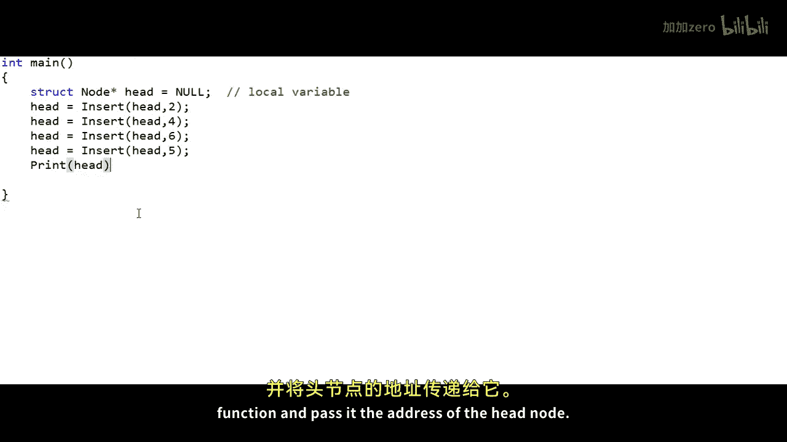
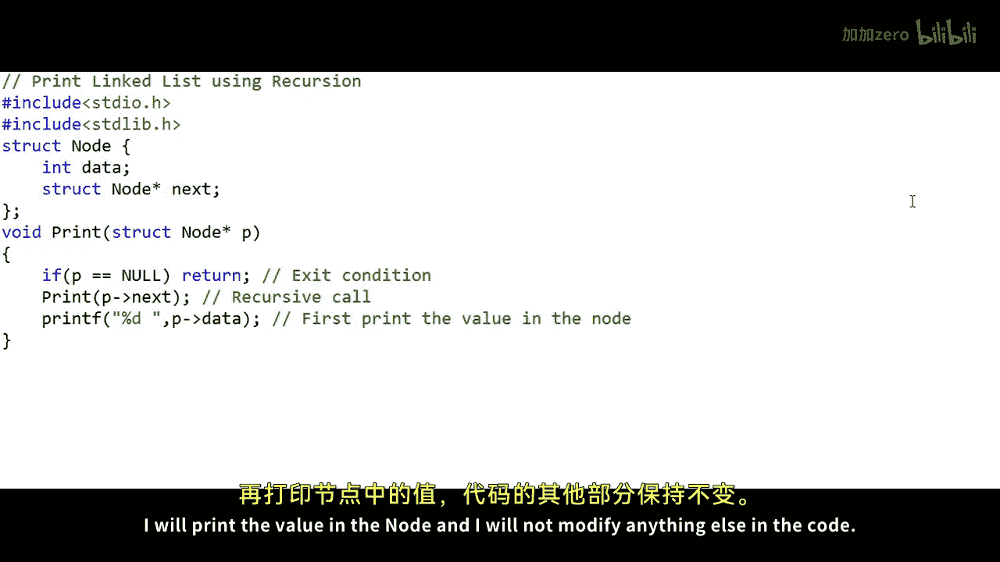
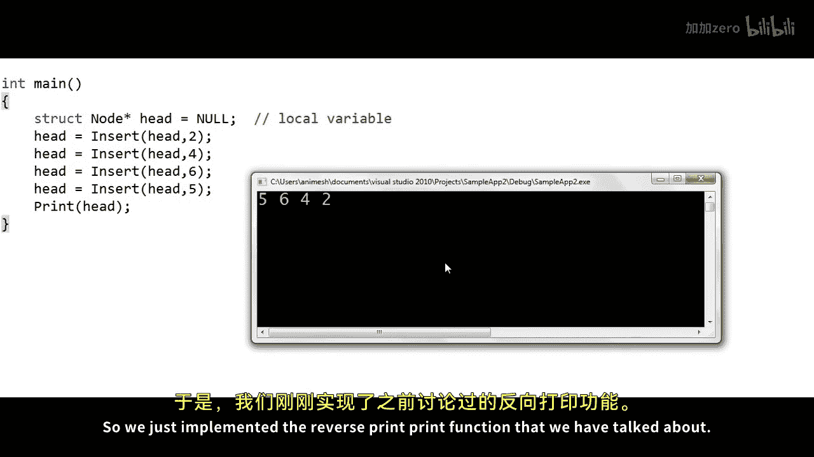

# 010：使用递归正向与反向打印链表元素 🧠

在本节课中，我们将学习如何使用递归来遍历链表，并分别以正向和反向顺序打印链表中的所有元素。我们将编写两个函数：一个用于正向打印，另一个用于反向打印，同时深入理解递归在链表操作中的应用。

---

## 概述

到目前为止，在我们的链表系列中，我们已经实现了插入、删除和遍历等基本操作。本节课，我们将编写代码，使用递归来遍历并打印链表中的元素。学习本课的前提是理解递归这一编程概念。链表的递归遍历实际上能帮助我们解决一些有趣的问题，但本节课我们将保持简单，仅使用递归打印链表中的所有元素，并编写一个简单的变体来反向打印元素。请注意，我们不会实际反转链表，只是以反向顺序打印元素。

---

## 链表节点结构

我们以一个整数链表为例。链表有四个节点，每个节点是一个矩形，包含两个字段：一个用于存储数据，另一个用于存储下一个节点的地址。假设四个节点的地址分别为100、200、150和250。当然，我们还需要一个变量来存储头节点的地址，在C或C++程序中，我们通常将这个变量命名为 `head`。

在代码中，一个节点可以这样定义：
```c
struct Node {
    int data;
    struct Node* next;
};
```

---

## 目标函数

本节课的目标是编写两个函数：
1.  一个名为 `Print` 的函数，它接收一个节点的地址作为参数（我们将传递头节点的地址给它），并使用递归打印链表中的元素。
2.  一个名为 `ReversePrint` 的函数，同样接收一个节点的地址，但使用递归以反向顺序打印链表中的元素。

对于示例链表，`Print` 函数的输出应为 `2 4 6 5`，而 `ReversePrint` 函数的输出应为 `5 6 4 2`。

---

## 实现正向打印函数

首先，我们来实现 `Print` 函数。在C代码中，我们这样声明该函数：它接收一个指向节点的指针作为参数。最初，我们将传递头节点的地址。我们可以将这个参数命名为 `p`。

递归是函数调用自身的一种技术。在我们的代码中，我们可以先打印当前节点的值，然后递归调用 `Print` 函数并传递下一个节点的地址。递归中一个重要的部分是退出条件，我们不能无限地进行递归调用。在这个例子中，当我们通过递归从第一个节点走到最后一个节点之后，`p` 最终会变为 `NULL`。此时，我们应该停止递归并退出。



以下是 `Print` 函数的一个可能实现：
```c
void Print(struct Node* p) {
    if(p == NULL) {
        printf("\n");
        return; // 退出条件：到达链表末尾
    }
    printf("%d ", p->data); // 打印当前节点的数据
    Print(p->next); // 递归调用，处理下一个节点
}
```


在 `main` 函数中，我们声明一个头指针 `head` 并初始化为 `NULL`，表示链表为空。然后，我们通过调用插入函数（例如在链表末尾插入节点的函数）来创建链表。插入函数可能需要返回修改后的头指针地址，以便在 `main` 函数中更新。创建链表后，我们调用 `Print(head)` 来打印所有元素。

执行上述代码，控制台将输出：`2 4 6 5`。

---





## 实现反向打印函数

接下来，我们来实现反向打印。神奇的是，我们只需对 `Print` 函数做一个小小的改动：**交换打印语句和递归调用的顺序**。

我们将函数重命名为 `ReversePrint`，并修改其逻辑：先进行递归调用，等递归调用返回后，再打印当前节点的值。这样，打印操作会在递归“返回”的过程中执行，从而实现了反向输出。

修改后的 `ReversePrint` 函数如下：
```c
void ReversePrint(struct Node* p) {
    if(p == NULL) {
        return; // 退出条件
    }
    ReversePrint(p->next); // 先递归到链表末尾
    printf("%d ", p->data); // 返回时再打印数据
}
```

在 `main` 函数中调用 `ReversePrint(head)`，控制台将输出：`5 6 4 2`。

---

## 递归执行过程分析

为了更好地理解，让我们逻辑上分析一下这两个递归函数的执行过程。

对于 `Print` 函数（正向打印）：
1.  从 `main` 调用 `Print(100)`。
2.  `Print(100)` 打印数据 `2`，然后调用 `Print(200)`。
3.  `Print(200)` 打印数据 `4`，然后调用 `Print(150)`。
4.  `Print(150)` 打印数据 `6`，然后调用 `Print(250)`。
5.  `Print(250)` 打印数据 `5`，然后调用 `Print(NULL)`。
6.  `Print(NULL)` 遇到退出条件，打印换行并返回。
7.  然后各层递归函数依次返回，整个过程结束。输出顺序是调用递归**之前**打印，因此是正向的。

对于 `ReversePrint` 函数（反向打印）：
1.  从 `main` 调用 `ReversePrint(100)`。
2.  `ReversePrint(100)` 首先调用 `ReversePrint(200)`，自身暂停。
3.  此过程持续，直到 `ReversePrint(NULL)`，它直接返回。
4.  然后控制返回到 `ReversePrint(250)`，它打印数据 `5`，然后返回。
5.  控制返回到 `ReversePrint(150)`，它打印数据 `6`，然后返回。
6.  依次类推，最后 `ReversePrint(100)` 打印数据 `2`。
7.  输出顺序是递归调用**返回之后**打印，因此是反向的。

这种结构被称为“递归树”。

---

## 内存中的执行情况

在程序运行时，函数调用和局部变量存储在内存的**栈**区，而通过 `malloc` 或 `new` 动态分配的节点内存则位于**堆**区。

当进行递归调用时，每个函数调用都会在栈上获得自己的“栈帧”，用于存储其参数和局部变量。对于链表递归打印：
*   初始时，`main` 函数的栈帧在栈顶。
*   当 `main` 调用 `Print(head)` 时，`Print` 函数的栈帧被压入栈。
*   每次递归调用都会将一个新的 `Print` 栈帧压入栈。
*   当到达退出条件（`p == NULL`）时，递归停止增长。
*   然后，栈顶的函数调用开始依次完成并弹出栈，控制权逐层返回。

对于反向打印，过程类似，只是打印操作发生在栈帧弹出（即函数返回）的过程中。

需要指出的是，对于正向遍历，**迭代方法**（使用循环）通常比递归更高效，因为迭代只使用一个临时变量，而递归会隐式使用栈内存来存储多次函数调用的信息。然而，对于反向打印操作，由于我们需要一种机制来“记住”节点顺序，使用递归是完全可以接受的。

---

## 总结

本节课中，我们一起学习了如何使用递归来遍历链表。
*   我们实现了 `Print` 函数，通过**先打印后递归**的方式正向输出链表元素。
*   我们实现了 `ReversePrint` 函数，通过**先递归后打印**的方式反向输出链表元素。
*   我们分析了递归的执行逻辑和内存中的栈帧变化。
*   我们了解到，对于简单遍历，迭代可能更高效；但对于需要反向顺序访问的问题，递归提供了一种简洁的解决方案。


递归是处理链表（以及树、图等递归结构）的强大工具。在接下来的课程中，我们将运用递归解决更多有趣的链表问题。