# 011：使用递归反转链表 🔄

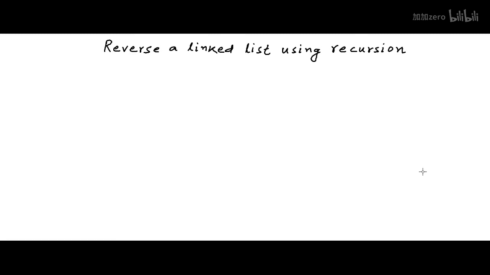

在本节课中，我们将学习如何使用递归方法反转一个单向链表。我们将从理解递归遍历链表开始，逐步构建反转链表的逻辑，并最终实现完整的递归反转函数。

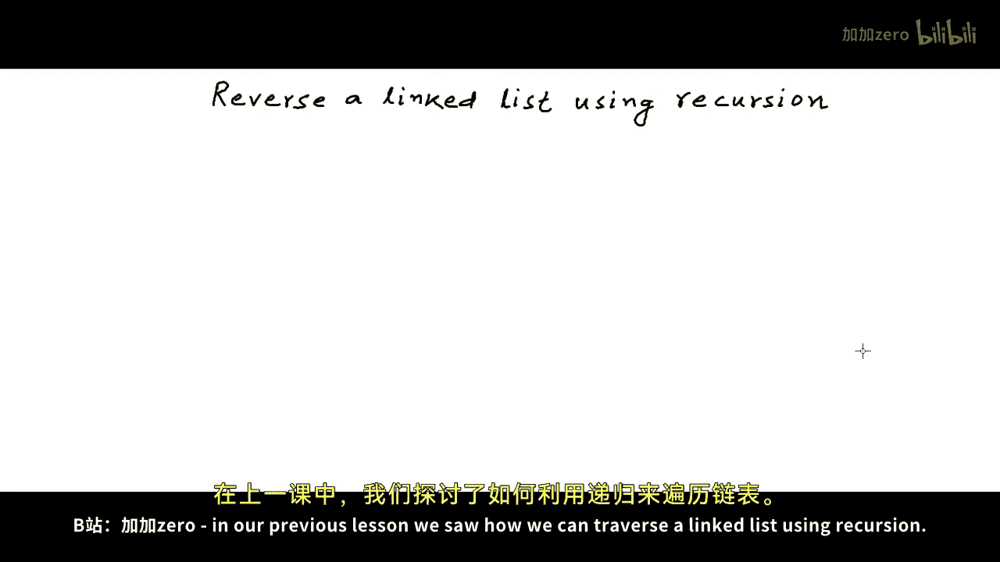

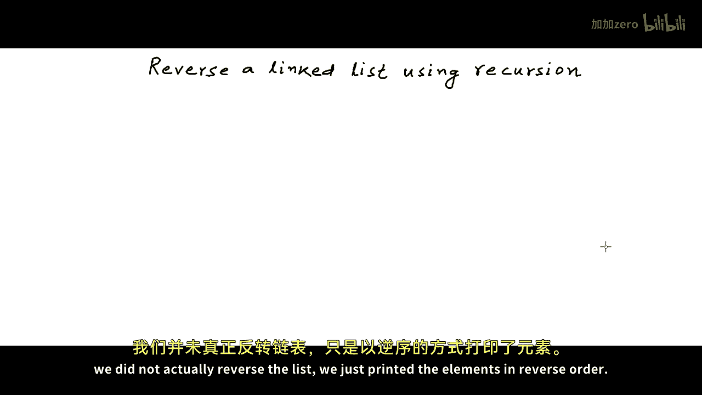

---

## 概述


在上节课中，我们学习了如何使用递归遍历链表，并编写了代码以正向和反向顺序打印链表元素。我们并未实际反转链表，只是以逆序打印了元素。本节课，我们将真正地使用递归来反转链表。这是一个著名的编程面试问题。


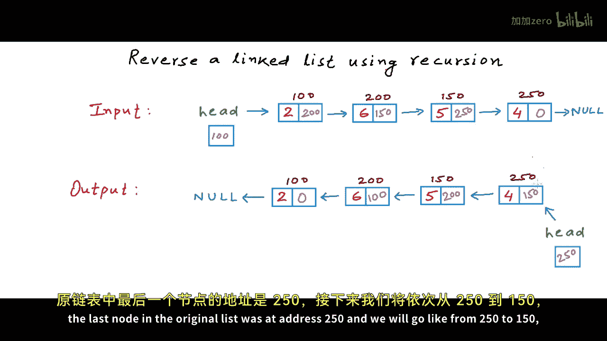

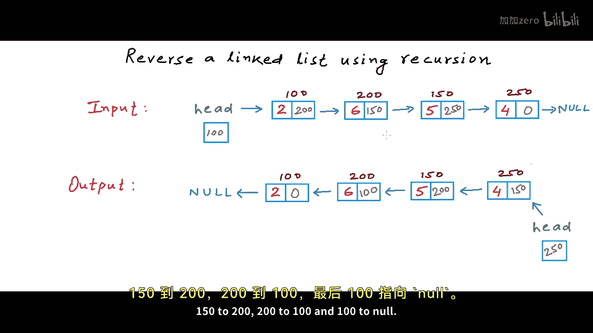

假设我们有一个输入链表，包含四个整数节点。每个节点由两个字段组成：一个存储数据，另一个存储下一个节点的地址。我们还有一个名为 `head` 的变量，用于存储第一个节点的地址。


输入链表结构如下：
```
head -> [2| ] -> [6| ] -> [5| ] -> [4| ] -> NULL
```
我们的目标是通过调整节点间的链接（而非移动数据），将其反转为：
```
head -> [4| ] -> [5| ] -> [6| ] -> [2| ] -> NULL
```

我们之前已经学习过使用迭代方法反转链表。现在，让我们看看如何使用递归解决这个问题。

---


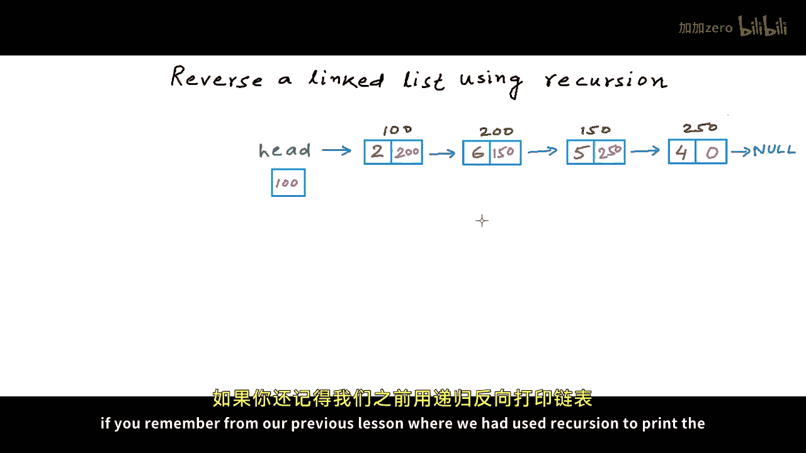

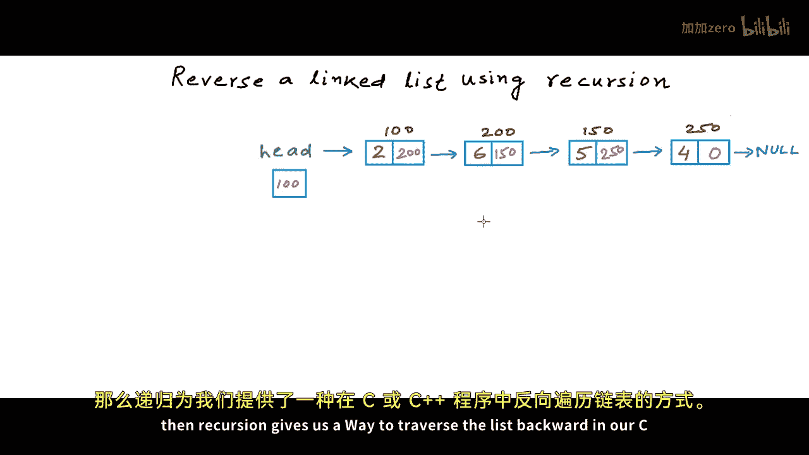


## 递归遍历的回顾

在深入反转逻辑之前，让我们回顾一下上节课中用于反向打印链表的递归函数。这个函数展示了递归如何让我们先正向遍历链表，再反向“回溯”处理节点。

以下是反向打印函数的伪代码：
```c
void ReversePrint(Node* p) {
    if (p == NULL) return; // 退出条件
    ReversePrint(p->next); // 递归调用
    printf("%d ", p->data); // 打印当前节点数据
}
```
当我们从 `main` 函数调用 `ReversePrint(head)` 时，递归会一直深入到最后一个节点（`p->next` 为 `NULL`），然后开始返回。在返回的过程中，每个节点的数据被打印出来，从而实现了逆序打印。


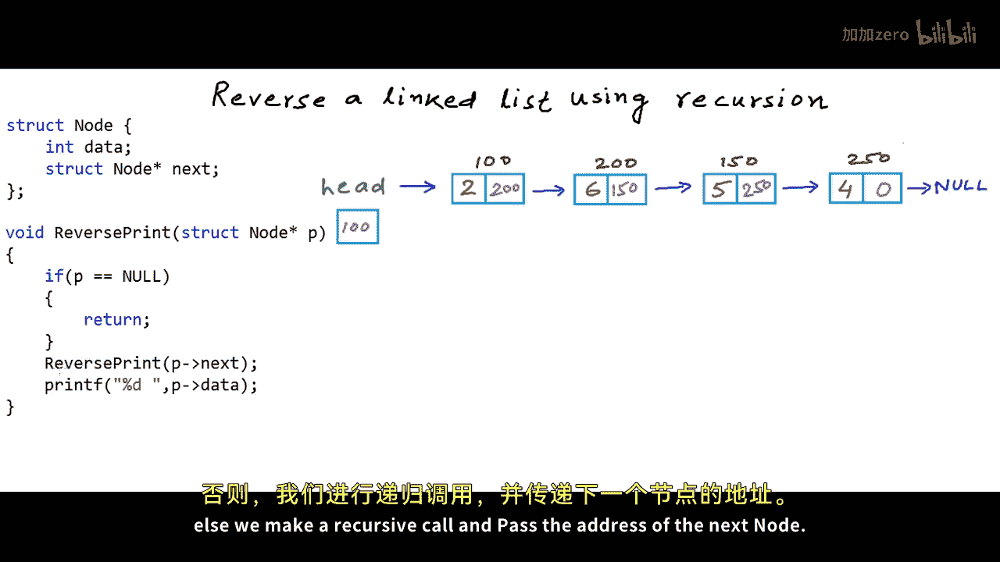


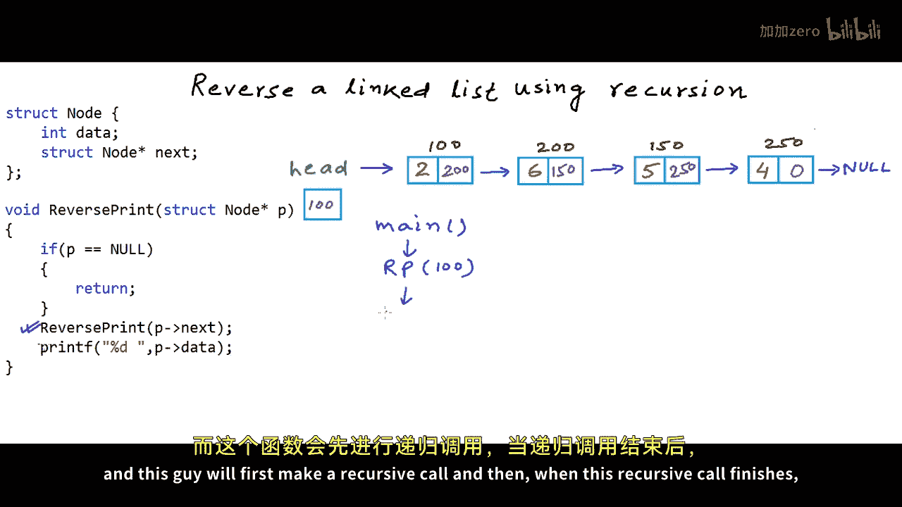

这个模式——先深入到底层，再在返回过程中执行操作——正是我们反转链表所需的关键。

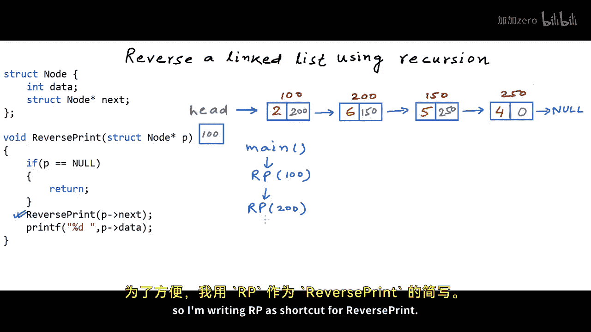


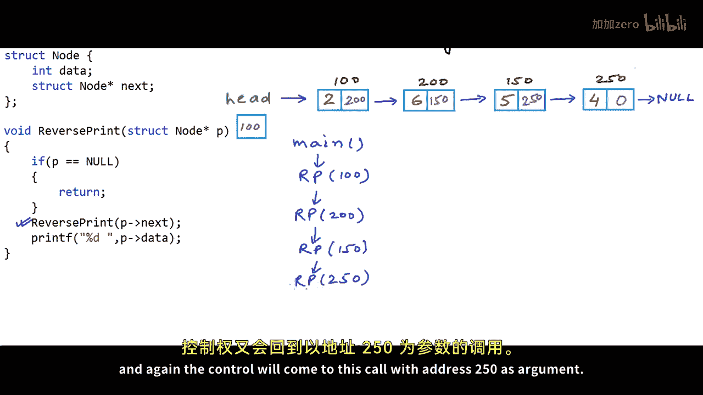

---


## 递归反转的逻辑

现在，让我们设计递归反转函数。为了简化，我们暂时假设 `head` 是一个全局变量。

我们的递归函数 `Reverse` 将接收一个节点指针 `p` 作为参数。基本思路如下：
1.  **递归深入**：函数不断递归调用自身，传入 `p->next`，直到到达最后一个节点。
2.  **处理最后一个节点**：当到达最后一个节点时（`p->next == NULL`），我们将全局的 `head` 指针指向这个节点，使其成为新链表的头节点。
3.  **回溯并反转链接**：在递归调用返回的过程中，我们将当前节点的下一个节点的 `next` 指针指向当前节点，从而反转链接方向，并将当前节点的 `next` 指针设为 `NULL`（在后续步骤中会被正确覆盖）。


以下是该逻辑的步骤分解：

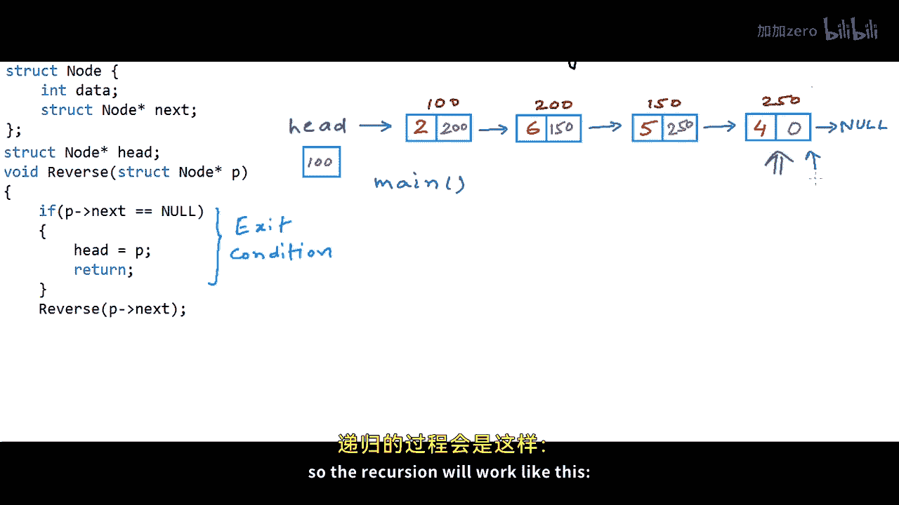

1.  **初始调用**：从 `main` 函数调用 `Reverse(head)`。
2.  **递归深入**：函数检查当前节点 `p` 是否为最后一个节点。如果不是，则递归调用 `Reverse(p->next)`。
3.  **到达末尾**：当 `p` 是最后一个节点时（例如存储数据 `4` 的节点），设置 `head = p`。此时，新链表的头节点已经确定。
4.  **回溯过程**：递归开始返回。假设我们回到了存储数据 `5` 的节点（此时 `p` 指向它）。
    *   我们需要让原顺序中 `p` 后面的节点（即节点 `4`，我们称其为 `q`，`q = p->next`）的 `next` 指针指向 `p`：`q->next = p`。
    *   然后，将 `p` 的 `next` 指针暂时设为 `NULL`：`p->next = NULL`。这一步在链表中间的反转过程中是必要的，它会被上一层的递归调用正确修改。
5.  **重复回溯**：上述过程在每一层递归返回时重复，直到回到最初的 `head` 节点，完成整个链表的反转。

---

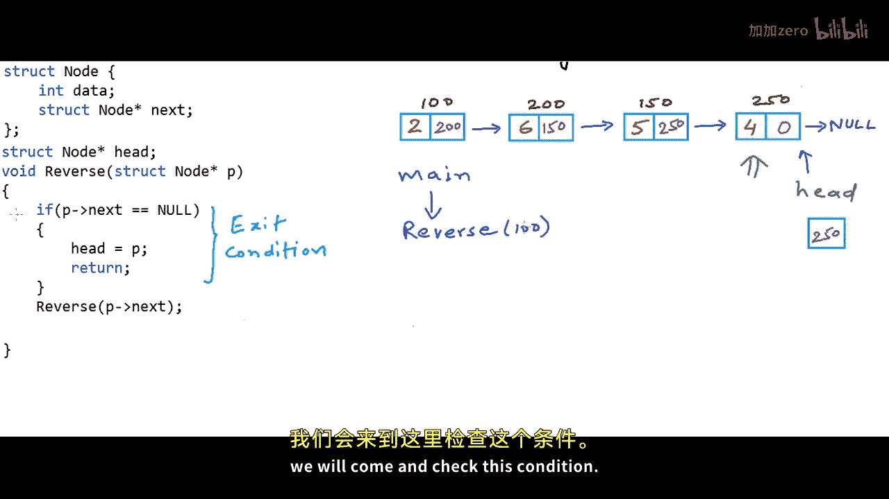

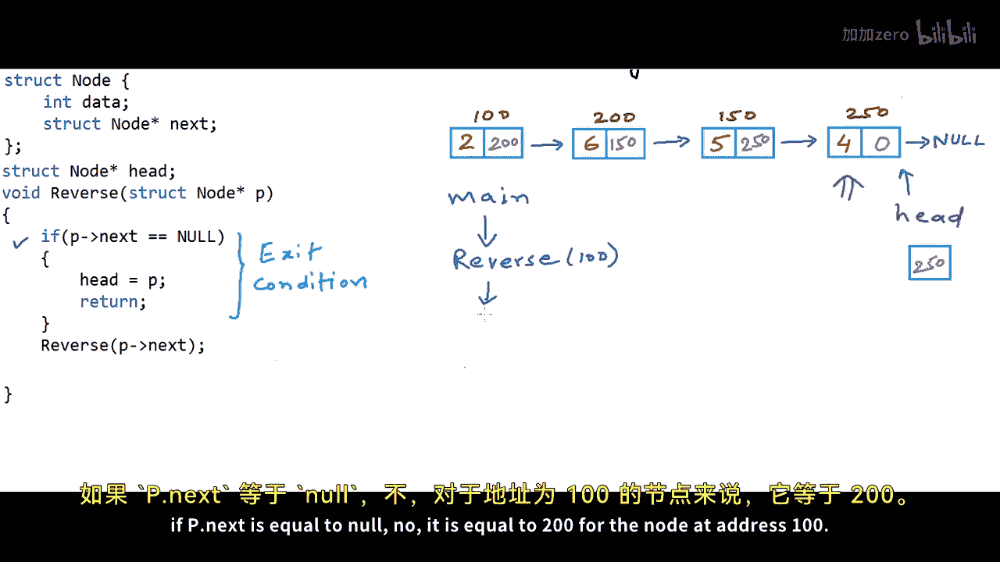

## 代码实现

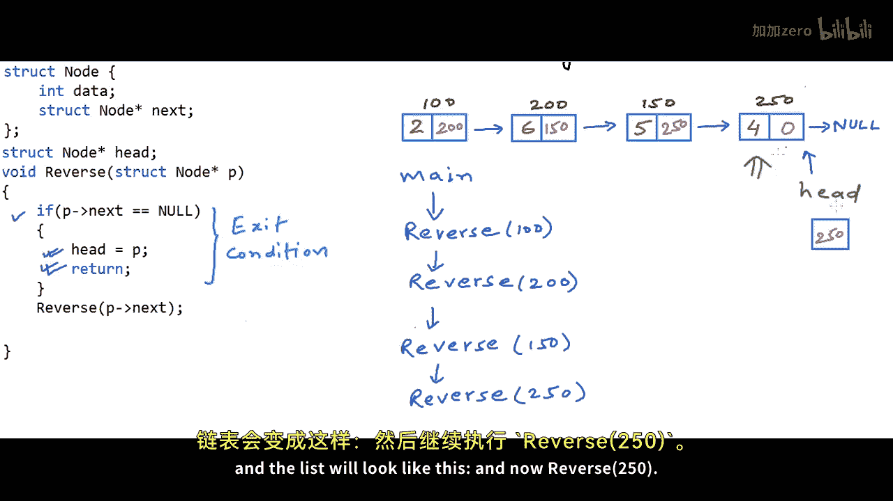


根据上述逻辑，我们可以写出以下递归反转函数（假设 `head` 为全局变量）：

```c
void Reverse(Node* p) {
    if (p->next == NULL) { // 退出条件：到达最后一个节点
        head = p; // 将头指针指向最后一个节点
        return;
    }
    Reverse(p->next); // 递归调用，深入下一个节点
    // 以下代码在递归返回时执行
    Node* q = p->next; // q 是当前节点 p 的下一个节点
    q->next = p; // 反转链接：让 q 指向 p
    p->next = NULL; // 将 p 的 next 暂时置空（会被上一层调用修改）
}
```

**代码解释**：
*   `if (p->next == NULL)`: 这是递归的基准情况。当 `p` 是最后一个节点时，我们将全局 `head` 指向它，并返回。
*   `Reverse(p->next)`: 递归调用，处理链表剩余部分。
*   `Node* q = p->next;`: 在递归调用返回后，`q` 指向原顺序中 `p` 后面的节点（该节点及其之后的链表部分已经被反转）。
*   `q->next = p;`: 这是关键的反转操作。它将 `q`（原顺序中的后继节点）的 `next` 指针指向当前节点 `p`。
*   `p->next = NULL;`: 将当前节点 `p` 的 `next` 指针断开。注意，对于非头节点的其他节点，这个 `NULL` 会在上一层递归中被正确的 `q->next = p` 覆盖。

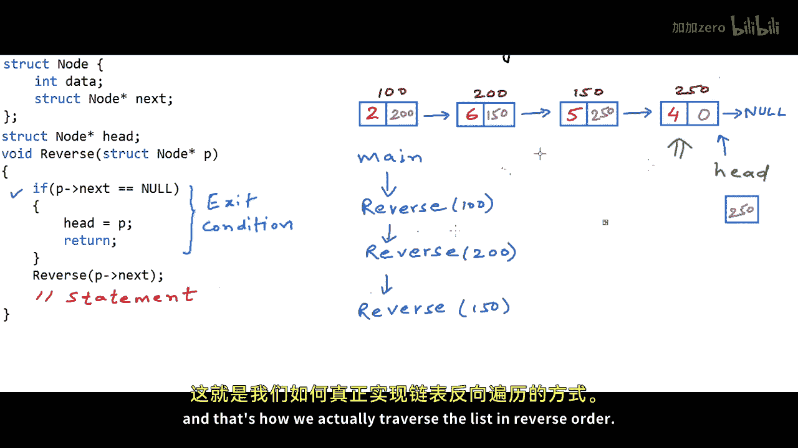


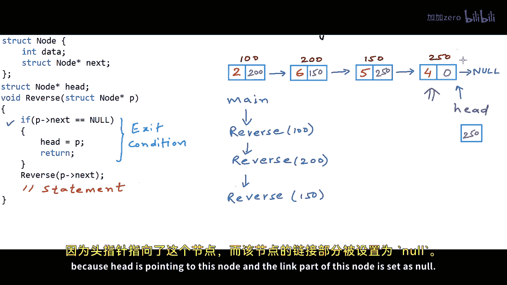


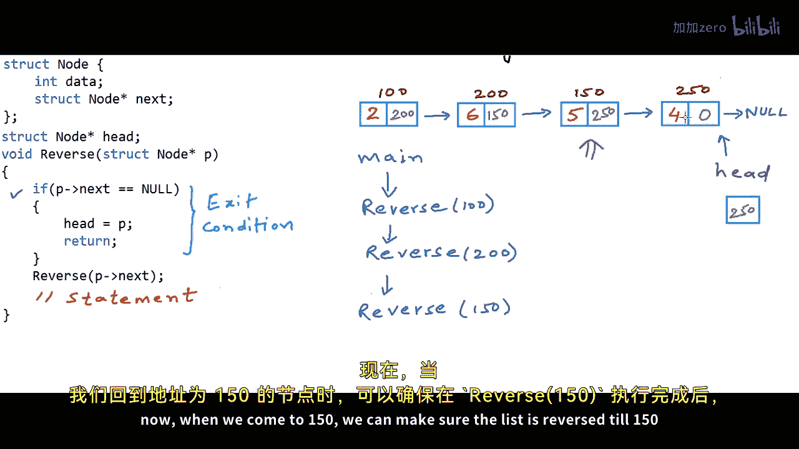

---


## 执行过程模拟


让我们用之前的链表 `[2, 6, 5, 4]` 来模拟一下 `Reverse(head)` 的调用栈：

1.  `Reverse(节点2)` 被调用。`p->next` (节点6) 不为 `NULL`，所以调用 `Reverse(节点6)`。
2.  `Reverse(节点6)` 被调用。`p->next` (节点5) 不为 `NULL`，所以调用 `Reverse(节点5)`。
3.  `Reverse(节点5)` 被调用。`p->next` (节点4) 不为 `NULL`，所以调用 `Reverse(节点4)`。
4.  `Reverse(节点4)` 被调用。`p->next` 为 `NULL`，触发基准情况：`head = 节点4`，然后返回。
5.  控制权回到 `Reverse(节点5)`。此时 `p` 是节点5，`q = p->next` 是节点4。
    *   执行 `q->next = p`：节点4的 `next` 指向节点5。
    *   执行 `p->next = NULL`：节点5的 `next` 置为 `NULL`。
    *   `Reverse(节点5)` 返回。
6.  控制权回到 `Reverse(节点6)`。此时 `p` 是节点6，`q = p->next` 是节点5。
    *   执行 `q->next = p`：节点5的 `next` 指向节点6。
    *   执行 `p->next = NULL`：节点6的 `next` 置为 `NULL`。
    *   `Reverse(节点6)` 返回。
7.  控制权回到 `Reverse(节点2)`。此时 `p` 是节点2，`q = p->next` 是节点6。
    *   执行 `q->next = p`：节点6的 `next` 指向节点2。
    *   执行 `p->next = NULL`：节点2的 `next` 置为 `NULL`。
    *   `Reverse(节点2)` 返回。


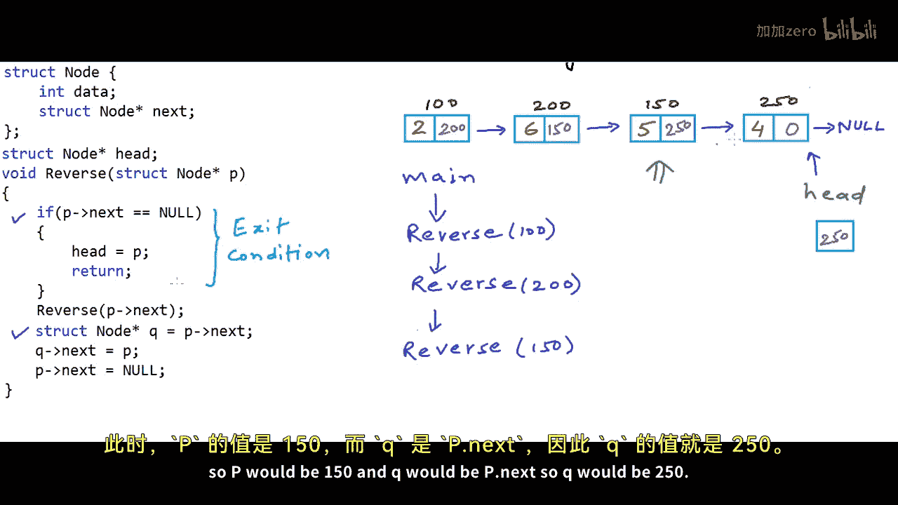

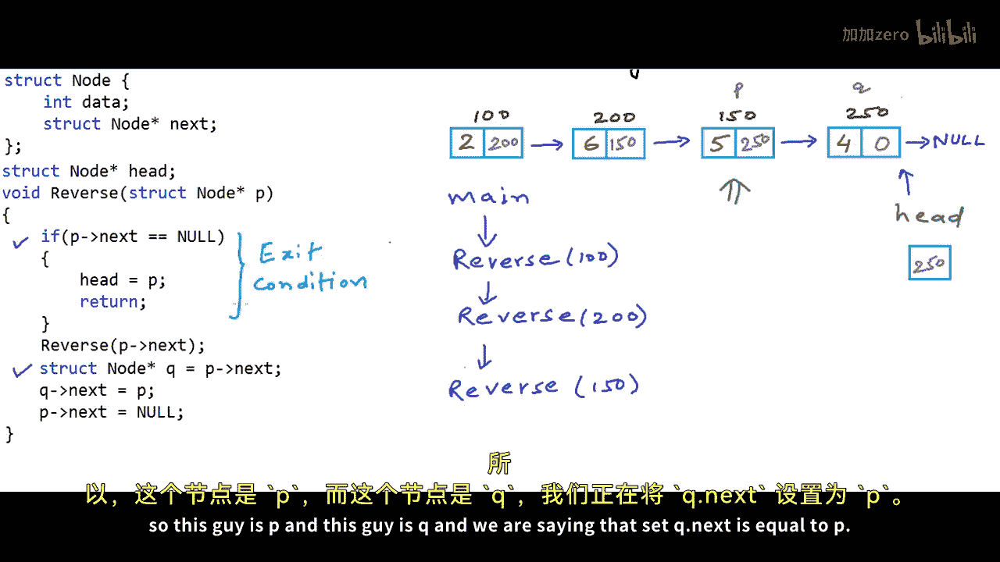

最终，`head` 指向节点4，链表成功反转为 `4 -> 5 -> 6 -> 2 -> NULL`。

---


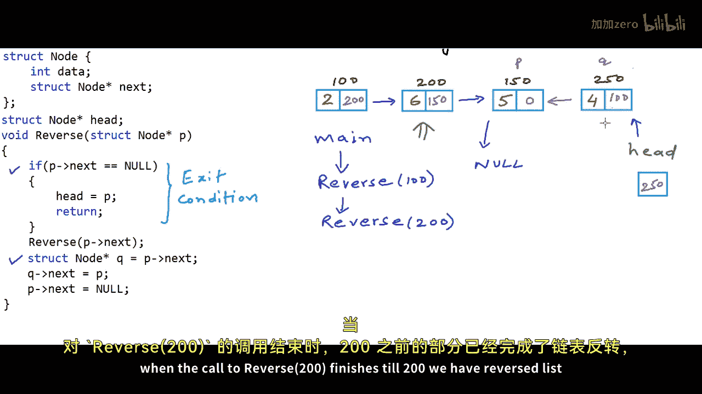

## 注意事项与扩展

1.  **代码简化**：在回溯部分的代码中，两行语句 `q->next = p;` 和 `p->next = NULL;` 有时可以被合并为一行更紧凑但可读性稍差的代码：`p->next->next = p;`。但为了清晰，我们更推荐分开写。
2.  **非全局头指针**：在我们的实现中，假设了 `head` 是全局变量。如果 `head` 是局部变量，我们的 `Reverse` 函数需要返回新的头节点地址。修改后的函数签名可能类似于 `Node* Reverse(Node* p)`，并在基准情况返回 `p`，在其他情况返回递归调用的结果。这留作一个练习。
3.  **递归与内存**：递归调用会在内存的栈区保存每一层函数调用的状态。对于长链表，这可能导致栈溢出。迭代方法通常在空间效率上更优。

---

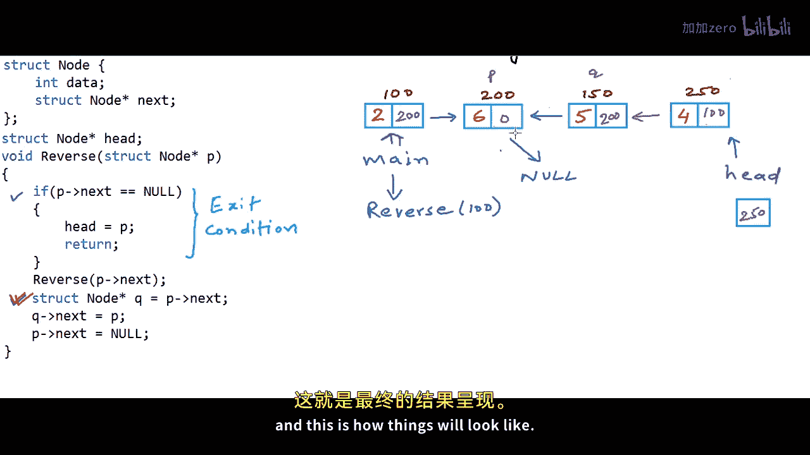

## 总结


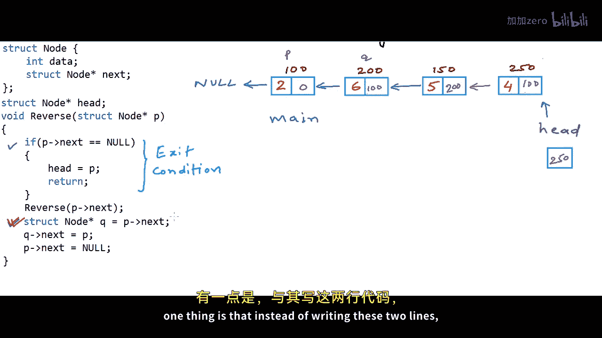

本节课中，我们一起学习了如何使用递归反转一个单向链表。

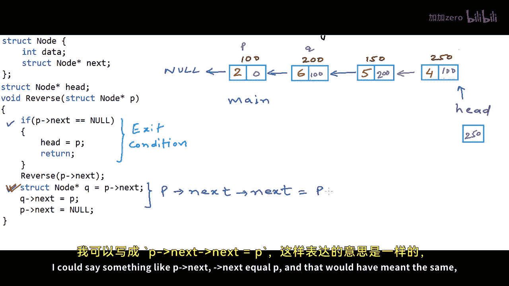

我们首先回顾了递归遍历链表的模式，然后基于此模式设计了反转逻辑：递归深入到链表末尾，将最后一个节点设为新头，然后在回溯过程中逐对反转节点间的链接。我们实现了相应的代码，并模拟了其执行过程。


关键点在于理解递归的“深入”和“回溯”两个阶段，并在回溯阶段执行反转链接的核心操作 `q->next = p`。虽然递归解法非常优雅且是常见的面试题，但在实际应用中需要注意其对栈空间的使用。