# 012：双向链表简介 📚

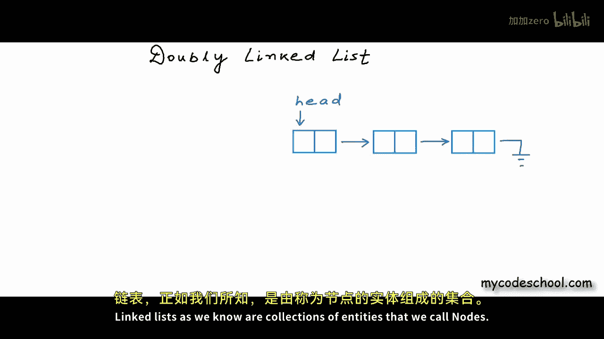

在本节课中，我们将要学习一种新的链表结构——双向链表。我们将了解它与之前学过的单向链表的区别，它的结构定义，以及它的优缺点。

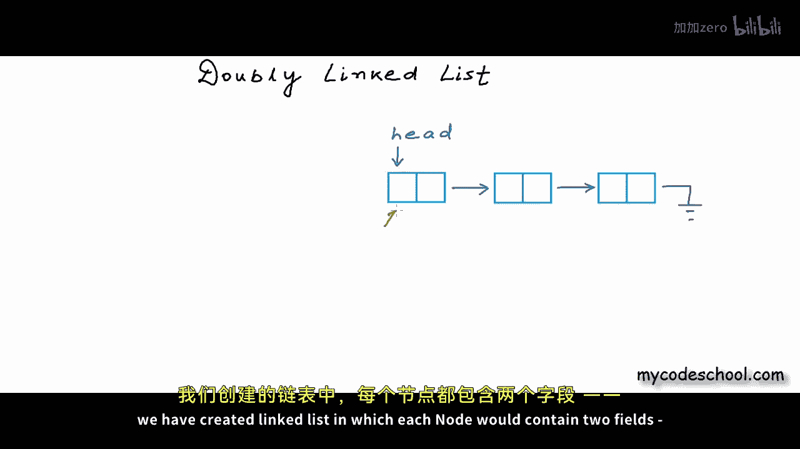

## 概述

到目前为止，在本系列课程中，我们已经详细讨论了链表。我们学习了如何创建链表以及如何对链表执行各种操作。链表是由我们称为“节点”的实体组成的集合。


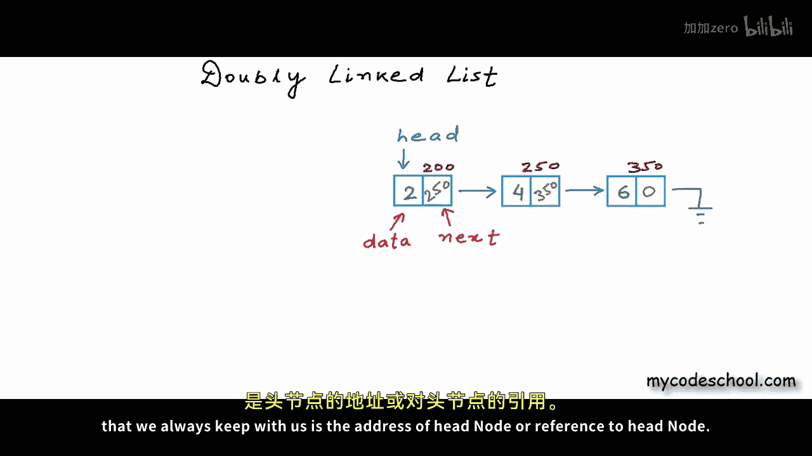

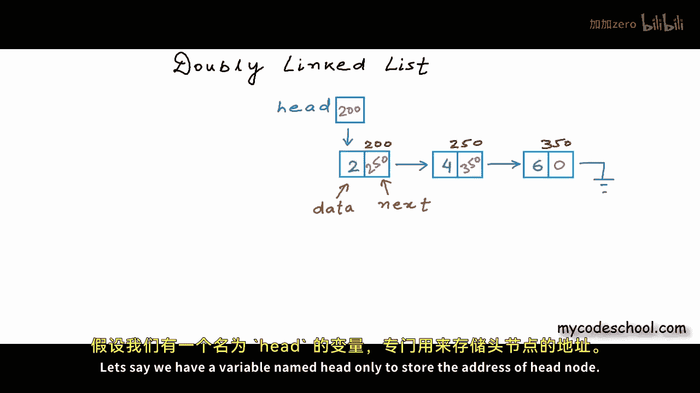


在之前所有的实现中，我们创建的链表，每个节点包含两个字段：一个用于存储数据，另一个用于存储下一个节点的地址。

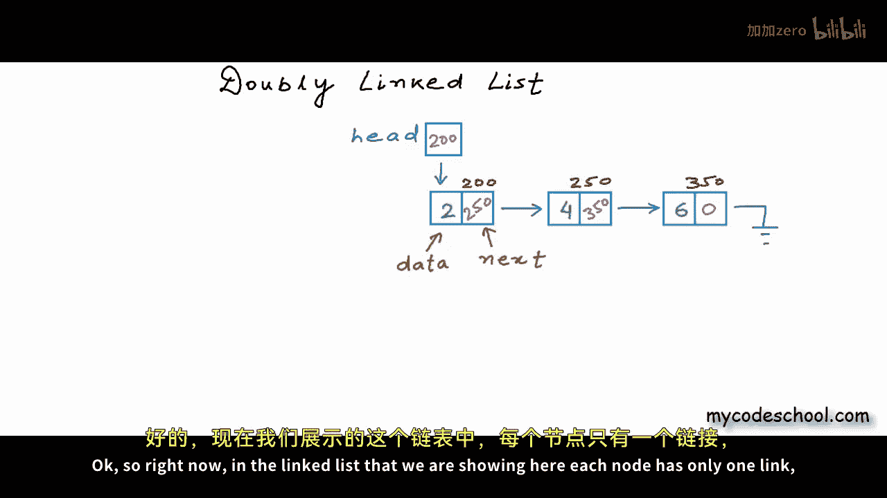

## 从单向链表到双向链表


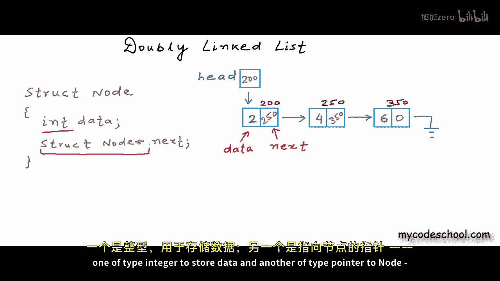

上一节我们介绍了单向链表的基本结构，本节中我们来看看双向链表。

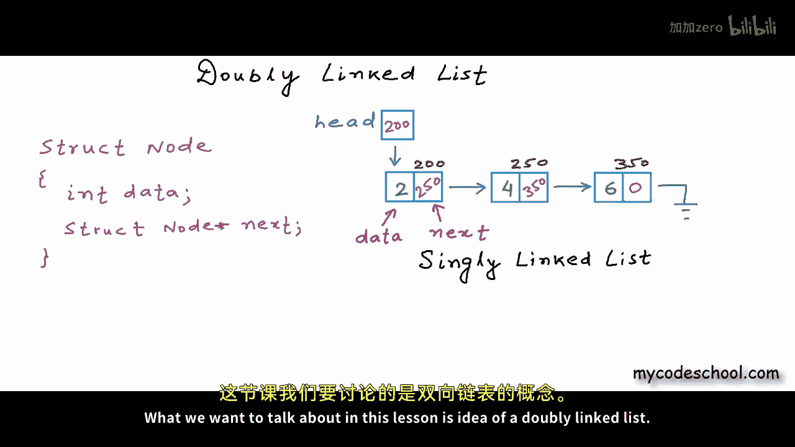

在单向链表中，每个节点只有一个指向下一个节点的链接。在C/C++中，节点的定义通常如下：


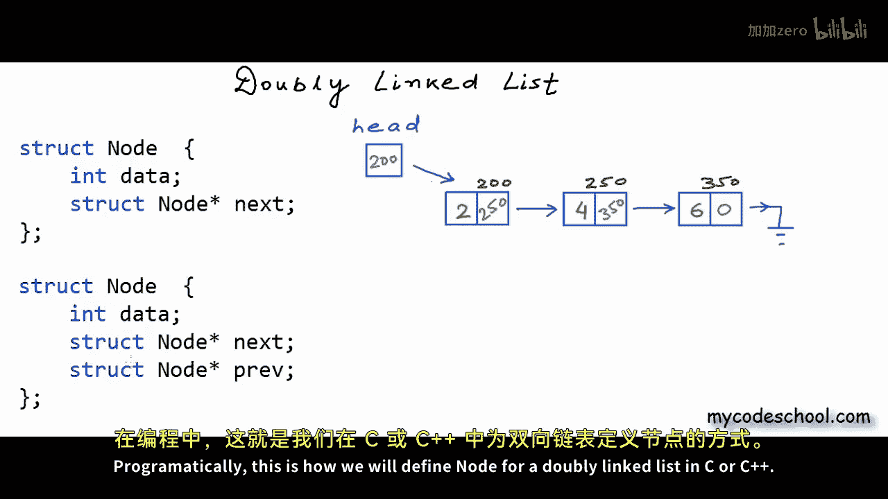

```c
struct Node {
    int data;
    struct Node* next;
};
```

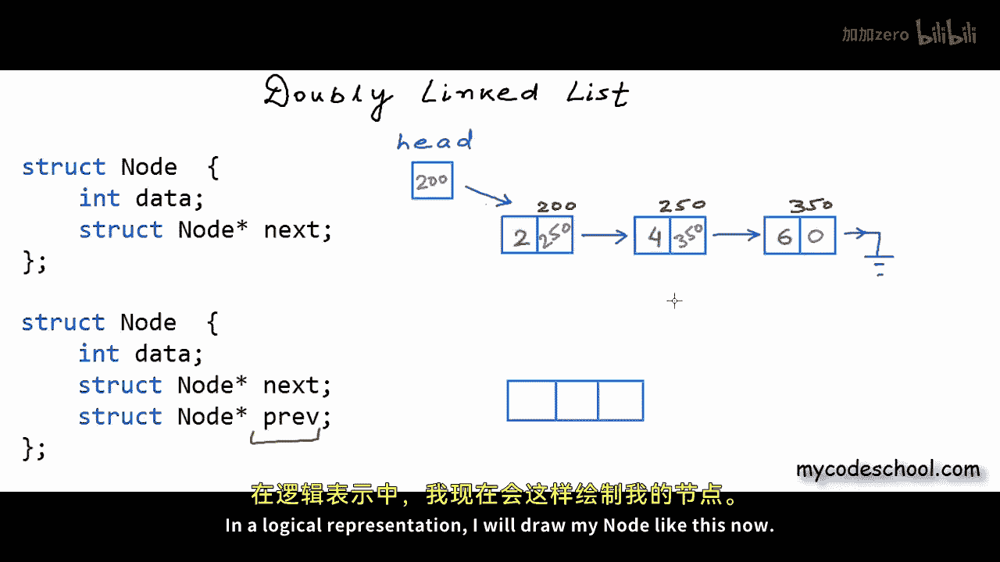

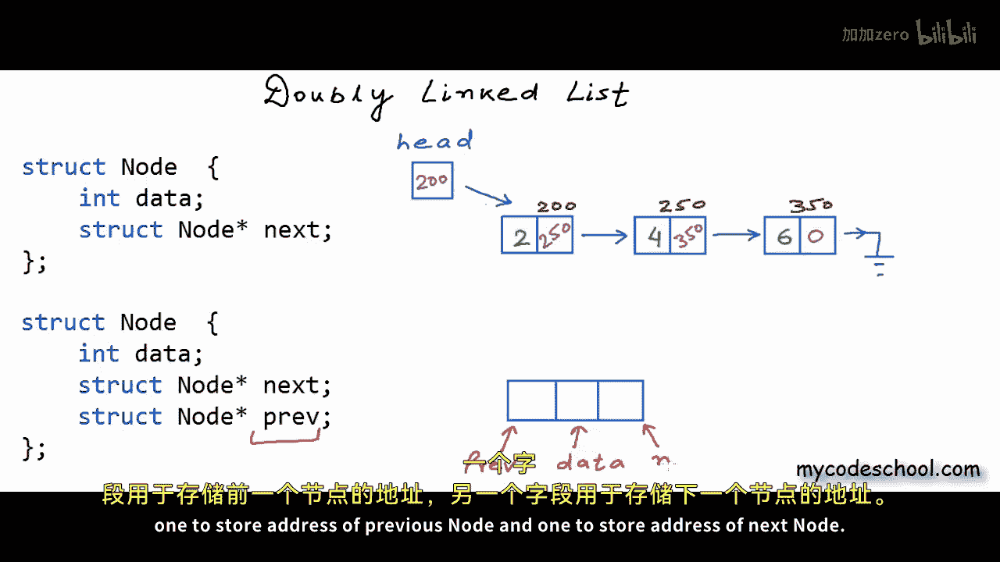

而双向链表的核心理念非常简单：在双向链表中，每个节点将拥有两个链接，一个指向下一个节点，另一个指向前一个节点。

在C/C++中，双向链表的节点定义如下：

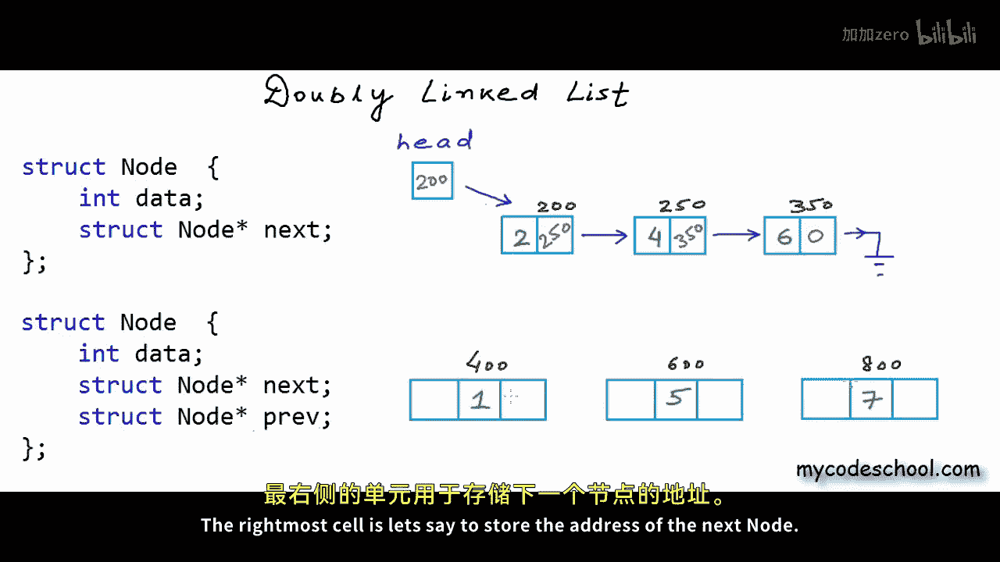


```c
struct Node {
    int data;
    struct Node* prev;
    struct Node* next;
};
```

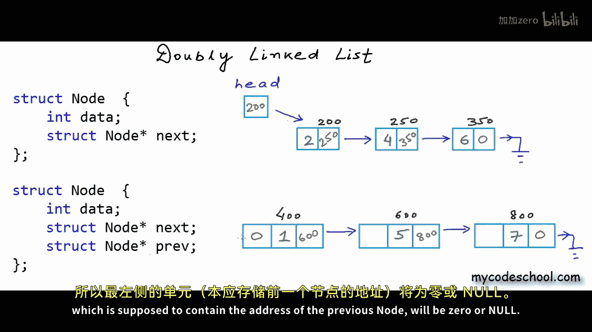

在逻辑表示中，一个双向链表的节点可以这样绘制：一个单元格存储数据，一个单元格存储前一个节点的地址，一个单元格存储下一个节点的地址。


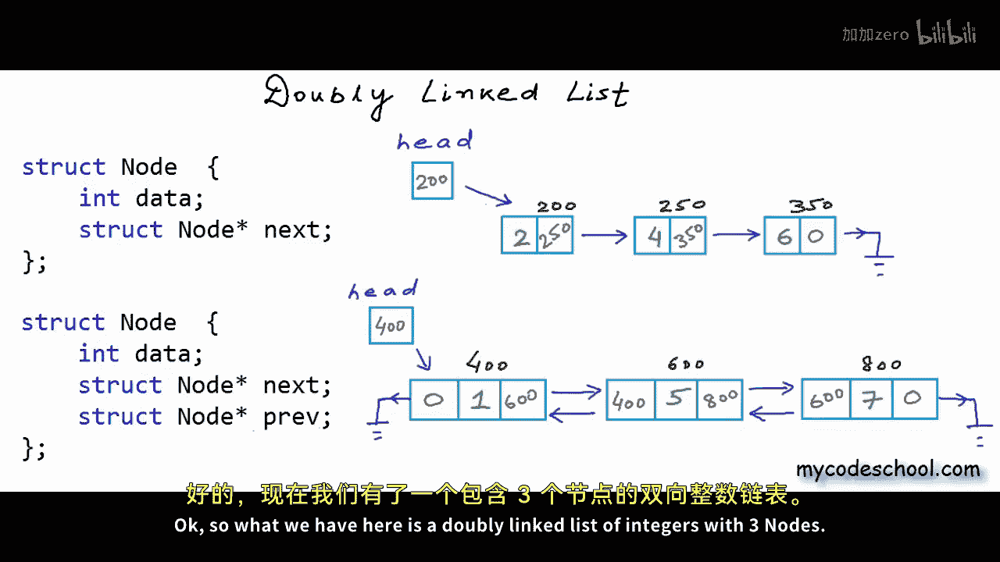

## 双向链表示例


假设我们创建一个包含三个整数的双向链表，节点地址分别为400、600和800。

以下是各节点链接的建立方式：
*   第一个节点的 `next` 字段指向地址600（第二个节点），`prev` 字段为0或NULL（因为没有前一个节点）。
*   第二个节点的 `next` 字段指向地址800（第三个节点），`prev` 字段指向地址400（第一个节点）。
*   第三个节点的 `next` 字段为0或NULL，`prev` 字段指向地址600（第二个节点）。


当然，我们仍然需要一个变量（例如 `head`）来存储头节点的地址。

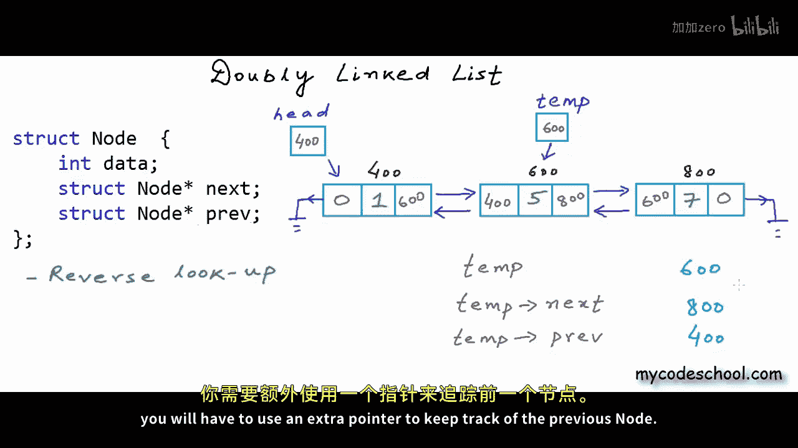

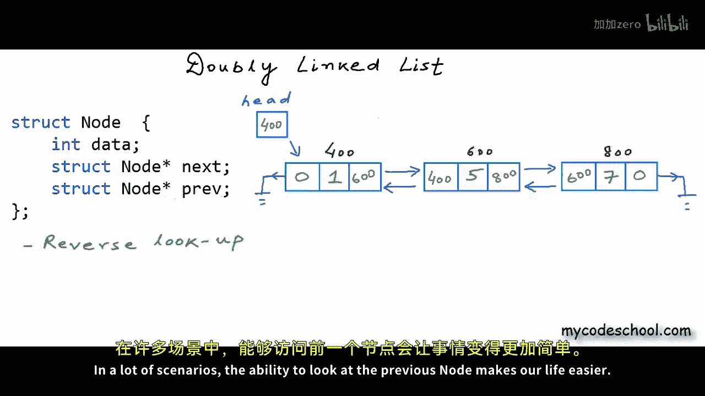

## 双向链表的优缺点

了解结构后，一个显而易见的问题是：为什么我们需要双向链表？它有什么优势和劣势？

以下是双向链表的主要优势：
*   **双向遍历**：如果我们有一个指向任何节点的指针，我们可以进行前向和后向查找。通过一个指针，我们可以访问当前节点、下一个节点以及前一个节点。在单向链表中，仅凭一个指针无法查看前一个节点，需要额外的指针来跟踪。
*   **简化操作**：在许多场景下，能够查看前一个节点的能力使操作更简单。例如，删除节点时，在单向链表中需要两个指针（一个指向待删除节点，一个指向前驱节点），而在双向链表中，仅需一个指向待删除节点的指针即可完成。


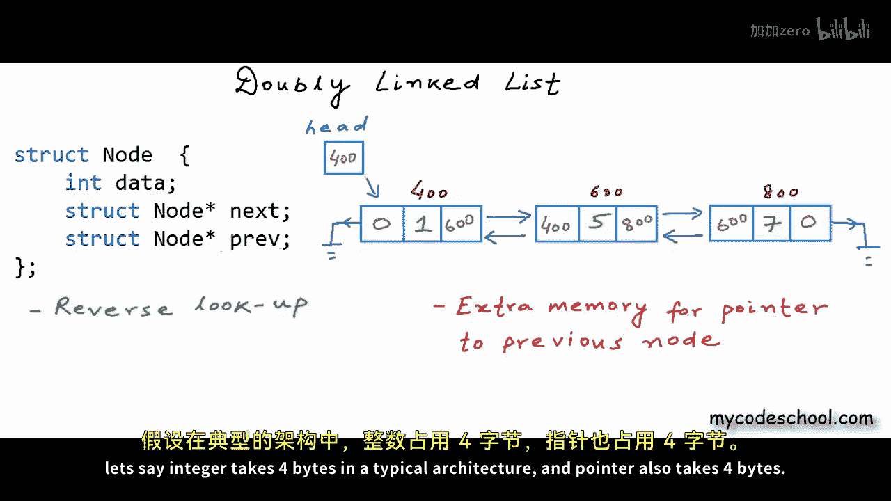

以下是双向链表的主要劣势：
*   **额外内存开销**：每个节点需要额外的内存来存储指向前一个节点的指针。例如，在一个整数链表中，假设整数占4字节，指针占4字节。在单向链表中，每个节点占8字节（4数据+4指针）。在双向链表中，每个节点占12字节（4数据+8指针）。
*   **操作更复杂**：在插入或删除节点时，我们需要比单向链表重置更多的链接（需要同时维护 `prev` 和 `next` 指针），因此更容易出错。

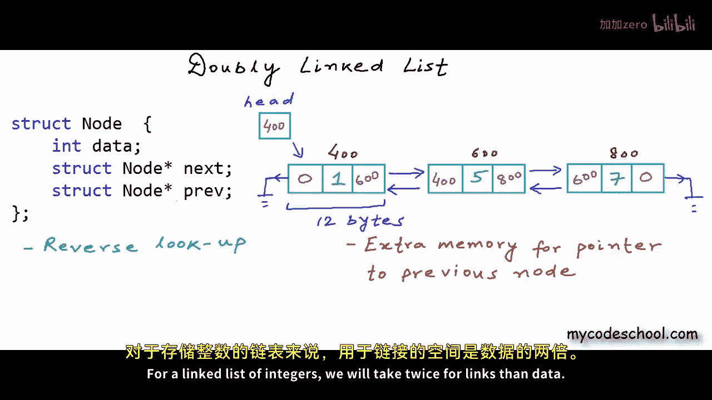

## 总结


本节课中我们一起学习了双向链表。我们了解了它的节点结构定义，通过示例看到了链接是如何建立的，并分析了它相对于单向链表的主要优点（双向遍历、简化某些操作）和缺点（内存开销增加、操作更复杂）。在下一课中，我们将在C程序中实现双向链表，并编写遍历、插入和删除等基本操作。