数据结构：13：双向链表在C/C++中的实现 🧠

在本节课中，我们将学习如何在C语言中实现一个双向链表。我们将编写一些基本操作，例如在链表头部和尾部插入节点、正向遍历以及反向遍历。通过本教程，你将理解双向链表节点的结构、内存管理（栈与堆的区别）以及如何通过指针操作来维护节点间的双向链接。

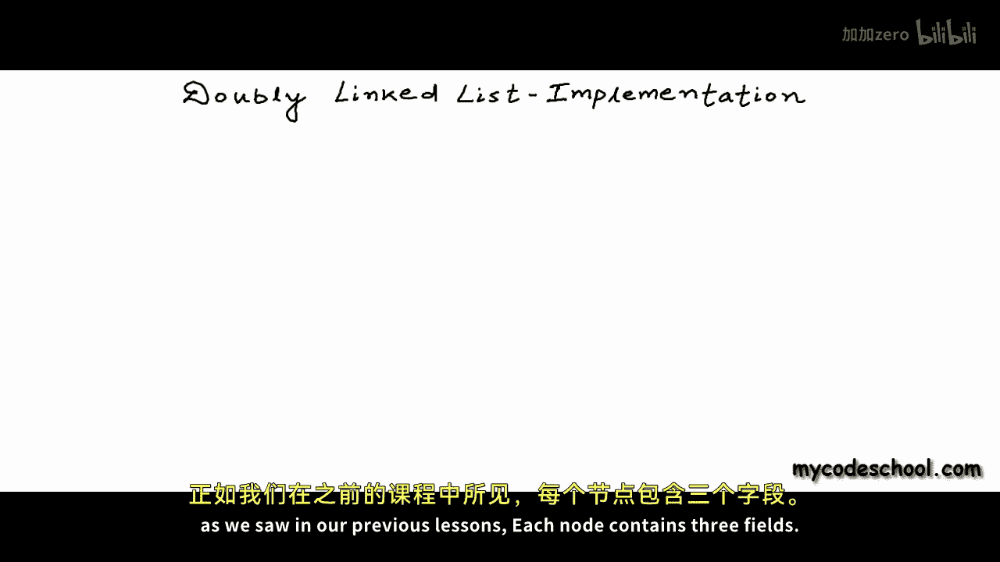


---

### 节点结构定义

在上一节中，我们介绍了双向链表的概念。本节中，我们来看看如何在代码中定义其节点结构。


每个节点包含三个字段：一个用于存储数据，一个用于存储下一个节点的地址，另一个用于存储前一个节点的地址。对于一个存储整数的链表，在C或C++程序中，节点可以这样定义：

```c
struct Node {
    int data;
    struct Node* next;
    struct Node* prev;
};
```

此外，我们还需要一个全局指针变量 `head` 来指向链表的第一个节点。

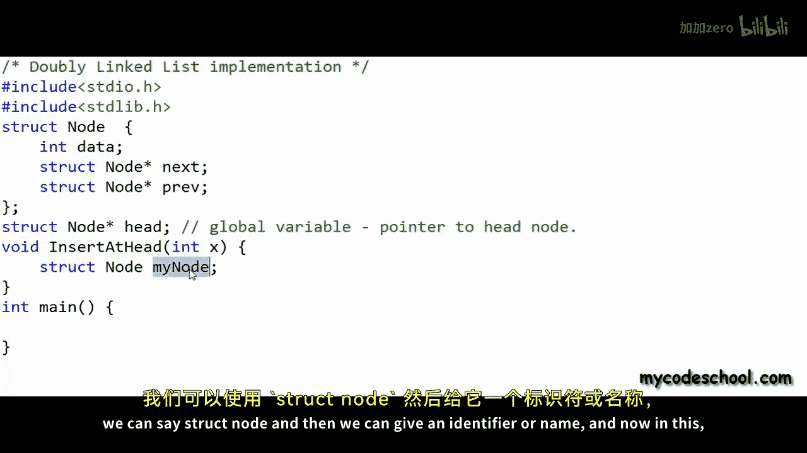

```c
struct Node* head = NULL; // 全局头指针，初始为空
```

全局变量 `head` 在整个程序运行期间都存在于内存中，可以被所有函数访问。这与局部变量不同，局部变量仅在函数调用期间存在。

---

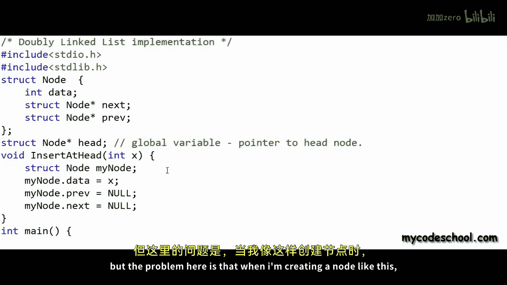

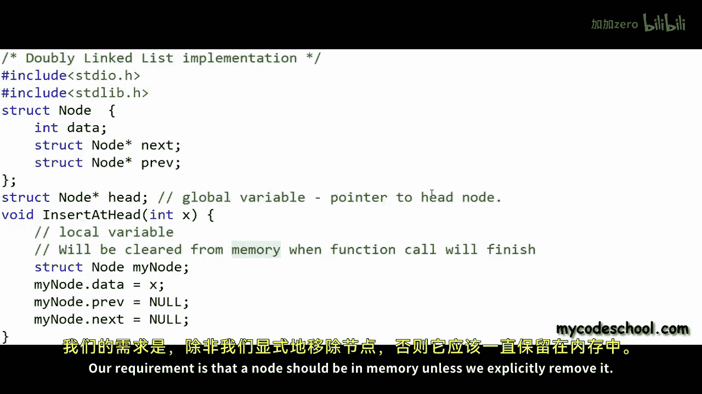

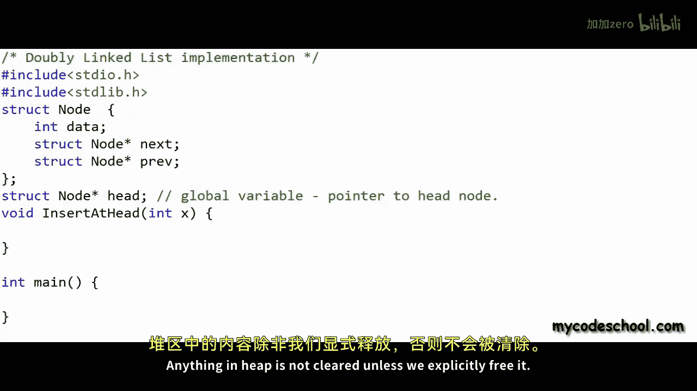

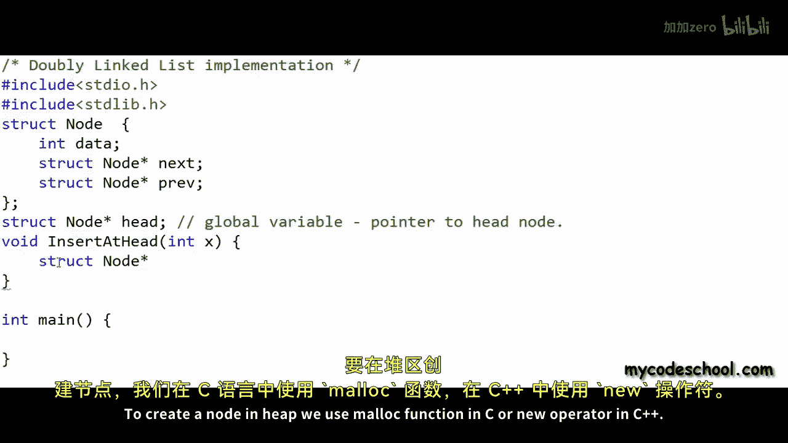

### 创建新节点


在实现插入操作之前，我们需要一个函数来创建新节点。这个函数将接收一个整数值作为参数，在堆内存中分配一个新节点，并初始化其字段。

以下是创建新节点的函数：

```c
struct Node* GetNewNode(int x) {
    struct Node* newNode = (struct Node*)malloc(sizeof(struct Node));
    newNode->data = x;
    newNode->prev = NULL;
    newNode->next = NULL;
    return newNode;
}
```


**关键点**：
*   我们使用 `malloc` 函数在**堆**上分配内存。堆上的内存在程序显式释放前会一直存在。
*   如果我们在函数内部像 `struct Node newNode;` 这样声明节点，它将被创建在**栈**上。当函数调用结束时，栈内存会被自动回收，这不符合我们的需求。
*   函数返回指向新创建节点的指针。


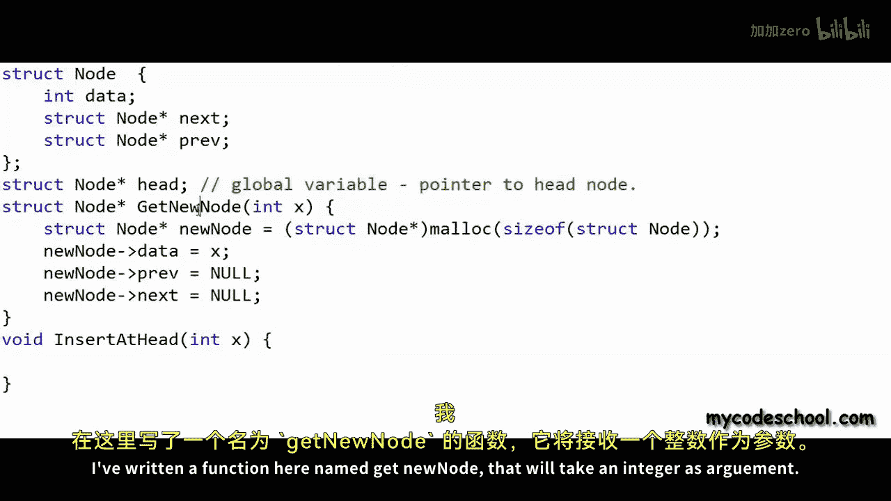

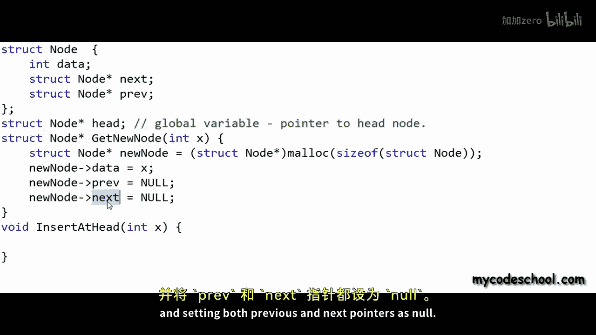

---

### 在链表头部插入节点

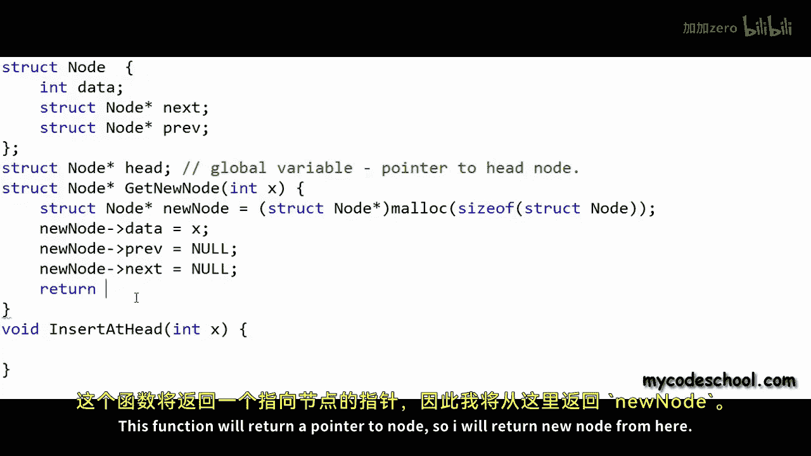

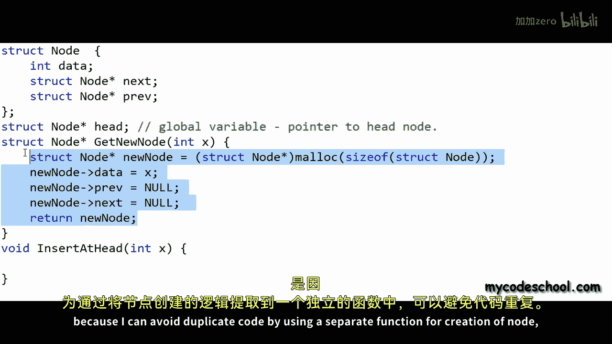

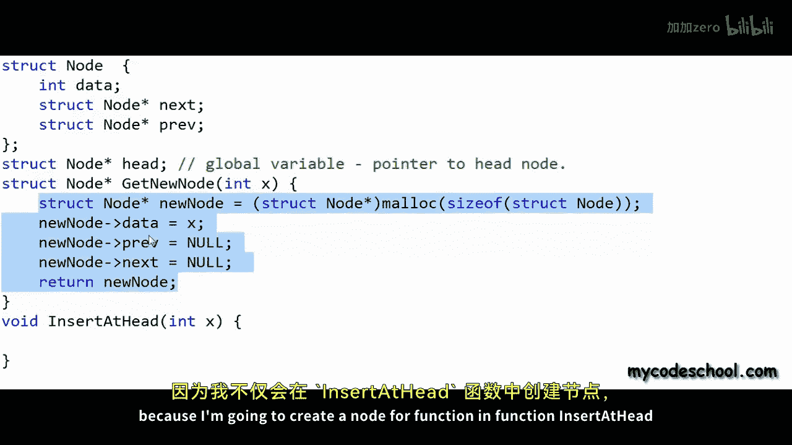


现在，我们来编写在链表头部插入节点的函数。这个函数需要考虑链表是否为空。


```c
void InsertAtHead(int x) {
    struct Node* newNode = GetNewNode(x);
    if(head == NULL) {
        head = newNode;
        return;
    }
    head->prev = newNode;
    newNode->next = head;
    head = newNode;
}
```


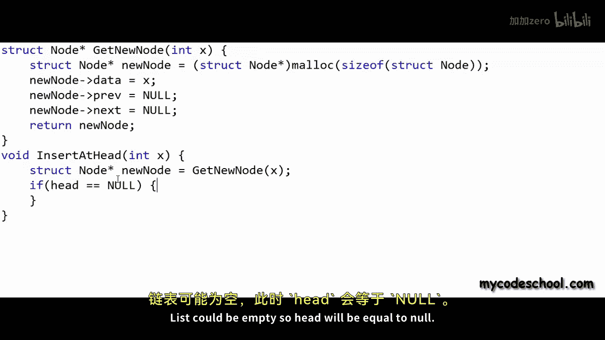

**操作步骤**：
1.  调用 `GetNewNode(x)` 创建一个新节点。
2.  检查链表是否为空（即 `head == NULL`）。
    *   如果为空，直接将 `head` 指向新节点，然后返回。
3.  如果链表不为空：
    *   将当前头节点的 `prev` 指针指向新节点。
    *   将新节点的 `next` 指针指向当前的头节点。
    *   最后，更新 `head` 指针，使其指向新节点，新节点成为新的头节点。

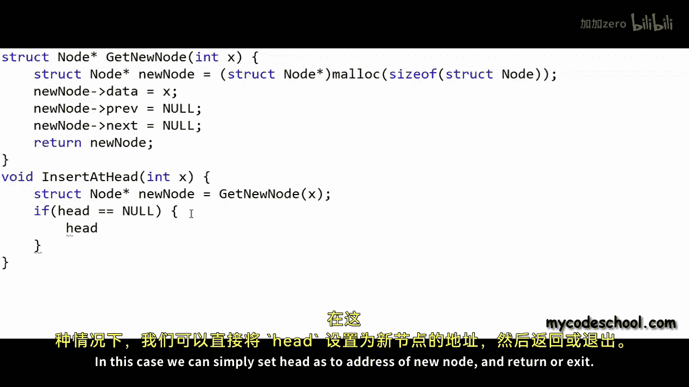


这个过程建立了从新节点到旧头节点、以及从旧头节点回溯到新节点的双向链接。

---

### 遍历链表

为了验证我们的操作，我们需要编写遍历链表的函数。我们将实现两个函数：一个正向打印，一个反向打印。

#### 正向打印

正向打印函数从 `head` 开始，沿着 `next` 指针遍历直到链表末尾。

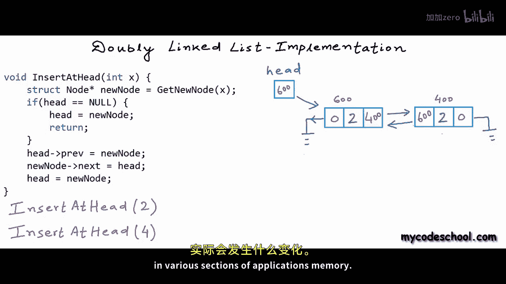

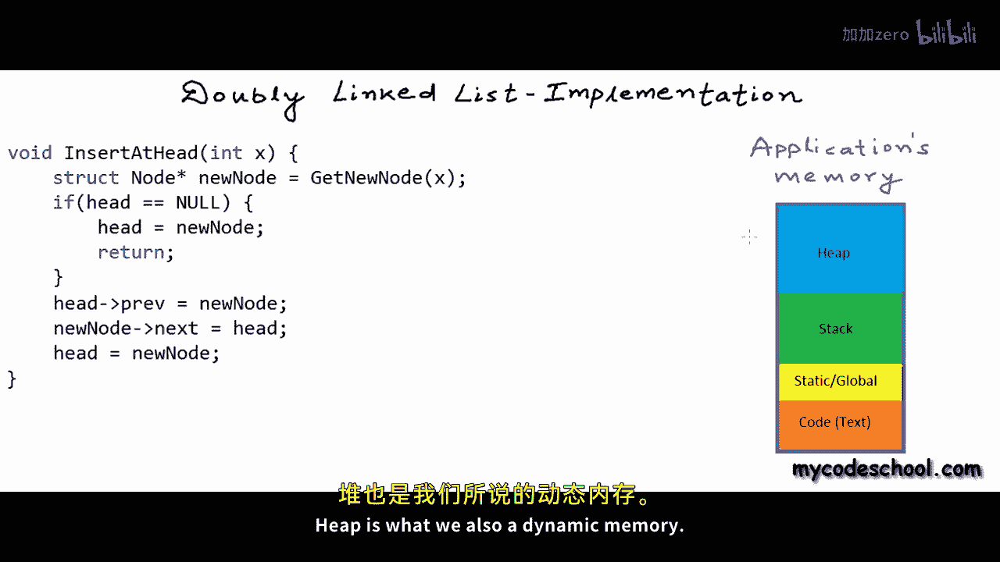

```c
void Print() {
    struct Node* temp = head;
    printf("Forward: ");
    while(temp != NULL) {
        printf("%d ", temp->data);
        temp = temp->next;
    }
    printf("\n");
}
```

#### 反向打印

反向打印函数首先需要遍历到链表的最后一个节点，然后沿着 `prev` 指针反向遍历回第一个节点。这可以验证我们建立的“前驱”指针是否正确。

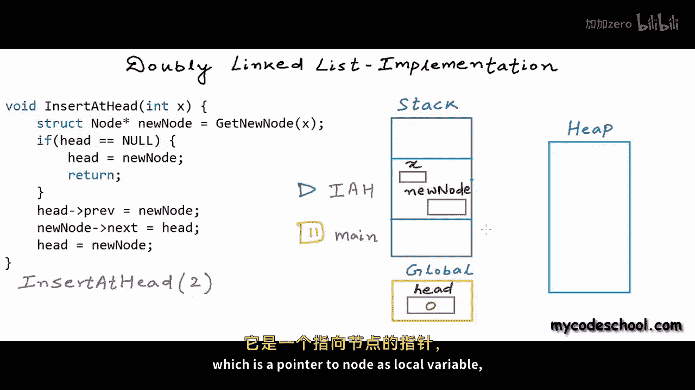

```c
void ReversePrint() {
    struct Node* temp = head;
    if(temp == NULL) return; // 空链表，直接返回

    // 先走到链表末尾
    while(temp->next != NULL) {
        temp = temp->next;
    }

    // 现在temp指向尾节点，开始反向遍历
    printf("Reverse: ");
    while(temp != NULL) {
        printf("%d ", temp->data);
        temp = temp->prev;
    }
    printf("\n");
}
```

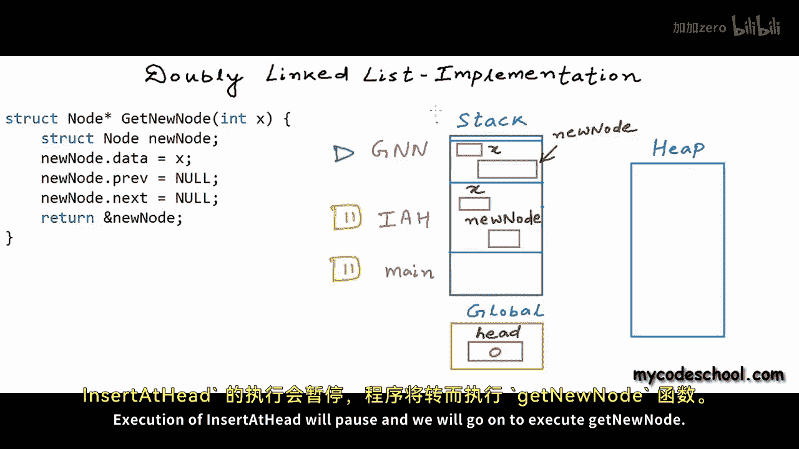

---

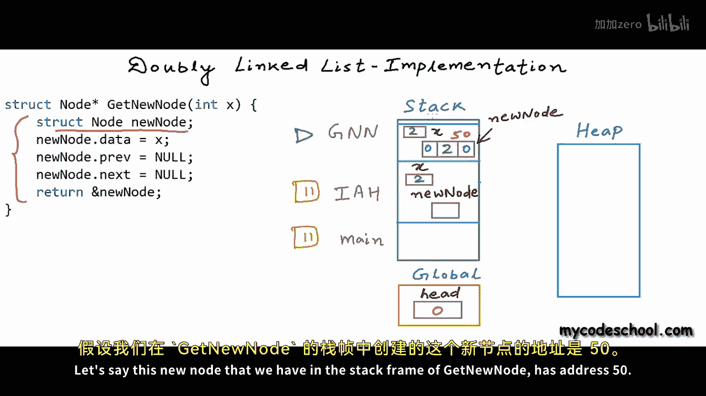

### 测试代码

让我们在 `main` 函数中测试以上实现的功能。


```c
int main() {
    head = NULL; // 开始时链表为空

    InsertAtHead(2);
    Print();
    ReversePrint();

    InsertAtHead(4);
    Print();
    ReversePrint();

    InsertAtHead(6);
    Print();
    ReversePrint();

    return 0;
}
```

运行这段代码，预期的输出应该是：
```
Forward: 2
Reverse: 2
Forward: 4 2
Reverse: 2 4
Forward: 6 4 2
Reverse: 2 4 6
```

---


### 练习：在链表尾部插入节点

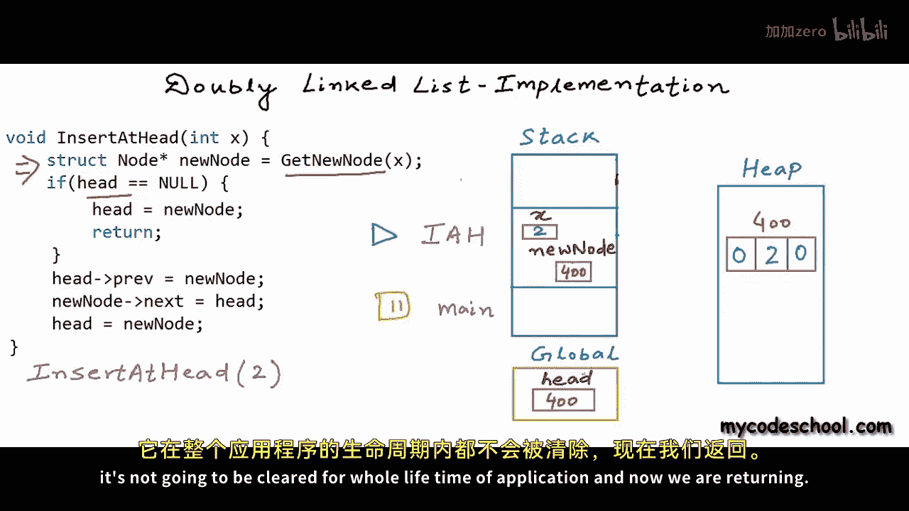

我们已经实现了在头部插入节点。作为练习，请你尝试实现 `InsertAtTail(int x)` 函数，该函数在链表的末尾插入一个新节点。


**提示**：
1.  创建新节点。
2.  如果链表为空，处理方式与 `InsertAtHead` 相同。
3.  如果链表不为空，需要先遍历到当前的尾节点（`next` 为 `NULL` 的节点）。
4.  将当前尾节点的 `next` 指向新节点。
5.  将新节点的 `prev` 指向当前的尾节点。

---

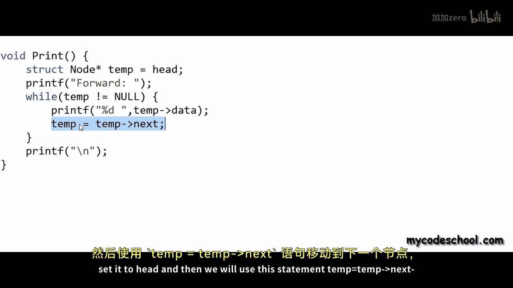

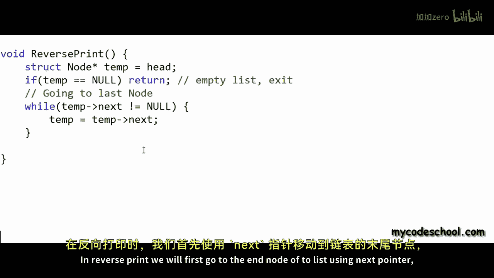

### 总结

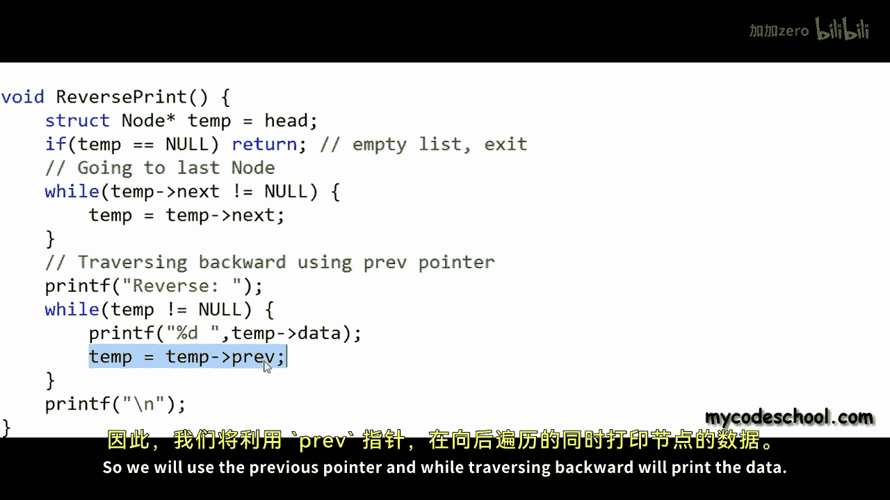


本节课中我们一起学习了双向链表的C语言实现。我们涵盖了以下核心内容：


1.  **节点结构**：使用包含 `data`、`next` 和 `prev` 指针的结构体来定义双向链表节点。
2.  **内存管理**：理解了栈（自动管理）和堆（手动管理）的区别，并使用 `malloc` 在堆上动态创建节点。
3.  **基本操作**：
    *   实现了 `GetNewNode` 函数来创建并初始化新节点。
    *   实现了 `InsertAtHead` 函数，处理了链表为空和不为空两种情况。
    *   实现了 `Print` 和 `ReversePrint` 函数来遍历和验证链表。
4.  **指针操作**：通过操作节点的 `next` 和 `prev` 指针来建立和维护节点间的双向链接。

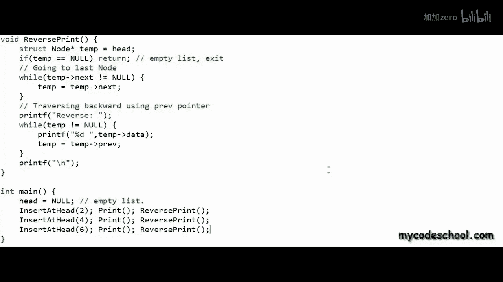

通过本教程，你应该对双向链表的基本原理和代码实现有了清晰的认识。在后续课程中，我们将探讨循环链表以及更多关于链表的趣味问题。