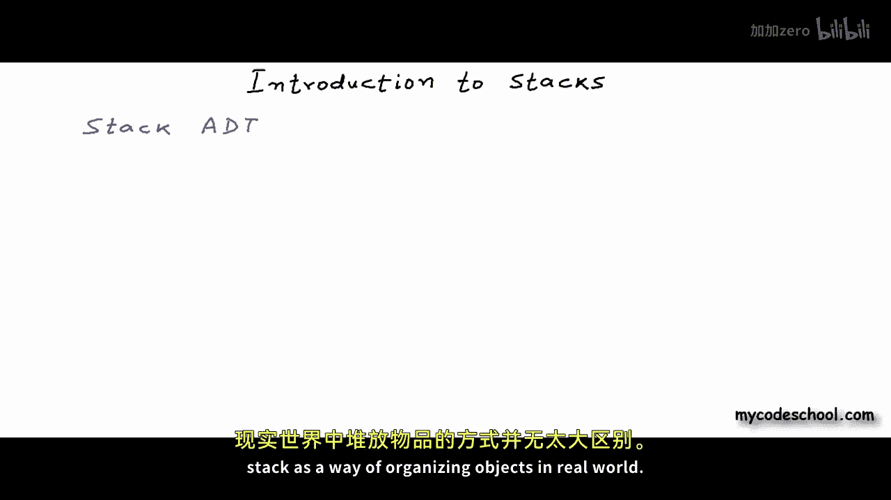
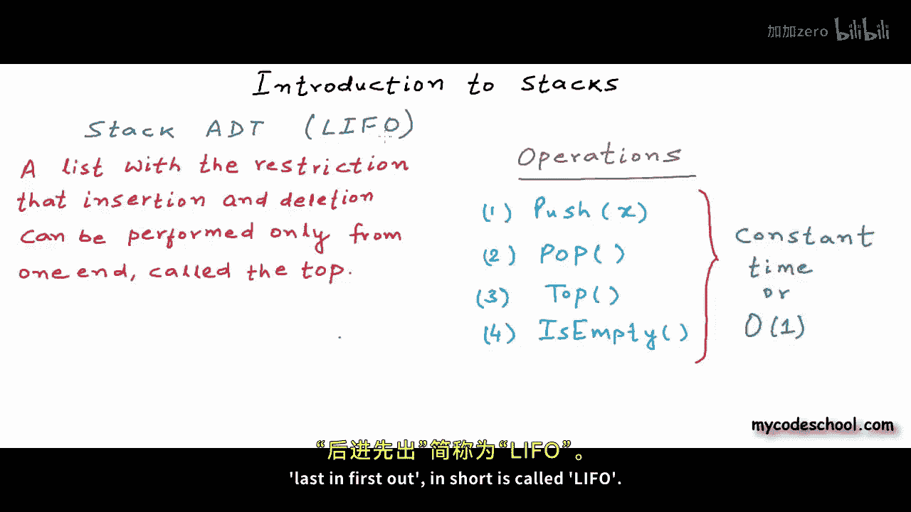
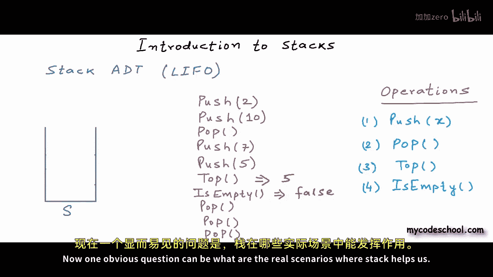
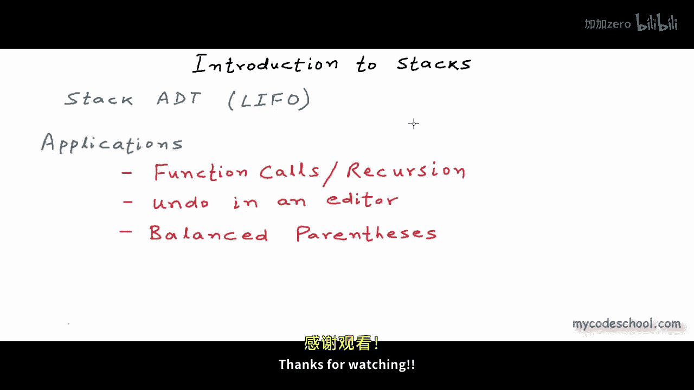

# 014：栈简介 📚

在本节课中，我们将介绍栈数据结构。

## 概述

数据结构是计算机中存储和组织数据的方式。在本系列课程中，我们已经讨论了一些数据结构，例如数组和链表。本节课，我们将讨论栈。我们将栈作为一种抽象数据类型来讨论。当我们把数据结构作为抽象数据类型讨论时，我们只讨论该数据结构可用的特性或操作，而不涉及实现细节。本质上，我们只将数据结构定义为一个数学或逻辑模型。我们将在后续课程中讨论栈的实现。本节课，我们只讨论栈的抽象数据类型，因此我们只关注栈的逻辑视图。

## 栈的现实世界类比

计算机科学中的栈数据结构与现实世界中组织对象的方式没有太大区别。

以下是现实世界中栈的一些例子：
*   第一张图是一叠餐盘。
*   第二张图是一个名为“汉诺塔”的数学谜题，其中有三根柱子，以及多个圆盘。游戏的目标是将一叠圆盘从一根柱子移动到另一根，但有一个限制：不能将较大的圆盘放在较小的圆盘之上。
*   第三张图是一盒网球。

栈本质上是一个具有特定属性的集合：栈中的项目必须从同一端插入或移除，我们称之为栈顶。实际上，这不仅仅是一个属性，而是一个约束或限制。只有栈顶是可访问的，任何项目都必须从栈顶插入或移除。因此，栈也被称为后进先出集合。栈中最近添加的项目必须最先出去。

在第一个例子中，你总是从栈顶拿起餐盘。如果你要把盘子放回栈中，你总是把它放回栈顶。你可以争辩说，我可以从中间抽出一个盘子，而不实际移除顶部的盘子，所以“必须从顶部取出盘子”这个约束并不严格。为了讨论，这没问题。在其他两个例子中，当柱子上有圆盘或只能从一侧打开的盒子里有网球时，你无法从中间取出项目。任何插入或移除都必须从顶部进行。你无法从中间抽出项目。你可以取出一个项目，但为此你必须移除该项目之上的所有项目。

## 栈的抽象数据类型定义

现在，让我们正式将栈定义为抽象数据类型。

栈是一个列表或集合，其限制是插入和删除只能从一端进行，我们称之为栈顶。让我们明确栈抽象数据类型可用的接口或操作。栈有两个基本操作：
*   插入操作称为 **push** 操作。push 操作可以将某个项目 X 插入或推入栈中。
*   第二个操作称为 **pop**。pop 操作从栈中移除最近添加的项目。

push 和 pop 是基本操作。通常还有几个其他操作：
*   一个操作称为 **top**，它简单地返回栈顶的元素。
*   可能还有一个操作来检查栈是否为空。如果栈为空，此操作返回 true，否则返回 false。

因此，push 是在栈顶插入一个元素，pop 是从栈顶移除一个元素。我们一次只能 push 或 pop 一个元素。这里列出的所有操作都可以在常数时间内完成，换句话说，时间复杂度是 O(1)。请记住，最后被推入栈的元素最先被弹出。因此，栈被称为后进先出结构。后进先出简称为 LIFO。

## 栈的逻辑表示与操作示例

从逻辑上讲，栈被表示为一个三面的图形，像一个从一侧打开的容器。这表示一个空栈。让我们将这个栈命名为 S。

假设这个图表示一个整数栈。目前栈是空的。我将执行 push 和 pop 操作来插入和移除栈中的整数。我将首先在这里写下操作，然后展示在逻辑表示中会发生什么。

让我们首先执行一个 push 操作。我想将数字 2 推入栈中。栈目前是空的，所以我们不能弹出任何东西。push 操作后，栈将如下所示。栈中只有一个整数，所以它当然在顶部。

让我们再推入一个整数。这次我想推入数字 10。

现在，假设我们想执行一个 pop 操作。目前顶部的整数是 10。执行 pop 后，它将被从栈中移除。

让我们再做几个 push 操作。我刚刚将 7 和 51 推入了栈中。

在这个阶段，如果我调用 top 操作，它将返回数字 51。is empty 操作将返回 false。

在这个阶段，一个 pop 操作将移除 51。正如你所见，最后进入的元素最先出去。这就是为什么我们称栈为后进先出数据结构。我们可以一直弹出，直到栈变空。

再执行一次 pop，栈将变为空。

## 栈的应用场景

以上就是栈数据结构的基本内容。现在一个显而易见的问题是：栈在哪些实际场景中对我们有帮助？让我们列出栈的一些应用。

栈数据结构用于程序中函数调用的执行。我们在关于动态内存分配和链表的课程中已经多次讨论过这一点。我们也可以说栈用于递归，因为递归也是一系列函数调用，只是所有调用都是对同一个函数的调用。要了解更多关于此应用的信息，你可以查看本视频描述中指向 mycodeschool 关于动态内存分配课程的链接。

栈的另一个应用是，我们可以用它来实现编辑器中的撤销操作。你可以在任何文本编辑器或图像编辑器中执行撤销操作。现在我按下 Ctrl+Z，正如你所见，我写的一些文本正在被清除。你可以使用栈来实现这个功能。

栈还用于许多重要算法中。例如，编译器使用栈数据结构来验证源代码中的括号是否平衡。对于源代码中的每个开大括号或开括号，必须在适当位置有一个闭括号。如果源代码中的括号放置不当，即不平衡，编译器应抛出错误。这个检查可以使用栈来执行。

我们将在接下来的课程中详细讨论其中一些问题，作为入门介绍已经足够。

## 总结

在本节课中，我们一起学习了栈数据结构。我们了解了栈是一种后进先出的抽象数据类型，其核心操作是 push 和 pop。我们还通过现实世界的例子和逻辑图示理解了栈的工作原理，并简要探讨了栈在程序执行、撤销功能和语法检查等场景中的应用。

在下一节课中，我们将讨论栈的实现。本节课到此结束。