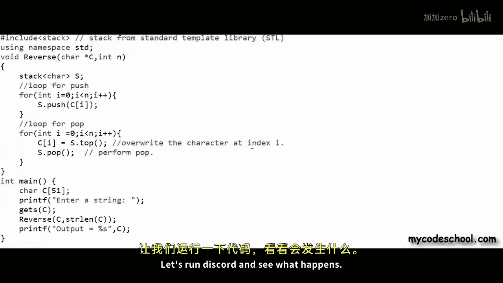
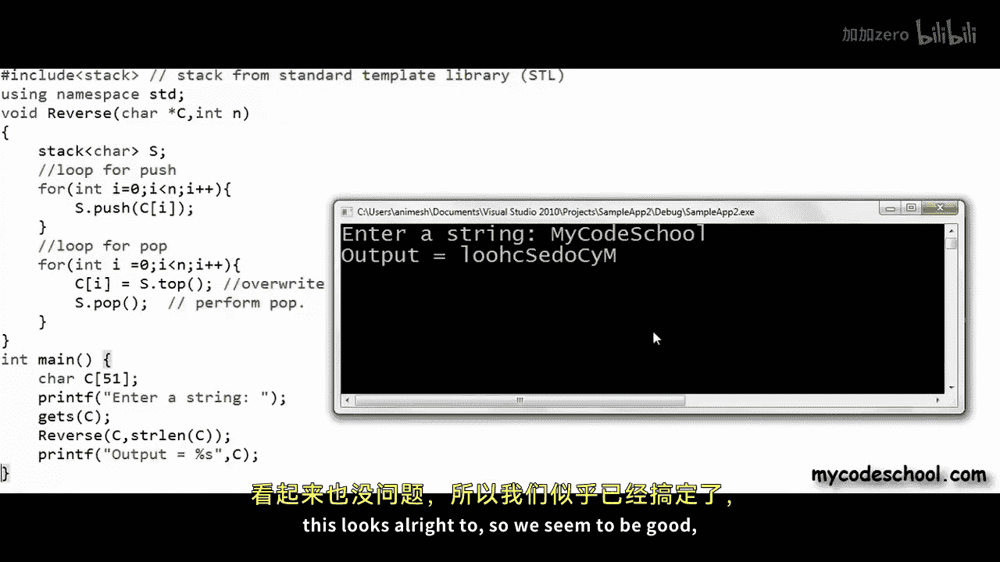
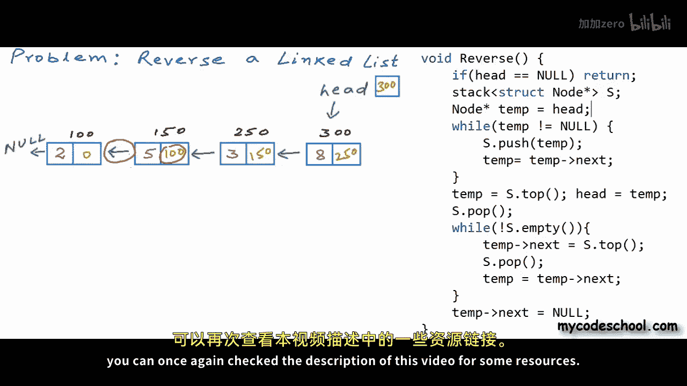

# 017：使用栈反转字符串或链表 📚

在本节课中，我们将学习栈数据结构的一个经典应用场景：反转序列。我们将通过两个具体问题——反转字符串和反转链表——来演示如何使用栈实现这一功能，并分析其效率。

---

## 概述

上一节我们介绍了栈的两种常见实现方式：基于数组和基于链表。作为一名程序员，我们不仅要掌握数据结构的实现，更要了解其应用场景。本节我们将探讨栈的一个简单而实用的用例：利用栈的“后进先出”特性来反转一个列表或集合。

我们将解决两个问题：字符串反转和链表反转，并均使用栈来实现。

---

## 字符串反转 🔤

首先，我们来讨论字符串反转问题。假设我们有一个以字符数组形式存储的字符串，例如 `"hello"`。在C语言风格中，字符串以空字符 `\0` 结尾。反转意味着重新排列数组中的字符顺序，如下图所示，空字符仅用于标记字符串结束，不参与反转。



有多种高效方法可以反转字符串。我们先看看如何使用栈来解决，然后再评估其效率。

### 使用栈的思路

我们可以创建一个字符栈。以下是逻辑步骤：

1.  从左到右遍历字符串中的每个字符。
2.  将每个字符依次压入栈中。
3.  遍历完成后，再次从字符串起始位置开始。
4.  将栈顶字符弹出，并写入字符串的当前位置。
5.  重复此过程，直到栈为空。

由于栈的“后进先出”特性，最后压入的字符会最先弹出，从而实现了反转。

### 代码实现

以下是使用C++标准模板库中的栈来实现的代码：

```cpp
#include <iostream>
#include <cstring>
#include <stack>
using namespace std;

void reverse(char *C, int n) {
    stack<char> S;
    // 遍历字符串，将字符压入栈
    for(int i = 0; i < n; i++) {
        S.push(C[i]);
    }
    // 遍历字符串，用栈顶字符覆盖原字符
    for(int i = 0; i < n; i++) {
        C[i] = S.top(); // 获取栈顶元素
        S.pop();        // 弹出栈顶元素
    }
}

int main() {
    char C[51];
    cout << "Enter a string: ";
    cin >> C;
    reverse(C, strlen(C));
    cout << "Output = " << C << endl;
}
```


运行示例：
输入 `"hello"`，输出 `"olleh"`。
输入 `"mycodeschool"`，输出 `"loohcse docym"`。




### 复杂度分析

*   **时间复杂度**：两个循环分别执行n次，每个栈操作（`push`, `top`, `pop`）是常数时间。因此，总时间复杂度为 **O(n)**。
*   **空间复杂度**：我们使用了一个额外的栈来存储所有n个字符，因此空间复杂度也为 **O(n)**。


### 更优的解法

存在不使用额外空间的反转算法，例如使用双指针法：

```cpp
void reverseInPlace(char *C, int n) {
    int i = 0;
    int j = n - 1;
    while(i < j) {
        swap(C[i], C[j]); // 交换字符
        i++;
        j--;
    }
}
```

该算法的空间复杂度为 **O(1)**，时间复杂度仍为 **O(n)**。在空间效率上，它优于栈方法。

---

## 链表反转 🔗

现在，我们来看一个更复杂的问题：反转链表。链表由节点组成，每个节点包含数据域和指向下一个节点的指针域。链表的身份由其头节点的地址（通常存储在 `head` 变量中）标识。



与数组不同，链表节点在内存中非连续存储，无法通过简单计算直接访问任意元素。我们之前学习过两种反转链表的方法：迭代法和递归法。

*   **迭代法**：时间复杂度 O(n)，空间复杂度 O(1)。
*   **递归法**：时间复杂度 O(n)，但使用了函数调用栈（隐式栈），空间复杂度 O(n)。

接下来，我们将看到如何使用**显式栈**来直观地解决这个问题。

### 使用栈的思路

1.  遍历链表，使用一个临时指针。
2.  将每个节点的地址（指针）依次压入栈中。
3.  遍历完成后，开始弹出栈顶元素（即原链表的尾节点地址）。
4.  将弹出的节点作为新链表的头节点，并依次建立反向链接。

### 代码实现

假设链表节点定义和头指针 `head` 如下：

```cpp
struct Node {
    int data;
    Node* next;
};

Node* head; // 全局头指针
```

反转函数实现如下：

```cpp
#include <stack>
using namespace std;

void reverseLinkedList() {
    if(head == nullptr) return;
    
    stack<Node*> S;
    Node* temp = head;
    
    // 遍历链表，将节点指针压入栈
    while(temp != nullptr) {
        S.push(temp);
        temp = temp->next;
    }
    
    // 设置新的头节点（原尾节点）
    head = S.top();
    S.pop();
    temp = head;
    
    // 弹出栈中元素，构建反向链接
    while(!S.empty()) {
        temp->next = S.top(); // 建立链接
        S.pop();              // 弹出
        temp = temp->next;    // 移动到下一个节点
    }
    // 设置新链表的尾节点next为nullptr
    temp->next = nullptr;
}
```

### 过程解析

1.  初始链表：`1 -> 2 -> 3 -> 4`
2.  压栈后：栈顶为节点4，栈底为节点1。
3.  弹出栈顶（节点4）作为新头。
4.  循环弹出并链接：`4 -> 3 -> 2 -> 1`。
5.  最后将节点1的 `next` 设为 `nullptr`。

使用栈使得反转链表的逻辑变得非常清晰和直观，尤其适合初学者理解反转过程。虽然空间复杂度为 O(n)，但在某些场景下，代码的清晰度可能比极致的空间优化更重要。

---

## 总结

本节课我们一起学习了栈的两个经典应用：

1.  **反转字符串**：通过将字符压栈再弹出，实现了字符串的反转。我们分析了其 O(n) 的时间和空间复杂度，并对比了更优的双指针原地反转法。
2.  **反转链表**：通过将节点指针压栈，再依次弹出构建新链表，直观地实现了链表反转。这种方法逻辑清晰，是理解链表反转过程的优秀范例。


栈的“后进先出”特性使其成为处理“反转”或“逆序”类问题的天然工具。理解这些基础应用，将帮助我们未来更灵活地运用栈去解决更复杂的算法问题。