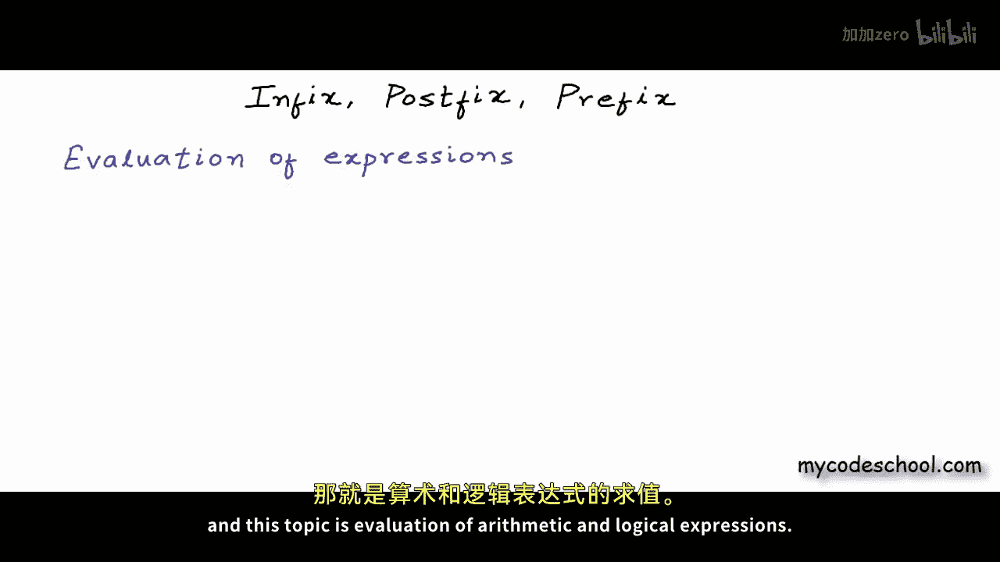
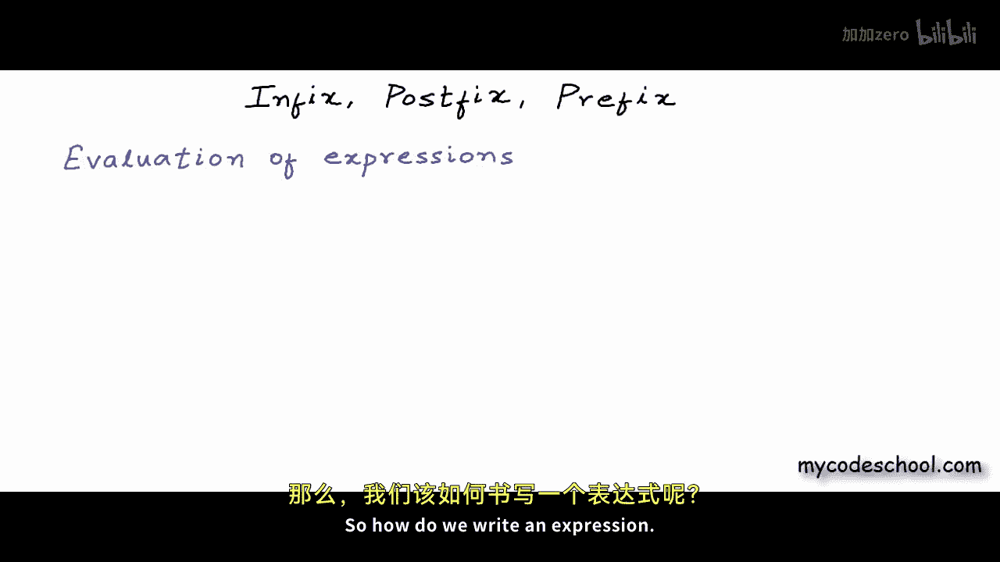

# 019：中缀、前缀与后缀表达式

在本节课中，我们将学习计算机科学中一个重要且有趣的主题——算术与逻辑表达式的求值。这是栈数据结构的一个典型应用。我们将探讨表达式的不同书写形式，以及如何利用栈来高效地处理它们。

表达式可以包含常量、变量以及运算符或括号等符号。我们通常书写表达式的方式被称为**中缀表示法**，即运算符位于两个操作数之间，例如 `A + B`。

然而，对于计算机而言，中缀表达式并不总是最方便处理的形式。因此，我们引入了**前缀**和**后缀**表示法。在前缀表示法中，运算符位于操作数之前，例如 `+ A B`。在后缀表示法中，运算符位于操作数之后，例如 `A B +`。这两种表示法完全不需要括号来定义运算顺序，因此也被称为“无括号表示法”。

---

## 中缀表示法

上一节我们提到了中缀表示法是我们最熟悉的书写方式。在这种表示法中，运算符的优先级和结合性决定了运算的顺序。例如，在表达式 `A + B * C` 中，乘法 `*` 的优先级高于加法 `+`，因此会先计算 `B * C`，再与 `A` 相加。

为了改变默认的运算顺序，我们需要使用括号。例如，`(A + B) * C` 会强制先计算加法。

中缀表示法对人类阅读友好，但对计算机直接求值来说较为复杂，因为它需要处理运算符优先级和括号嵌套的问题。

---

## 前缀表示法

现在，让我们来看看前缀表示法。前缀表示法，也称为波兰表示法，将运算符写在所有操作数之前。

以下是一些中缀表达式及其对应的前缀表达式示例：

*   `A + B` 转换为 `+ A B`
*   `A + B * C` 转换为 `+ A * B C` （注意：乘法优先级高，所以 `* B C` 作为一个整体成为 `+` 的第二个操作数）
*   `(A + B) * C` 转换为 `* + A B C` （括号强制先算加法，所以 `+ A B` 作为一个整体成为 `*` 的第一个操作数）

从这些例子可以看出，前缀表达式完全消除了对括号的需求。运算顺序由运算符和操作数的位置唯一确定。

---

## 后缀表示法

接下来，我们探讨后缀表示法。后缀表示法，也称为逆波兰表示法，将运算符写在所有操作数之后。

以下是一些中缀表达式及其对应的后缀表达式示例：

*   `A + B` 转换为 `A B +`
*   `A + B * C` 转换为 `A B C * +`
*   `(A + B) * C` 转换为 `A B + C *`

与前缀表示法类似，后缀表达式也无需括号来定义优先级。计算机可以非常高效地使用栈数据结构对后缀表达式进行求值。

---

## 表达式求值与栈的应用

我们已经了解了三种表达式表示法。本节中，我们来看看栈如何应用于后缀表达式的求值。


求值算法非常直观：
1.  从左到右扫描表达式。
2.  如果遇到操作数（数字或变量），将其压入栈中。
3.  如果遇到运算符，则从栈中弹出所需数量的操作数（对于二元运算符是两个），执行运算，然后将结果压回栈中。
4.  扫描结束后，栈顶元素就是表达式的最终结果。

例如，求值后缀表达式 `A B C * +` （对应中缀 `A + B * C`）：
*   扫描到 `A`, `B`, `C`，依次压入栈。
*   扫描到 `*`，弹出 `C` 和 `B`，计算 `B * C`，将结果 `R1` 压入栈。
*   扫描到 `+`，弹出 `R1` 和 `A`，计算 `A + R1`，将最终结果压入栈。



这个过程可以用以下伪代码描述：
```pseudocode
for each token in postfix_expression:
    if token is an operand:
        push(token onto stack)
    else if token is an operator:
        operand2 = pop(stack)
        operand1 = pop(stack)
        result = perform operation(token, operand1, operand2)
        push(result onto stack)
final_result = pop(stack)
```

---



## 中缀到后缀的转换

既然后缀表达式易于求值，一个关键问题是如何将我们熟悉的中缀表达式转换为后缀表达式。这同样可以借助栈来完成。


转换算法如下：
1.  初始化一个空栈用于存放运算符，初始化一个空列表用于输出后缀表达式。
2.  从左到右扫描中缀表达式。
3.  如果遇到操作数，直接添加到输出列表。
4.  如果遇到左括号 `(`，将其压入栈。
5.  如果遇到右括号 `)`，则不断从栈顶弹出运算符并添加到输出列表，直到遇到左括号为止（左括号弹出但不输出）。
6.  如果遇到运算符 `op1`：
    *   只要栈非空且栈顶运算符的优先级大于或等于 `op1`，且栈顶不是左括号，就将其弹出并添加到输出列表。
    *   然后将 `op1` 压入栈。
7.  扫描结束后，将栈中所有剩余的运算符依次弹出并添加到输出列表。

以下是一个转换示例，将中缀表达式 `A + B * C` 转换为后缀表达式：
*   输出 `A`。
*   `+` 入栈。
*   输出 `B`。
*   `*` 优先级高于栈顶的 `+`，所以 `*` 入栈。
*   输出 `C`。
*   扫描结束，弹出栈中的 `*` 和 `+` 到输出。
*   最终后缀表达式为 `A B C * +`。


---

## 总结

本节课中，我们一起学习了表达式的三种重要表示法：**中缀**、**前缀**和**后缀**。我们了解到，虽然中缀表示法便于人类阅读，但前缀和后缀（尤其是后缀）表示法因其无括号的特性，更便于计算机处理。我们重点探讨了如何使用**栈**这一数据结构来高效地**将中缀表达式转换为后缀表达式**，以及如何对**后缀表达式进行求值**。掌握这些概念是理解编译器、计算器等工作原理的基础。