# 020：使用栈求值前缀与后缀表达式 📚

在本节课中，我们将学习如何使用栈（Stack）这种数据结构来求值前缀表达式（Prefix）和后缀表达式（Postfix）。我们将从后缀表达式开始，因为它更易于理解和实现，然后再讨论前缀表达式的求值。

## 概述

上一节我们介绍了前缀和后缀表达式的概念。本节中，我们将具体探讨如何对这两种表达式进行求值。核心思想是利用栈的“后进先出”（LIFO）特性，高效地处理运算符和操作数。

## 后缀表达式求值


后缀表达式，也称为逆波兰表示法，其特点是运算符位于操作数之后。例如，中缀表达式 `(A * B) + (C * D) - E` 的后缀形式为 `A B * C D * + E -`。

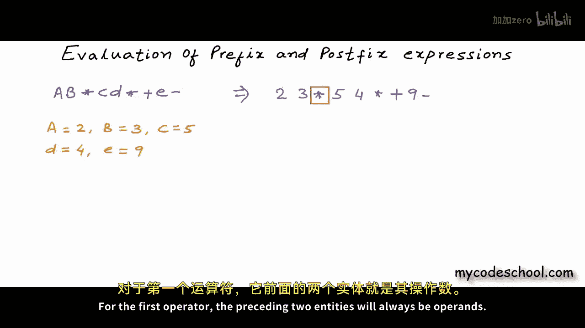

### 手动求值过程

以下是手动求值后缀表达式的步骤：


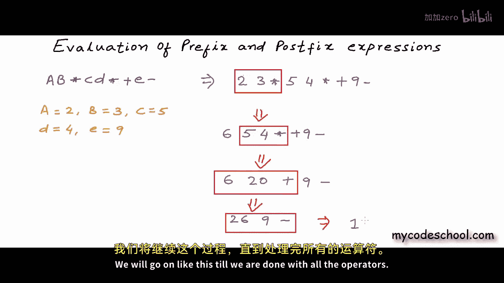

1.  从左到右扫描表达式。
2.  找到第一个出现的运算符。
3.  该运算符之前的两个实体必定是其操作数。
4.  对这两个操作数应用该运算符，得到一个结果。
5.  用这个结果替换掉表达式中的“操作数1 操作数2 运算符”序列。
6.  重复步骤1-5，直到表达式中没有运算符为止。


例如，对于表达式 `2 3 * 5 4 * + 9 -` 和变量值 `A=2, B=3, C=5, D=4, E=9`，求值过程如下：

```
初始: 2 3 * 5 4 * + 9 -
步骤1: 计算 2 * 3 = 6 -> 6 5 4 * + 9 -
步骤2: 计算 5 * 4 = 20 -> 6 20 + 9 -
步骤3: 计算 6 + 20 = 26 -> 26 9 -
步骤4: 计算 26 - 9 = 17 -> 17
最终结果: 17
```

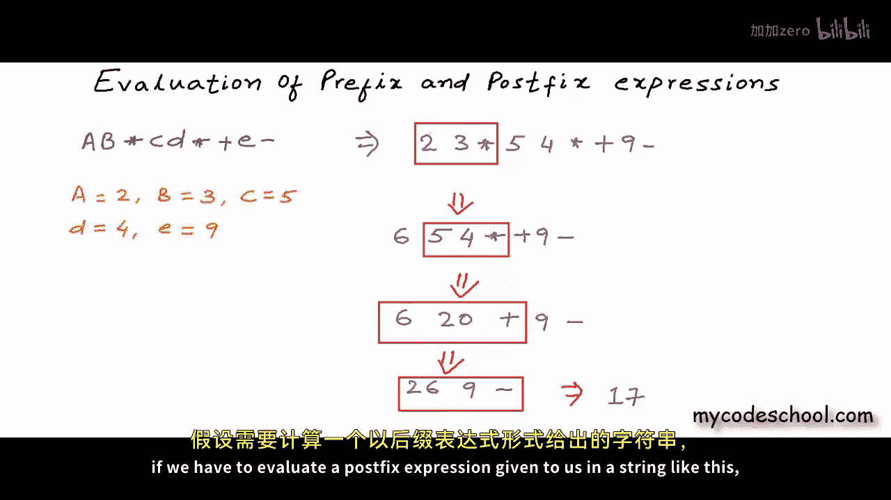

### 使用栈的算法

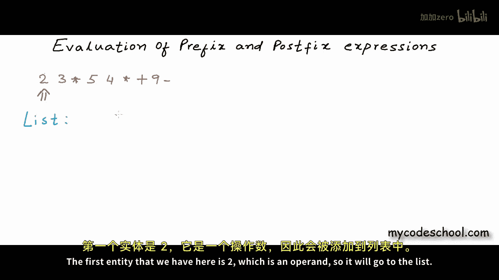

我们可以使用栈来高效地实现上述过程。算法伪代码如下：

```
函数 evaluatePostfix(表达式字符串 exp):
    创建栈 stack

    对于 i 从 0 到 exp.length - 1:
        当前字符 token = exp[i]

        如果 token 是操作数:
            将 token 压入栈 stack
        否则如果 token 是运算符:
            // 弹出栈顶两个元素作为操作数
            操作数2 = stack.pop()
            操作数1 = stack.pop()
            // 执行运算
            结果 = 执行运算(操作数1, token, 操作数2)
            // 将结果压回栈中
            stack.push(结果)

    // 表达式扫描完毕，栈顶元素即为最终结果
    返回 stack.pop()
```

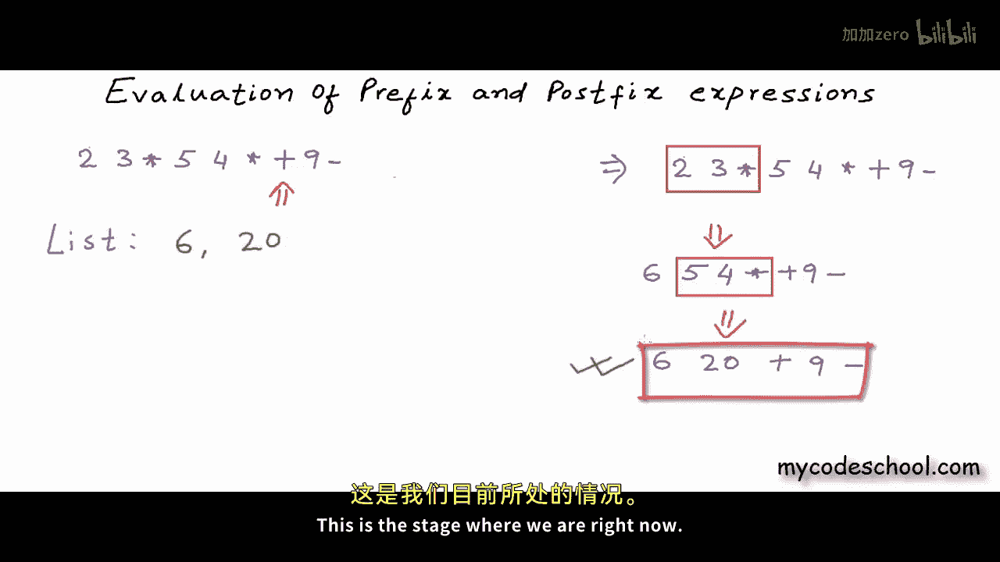

**核心概念**：栈的LIFO特性确保了运算符总是作用于最近遇到的两个操作数。

使用栈对同一个表达式 `2 3 * 5 4 * + 9 -` 的求值流程如下：

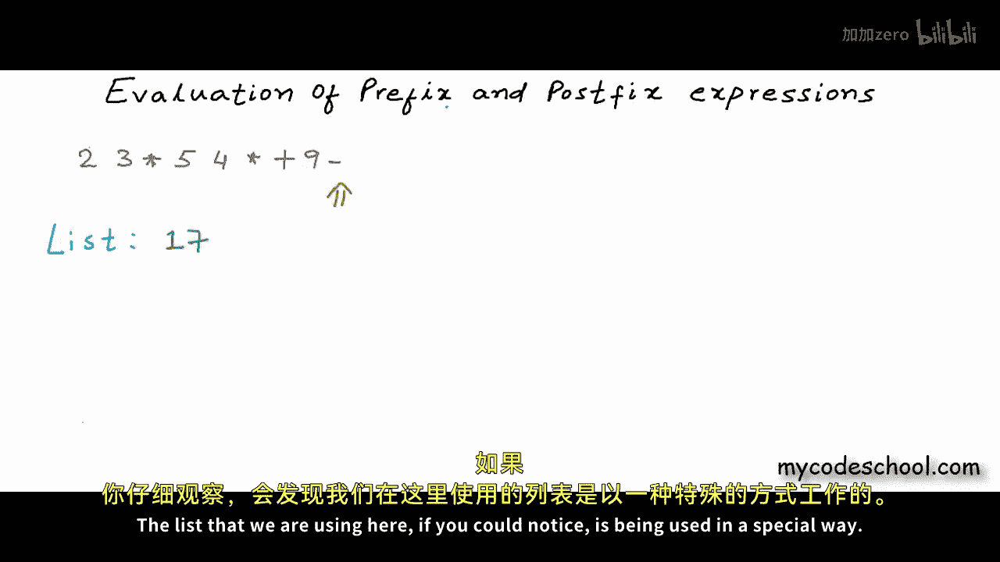

```
扫描 ‘2’: 栈 -> [2]
扫描 ‘3’: 栈 -> [2, 3]
扫描 ‘*’: 弹出 3 和 2，计算 2 * 3 = 6，压入 6。栈 -> [6]
扫描 ‘5’: 栈 -> [6, 5]
扫描 ‘4’: 栈 -> [6, 5, 4]
扫描 ‘*’: 弹出 4 和 5，计算 5 * 4 = 20，压入 20。栈 -> [6, 20]
扫描 ‘+’: 弹出 20 和 6，计算 6 + 20 = 26，压入 26。栈 -> [26]
扫描 ‘9’: 栈 -> [26, 9]
扫描 ‘-’: 弹出 9 和 26，计算 26 - 9 = 17，压入 17。栈 -> [17]
返回栈顶元素 17。
```

## 前缀表达式求值

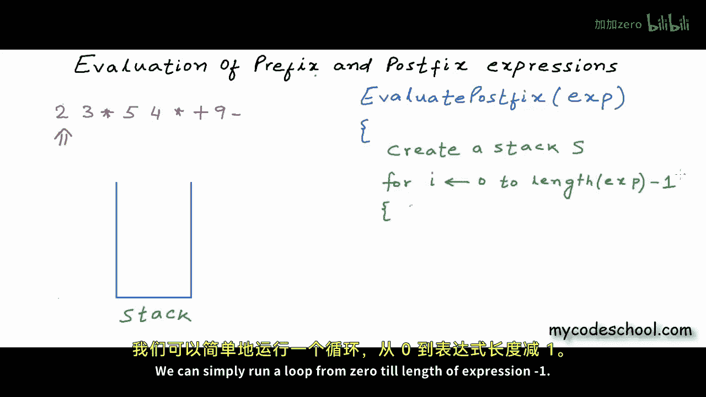

前缀表达式，也称为波兰表示法，其特点是运算符位于操作数之前。例如，中缀表达式 `(A * B) + (C * D) - E` 的前缀形式为 `- + * A B * C D E`。

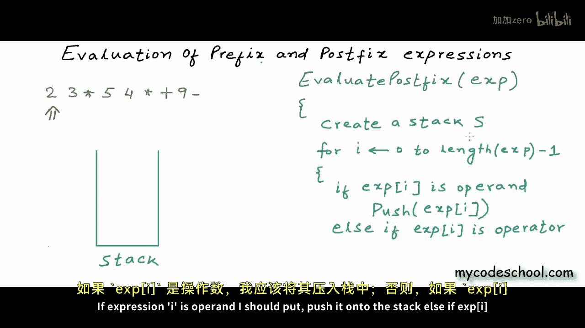

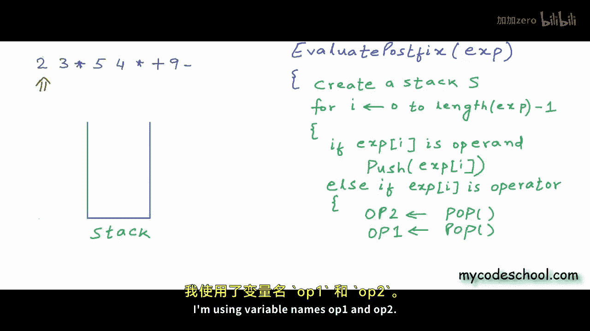


### 使用栈的算法


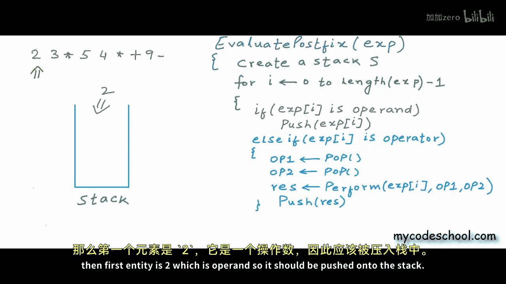

前缀表达式的求值算法与后缀类似，但扫描方向相反。

1.  从右到左扫描表达式。
2.  如果遇到操作数，将其压入栈。
3.  如果遇到运算符，则从栈中弹出两个元素作为操作数。**注意**：第一个弹出的元素是运算符的**第一个**操作数，第二个弹出的是**第二个**操作数（这与后缀求值顺序相反）。
4.  对这两个操作数应用运算符，并将结果压回栈中。
5.  重复步骤1-4，直到扫描完整个表达式。
6.  栈中最后剩下的元素就是表达式的结果。

算法伪代码如下：

```
函数 evaluatePrefix(表达式字符串 exp):
    创建栈 stack

    对于 i 从 exp.length - 1 到 0:
        当前字符 token = exp[i]

        如果 token 是操作数:
            将 token 压入栈 stack
        否则如果 token 是运算符:
            // 弹出栈顶两个元素作为操作数
            操作数1 = stack.pop() // 注意顺序
            操作数2 = stack.pop()
            // 执行运算
            结果 = 执行运算(操作数1, token, 操作数2)
            // 将结果压回栈中
            stack.push(结果)

    // 表达式扫描完毕，栈顶元素即为最终结果
    返回 stack.pop()
```


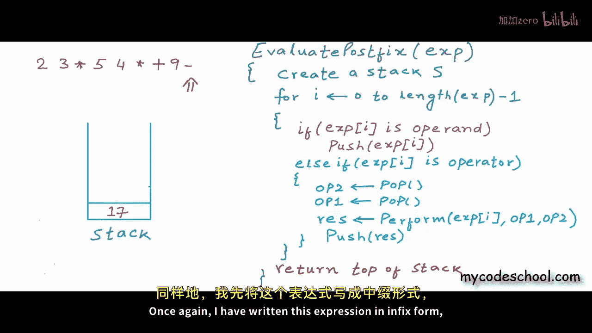

例如，对前缀表达式 `- + * 2 3 * 5 4 9` 进行求值：

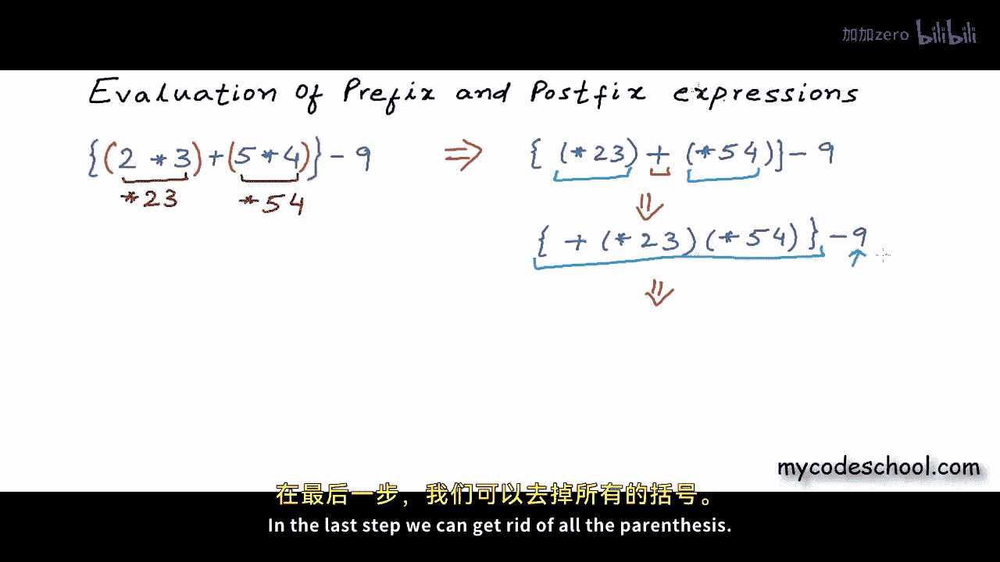


```
从右向左扫描:
扫描 ‘9’: 栈 -> [9]
扫描 ‘4’: 栈 -> [9, 4]
扫描 ‘5’: 栈 -> [9, 4, 5]
扫描 ‘*’: 弹出 5 和 4，计算 5 * 4 = 20，压入 20。栈 -> [9, 20]
扫描 ‘3’: 栈 -> [9, 20, 3]
扫描 ‘2’: 栈 -> [9, 20, 3, 2]
扫描 ‘*’: 弹出 2 和 3，计算 2 * 3 = 6，压入 6。栈 -> [9, 20, 6]
扫描 ‘+’: 弹出 6 和 20，计算 20 + 6 = 26，压入 26。栈 -> [9, 26]
扫描 ‘-’: 弹出 26 和 9，计算 26 - 9 = 17，压入 17。栈 -> [17]
返回栈顶元素 17。
```

## 总结

本节课中，我们一起学习了如何使用栈来求值前缀和后缀表达式：


*   **后缀表达式求值**：从左到右扫描，遇到操作数则入栈，遇到运算符则弹出栈顶两个操作数进行计算，并将结果入栈。
*   **前缀表达式求值**：从右到左扫描，遇到操作数则入栈，遇到运算符则弹出栈顶两个操作数进行计算（注意操作数顺序），并将结果入栈。


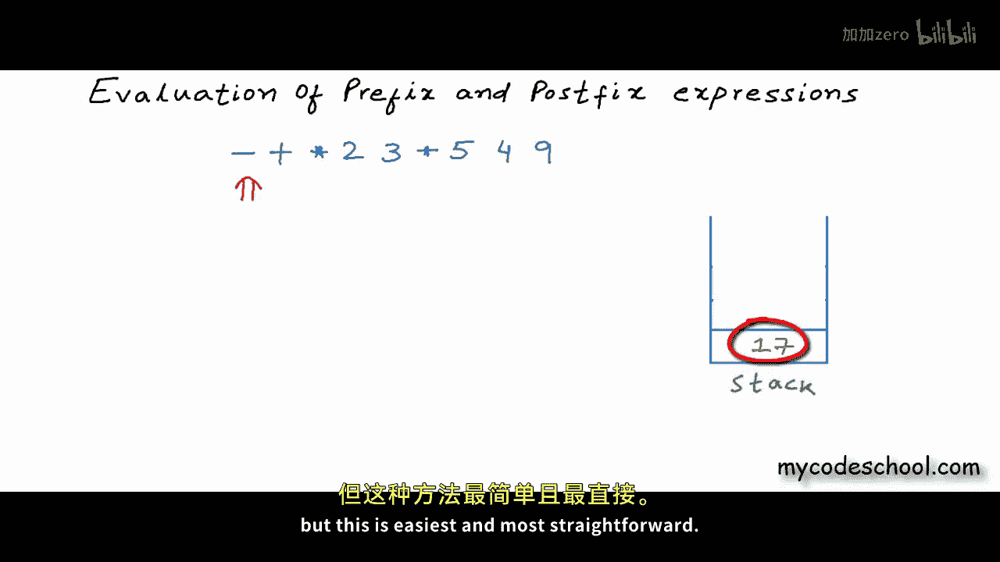


这两种算法的核心都是利用栈来临时存储中间结果，从而只需一次扫描即可完成求值，时间复杂度为 **O(n)**，其中 n 是表达式的长度。在后续课程中，我们将探讨如何将常见的中缀表达式高效地转换为前缀或后缀形式。