# 023：队列的数组实现 🧑‍💻

在本节课中，我们将要学习如何使用数组来实现队列数据结构。上一节我们介绍了队列作为一种抽象数据类型（ADT），本节中我们来看看如何用具体的代码来实现它。


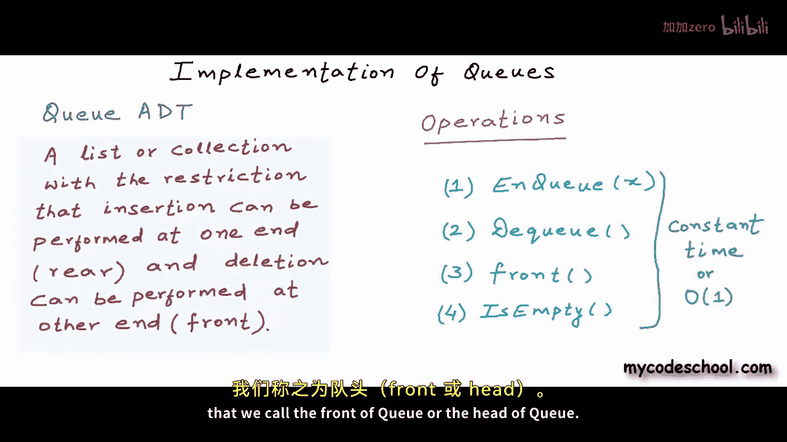

## 概述 📋

队列是一种特殊的列表，它遵循“先进先出”（FIFO）的原则。这意味着元素的插入（入队）只能在一端（称为队尾）进行，而元素的删除（出队）只能在另一端（称为队头）进行。我们将讨论如何用数组来实现队列，并处理一些关键的边界情况。

## 队列的抽象定义

队列作为抽象数据类型，我们定义了以下四个核心操作：
*   **Enqueue(x)**：在队尾插入元素 `x`。
*   **Dequeue()**：从队头移除一个元素。
*   **Front()**：返回队头的元素（不移除）。
*   **IsEmpty()**：检查队列是否为空。

所有这些操作的时间复杂度都必须是 **O(1)**，即执行时间不依赖于队列中元素的数量。

## 数组实现的初步构想

我们可以使用一个固定大小的数组来存储队列元素。需要两个变量来追踪队列的位置：
*   **`front`**：指向队列的第一个元素（队头）。
*   **`rear`**：指向队列的最后一个元素（队尾）。

初始时，队列为空，我们将 `front` 和 `rear` 都设置为 `-1`。

以下是入队（Enqueue）和出队（Dequeue）的基本逻辑：
*   **入队**：将 `rear` 向后移动一位，然后在新的 `rear` 位置放入新元素。
*   **出队**：将 `front` 向后移动一位，原 `front` 位置的元素即被“移除”。


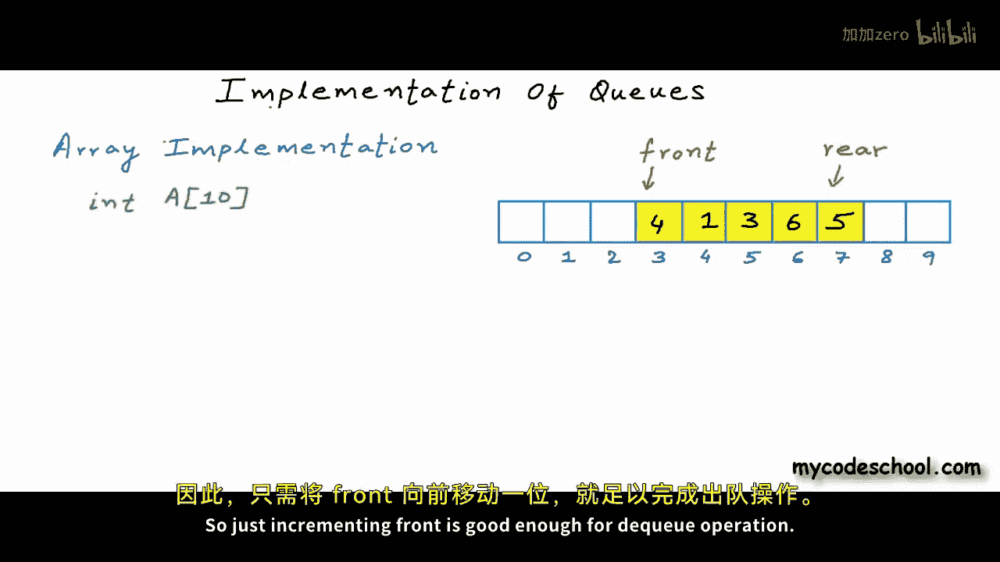

## 基本操作的伪代码

以下是队列基本操作的初步伪代码实现。

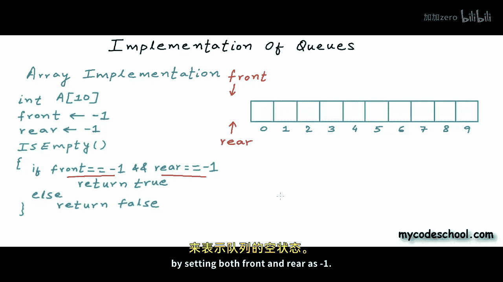

### 检查队列是否为空


如果 `front` 和 `rear` 都等于 `-1`，则队列为空。


```pseudocode
function IsEmpty()
    if front == -1 AND rear == -1
        return true
    else
        return false
```

### 入队操作 (Enqueue)

入队操作需要考虑队列是否已满以及是否为空等边界情况。

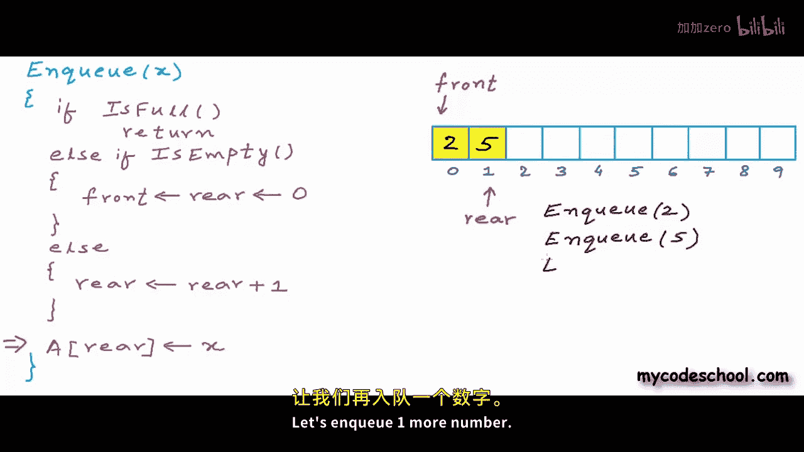

```pseudocode
function Enqueue(x)
    // 检查队列是否已满（简单情况，rear 是否在数组末尾）
    if rear == SIZE_OF_ARRAY - 1
        print "Error: Queue is full"
        return

    else if IsEmpty()
        // 队列为空时，第一个元素放在索引0处
        front = 0
        rear = 0
    else
        // 正常情况，rear 向后移动
        rear = rear + 1

    // 将新元素放入 rear 指向的位置
    A[rear] = x
```

### 出队操作 (Dequeue)

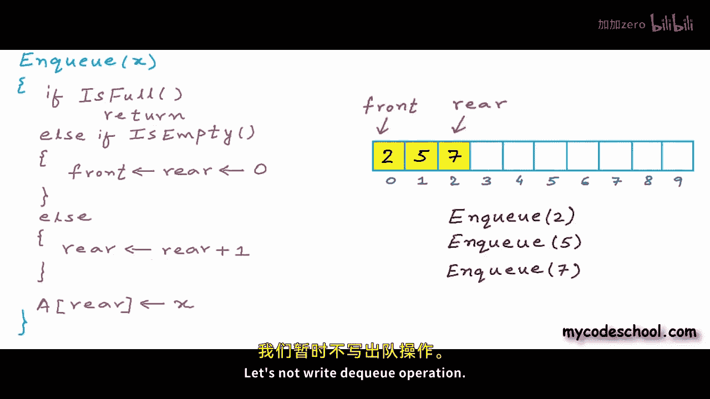

出队操作需要考虑队列是否为空以及是否只剩下一个元素。

```pseudocode
function Dequeue()
    if IsEmpty()
        print "Error: Queue is empty"
        return
    else if front == rear
        // 队列中只有一个元素，出队后队列变为空
        front = -1
        rear = -1
    else
        // 正常情况，front 向后移动
        front = front + 1
```


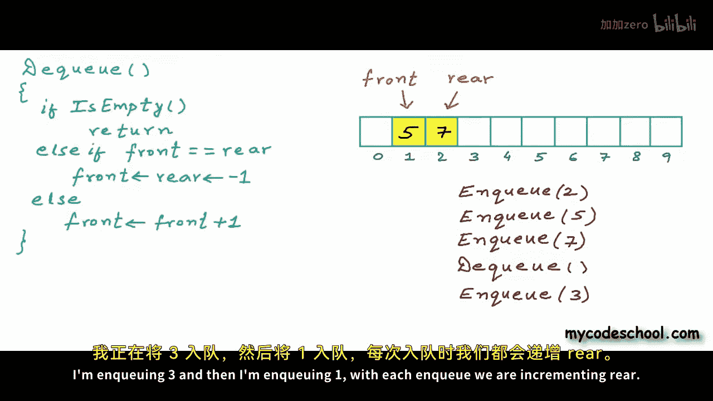

## 线性数组实现的问题 🚧


使用上述简单方法，随着元素不断入队和出队，`rear` 指针会逐渐移向数组末端。即使数组前端（`front` 之前）有空闲位置，我们也无法再利用它们，因为 `rear` 无法“绕回”到数组开头。这造成了空间浪费。

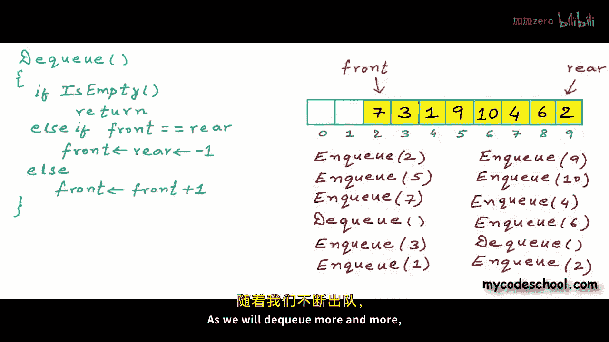

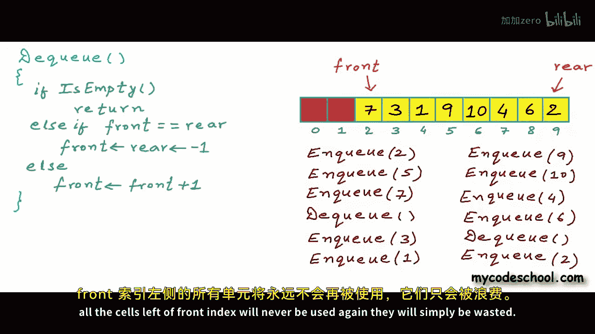

## 解决方案：循环数组 🔄

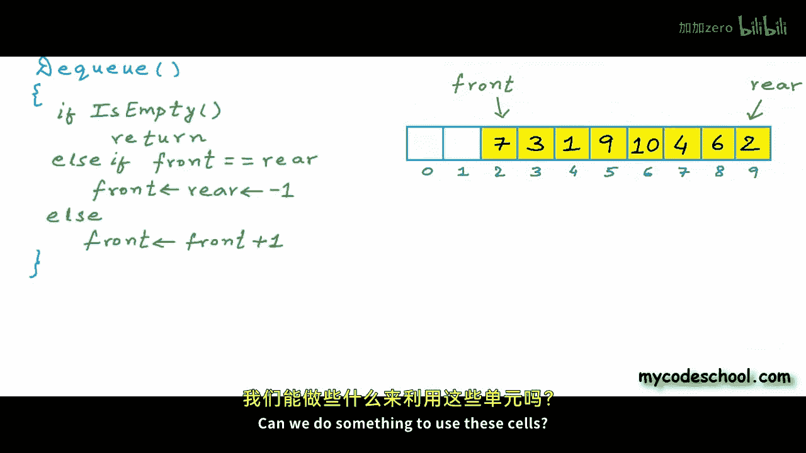

为了解决空间浪费问题，我们引入**循环数组**的概念。在逻辑上，我们将数组视为一个首尾相接的环。

在循环数组中，计算下一个位置的公式是：
`next_index = (current_index + 1) % array_size`
计算前一个位置的公式是：
`previous_index = (current_index + array_size - 1) % array_size`


其中 `%` 是取模运算符。


## 基于循环数组的完整实现


现在，我们修改伪代码，使用循环数组的逻辑。

### 修改后的入队操作


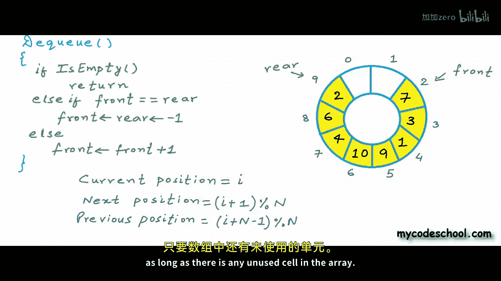


```pseudocode
function Enqueue(x)
    // 检查队列是否已满：队尾的下一个位置是否是队头
    if (rear + 1) % N == front
        print "Error: Queue is full"
        return
    else if IsEmpty()
        front = 0
        rear = 0
    else
        // 循环移动 rear
        rear = (rear + 1) % N

    A[rear] = x
```

### 修改后的出队操作


```pseudocode
function Dequeue()
    if IsEmpty()
        print "Error: Queue is empty"
        return
    else if front == rear
        front = -1
        rear = -1
    else
        // 循环移动 front
        front = (front + 1) % N
```

### 获取队头元素

```pseudocode
function Front()
    if IsEmpty()
        print "Error: Queue is empty"
        return -1 // 或抛出错误
    else
        return A[front]
```

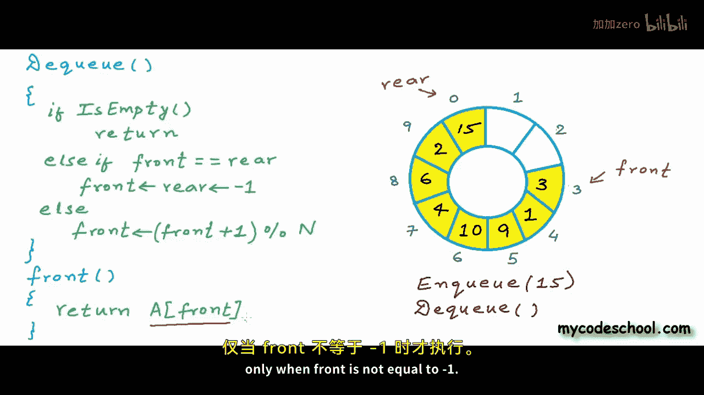


## 总结 🎯

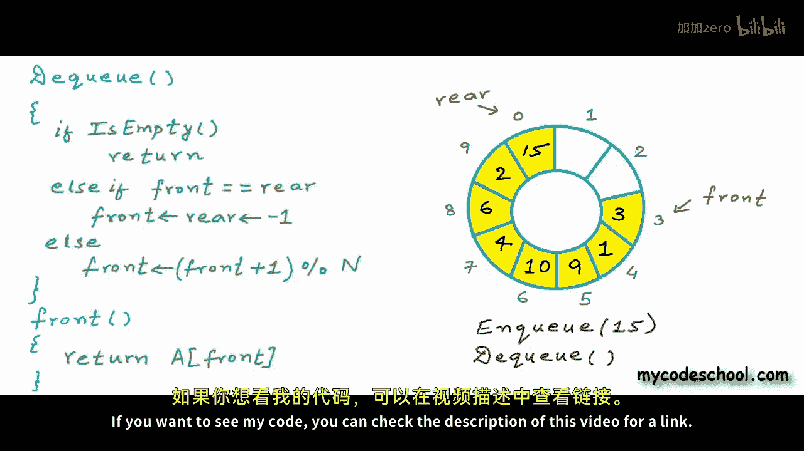

本节课中我们一起学习了如何使用数组实现队列。我们首先探讨了基本的线性数组实现及其空间浪费的局限性，然后引入了**循环数组**的概念来高效利用所有数组空间。关键点在于使用取模运算 `%` 来实现指针的循环移动，并仔细处理了队列为空、满、以及只有一个元素等各种边界情况。最终，我们实现的所有队列操作（Enqueue, Dequeue, Front, IsEmpty）都达到了 **O(1)** 的时间复杂度。