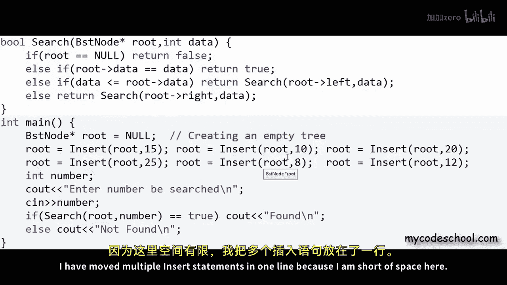
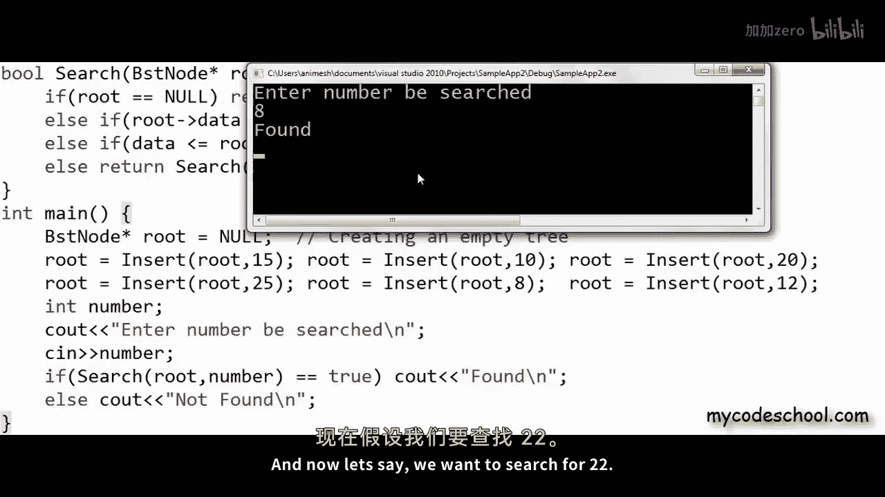

# 028：二叉搜索树 - C/C++ 实现 🧑‍💻

在本节课中，我们将学习如何用 C/C++ 语言实现二叉搜索树。我们将编写代码来创建树、插入节点以及搜索数据。学习本课的前提是，您需要理解 C/C++ 中的指针和动态内存分配概念。如果您已经学习了本系列关于链表的课程，那么实现二叉搜索树（或一般的二叉树）将不会有太大不同。

## 概述

上一节我们介绍了二叉搜索树是什么。本节中，我们将动手实现它。我们将使用动态创建并通过指针链接的节点来构建这种非线性逻辑结构，这与链表的实现方式非常相似。

## 二叉搜索树节点结构

在二叉搜索树（或一般的二叉树）中，每个节点最多可以有两个子节点。因此，我们可以将节点定义为一个包含三个字段的对象。

以下是节点的定义方式：
*   一个字段用于存储数据。
*   一个字段用于存储指向左子节点的地址（指针）。
*   一个字段用于存储指向右子节点的地址（指针）。

如果某个节点没有左子节点或右子节点，相应的指针应设置为 `NULL`。

在 C/C++ 中，我们可以这样定义节点结构体：

```c
struct BSTNode {
    int data;           // 存储数据，此处以整型为例
    BSTNode* left;      // 指向左子节点的指针
    BSTNode* right;     // 指向右子节点的指针
};
```

这个节点定义与双向链表的节点定义非常相似。区别在于，双向链表是线性排列，而二叉树是非线性的。

## 树的标识：根节点指针

与链表需要记录头节点地址类似，对于树，我们需要始终记录根节点的地址。

因此，我们需要声明一个指向 `BSTNode` 的指针变量来存储根节点的地址。通常，我们将其命名为 `root` 或 `rootPtr`。

```c
BSTNode* rootPtr; // 指向根节点的指针
```

初始时，树是空的，因此我们将这个根指针设置为 `NULL`，表示一棵空树。

```c
rootPtr = NULL; // 初始化为空树
```

## 创建新节点的辅助函数

在插入节点之前，我们需要一个函数来在堆内存中动态创建新节点。

以下是 `getNewNode` 函数的实现：

```c
BSTNode* getNewNode(int data) {
    BSTNode* newNode = new BSTNode(); // 在C++中使用new，C中使用malloc
    newNode->data = data;             // 设置节点数据
    newNode->left = NULL;             // 左子节点初始化为空
    newNode->right = NULL;            // 右子节点初始化为空
    return newNode;                   // 返回新节点的地址
}
```

## 向树中插入节点

现在，我们来编写核心的插入函数 `insert`。该函数接收当前（子）树的根节点地址和要插入的数据，并将新节点插入到正确的位置，最后返回更新后的（子）树根节点地址。

插入逻辑需要考虑以下几种情况：
1.  如果树为空（根节点为 `NULL`），则直接创建新节点作为根节点。
2.  如果树不为空，则比较要插入的数据与当前根节点的数据：
    *   如果数据**小于或等于**当前节点数据，则递归地将其插入到**左子树**中。
    *   如果数据**大于**当前节点数据，则递归地将其插入到**右子树**中。

以下是 `insert` 函数的实现：

```c
BSTNode* insert(BSTNode* rootPtr, int data) {
    // 情况1：树为空
    if(rootPtr == NULL) {
        rootPtr = getNewNode(data);
    }
    // 情况2：数据小于等于当前节点，插入左子树
    else if(data <= rootPtr->data) {
        rootPtr->left = insert(rootPtr->left, data);
    }
    // 情况3：数据大于当前节点，插入右子树
    else {
        rootPtr->right = insert(rootPtr->right, data);
    }
    return rootPtr; // 返回当前（子）树的根节点指针
}
```

**注意**：由于 `rootPtr` 是函数内的局部指针变量，为了在 `main` 函数中更新真正的根指针，我们采用了**返回新根节点地址**的方式。在 `main` 函数中调用时，需要这样写：

```c
rootPtr = insert(rootPtr, 15); // 插入数据15，并更新根指针
```

## 在树中搜索数据

接下来，我们实现一个搜索函数 `search`。该函数接收树的根节点地址和要查找的数据，如果找到数据则返回 `true`，否则返回 `false`。

搜索逻辑如下：
1.  如果到达空节点（`NULL`），说明未找到，返回 `false`。
2.  如果当前节点数据等于要查找的数据，说明已找到，返回 `true`。
3.  否则，根据要查找的数据与当前节点数据的大小关系，递归地在左子树或右子树中继续搜索。

以下是 `search` 函数的实现：

```c
bool search(BSTNode* rootPtr, int data) {
    if(rootPtr == NULL) {
        return false; // 未找到
    }
    else if(rootPtr->data == data) {
        return true;  // 找到
    }
    else if(data <= rootPtr->data) {
        return search(rootPtr->left, data); // 在左子树中搜索
    }
    else {
        return search(rootPtr->right, data); // 在右子树中搜索
    }
}
```

## 主函数示例

最后，我们在 `main` 函数中整合以上操作，构建一棵树并进行搜索。

```c
#include <iostream>
using namespace std;

// ... (此处放置之前定义的 struct BSTNode, getNewNode, insert, search 函数)

int main() {
    BSTNode* rootPtr = NULL; // 创建一棵空树

    // 插入一系列数据
    rootPtr = insert(rootPtr, 15);
    rootPtr = insert(rootPtr, 10);
    rootPtr = insert(rootPtr, 20);
    rootPtr = insert(rootPtr, 25);
    rootPtr = insert(rootPtr, 8);
    rootPtr = insert(rootPtr, 12);

    // 搜索数据
    int number;
    cout << "Enter number to be searched: ";
    cin >> number;

    if(search(rootPtr, number) == true) {
        cout << "Found\n";
    }
    else {
        cout << "Not Found\n";
    }

    return 0;
}
```





## 总结


本节课中，我们一起学习了二叉搜索树在 C/C++ 中的基本实现。我们首先定义了树的节点结构，然后实现了创建新节点、插入节点和搜索数据的函数。实现的关键在于理解递归在树操作中的自然应用，以及如何通过指针在堆内存中动态构建和链接节点结构。在接下来的课程中，我们将更深入地探讨树的其他操作和内存管理细节。