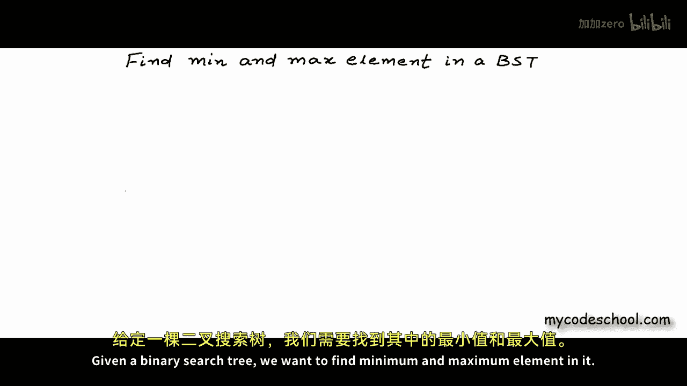
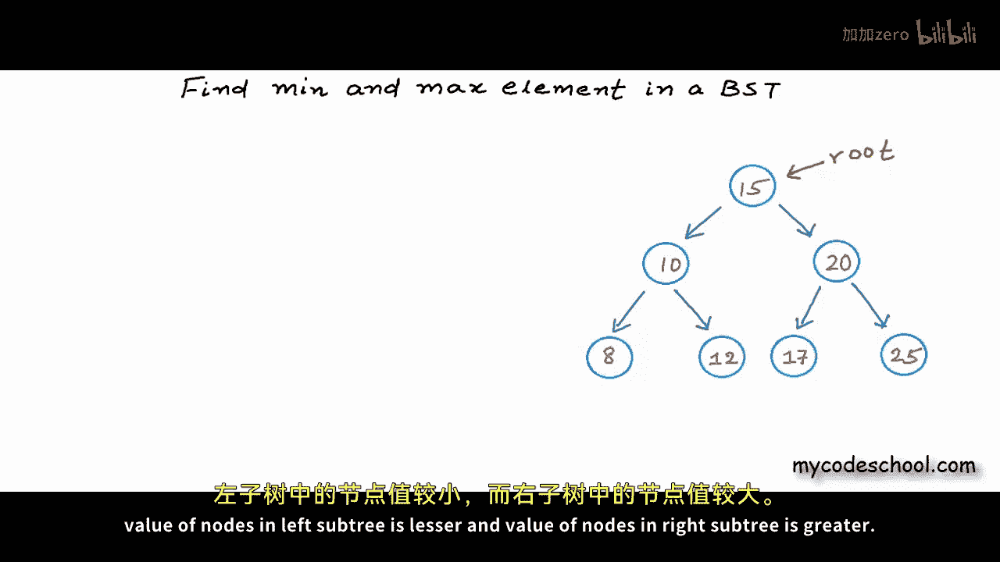
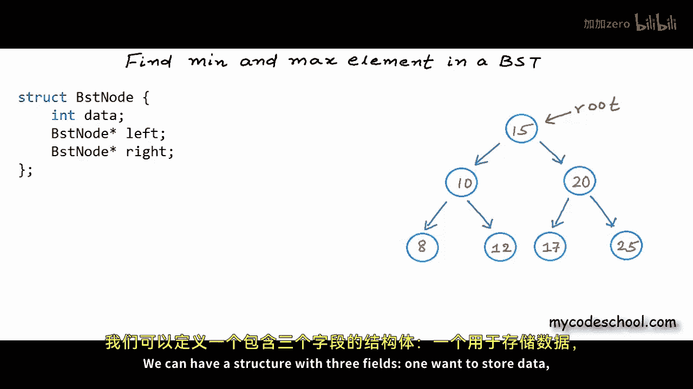
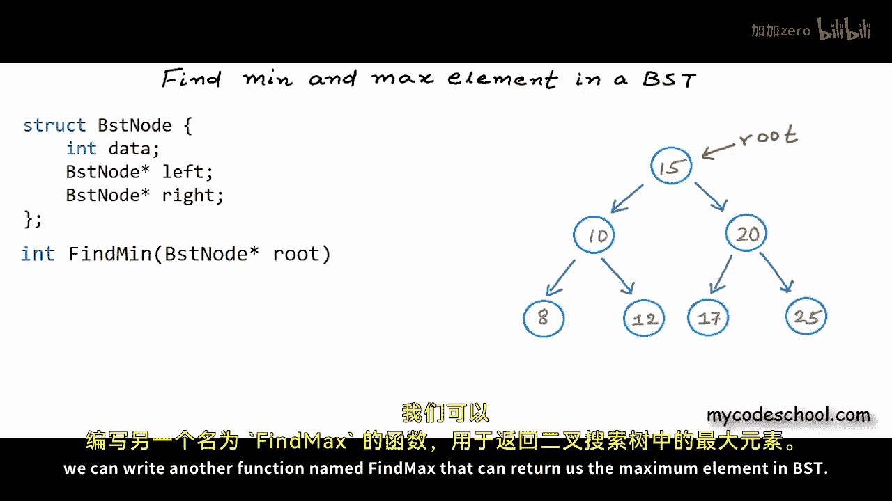
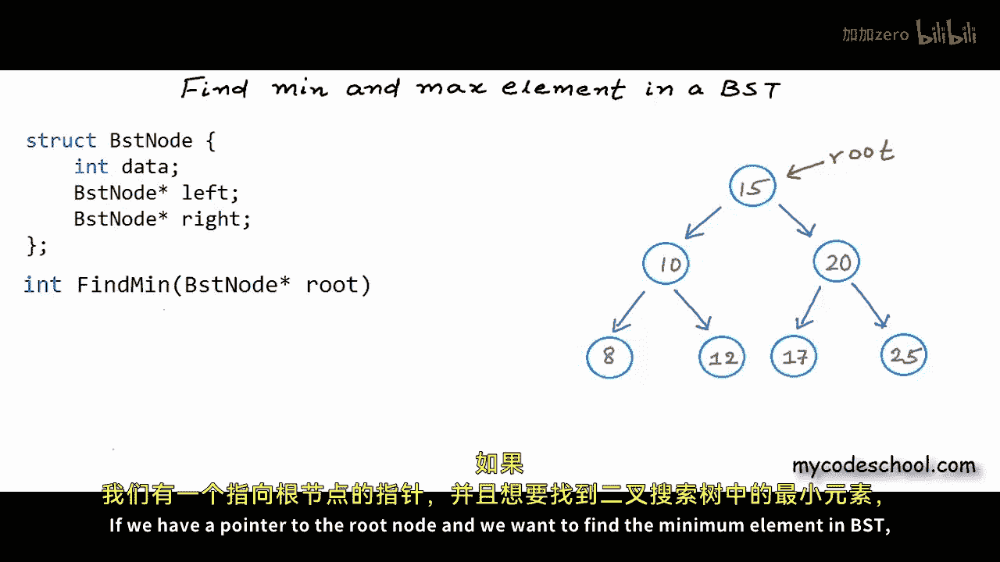
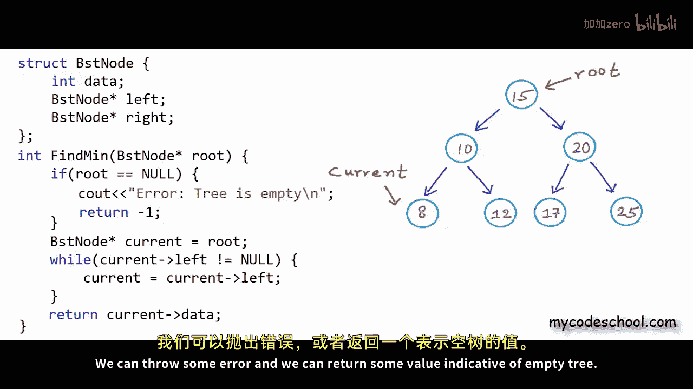
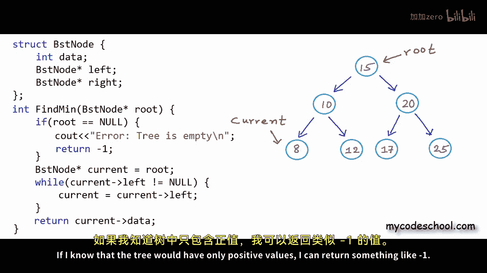
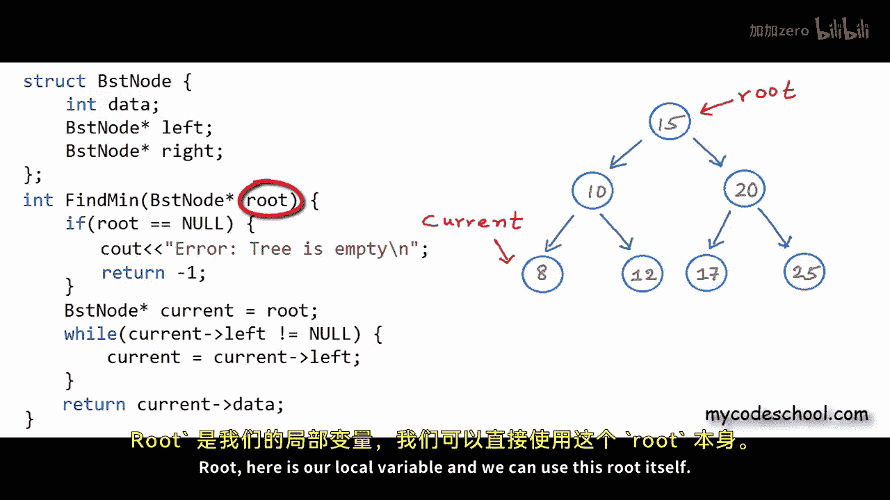
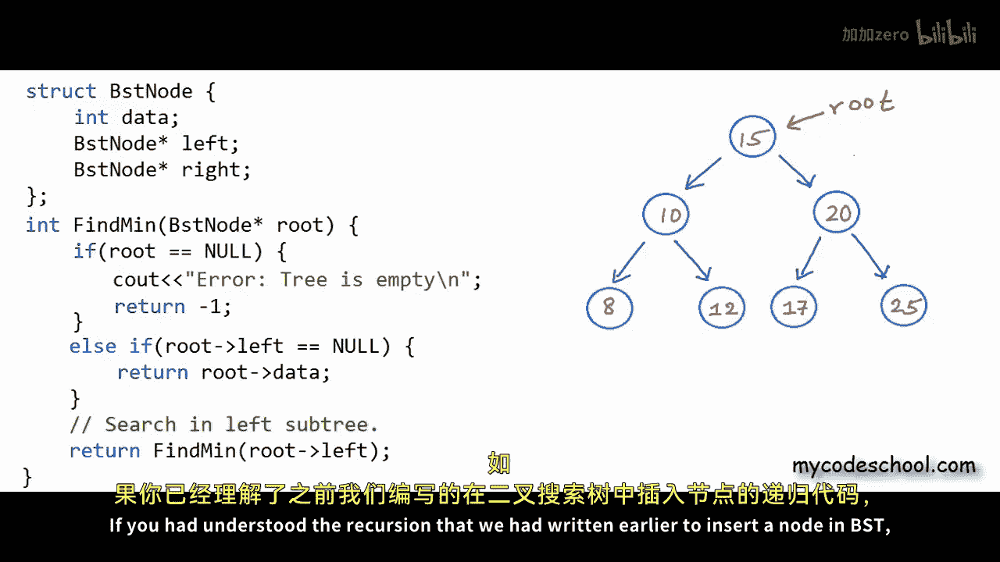
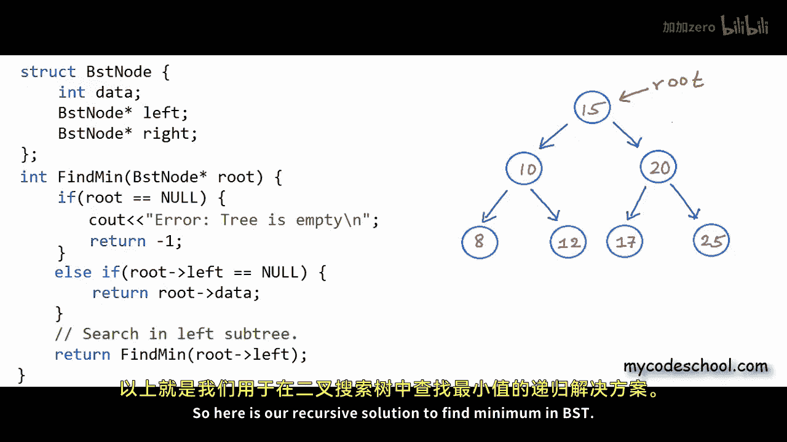

# 030：在二叉搜索树中查找最小与最大值 🔍

在本节课中，我们将学习如何在二叉搜索树中查找最小和最大元素。我们将探讨两种不同的实现方法：迭代法和递归法，并通过清晰的步骤和代码示例来理解其背后的逻辑。



---

## 概述

在之前的课程中，我们编写了二叉搜索树的一些基础代码。为了巩固概念，我们需要编写更多代码。本节选取了一个简单的问题：给定一个二叉搜索树，找出其中的最小和最大元素。


让我们看看如何解决这个问题。上图展示了一个整数二叉搜索树的逻辑结构。我们知道，在二叉搜索树中，对于所有节点，其左子树中所有节点的值都小于该节点，右子树中所有节点的值都大于该节点。在C/C++中，我们可以用一个包含三个字段的结构体来定义节点：一个存储数据，一个存储左子节点的地址，另一个存储右子节点的地址。在BST的实现中，我们通常持有并传递给函数的树的标识是根节点的地址。

因此，这里我想首先编写一个名为 `find_min` 的函数，它接收根节点的地址作为参数，并返回树中的最小元素。






同样地，我们可以编写另一个名为 `find_max` 的函数来返回BST中的最大元素。让我们先看看如何找到最小元素。




---


## 查找最小元素：迭代法 🔄

有两种可能的方法：我们可以编写一个使用简单循环的迭代解决方案，或者使用递归。首先看看迭代解法。


如果我们有一个指向根节点的指针，并且想要找到BST中的最小元素，那么我们需要从根节点开始，沿着左链接尽可能地向左移动。因为在BST中，对于所有节点，左子节点的值较小，右子节点的值较大。我们可以用一个临时指针（例如命名为 `current`）指向根节点开始。

以下是实现步骤：

1.  检查树是否为空。如果为空，可以返回一个错误值（例如-1）。
2.  使用一个 `while` 循环，只要当前节点的左子节点不为空，就将指针移动到其左子节点。
3.  当无法再向左移动时，当前指针指向的节点就是最小节点，返回其数据。



代码实现如下：

```c
int find_min_iterative(struct BSTNode* root) {
    if (root == NULL) {
        printf("错误：树为空。\n");
        return -1; // 假设树中只有正数，用-1表示错误
    }
    while (root->left != NULL) {
        root = root->left;
    }
    return root->data;
}
```

在这个例子中，我们从值为15的节点开始。它有左子节点10，所以我们移动到节点10。节点10有左子节点8，所以我们移动到节点8。节点8没有左子节点，循环结束，我们返回节点8的数据，即最小值。








修改函数内的局部变量 `root` 不会影响主函数或其他调用函数中的根节点指针。

---

## 查找最小元素：递归法 🔁

现在，让我们看看如何使用递归来查找最小元素。


如果我们想以递归的、自相似的方式简化这个问题，可以这样思考：


*   如果左子树不为空，那么问题可以简化为在左子树中查找最小值。
*   如果左子树为空，那么当前节点就是最小值，因为右子树中的值不可能更小。


递归的基准条件是当左子节点为空时。以下是递归实现的逻辑：

1.  如果根节点为空（树为空），抛出错误。
2.  否则，如果根节点的左子节点为空，返回根节点的数据（这就是最小值）。
3.  否则（左子树非空），递归地在左子树中查找最小值。

代码实现如下：

```c
int find_min_recursive(struct BSTNode* root) {
    if (root == NULL) {
        printf("错误：树为空。\n");
        return -1;
    }
    else if (root->left == NULL) {
        return root->data; // 基准条件：没有左子节点，当前节点最小
    }
    else {
        // 递归条件：在左子树中继续查找
        return find_min_recursive(root->left);
    }
}
```


如果你理解了之前编写的在BST中插入节点的递归方法，那么这个递归应该不难理解。

---

## 查找最大元素

查找最大元素的逻辑与查找最小元素非常相似。

*   **迭代法**：不是一直向左移动，而是一直向右移动，直到无法再向右为止。最后访问的节点就是最大值。
*   **递归法**：检查右子树。如果右子树为空，则当前节点是最大值；否则，递归地在右子树中查找最大值。

具体的实现留作练习，你可以参考查找最小元素的代码进行修改。






---

## 总结

在本节课中，我们一起学习了如何在二叉搜索树中查找最小和最大元素。我们探讨了两种方法：


1.  **迭代法**：通过循环沿着左（找最小）或右（找最大）链接遍历树，直到到达叶子节点。
2.  **递归法**：将问题分解为更小的子问题（在左子树或右子树中查找），并定义清晰的基准条件来终止递归。


这两种方法都充分利用了二叉搜索树的关键性质：**左子树的值 < 根节点的值 < 右子树的值**。理解这些基本操作是掌握更复杂树形算法的重要基础。在接下来的课程中，我们将解决更多关于BST的有趣问题。