# 031：计算二叉树的高度 🌳

在本节课中，我们将学习如何编写代码来计算二叉树的高度，也称为二叉树的最大深度。我们将首先回顾树的高度和深度的基本概念，然后通过递归方法实现一个计算高度的函数，并分析其时间复杂度。


## 高度与深度的概念回顾


上一节我们介绍了树的基本概念，本节中我们来看看如何具体计算二叉树的高度。首先，我们需要明确树的高度和深度的定义。

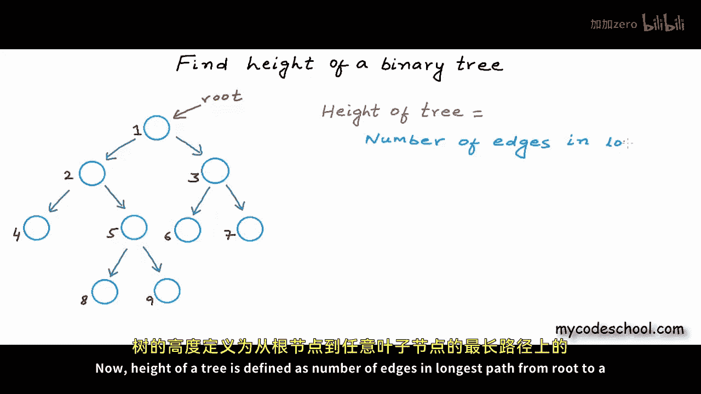

高度定义为从根节点到最远叶子节点的路径上的**边数**。深度则定义为从根节点到该节点的路径上的**边数**。

以下是一个二叉树的示例，节点已编号以便说明：


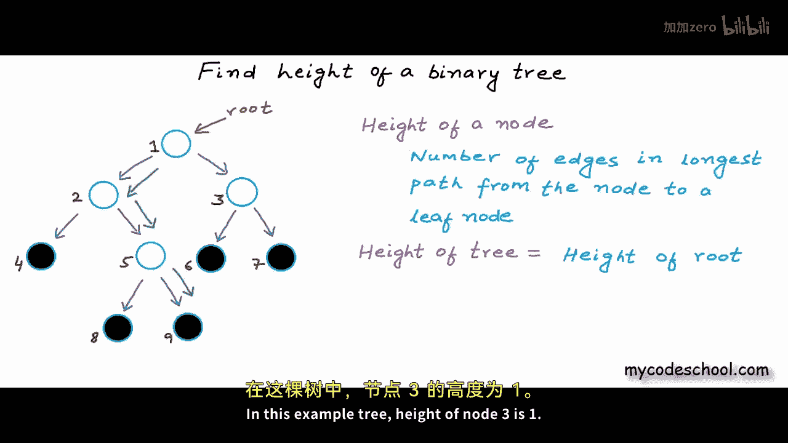

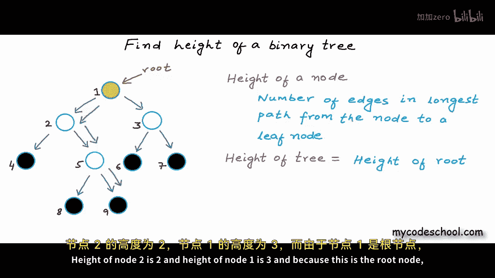


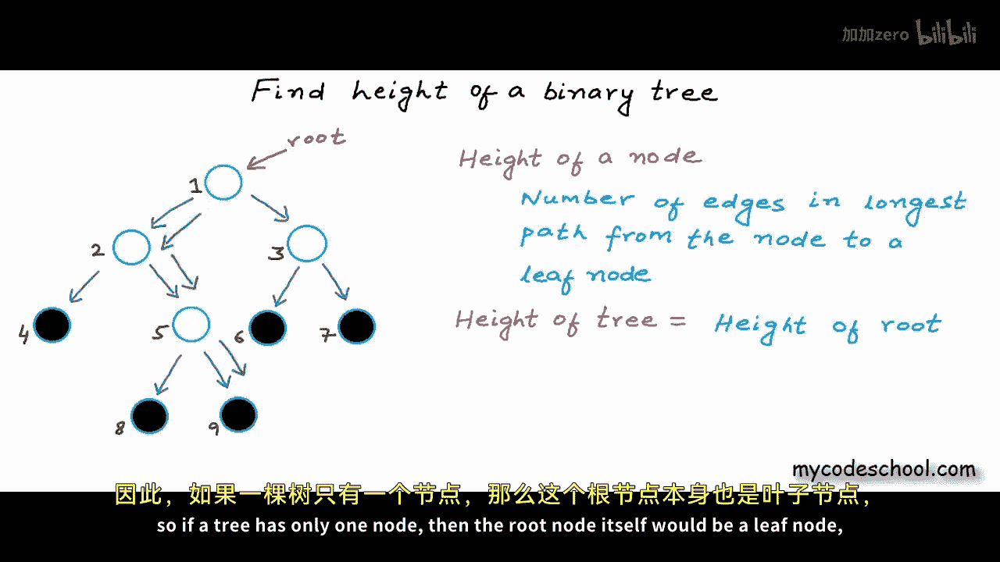


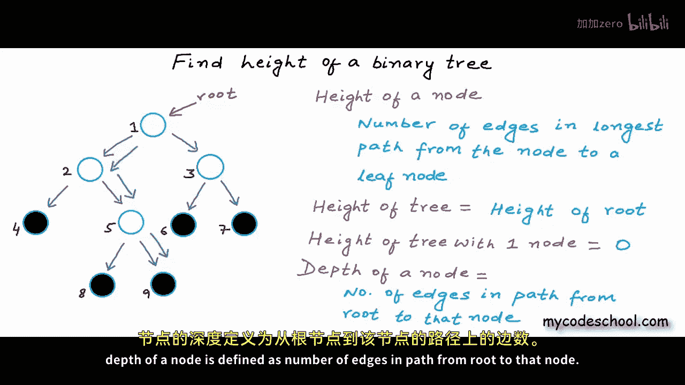


*   节点3、4、6、7、8和9是叶子节点（没有子节点的节点）。
*   从根节点（节点1）到叶子节点8或9的路径包含3条边。因此，这棵树的高度是3。
*   一个节点的高度定义为从该节点到其最远叶子节点的路径边数。因此：
    *   节点3的高度是1。
    *   节点2的高度是2。
    *   节点1（根节点）的高度是3，这也是整棵树的高度。
*   叶子节点的高度为0。如果一棵树只有一个节点，那么这棵树的高度就是0。
*   深度是节点到根节点的距离。例如：
    *   节点2的深度是1，高度是2。
    *   节点9的深度是3，高度是0。
    *   根节点的深度是0，高度是3。

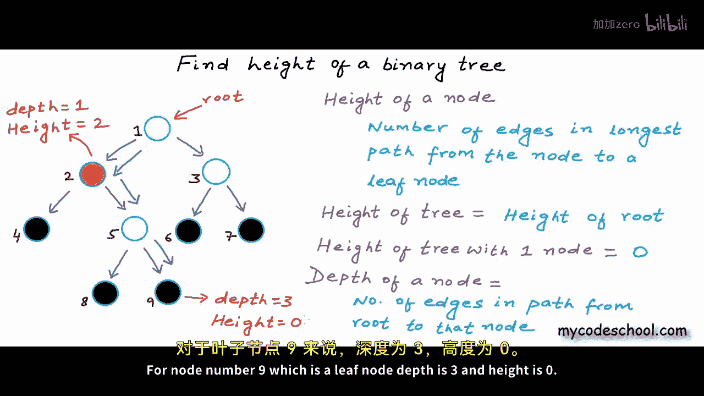

**核心关系**：树的高度等于树中所有节点的**最大深度**。

## 计算高度的递归方法

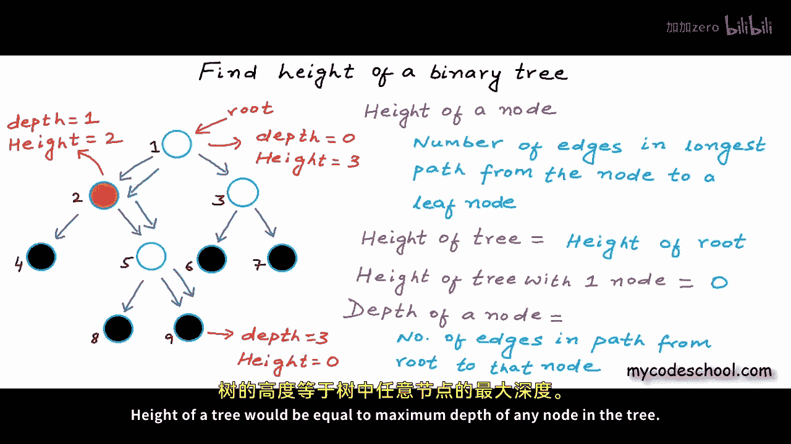


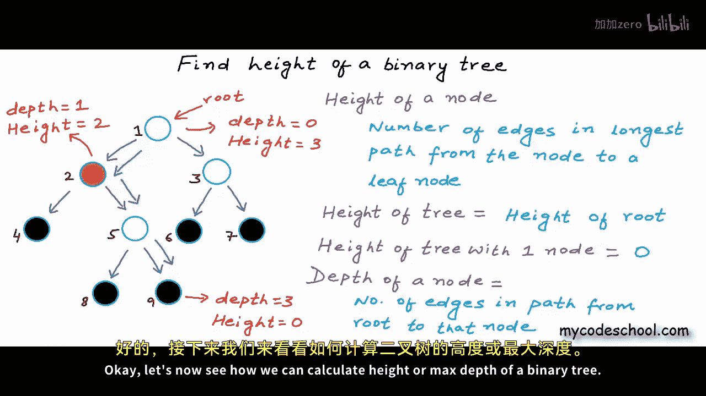


理解了基本概念后，现在我们来探讨如何通过编程计算二叉树的高度。核心思想是使用递归。

对于树中的任何一个节点，其高度可以通过其左右子树的高度来计算。逻辑如下：

1.  计算左子树的高度。
2.  计算右子树的高度。
3.  该节点的高度等于左右子树高度的**较大值**，**再加1**（加上的1代表连接该节点到其子节点的边）。

用**公式**表示：
`height(node) = max(height(node.left), height(node.right)) + 1`


对于上图中的根节点（节点1）：
*   左子树（以节点2为根）的高度是2。
*   右子树（以节点3为根）的高度是1。
*   因此，根节点的高度 = max(2, 1) + 1 = 3。

## 递归函数的实现与边界条件


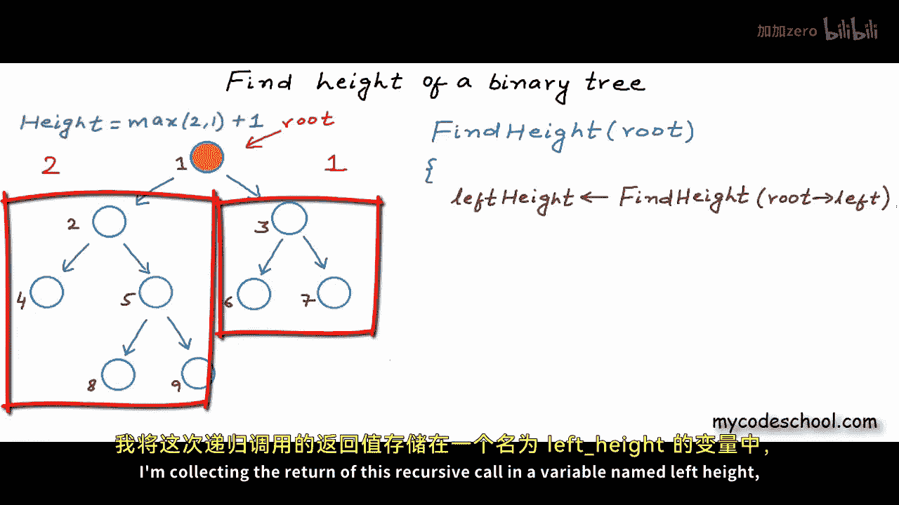


我们将实现一个名为 `findHeight` 的函数，它接收二叉树的根节点作为参数，并返回树的高度。


以下是实现这个递归逻辑需要考虑的步骤：


首先，我们需要定义递归的**基线条件**（即递归终止条件），以防止无限递归。当我们递归到一个空子树（即 `node == NULL`）时，应该返回什么值？

考虑一个叶子节点（例如节点7）。对于它的递归调用，其左右子节点都是 `NULL`。我们希望叶子节点的高度计算为0。
*   如果对 `NULL` 的调用返回0，那么根据公式 `max(0, 0) + 1`，叶子节点的高度会被计算为1，这与定义（高度为0）不符。
*   因此，一个常见的约定是：**空树的高度定义为 -1**。这样，公式 `max(-1, -1) + 1` 的结果正好是0，符合叶子节点高度为0的定义。

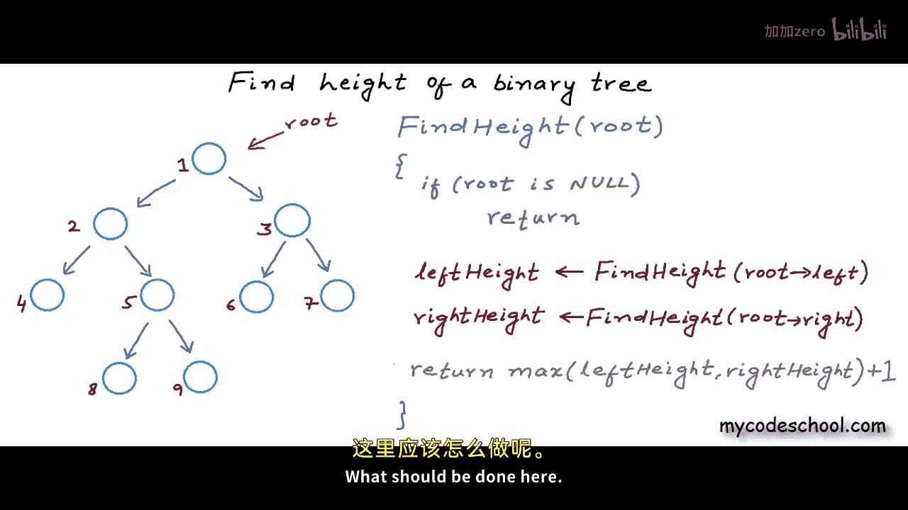

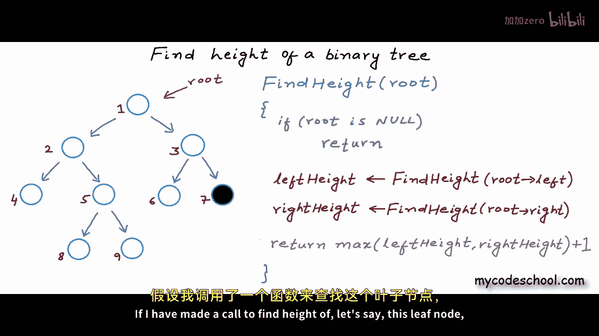

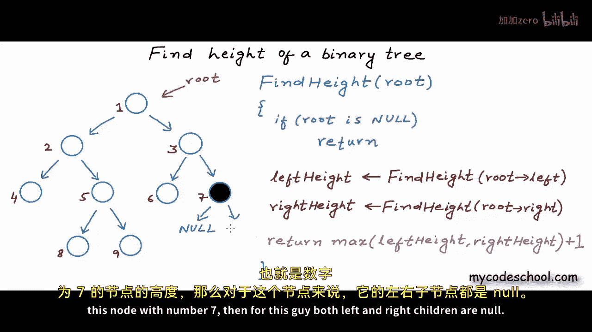

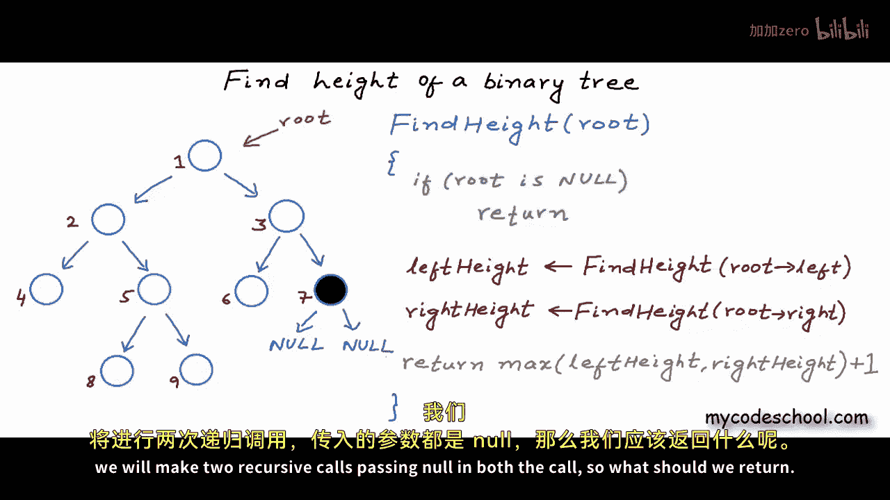

以下是 `findHeight` 函数的伪代码：

```c
int findHeight(Node* root) {
    if (root == NULL) {
        return -1; // 空树的高度为-1
    }
    int leftHeight = findHeight(root->left);
    int rightHeight = findHeight(root->right);
    return max(leftHeight, rightHeight) + 1;
}
```

> **注意**：有些定义将高度视为从根到叶子的**节点数**。如果采用那种定义，叶子节点高度为1，空树高度为0。此时，基线条件应返回0，公式不变。但本教程采用更常见的**边数**定义。

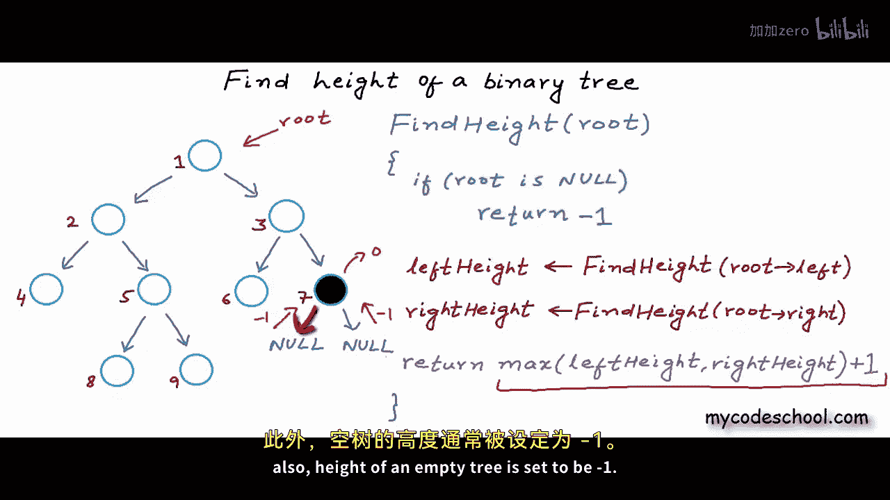

## 时间复杂度分析

最后，我们来分析一下这个算法的时间复杂度。

该函数会访问二叉树中的每一个节点恰好一次。每个节点的处理操作（计算左右子树高度、取最大值、加1）都是常数时间 `O(1)`。

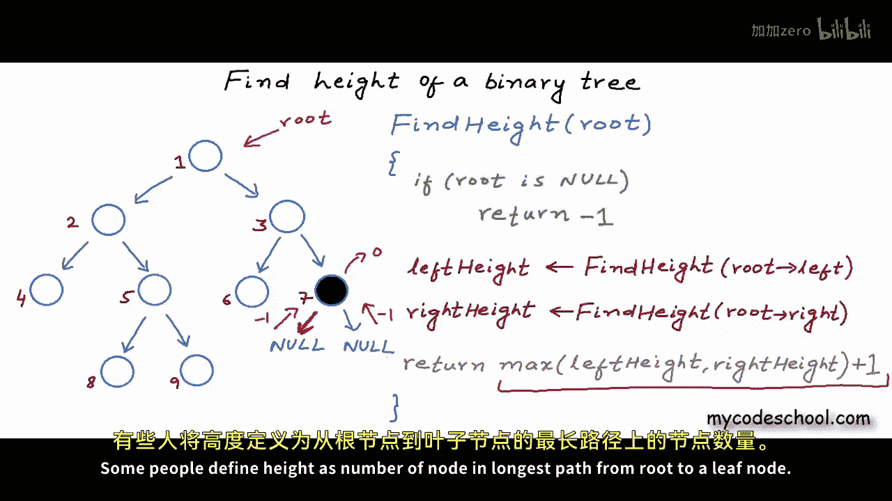


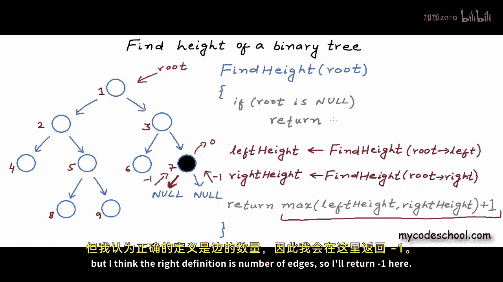

因此，如果树中共有 `n` 个节点，那么 `findHeight` 函数的**总时间复杂度为 O(n)**。

## 总结


本节课中我们一起学习了二叉树高度的计算。
*   我们明确了**高度**（从节点到最远叶子的边数）和**深度**（从根到节点的边数）的定义与区别。
*   我们掌握了计算高度的核心递归思想：`节点高度 = max(左子树高度, 右子树高度) + 1`。
*   我们实现了 `findHeight` 函数，并确定了关键的基线条件：**空树返回 -1**，以确保叶子节点高度为0。
*   我们分析了该算法的时间复杂度为 **O(n)**，其中 n 是树中的节点数。

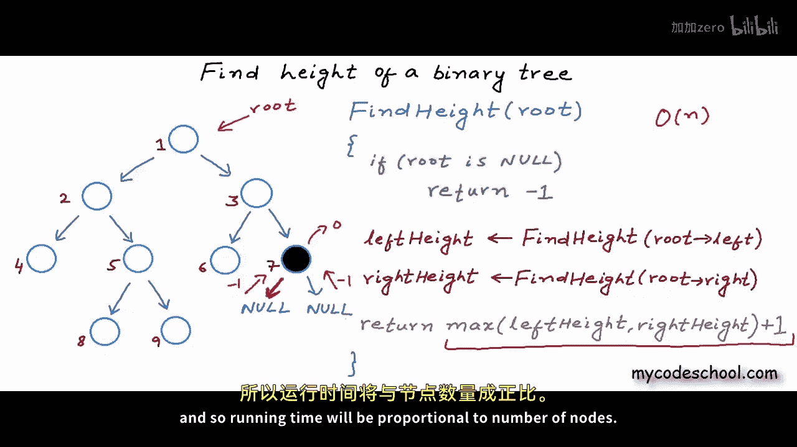

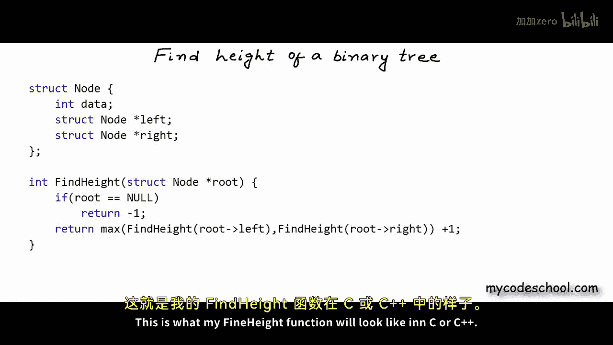

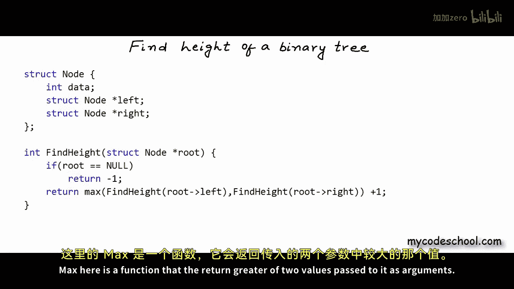

通过本课的学习，你已经掌握了使用递归计算二叉树高度的基本方法，这是理解和操作二叉树结构的重要基础。