# 033：二叉树的层序遍历 🧮

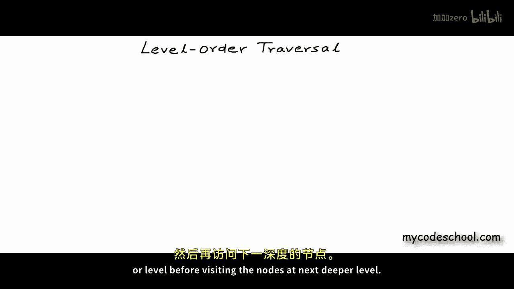

在本节课中，我们将学习如何为二叉树编写层序遍历的代码。层序遍历是一种按树的层级顺序访问所有节点的方法，即先访问同一层的所有节点，再访问下一层的节点。

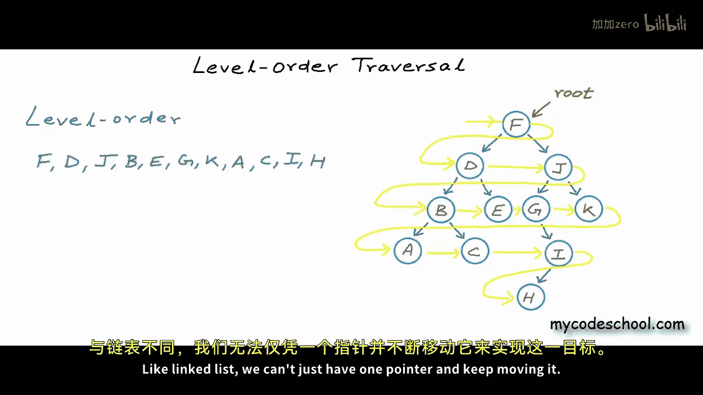

## 算法核心思想

上一节我们介绍了层序遍历的概念，本节中我们来看看如何通过编程实现它。核心思想是使用一个队列来辅助遍历。我们无法仅用一个指针在树中移动，因为从父节点到其兄弟节点没有直接的链接。因此，我们需要一个数据结构来暂存待访问的节点地址。

以下是算法的基本步骤：
1.  将根节点放入队列。
2.  当队列不为空时，重复以下步骤：
    *   从队列前端取出一个节点（出队）并访问它（例如打印其值）。
    *   如果该节点有左子节点，则将左子节点放入队列（入队）。
    *   如果该节点有右子节点，则将右子节点放入队列（入队）。

通过队列的“先进先出”特性，我们可以确保节点按照层级顺序被访问。

## 代码实现

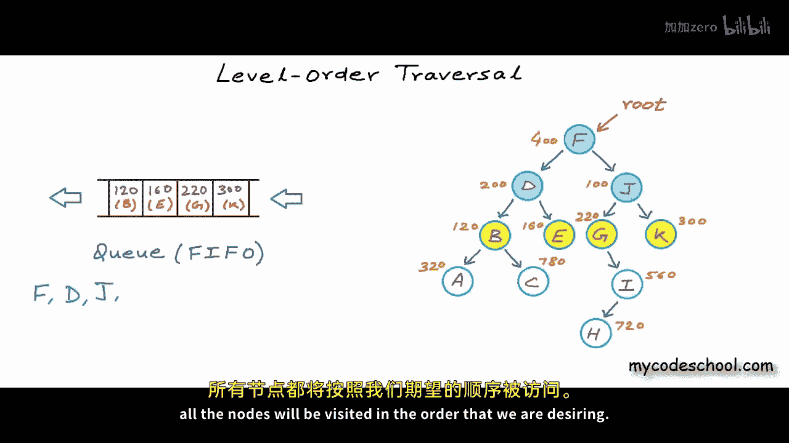

现在，让我们用C++代码来实现上述算法。首先，我们定义二叉树节点的结构。

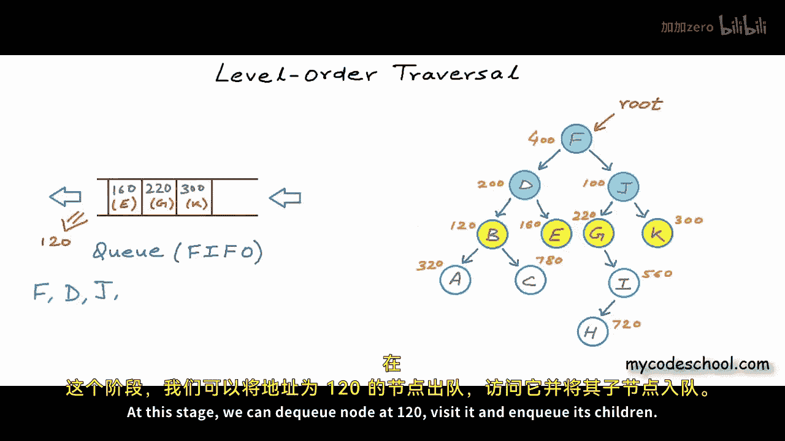

```cpp
struct Node {
    char data;      // 存储字符数据
    Node* left;     // 指向左子节点的指针
    Node* right;    // 指向右子节点的指针
};
```

接下来，我们编写层序遍历函数 `levelOrder`。

```cpp
#include <queue>
#include <iostream>

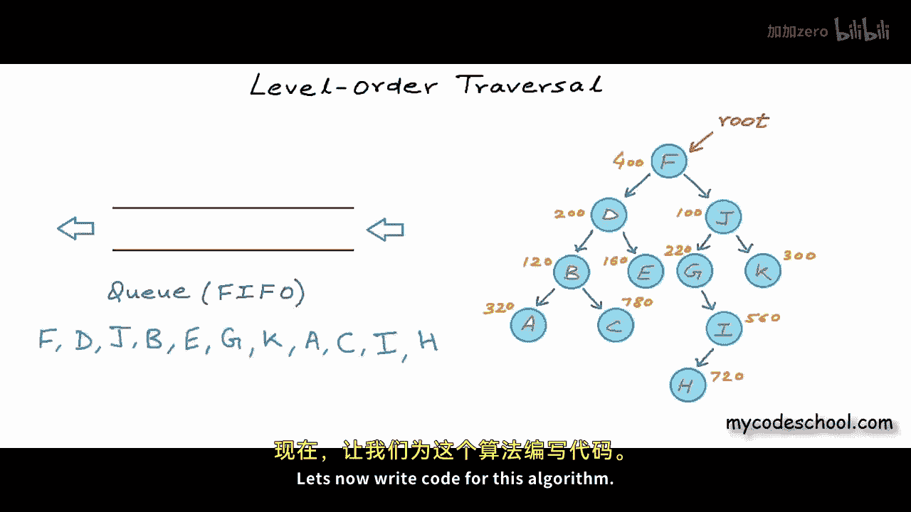

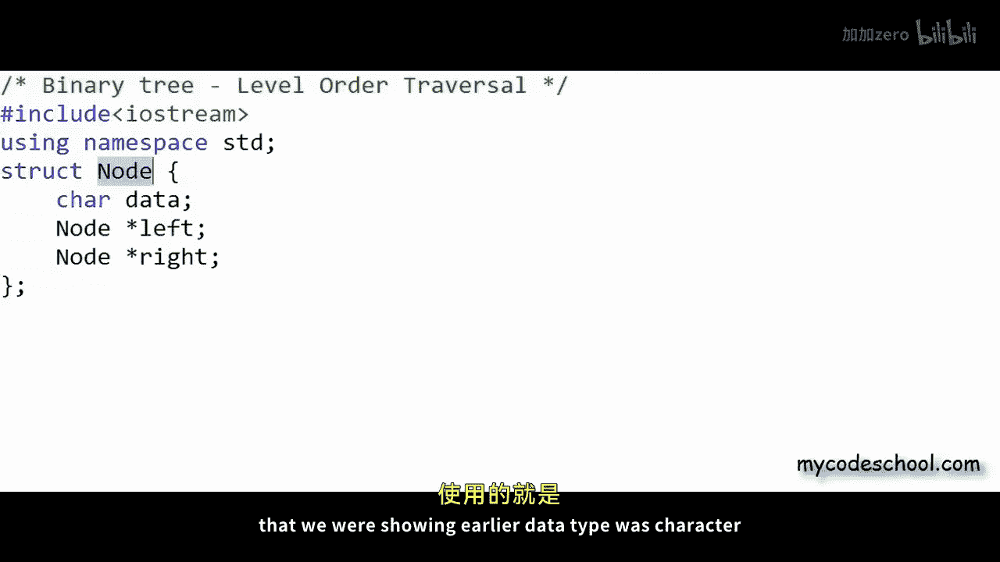


void levelOrder(Node* root) {
    // 处理空树的情况
    if (root == nullptr) {
        return;
    }

    // 创建一个存储节点指针的队列
    std::queue<Node*> q;

    // 将根节点放入队列
    q.push(root);

    // 当队列中还有待访问的节点时
    while (!q.empty()) {
        // 取出队列前端的节点
        Node* current = q.front();

        // 访问该节点（这里打印其数据）
        std::cout << current->data << " ";

        // 如果左子节点存在，将其放入队列
        if (current->left != nullptr) {
            q.push(current->left);
        }
        // 如果右子节点存在，将其放入队列
        if (current->right != nullptr) {
            q.push(current->right);
        }

        // 将已访问的节点移出队列
        q.pop();
    }
}
```


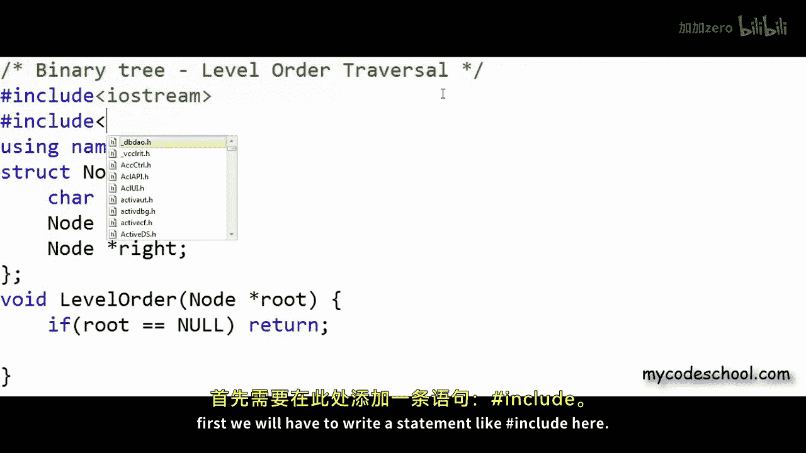

## 复杂度分析

在理解了算法实现后，我们来分析其时间和空间复杂度。

### 时间复杂度

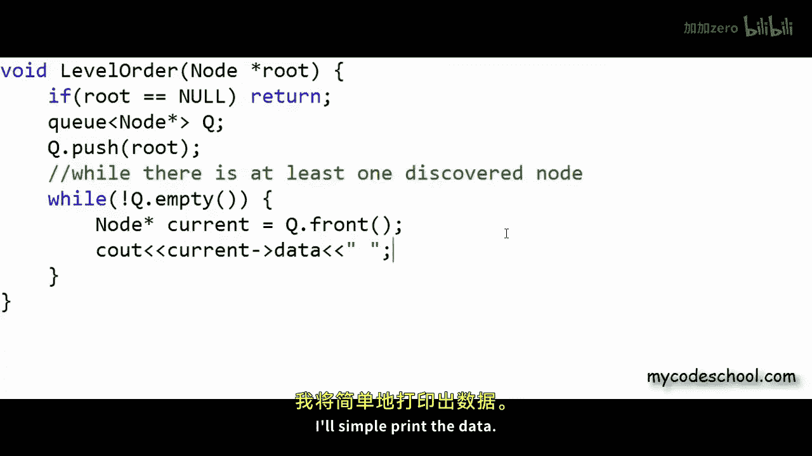


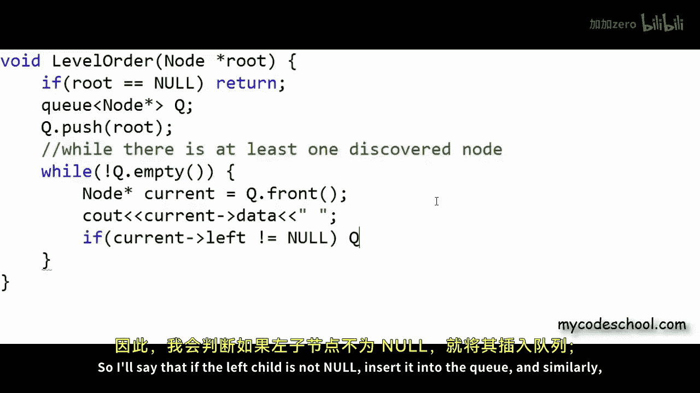

每个节点恰好被访问一次（出队并打印），每次访问操作（包括检查子节点和入队）的时间是常数级的。因此，对于包含 **n** 个节点的树，总时间复杂度为 **O(n)**。无论树的形状如何，这个结论都成立。

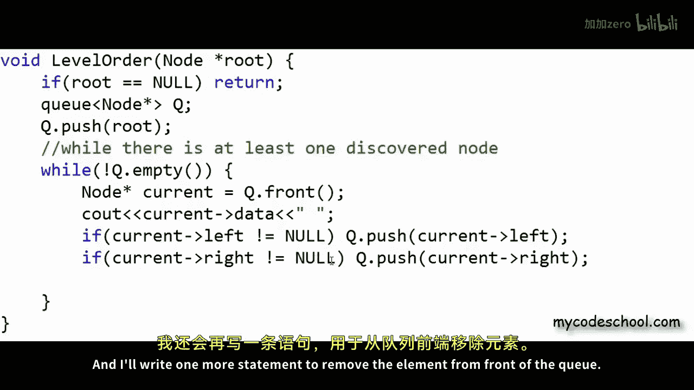


### 空间复杂度


空间复杂度衡量的是算法使用的额外内存随输入规模增长的速度。在本算法中，主要额外内存消耗来自队列。

以下是几种情况的分析：
*   **最佳情况（如斜树）**：队列中最多只有一个节点，空间复杂度为 **O(1)**。
*   **最坏情况（如完美二叉树）**：在遍历到最底层时，队列中大约有 **n/2** 个节点，因此空间复杂度为 **O(n)**。
*   **平均情况**：空间复杂度通常也为 **O(n)**。

因此，层序遍历的**时间复杂度恒为 O(n)**，而**空间复杂度在最坏和平均情况下为 O(n)**。

## 总结

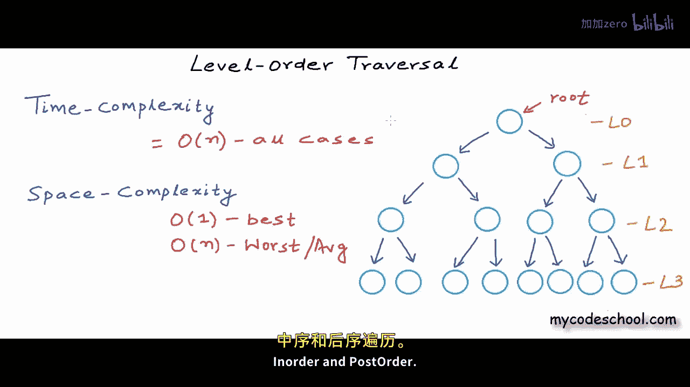

本节课中我们一起学习了二叉树的层序遍历。我们首先理解了为什么需要借助队列来实现按层级访问节点，然后详细分析了算法的每一步。接着，我们用C++代码实现了 `levelOrder` 函数。最后，我们讨论了算法的时间复杂度（O(n)）和空间复杂度（最坏情况下 O(n)）。层序遍历是理解树结构的基础，下一节课我们将探讨深度优先遍历的几种方式：先序、中序和后序遍历。