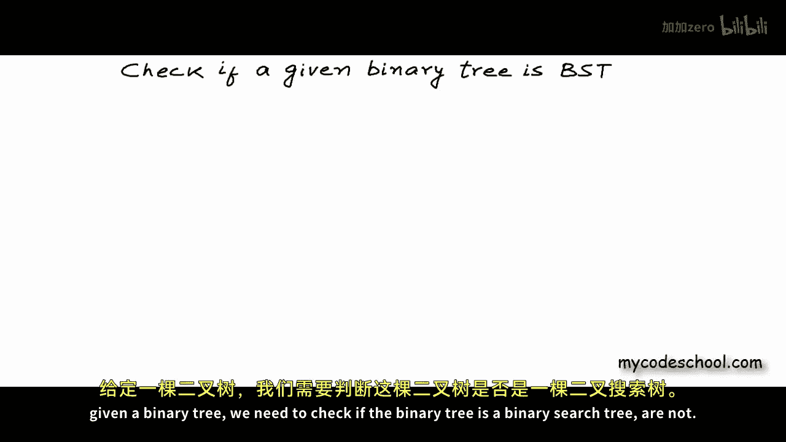
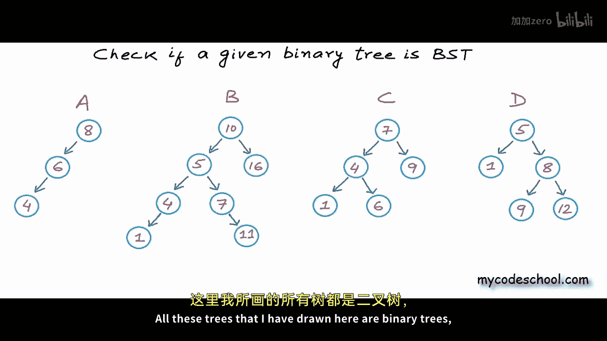
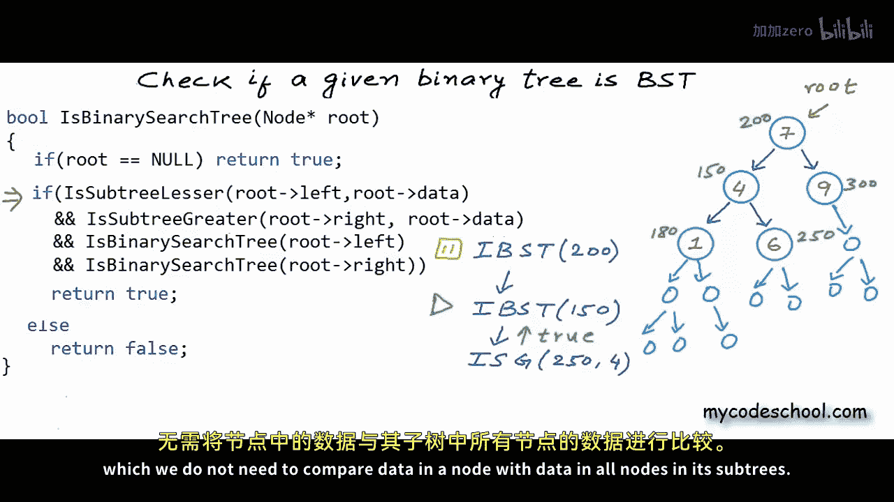
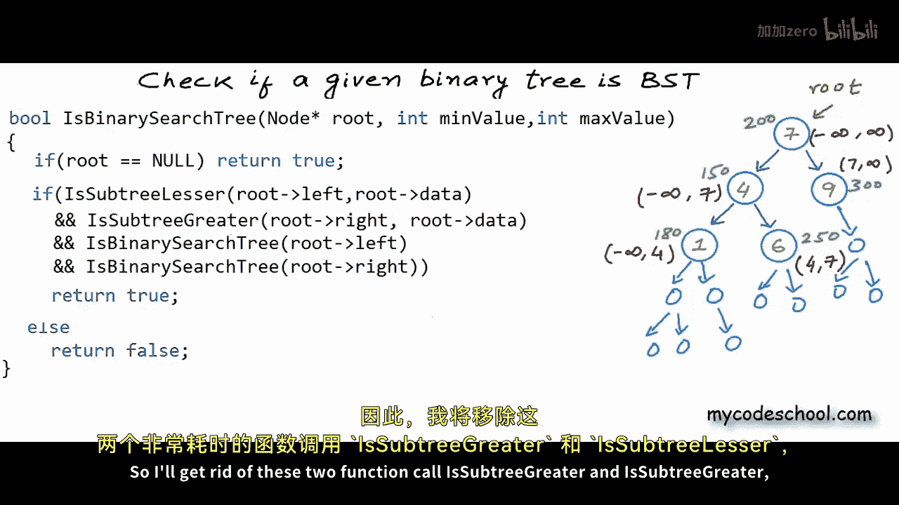
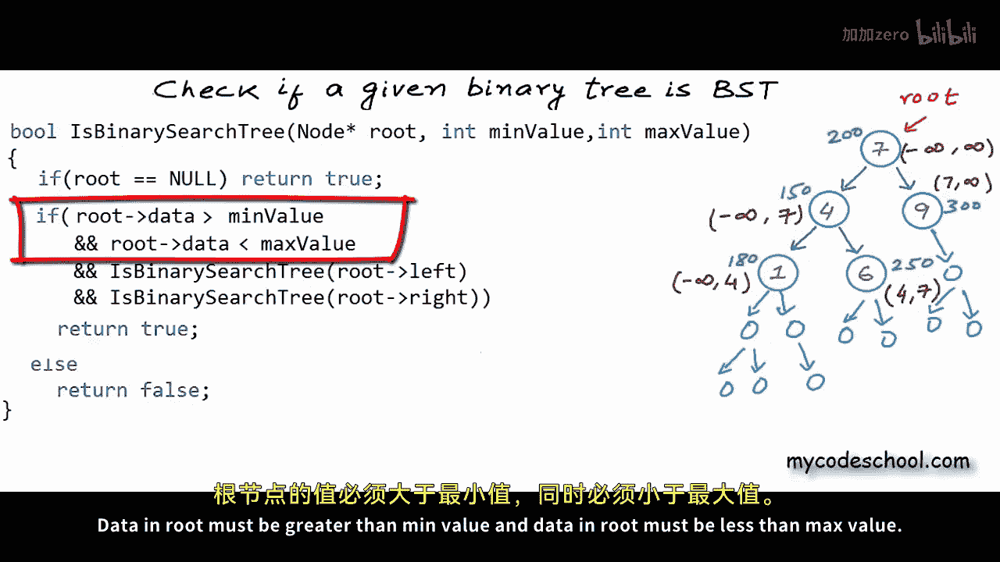
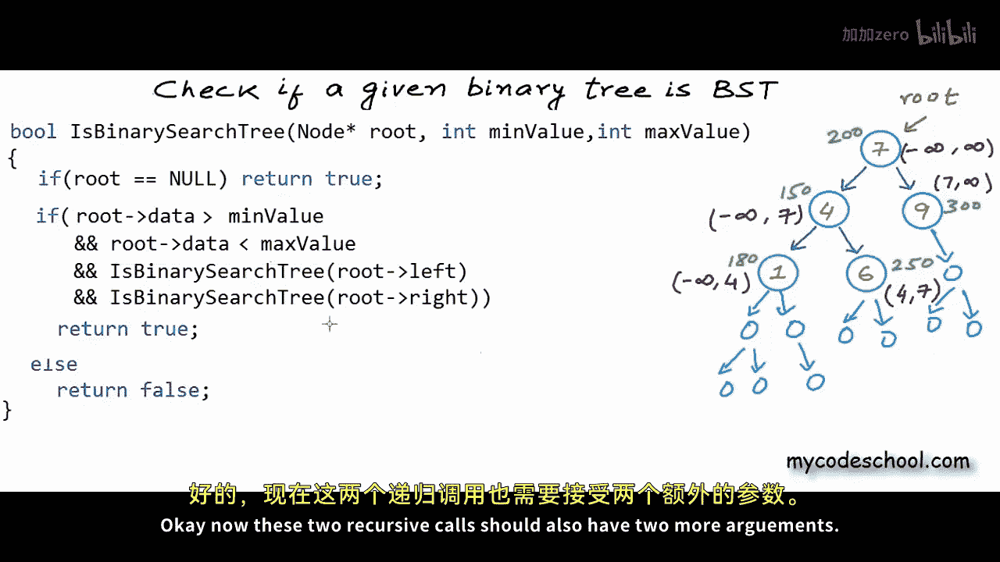
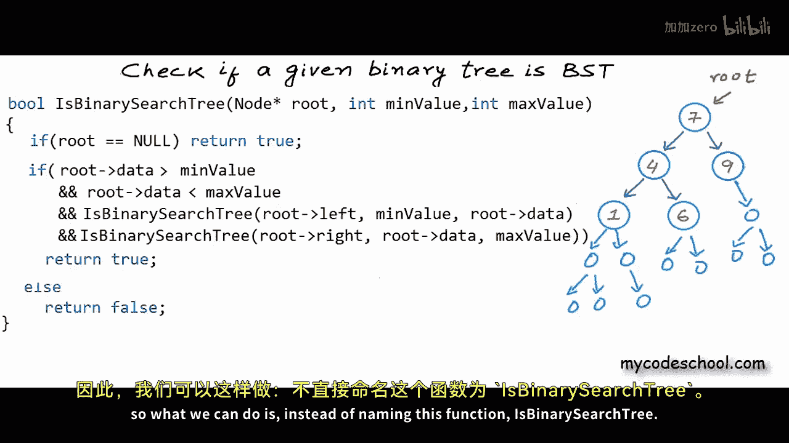
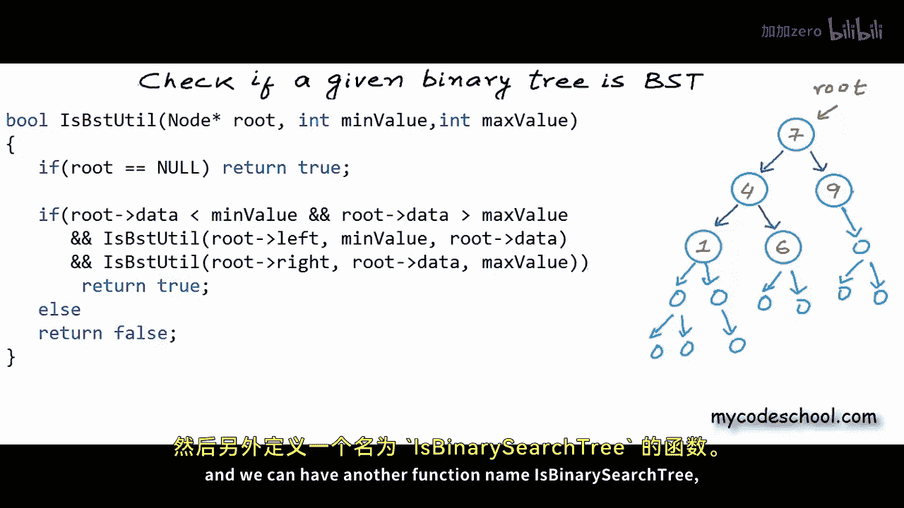

# 035：判断二叉树是否为二叉搜索树 🌳





在本节课中，我们将解决一个关于二叉树的简单问题，这也是一个著名的编程面试题。问题是：给定一棵二叉树，我们需要判断它是否是一棵二叉搜索树。


## 什么是二叉搜索树？ 🤔

我们知道，二叉树是一种每个节点最多可以有两个子节点的树结构。然而，并非所有二叉树都是二叉搜索树。

二叉搜索树是一种特殊的二叉树，其中对于每个节点：
*   左子树中**所有**节点的值都**小于或等于**该节点的值。
*   右子树中**所有**节点的值都**大于**该节点的值。

我们可以将其定义为一个递归结构：不仅根节点需要满足上述条件，其左子树和右子树本身也必须是二叉搜索树。

## 问题定义与函数签名 📝

我们需要编写一个函数，它以二叉树根节点的指针（或引用）作为参数，并返回一个布尔值：如果该二叉树是BST则返回`true`，否则返回`false`。


以下是C++中的函数签名和节点定义：
```cpp
struct Node {
    int data;
    Node* left;
    Node* right;
};


bool isBST(Node* root);
```

## 方法一：直观但低效的解法 ⏳


第一种方法直接根据定义进行验证。对于每个节点，我们需要检查：
1.  其左子树中的所有节点值是否都小于或等于当前节点值。
2.  其右子树中的所有节点值是否都大于当前节点值。
3.  其左子树本身是否是BST。
4.  其右子树本身是否是BST。


以下是实现此逻辑的伪代码框架：
```cpp
bool isSubtreeLesser(Node* root, int value) {
    // 检查以root为根的树中所有节点值是否都小于value
}

bool isSubtreeGreater(Node* root, int value) {
    // 检查以root为根的树中所有节点值是否都大于value
}


bool isBST(Node* root) {
    if (root == NULL) return true; // 空树是BST
    if (isSubtreeLesser(root->left, root->data) &&
        isSubtreeGreater(root->right, root->data) &&
        isBST(root->left) &&
        isBST(root->right))
        return true;
    else
        return false;
}
```
`isSubtreeLesser`和`isSubtreeGreater`函数需要遍历整个子树来比较所有节点的值。

**时间复杂度分析**：这种方法效率很低。对于每个节点，我们都需要遍历其左子树和右子树来验证条件。在最坏情况下（例如树退化成链表），总的时间复杂度将达到 **O(n²)**，其中n是节点数。节点值会被多次读取和比较。

## 方法二：高效的范围限定法 ⚡


上一节我们介绍了一种直观但低效的方法。本节中，我们来看看一种更高效的解决方案。

核心思想是：为树中的每个节点定义一个**允许的取值范围**。在遍历树的过程中，我们动态地更新并检查每个节点的值是否在其合法范围内。


以下是具体的步骤：
1.  根节点的初始范围是 **(-∞, +∞)**。
2.  当遍历到左子节点时，其取值范围的**上限**更新为其父节点的值，下限不变。
3.  当遍历到右子节点时，其取值范围的**下限**更新为其父节点的值，上限不变。
4.  在访问每个节点时，检查其值是否在当前范围内。


以下是实现此逻辑的代码：
```cpp
bool isBSTUtil(Node* root, int minValue, int maxValue) {
    if (root == NULL) return true;
    if (root->data > minValue &&
        root->data < maxValue &&
        isBSTUtil(root->left, minValue, root->data) &&
        isBSTUtil(root->right, root->data, maxValue))
        return true;
    else
        return false;
}



bool isBST(Node* root) {
    return isBSTUtil(root, INT_MIN, INT_MAX);
}
```
**时间复杂度分析**：这种方法非常高效。我们只需遍历每个节点一次，并且在每个节点上只进行常数时间的比较操作。因此，总的时间复杂度是 **O(n)**。

**关于重复值的处理**：上面的代码要求左子树值**严格小于**，右子树值**严格大于**。如果要允许左子树中存在等于节点值的重复项，只需将比较条件 `root->data > minValue` 改为 `root->data >= minValue` 即可。

## 方法三：利用中序遍历的特性 🔄


除了范围限定法，还有一种巧妙的解决方案利用二叉搜索树的一个重要特性：**对BST进行中序遍历，会得到一个升序排序的序列**。







因此，我们可以在中序遍历的过程中，实时检查当前访问的节点值是否大于前一个访问的节点值。以下是实现思路：
1.  初始化一个变量（如`prev`）来保存前一个访问的节点值，初始值可设为非常小的数。
2.  进行中序遍历（左-根-右）。
3.  访问每个节点时，比较当前节点值与`prev`值。如果当前值小于等于`prev`，则不是BST。
4.  更新`prev`为当前节点值，继续遍历。



这种方法同样只需要一次遍历，时间复杂度也是 **O(n)**，且空间复杂度可以优化为 **O(1)**（如果不考虑递归调用栈的话）。鼓励你尝试实现这个方案。



## 总结 📚

本节课中我们一起学习了如何判断一棵二叉树是否为二叉搜索树。
*   我们首先分析了BST的递归定义。
*   然后探讨了一种符合直觉但时间复杂度为 **O(n²)** 的低效方法。
*   接着，我们深入学习了高效的**范围限定法**，其核心是为每个节点设定动态的取值范围，将时间复杂度降至 **O(n)**。
*   最后，我们提到了利用**中序遍历**特性进行验证的另一种思路。


理解并掌握范围限定法对于解决BST相关问题至关重要。在接下来的课程中，我们将讨论更多关于二叉树的习题。