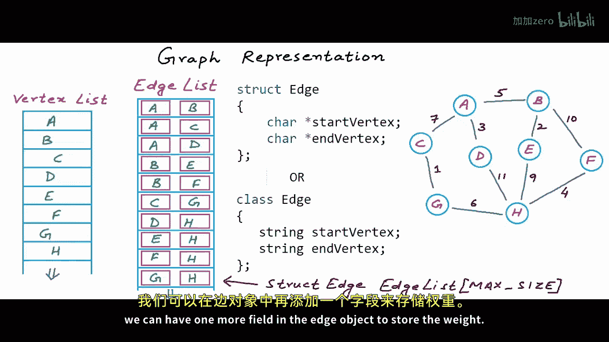
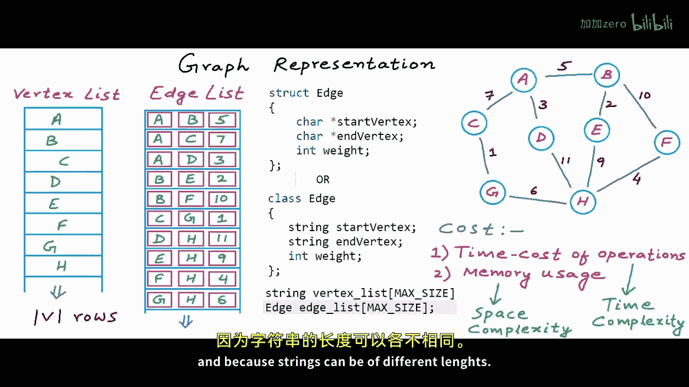
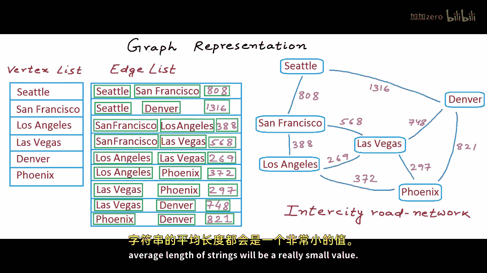
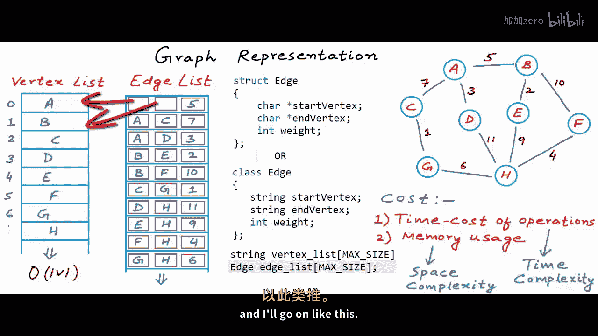
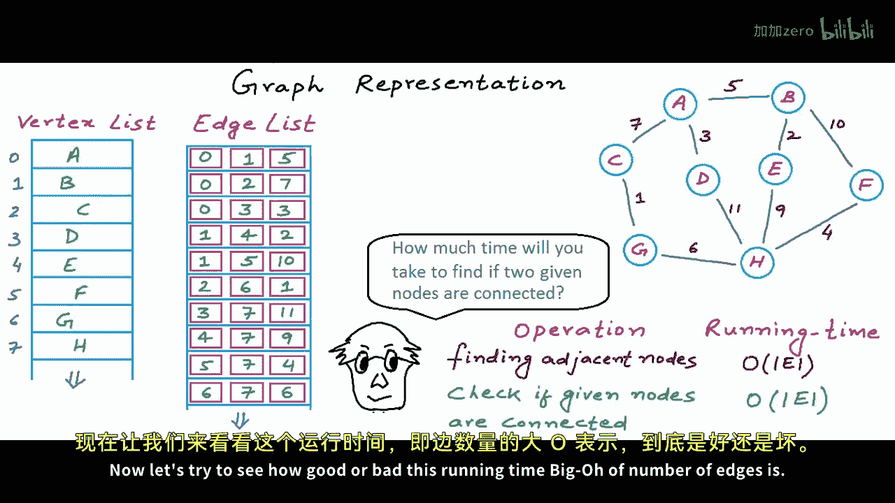
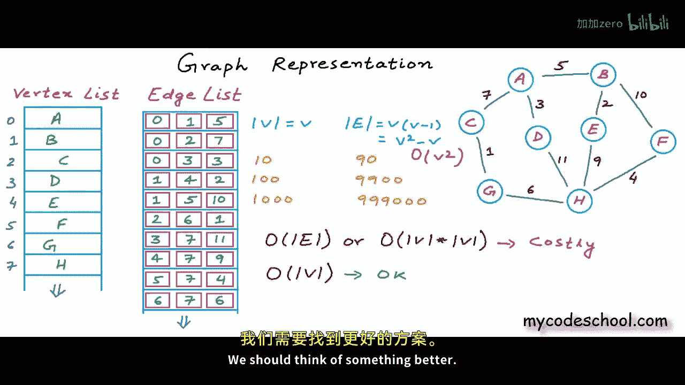
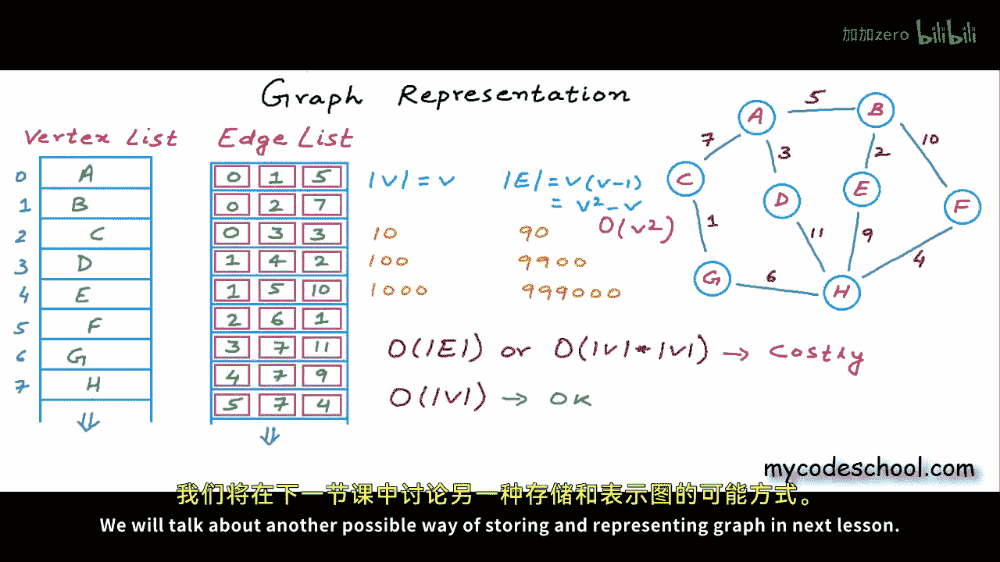

# 040：图的表示方法（第一部分）—— 边列表 🗺️

## 概述
在本节课中，我们将学习如何在计算机内存中表示和存储图数据结构。我们将从最简单的方法——边列表开始，分析其内存使用和时间成本，并理解其优缺点。

---

## 图的定义
在之前的课程中，我们介绍了图的概念及其一些基本属性。但到目前为止，我们尚未讨论如何在计算机中实现图，即如何在内存中创建图这样的逻辑结构。

图包含一组顶点和一组边。这是我们在纯数学术语中定义图的方式：一个图 **G** 被定义为一个有序对，包含顶点集 **V** 和边集 **E**。

**公式：** `G = (V, E)`

---

## 边列表表示法
为了在计算机内存中创建和存储图，我们可能做的最简单的事情是创建两个列表：一个用于存储所有顶点，另一个用于存储所有边。对于列表，我们可以使用适当大小的数组，或者使用动态列表的实现（例如 C++ 中的 `vector` 或 Java 中的 `ArrayList`）。

顶点由其名称标识。因此，第一个列表（顶点列表）将只是一个名称或字符串的列表。

边由其两个端点标识。我们可以创建一个具有两个字段的边对象。我们可以将边定义为一个结构体或类，包含两个字段：一个用于存储起始顶点，另一个用于存储结束顶点。边列表本质上就是这种 `Edge` 结构体的数组或列表。

**代码示例（C风格）：**
```c
struct Edge {
    char* startVertex;
    char* endVertex;
    // 对于加权图，可以添加：int weight;
};
```

**代码示例（C++/Java风格，使用索引）：**
```cpp
struct Edge {
    int startVertexIndex;
    int endVertexIndex;
    // int weight; // 对于加权图
};
```

---



## 构建示例图的边列表
让我们为一个示例图填充边列表。考虑以下无向图：


顶点列表：`[A, B, C, D, E, F, G, H]`

对于无向图，边的顺序不重要（例如，`(A, B)` 和 `(B, A)` 表示同一条边）。因此，边列表可以如下所示：

| 起始顶点索引 | 结束顶点索引 | 权重（若为加权图） |
| :--- | :--- | :--- |
| 0 (A) | 1 (B) | (例如) 4 |
| 0 (A) | 2 (C) | 1 |
| 0 (A) | 3 (D) | 3 |
| 1 (B) | 4 (E) | 2 |
| 1 (B) | 5 (F) | 5 |
| 2 (C) | 6 (G) | 2 |
| 3 (D) | 7 (H) | 1 |
| 4 (E) | 7 (H) | 3 |
| 5 (F) | 7 (H) | 2 |
| 6 (G) | 7 (H) | 4 |

> **注意：** 在无向图中，每条边只需存储一次。在有向图中，`(F, H)` 和 `(H, F)` 代表两条不同的边，需要分别存储。对于加权图，只需在边对象中添加一个权重字段。



---

## 空间复杂度分析
现在我们来分析这种表示方法的内存使用情况，即空间复杂度。



*   **顶点列表：** 存储空间与顶点数量 **V** 成正比。假设顶点名称的平均长度是一个常数，则空间复杂度为 **O(V)**。
*   **边列表：** 如果使用顶点索引（整数）而非字符串副本，每条边的存储开销是固定的。存储空间与边的数量 **E** 成正比。因此，空间复杂度为 **O(E)**。

**公式：** 总空间复杂度 = **O(V + E)**

这种内存使用率是合理的，因为要存储一个图，我们至少需要存储所有顶点和所有边的信息。

---

## 时间复杂度分析与常见操作
上一节我们分析了内存使用，本节我们来看看在这种表示下执行常见操作所需的时间成本。对于任何数据结构，我们都需要关注其最常见操作的时间复杂度。



以下是使用边列表时两个常见操作的分析：

**1. 查找给定节点的所有相邻节点**
要找到与给定节点直接连接的所有节点，我们必须扫描整个边列表，检查每条边的起始或结束顶点是否是该节点。

*   **操作：** 线性搜索整个边列表。
*   **时间复杂度：** **O(E)**，其中 E 是边的数量。

**2. 判断两个给定节点是否相连**
要检查两个节点之间是否存在边，我们同样需要对边列表进行线性搜索，寻找匹配该节点对的边。

*   **操作：** 线性搜索整个边列表。
*   **最坏情况时间复杂度：** **O(E)**。

---

## 边列表的局限性
现在让我们评估一下 **O(E)** 这个时间复杂度是好是坏。回忆一下之前课程的内容：在一个有 **V** 个顶点的简单图中，最大边数可以达到 **O(V²)** 级别（例如，完全图）。

**公式（无向图最大边数）：** `E_max = V * (V - 1) / 2 ≈ O(V²)`



因此，**O(E)** 的操作在最坏情况下可能接近 **O(V²)**。与 **O(V)** 的操作相比，**O(V²)** 的成本要高得多，尤其是在稠密图（边数很多）中。

**结论：** 边列表表示法在内存使用上是高效的，但在执行查找相邻节点或判断连通性等常见操作时，时间复杂度较高（**O(E)**，可能达到 **O(V²)**），这被认为是低效的。

---

## 总结
本节课中，我们一起学习了图的边列表表示法。
*   我们了解了如何用顶点列表和边列表在内存中表示图。
*   我们分析了其空间复杂度为 **O(V + E)**，这是存储图所必需的最低限度。
*   我们重点分析了两种常见操作（查找相邻节点和判断连通性）的时间复杂度均为 **O(E)**。
*   由于在稠密图中 E 可能达到 **O(V²)**，因此边列表在时间效率上存在显著缺陷。





正因为这些局限性，我们需要寻找更高效的图表示方法。在下一节课中，我们将探讨另一种更优的图存储和表示方式。