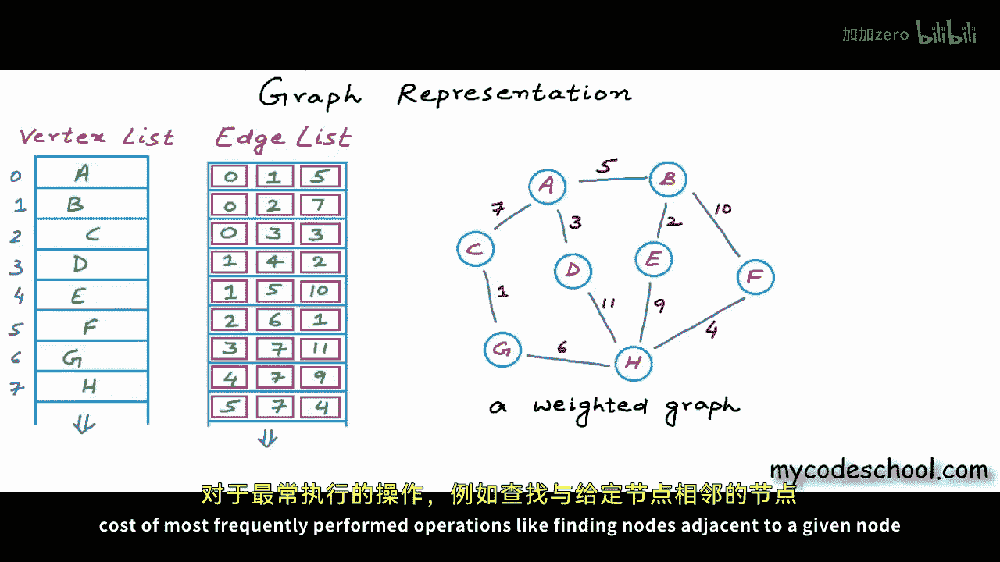
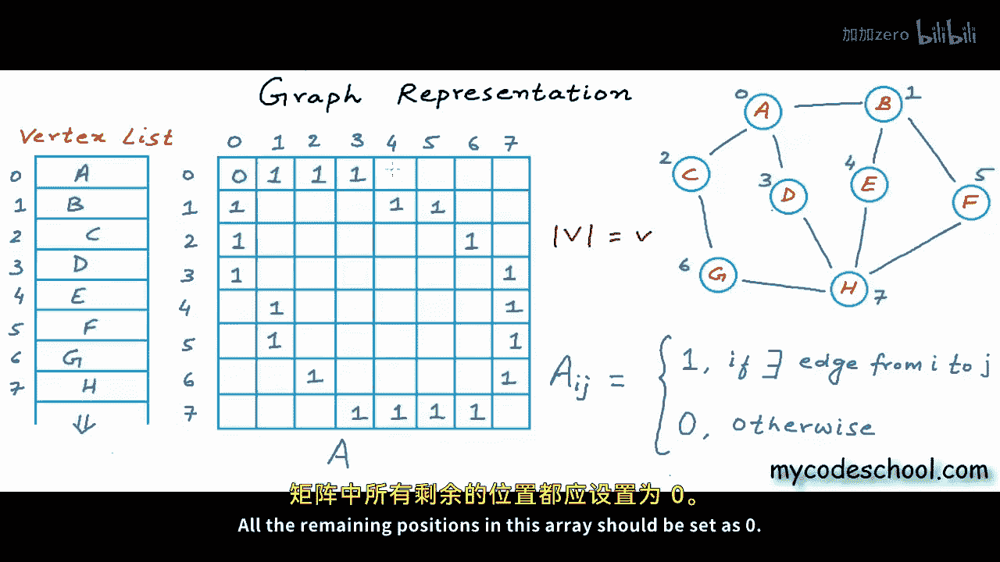
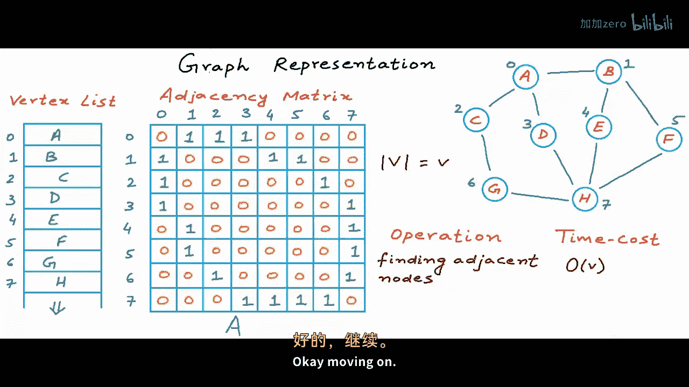
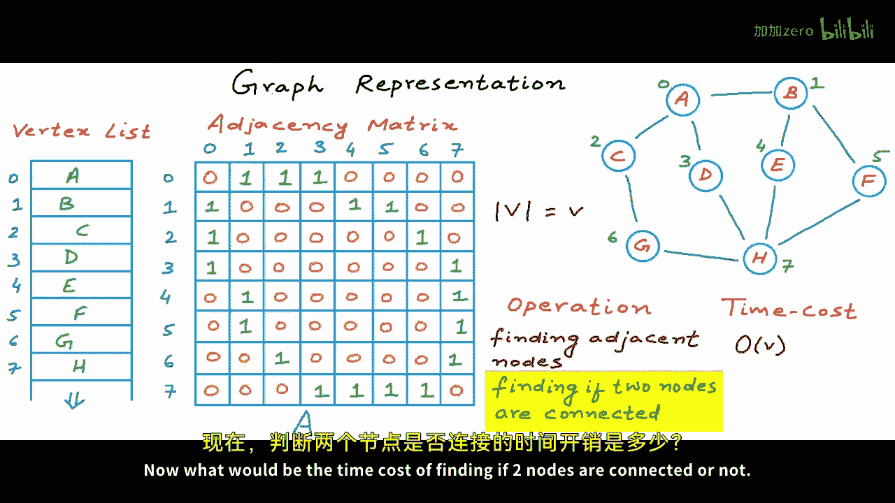
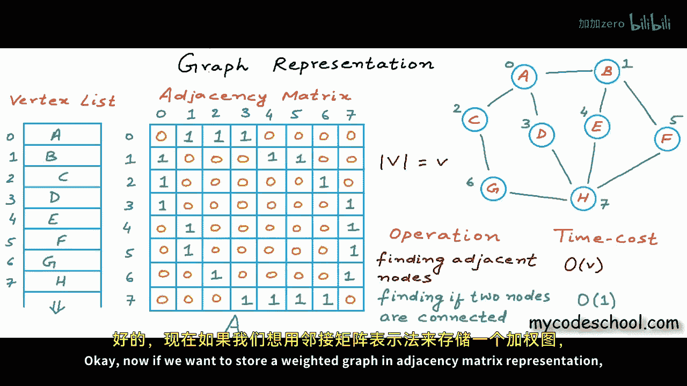
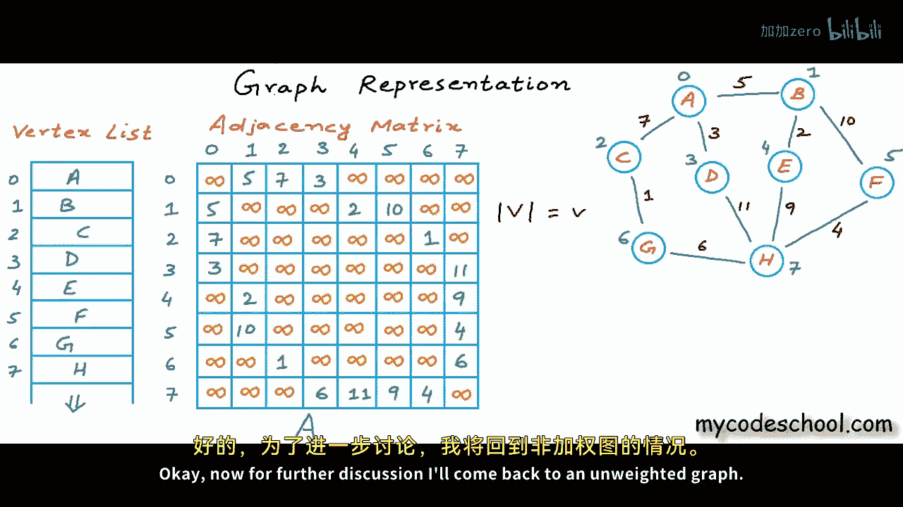
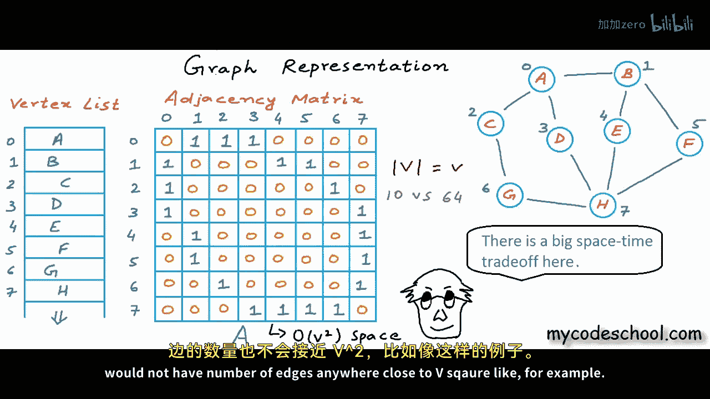
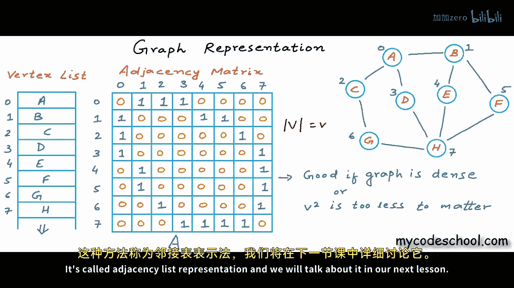

# 041：图的表示方法（二） - 邻接矩阵 📊

在本节课中，我们将学习图的第二种表示方法——邻接矩阵。我们将探讨其工作原理、优缺点，并通过具体例子理解其时间与空间复杂度。



---

## 概述


上一节我们介绍了使用边列表（Edge List）来存储图。本节中，我们将探讨一种更高效的表示方法——邻接矩阵（Adjacency Matrix）。我们将学习如何构建邻接矩阵，分析其执行常见操作的时间成本，并讨论其适用场景。

## 邻接矩阵表示法


邻接矩阵使用一个二维数组（矩阵）来存储图中顶点之间的连接关系。

### 核心概念

对于一个具有 **V** 个顶点的图，我们创建一个大小为 **V × V** 的二维数组 `A`。数组中的每个元素 `A[i][j]` 表示顶点 `i` 和顶点 `j` 之间是否存在一条边。

**对于无权图：**
*   如果存在从顶点 `i` 到顶点 `j` 的边，则 `A[i][j] = 1`（或 `true`）。
*   如果不存在边，则 `A[i][j] = 0`（或 `false`）。

**对于有权图：**
*   如果存在从顶点 `i` 到顶点 `j` 的边，则 `A[i][j] = 该边的权重`。
*   如果不存在边，则 `A[i][j] = 一个特殊值`（如 `INF`，表示无穷大）。



### 构建示例

考虑以下具有8个顶点的无向无权图：

```
顶点: A(0), B(1), C(2), D(3), E(4), F(5), G(6), H(7)
边: (0-1), (0-2), (0-3), (1-4), (1-5), (2-6), (3-7), (4-7), (5-7), (6-7)
```

其对应的邻接矩阵 `A` 如下所示（为简洁起见，仅展示非零部分逻辑）：


```
   0 1 2 3 4 5 6 7
0: 0 1 1 1 0 0 0 0
1: 1 0 0 0 1 1 0 0
2: 1 0 0 0 0 0 1 0
3: 1 0 0 0 0 0 0 1
4: 0 1 0 0 0 0 0 1
5: 0 1 0 0 0 0 0 1
6: 0 0 1 0 0 0 0 1
7: 0 0 0 1 1 1 1 0
```

**注意：** 对于无向图，邻接矩阵是对称的，即 `A[i][j] = A[j][i]`。对于有向图，则不一定对称。

---

## 操作的时间复杂度分析

了解了邻接矩阵的结构后，我们来看看基于此结构执行常见操作需要多少时间。





### 1. 查找某个节点的所有邻接节点

假设我们要查找与节点 `F`（索引为5）相邻的所有节点。

操作步骤如下：
1.  **获取索引（若给定的是名称）**： 需要扫描顶点列表以找到 `F` 对应的索引5。最坏情况下，这需要检查所有 **V** 个顶点，时间复杂度为 **O(V)**。
2.  **扫描矩阵行**： 在邻接矩阵中，找到第5行，并扫描该行的所有 **V** 个元素，找出值为1的位置。时间复杂度为 **O(V)**。

因此，总时间复杂度为 **O(V)**。如果配合哈希表（将顶点名称直接映射到索引），第一步可优化至 **O(1)**，但扫描行仍需 **O(V)**。

### 2. 判断两个节点是否相连

假设我们要判断节点 `A`（索引0）和节点 `F`（索引5）是否相连。



操作步骤如下：
1.  **获取索引（若给定的是名称）**： 同样，可能需要 **O(V)** 时间（或使用哈希表优化为 **O(1)**）。
2.  **访问矩阵元素**： 直接访问 `A[0][5]` 的值。在二维数组中，这是一个常数时间操作，即 **O(1)**。



因此，如果直接使用索引，此操作的时间复杂度为优秀的 **O(1)**。

---

## 空间复杂度与优缺点

邻接矩阵在时间效率上表现不错，但我们需要评估其空间消耗。

### 空间复杂度



邻接矩阵需要存储一个 **V × V** 的二维数组。无论图中有多少条边，它都占用固定的 **V²** 个存储单元。因此，其空间复杂度为 **O(V²)**。

### 优缺点总结

以下是邻接矩阵的主要优缺点：

**优点：**
*   **查询速度快**： 判断任意两点间是否存在边仅需 **O(1)** 时间（若已知索引）。
*   **结构简单**： 对于稠密图（边数接近 V²）来说，存储效率高。
*   **易于实现**： 矩阵操作直观，便于理解和编码。

**缺点：**
*   **空间消耗大**： 需要 **O(V²)** 的空间，对于稀疏图（边数远小于 V²）会浪费大量空间存储 `0`。
*   **添加/删除顶点开销大**： 需要重新调整整个矩阵的大小。

### 现实世界的考量

大多数现实世界的图都是稀疏的。例如：
*   **社交网络**： 一个人不可能与全球数十亿用户都成为好友。假设有 **10⁹** 用户，每人平均有1000个朋友，边数约为 **5 × 10¹¹**，而矩阵需要 **10¹⁸** 的存储空间，这是不现实的。
*   **万维网**： 一个网页只会链接到少数其他网页，而非所有网页。


对于这类稀疏图，邻接矩阵会消耗巨大且不必要的内存。

---

## 总结

本节课我们一起学习了图的邻接矩阵表示法。
*   我们了解了如何用一个 **V × V** 的二维数组来表示顶点间的连接。
*   我们分析了基于邻接矩阵进行“查找邻接节点”和“判断连通性”等操作的时间复杂度，分别为 **O(V)** 和 **O(1)**。
*   我们重点讨论了其 **O(V²)** 的空间复杂度，并认识到这对于顶点数量庞大、连接稀疏的现实世界图（如社交网络、网页链接）来说是一个主要缺点。



虽然邻接矩阵在查询速度上具有优势，但其巨大的空间开销限制了它在稀疏图中的使用。因此，我们需要寻找一种既能保持高效操作，又更节省空间的表示方法。下一节，我们将介绍这样一种方法——邻接表（Adjacency List）。