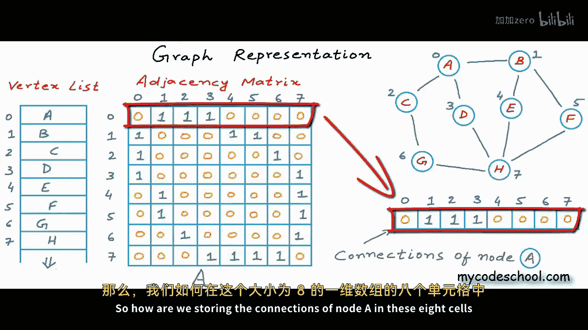
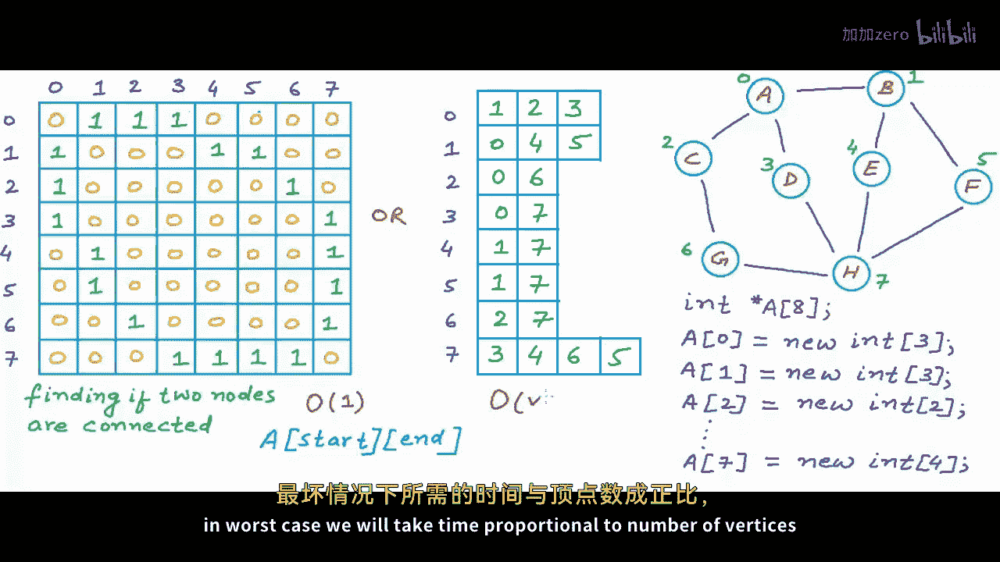
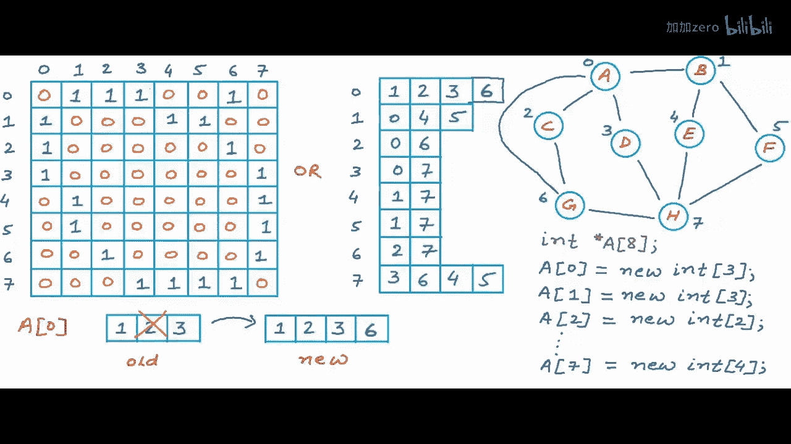
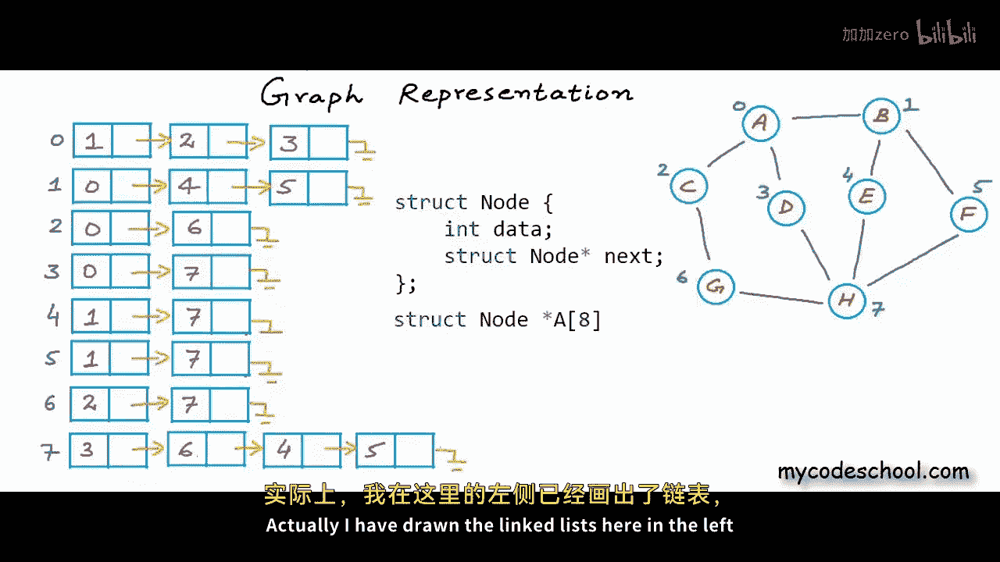
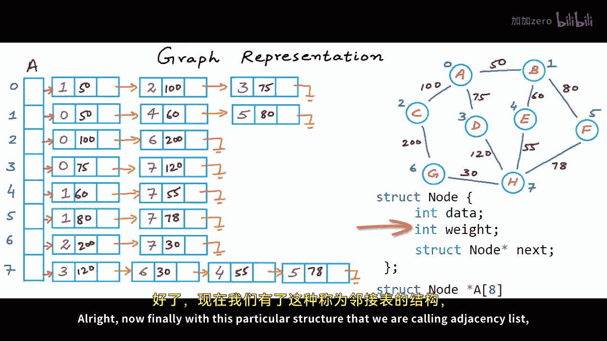
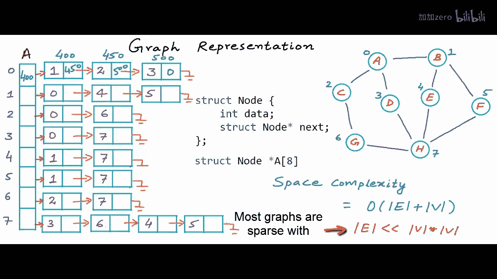

# 042：图的表示方法（三） - 邻接表

在本节课中，我们将学习图的另一种存储和表示方法——邻接表。我们将分析其空间和时间效率，并与之前介绍的邻接矩阵进行比较，以理解它们各自的优缺点。


## 概述



上一节我们介绍了邻接矩阵作为存储和表示图的一种方式。通过分析，我们发现邻接矩阵在操作的时间成本上非常高效，例如判断两个节点是否相连只需常数时间 `O(1)`，查找一个节点的所有邻居需要 `O(V)` 时间（V为顶点数）。然而，邻接矩阵在空间消耗上效率不高，其空间复杂度为 `O(V^2)`。

本节中，我们将探讨邻接表这种数据结构，它旨在解决邻接矩阵空间消耗过大的问题，特别是在处理稀疏图时。


## 邻接矩阵的回顾与问题

在邻接矩阵表示法中，我们使用一个大小为 `V x V` 的二维数组（矩阵）来存储边，其中 `V` 是图中的顶点数。例如，对于一个有8个顶点的图，我们需要一个 `8 x 8` 的矩阵，消耗64个单位的空间。

在这个矩阵中，每一行对应一个顶点，存储了该顶点与其他所有顶点的连接信息。行索引代表边的起点，列索引代表边的终点。单元格中的值（0或1）表示是否存在从起点到终点的边。

然而，这种方法存储了大量冗余信息。对于大多数真实世界的图（如社交网络），它们是稀疏的，即实际连接数远小于可能的最大连接数 `V^2`。这意味着矩阵中会有大量的0（表示“无连接”），而只有少量的1（表示“有连接”）。这些0造成了巨大的内存浪费。

## 邻接表的基本思想


为了解决空间浪费问题，我们可以只存储“有连接”的信息，而忽略“无连接”的信息，因为后者可以被推断出来。


以下是实现这一想法的基本方法：

对于每个顶点，我们不再使用一个固定大小的数组（其索引代表其他顶点），而是维护一个列表，仅包含与该顶点直接相连的邻居节点的标识符（例如索引或名称）。这个列表可以使用数组、链表甚至平衡二叉搜索树等数据结构来实现。

## 邻接表的实现方式


程序上，我们可以创建一个指针数组（或引用数组），数组大小为顶点数 `V`。数组中的每个元素（指针）指向一个动态数据结构，该结构存储了对应顶点的邻居列表。

例如，在C/C++中，可以这样实现：
```c
// 假设使用链表存储邻居
struct ListNode {
    int vertex;
    struct ListNode* next;
};


struct ListNode* adjacencyList[V]; // 指针数组
```
`adjacencyList[i]` 指向一个链表，该链表包含了顶点 `i` 的所有邻居。



## 空间复杂度分析

邻接表的主要优势在于空间效率。

*   对于无向图，每条边会被存储两次（分别在两个端点的邻居列表中），因此总空间消耗与边数 `E` 成正比，约为 `2E`。
*   对于有向图，每条边只存储一次，空间消耗约为 `E`。


因此，邻接表的空间复杂度为 `O(V + E)`。在稀疏图（`E` 远小于 `V^2`）中，这比邻接矩阵的 `O(V^2)` 要高效得多。

## 时间复杂度分析

现在，我们来比较两种结构下常见操作的时间成本。

以下是关键操作的时间复杂度对比：


| 操作 | 邻接矩阵 | 邻接表（使用链表/无序数组） | 邻接表（使用有序数组/平衡BST） |
| :--- | :--- | :--- | :--- |
| 判断两节点是否相连 | `O(1)` | `O(degree(V))`* | `O(log(degree(V)))`* |
| 查找节点的所有邻居 | `O(V)` | `O(degree(V))`* | `O(degree(V))`* |
| 添加一条边 | `O(1)` | `O(1)`（链表头插）或 `O(degree(V))`（维护有序） | `O(log(degree(V)))` |
| 删除一条边 | `O(1)` | `O(degree(V))` | `O(log(degree(V)))` |

*注：`degree(V)` 表示顶点V的度（邻居数量）。在稀疏图中，`degree(V)` 远小于 `V`。*

虽然邻接矩阵在“判断连接”操作上有绝对的常数时间优势，但在稀疏图的实际场景中，邻接表在“查找所有邻居”和“修改图结构”操作上通常表现更佳，因为其成本取决于顶点的实际邻居数量，而非顶点总数。



## 邻接表的变体与优化

我们可以根据需求选择不同的数据结构来实现每个顶点的邻居列表：




*   **动态数组**：易于实现，但插入/删除可能涉及数组扩容和数据拷贝。
*   **链表**：插入和删除（尤其在头部）效率高，`O(1)`，但查找需要线性扫描。
*   **平衡二叉搜索树（如AVL树、红黑树）**：可以将查找、插入、删除操作的时间复杂度都优化到 `O(log(degree(V)))`，但实现更复杂。

对于加权图，只需在邻居列表的节点结构中增加一个权重字段即可。


## 总结



本节课我们一起学习了图的邻接表表示法。


*   我们首先回顾了邻接矩阵空间消耗大的问题，特别是在处理稀疏图时。
*   接着，引入了邻接表的核心思想：只为每个顶点存储其实际存在的邻居列表，从而消除冗余的“无连接”信息。
*   我们分析了邻接表的空间复杂度为 `O(V + E)`，在稀疏图中远优于邻接矩阵。
*   然后，我们对比了两种结构在各种图操作上的时间复杂度。邻接表在稀疏图的大多数操作中更具实际优势，尽管邻接矩阵在特定操作上有理论上的最优时间。
*   最后，我们探讨了使用链表、平衡二叉搜索树等不同数据结构来实现邻居列表的优缺点。



邻接表是表示稀疏图最常用且高效的数据结构之一，在实际应用（如社交网络、路由算法）中被广泛采用。选择邻接矩阵还是邻接表，需要根据具体图的特点（稠密或稀疏）和需要频繁执行的操作类型来决定。