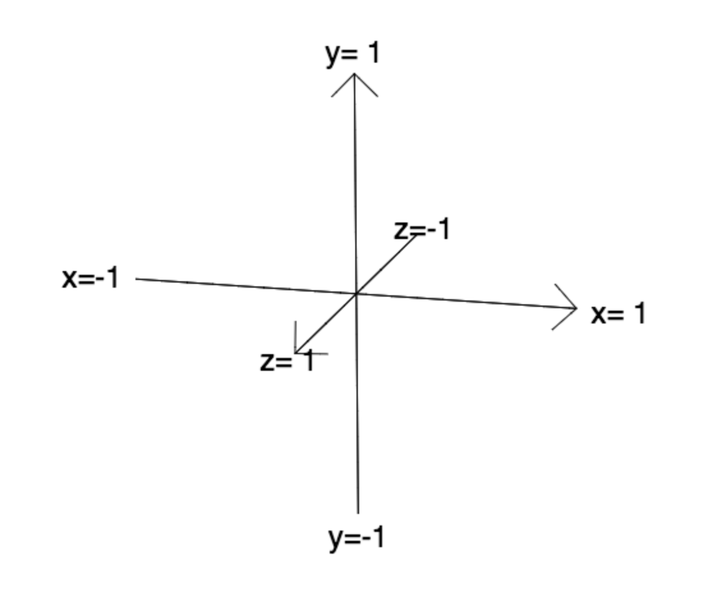
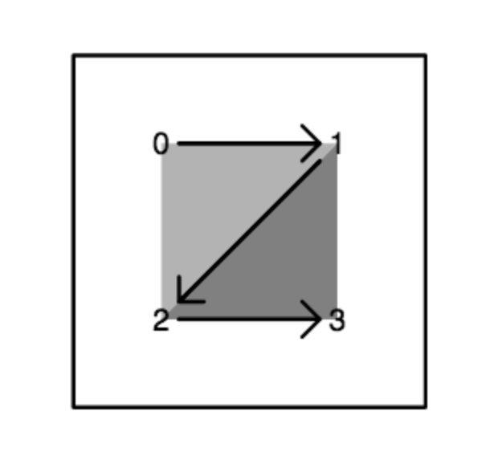
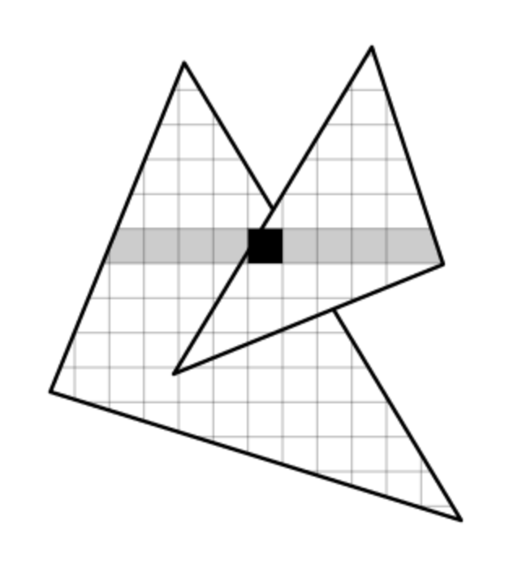
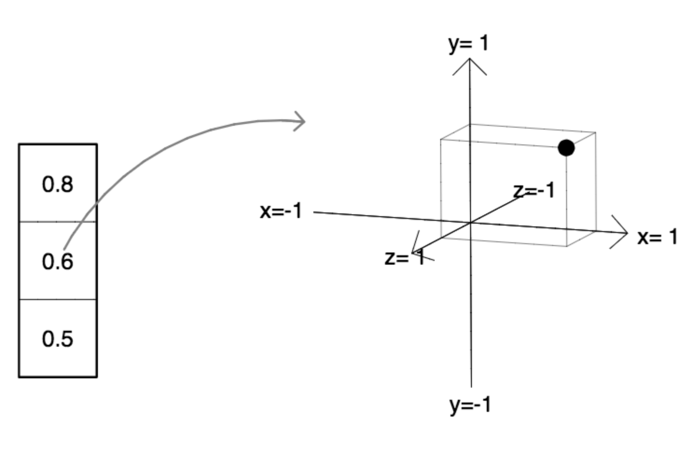

# 9 月 9 日课程笔记 -- 着色器简介

**3D 坐标系**

WebGL 存在于 3D 世界中：

+   x 向右移动

+   y 向上

+   z 向前（屏幕外）

这被称为*右手坐标系*。

现在我们将从 x、y 平面开始进行所有工作。 具体来说，我们将使用从 -1 → +1 的正方形的 x 和 y。



**正方形作为三角带**

我们的几何图形将是一个正方形。

在 WebGL 中，一切都由三角形组成，因此我们将需要两个三角形。

我们将这些定义为 *三角带*。

> 在三角带中，每三个连续的顶点构成一个新的三角形，因此我们需要指定总共四个顶点，如右图所示。



**Z 缓冲算法**

GPU（图形处理单元）使用 "Z 缓冲算法" 进行渲染。

对于每个动画帧，此算法由两个连续步骤组成：

1.  对于每个顶点：

    > GPU 运行 *顶点着色器* 以：
    > 
    > +   找出包含此顶点的图像的像素；
    > +   
    > +   设置要插值的 "varying" 值。

1.  对于每个三角形：

    > GPU 从顶点到像素进行插值。
    > 
    > 对于每个像素：
    > 
    > > GPU 运行 *片段着色器* 以：
    > > 
    > > 1.  计算颜色；
    > > 1.  
    > > 1.  如果这是像素上最近的片段，请替换图像中此像素的颜色和深度。



**Vector3 对象**

一个非常有用的数据结构是长度为 3 的向量，我们可以使用它来表示 x、y、z 坐标，如右图所示。

在 Javascript 中，我们可以通过构造函数定义此对象，该构造函数包含每个实例可以更改的所有属性，以及原型，该原型包含从一个实例到另一个实例不会更改的属性（例如设置值的函数等）。



Vector3 对象将随着学期的进展而增加功能，但右侧是一个起始版本。

请注意，x、y 和 z 属性是在构造函数中定义的，这些属性从实例到实例会改变。

set 属性，这将是所有实例的相同函数，定义在原型中。

```
function Vector3() {
   this.x = 0;
   this.y = 0;
   this.z = 0;
}
Vector3.prototype = {
   set : function(x,y,z) {
      this.x = x;
      this.y = y;
      this.z = z;
   },
}

```

**Uniform 变量**

GLSL（"GL 着色语言"）是用于 GPU 上着色器的类似 C 的语言。 其中一个关键构造是 *uniform 变量*。

GPU 上的 uniform 变量在每个像素处具有相同的值。 它们可以（并且经常）随时间改变。

按照惯例，uniform 变量名以字母 'u' 开头。

对于您的作业，我已经创建了一些有用的 uniform 变量：

```
   float uTime;    // time elapsed, in seconds

   vec3  uCursor;  // mouse position and state
                   //    uCursor.x goes from -1 to +1
                   //    uCursor.y goes from -1 to +1
                   //    uCursor.z is 1 when mouse down, 0 when mouse up.

```

**顶点着色器**

*顶点着色器* 是您（应用程序员/艺术家）编写的在 GPU 上在每个顶点运行的程序。 它是用特殊用途语言 GLSL 编写的。

右侧是一个非常简单的顶点着色器程序。"属性"是从 CPU 传入的常量值。在这种情况下，它是`aPosition`，场景中每个顶点的 x、y、z 位置。它是`vec3`类型，这意味着它由三个 GLSL 浮点数组成。

```
   attribute vec3 aPosition;
   varying   vec3 vPosition;
   void main() {
      gl_Position = vec4(aPosition, 1.0);
      vPosition = aPosition;
   }

```

顶点着色器最强大的功能之一是设置“varying”变量。然后 GPU 会在使用这个顶点的任何三角形的像素上对这些值进行插值。这个插值值将在每个像素处供片段着色器使用。

例如，“varying”变量`vPosition`是由这个顶点着色器设置的。按照惯例，变量的名称以字母'v'开头。

这个顶点着色器做了两件事：

+   通过设置`gl_Position`，它确定了这个顶点将出现在图像的哪个像素上。

+   它将 varying 变量`vPosition`设置为等于此顶点的属性位置`aPosition`。

**片段着色器**

*片段着色器*是您（应用程序员）编写的在每个像素处运行的程序。

因为不同三角形的片段可以在每个像素处可见（例如：当三角形非常小，或者像素在一个三角形的边缘部分遮挡另一个三角形时），通常我们实际上是在定义像素片段的颜色，这就是为什么这些被称为片段着色器。

由于我们的顶点着色器为`vPosition`设置了一个值，我们编写的任何片段着色器都将能够利用这个变量，其值现在已经被插值到像素级别。

**WebGL 指南**

有许多关于 WebGL 的在线指南。我发现这个[WebGL 基础教程](http://webglfundamentals.org)对于新手来说非常清晰易懂。

我还发现这个[快速参考卡](https://www.khronos.org/files/webgl/webgl-reference-card-1_0.pdf)在编写 WebGL 着色器时非常有用。我认为你会发现最后一页的内置函数列表特别有用。

**作业 1**

本周的作业是从这个 zip 文件中的代码开始，我们在课堂上讨论过，然后用您自己的迷人、精彩和原创的片段着色器替换 index.html 中的片段着色器。

***重要提示：*** 创造属于你自己的东西。不要只是对我在课堂上所做的进行微小变化。玩得开心。

你的作业要在下周课程开始之前完成。
