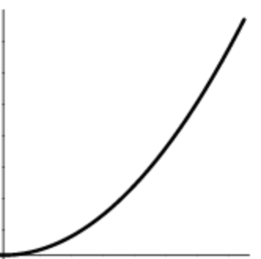
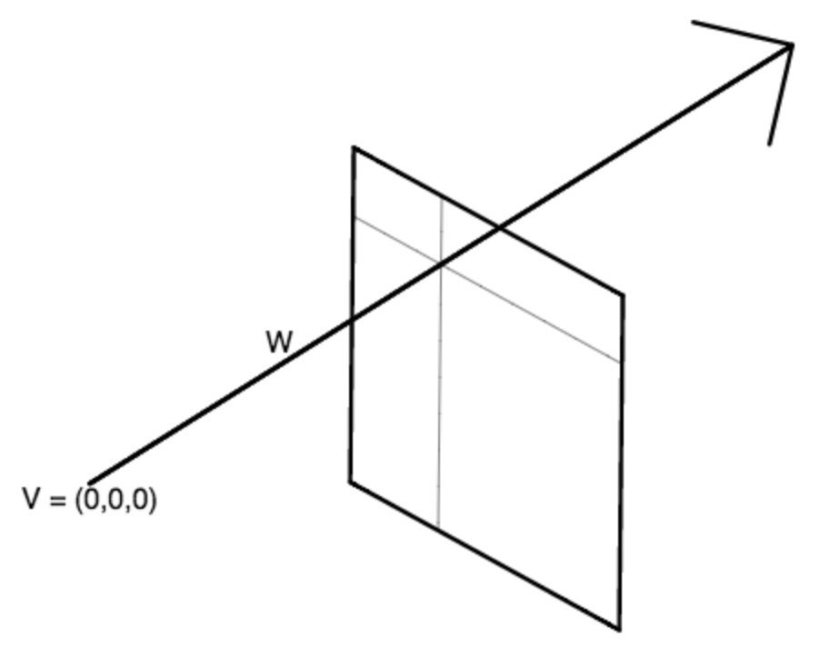
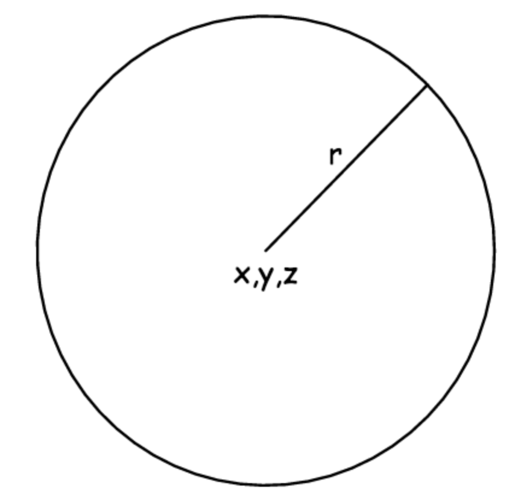
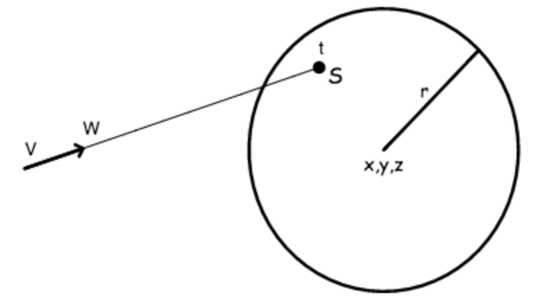
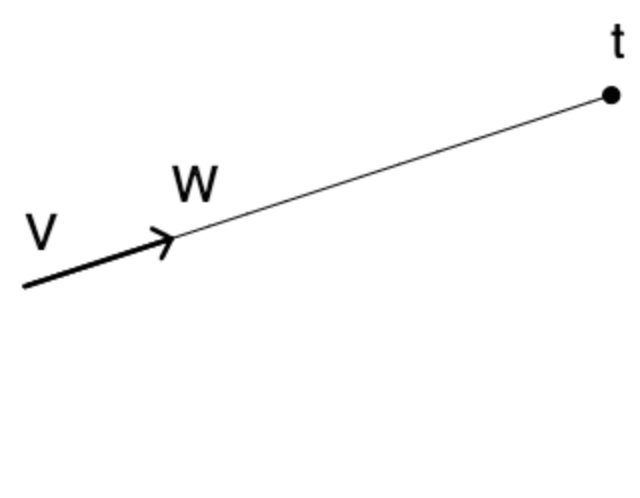
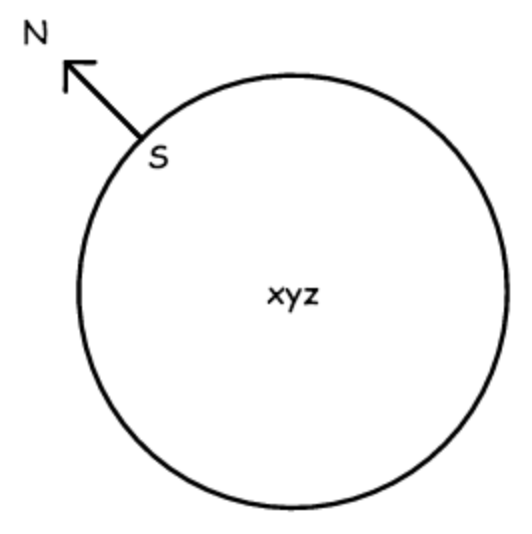
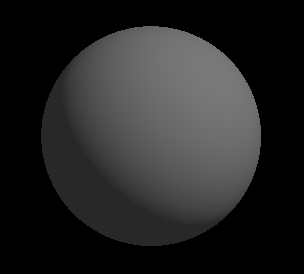

# 9 月 16 日课程笔记--射线追踪简介

**WebGL 速查表**

> 正如我上周提到的，这里有一个方便的[WebGL 紧凑指南。](https://www.khronos.org/files/webgl/webgl-reference-card-1_0.pdf)
> 
> 特别是最后一页对于在 OpenGL ES 中编写着色器非常有用。
> 
> 请注意，OpenGL ES 片段着色器不允许递归。

**伽马校正**

> 显示器使用“伽马曲线”调整人类感知，因为人们可以感知到非常大范围的亮度。
> 
> 例如，右侧的图像显示了水平轴上的值 0...255，虚拟轴上的实际显示亮度。
> 
> 不同的显示器有所不同，但这种调整通常大约是 x²
> 
> 由于我们所有的计算实际上都是在求解实际光子的总和，我们需要在线性亮度下进行所有数学运算，然后在完成时进行伽马校正：
> 
> > 粗略地说：c → sqrt(c)

*输出亮度*



*输入值 0 ... 255*

**射线追踪：*形成一条射线***

> 在每个像素处，从原点 V =（0,0,0）射出一条射线，击中一个位于 z = -f 平面上的虚拟屏幕。
> 
> 我们将 f 称为这个虚拟相机的“焦距”。
> 
> 指向任何像素的光线目标是：(x, y, -f)，其中-1 ≤ x ≤ +1，-1 ≤ y ≤ +1。
> 
> 因此，射线方向 W = normalize（vec3（x，y，-f））。
> 
> 为了在任何像素渲染场景的图像，我们需要跟随该像素处的射线，并查看射线首先遇到的对象（如果有）是什么。
> 
> 换句话说，在点 V + Wt 处最近的对象，其中 t > 0。



**射线追踪：*定义一个球体***

> 我们可以用长度为 4 的 GLSL 向量来描述一个球体：
> 
> > `vec4 sphere = vec4(x,y,z,r);`
> > 
> 其中（x，y，z）是球体的中心，r 是球体的半径。
> 
> 正如我们在课堂上讨论的那样，GLSL 中的 vec4 的分量可以通过两种方式之一访问：
> 
> ```
> v.x, v.y, v.z, v.w // when thought of as a 4D point
> v.r, v.g, v.b, v.a // when thought of as a color + alpha
> 
> ```
> 
> 因此，在片段着色器`vec4`中访问你的球体半径的值时，你将希望将其称为 sphere.w（而不是 sphere.r）。



**射线追踪：*找到射线击中球体的位置***

> D = V - sph.xyz // 从球体中心到射线起点的向量。
> 
> 这样做减法的目的是，我们实际上在解决射线追踪到原点（0,0,0）处的球体的问题，这个问题要容易得多。
> 
> 因此，我们不是解决追踪射线 V+Wt 到以 sph.xyz 为中心的球体的更复杂问题，而是解决等效但简单得多的问题，即追踪射线 D+Wt 到以（0,0,0）为中心的球体。
> 
> （D + Wt）² = sph.r² //找到沿射线距离球体中心 r 的���。
> 
> （D + Wt）² - sph.r² = 0 //需要解决 t。
> 
> 一般来说，如果 a 和 b 是向量，那么 a • b =（a[x] * b[x] + a[y] * b[y] + a[z] * b[z]）
> 
> 这个“内积”也等于：|a| * |b| * cos(θ)
> 
> 将这些项相乘，我们需要解决以下二次方程：
> 
> > （W • W）t² +
> > 
> > 2（W • D）t +
> > 
> > (D • D) - r² = 0
> > 
> 由于射线方向 W 是单位长度，因此此方程中的第一项（W • W）只是 1。



**光线追踪：*找到最近的交点***

> 计算场景中所有球体的交点。
> 
> 在此像素处可见的球体（如果有的话），是具有最小正 t 值的球体。

**光线追踪：*计算表面点***

一旦我们知道 t 的值，我们只需将其代入射线方程中，即可得到在此射线可见的球体表面点的位置，如下方程和右侧图所示：

> S = V + W t



**光线追踪：*计算表面法线***

现在我们需要计算表面法线，以便计算球体如何与光线相互作用，从而在此像素产生最终颜色。

“表面法线”是垂直于球体表面的单位长度向量，即如果你站在表面上的“向上”方向。

对于一个球体，我们可以通过从球体中心减去表面点 S，然后除以球体半径来获得这个值：

> N = (S - sph.xyz) / sph.r



**光线追踪：*一个简单的着色器***

无穷远处的简单光源可以定义为 rgb 颜色，以及 xyz 光线方向：

```
   vec3 lightColor;     // rgb
   vec3 lightDirection; // xyz

```

一个简单的漫反射表面材质可以由独立于任何特定光源的 rgb“环境”分量和为每个光源添加的 rgb“漫反射”分量来定义：

```
   vec3 ambient;   // rgb
   vec3 diffuse;   // rgb

```

右侧的图显示了一个漫反射球体，其中每个像素点的位置计算如下：

> 环境光 + 光源颜色 * 漫反射 * max(0, 法线 • 光线方向)



**光线追踪：*多光源***

如果场景包含多个光源，则可以通过以下方式计算球体上点的像素颜色：

> 环境光 + ∑[n]（光源颜色[n] * 漫反射 * max(0, 法线 • 光线方向[n])）

其中 n 在场景中的光源上进行迭代。

**课程结束时我们观看了一个视频：**

> 由 Chris Landreth 执导的获得奥斯卡奖的短片[**Ryan**](http://videosift.com/video/Chris-Landreth-Ryan-Oscar-winning-animated-short)。

**作业**

+   在片段着色器中为球体实现简单的光线追踪。

    正如我们在课堂上所说，您可以从此代码库开始。

+   实现简单的漫反射阴影。

+   额外加分：多个球体

    > ***提示：*** 您可以创建并使用球体数组，如下所示：
    > 
    > ```
    >       vec4 spheres[3]; // Note that I am explicitly setting the size of the array.
    >       ...
    >       for (int i = 0 ; i < 3 ; i++) { // and also the size of the loop.
    >          ... spheres[i] ...
    >       }
    >    
    > ```
    > 
    > 如果尝试这个额外加分，请确保在每个像素处选择具有最小 t 值的球体。

+   额外加分：多个光源

+   额外加分：程序纹理

+   制作一些酷炫有趣的东西，尝试创建一些交互式的（使用 uCursor）和/或动画的（使用 uTime）。
