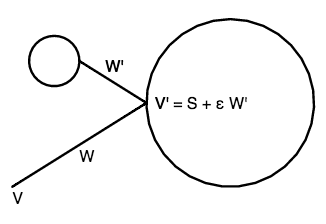

# 9 月 30 日课堂笔记 -- 更多光线追踪

**Phong 镜面反射模型**

> 表面反射的第一个真正有趣的模型是由 Bui-Tong Phong 在 1973 年开发的。在此之前，计算机图形学表面仅使用漫反射兰伯特反射来渲染。Phong 的模型是第一个考虑到镜面高光的模型。
> 
> Phong 模型首先通过定义一个反射向量 R 来开始，该向量是光源方向 L 关于表面法线 N 的反射。
> 
> 正如我们在课堂上展示的，并且从右边的图表中可以看到的那样，它由以下公式给出：
> 
> > R = 2 (N • L) N - L

> 一旦 R 被定义，那么 Phong 模型近似表面反射的 *镜面* 组件为：
> 
> > s[rgb] max(0, E • R)^p )
> > 
> 其中 s[rgb] 是镜面反射的颜色，p 是镜面功率，E 是指向眼睛的方向（在我们的情况下，E = -W，即光线方向的反向）。镜面功率 p 越大，表面看起来就越 "光滑"。
> 
> 要得到完整的 Phong 反射，我们对场景中的光源求和：
> 
> > a[rgb] + ∑[i] lightColor[i] ( d[rgb] max(0, N • L[i]) + s[rgb] max(0, E • R) ^p )
> > 
> a[rgb]、d[rgb] 和 s[rgb] 分别表示环境光、漫反射和镜面反射颜色，p 是镜面功率。

**Blinn 镜面反射模型**

> 几年后，吉姆·布林创建了 Phong 模型的一个变体，以在极端情况下（当观察者从远离表面法线的角度观看时）产生更逼真的高光。
> 
> 在我们通过在整个物体上近似 E 为一个常矢量并且假设光源方向 L 在整个物体上都是恒定的特殊情况下，Blinn 模型也相对较快。
> 
> 基本思想是中间向量 H 被定义为从光源方向 L 到眼睛方向 E 的中点。如果 E 和 L 是恒定的，这只需要对每个光源执行一次。
> 
> 然后在每个像素点，我们只需计算 N 和 H 的内积：
> 
> > s[rgb] max(0, N • H)^p
> > 
> 因为 H 倾向于保持相对接近 N，所以为了获得相同水平的镜面反射，Blinn 模型中的功率 p 需要比 Phong 模型中的对应值大大约三倍。

**阴影**

> 在光线追踪中，投射阴影相对容易。一旦我们找到表面点 S，然后对于每个光源，我们发射另一条光线，其起点 V' 就是表面点 S，方向 W' 就是指向那个光源 L[i] 的方向。
> 
> 我们要确保光线未击中我们起始的对象，所以我们将新光线的起点 V' 稍微向表面朝向光源的方向移动。因此，我们的 "阴影光线" 将是：
> 
> > V' = S + ε L[i]
> > 
> > W' = L[i]
> > 
> > 其中 ε 可以是任何微小的正值，例如 0.001。
> > 
> > 如果此阴影射线遇到任何其他物体，则此像素处的表面处于阴影中，我们不会添加表面反射的漫反射和镜面反射分量。
> > 
> > 右上方是一个表面不在阴影中的示例。就在下方，是一个表面在阴影中的示例，因为它的光线路径被另一个物体挡住了。

**反射**

> 光线追踪的另一个伟大之处在于，我们可以从摄像机向后继续跟踪光线的路径，以模拟镜面反射的行为。我们采用了计算菲涅尔反射模型的反射方向 R 的技术，但在该方程中用-W（沿着入射光线的反方向）替换了 L：
> 
> > W' = 2 (N • (-W)) N - (-W)
> > 
> 我们可以计算出一个新的射线，它从表面点 S 开始，朝着那个反射方向前进：
> 
> > V' = S + ε W'
> > 
> 如右图所示，我们希望将射线的起点偏移一点出表面，这样射线就不会意外地遇到物体本身。
> 
> 由此射线计算出的任何颜色，我们都将其混合到菲涅尔反射算法的结果中。结果就是具有镜面光泽的阴影表面的外观。

**布尔交集**

> 光线追踪的另一个好处是，我们可以用它来进行*布尔建模*，正如我们在课堂上讨论的那样。例如，给定两个球体 A 和 B，我们可以通过沿着射线计算它们的交点（如果有）来计算这些球体的交集。
> 
> 假设，沿着给定的射线，进入和退出球体 A 的值分别为 A[in]和 A[out]。
> 
> 还假设沿着这条射线，进入和退出球体 B 时的值分别为 B[in]和 B[out]。
> 
> 然后，两个形状沿射线的交点由进入（in）值的最大值和退出（out）值的最小值给出：
> 
> > 进入交点形状的 t[in] = max(A[in]，B[in])
> > 
> > 从交点形状退出的 t[out] = min(A[out]，B[out])
> > 
> 如果 t[in] < t[out]，那么射线就与交点形状相交。否则，射线就未与交点形状相交。
> 
> 要在像素处着色所得的交点形状，我们需要使用实际被射线击中的表面的法线。例如，如果 A[in] > B[in]，则我们需要使用 A 的表面法线。

**折射**

> 在现实世界中，许多材料，如油、水、塑料、玻璃和钻石，都是透明的。透明材料具有*折射率*，它衡量了光线进入介质时减速的程度。例如，水的折射率约为 1.333，玻璃的折射率约为 1.5。钻石的折射率是已知折射率中最高的物质，为 2.42。
> 
> 如右侧图中所示，您可以通过遵循斯涅尔定律为您的光线追踪添加折射：
> 
> > n1 / n2 = sin(θ2) / sin(θ1)
> > 
> 以确定光线进入或退出透明物体时应该弯曲多少。
> 
> 请注意，您需要更改您的光线追踪模型以包含折射。除了您最初的入射光线和任何阴影或反射光线外，您还需要添加一个折射光线，该光线从表面内部开始，并向内延伸。
> 
> 请注意，如果您已经对一个球体进行了光线追踪，并且现在正在计算折射光线将从该球体退出的位置，您将需要计算二次方程的*第二*根。
> 
> 然后，在这个折射光线从透明球体的背面退出后，您将需要计算它在出射时折射多少，并从那里向球体后面的场景发射一道光线。
> 
> 一般来说，您可以通过混合返回的颜色与由纯反射或 Blinn/Phong 反射计算出的表面颜色来使用折射的结果。

**作业（截止日期为 10 月 8 日星期三课前）**

+   实现 Phong 或 Blinn 反射模型之一。

+   实现阴影。

+   实现两个球体之间的布尔交集。

+   额外加分：

    > +   实现 Phong 和 Blinn 反射模型。
    > +   
    > +   实现反射。
    > +   
    > +   实现折射。
    > +   
    > +   实现两个以上球体之间的布尔交集。

+   一如既往，制作一些酷炫有趣的东西，尝试创建一些交互式的（使用 uCursor）和/或动画的（使用 uTime）东西。
