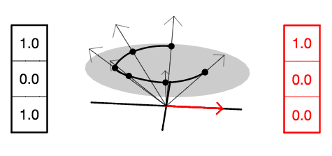
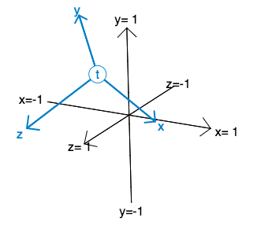
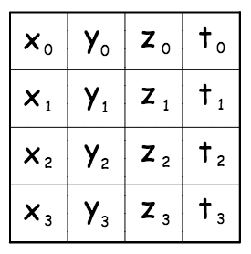
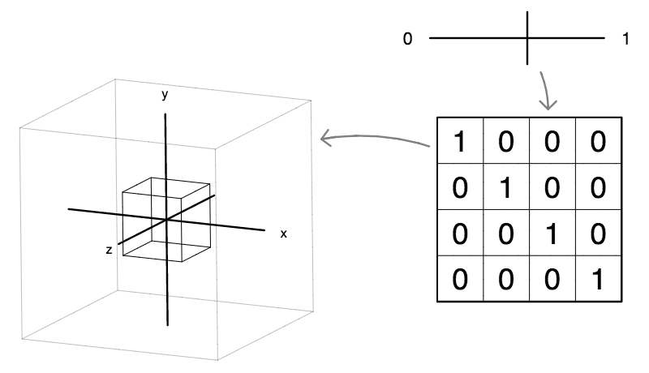
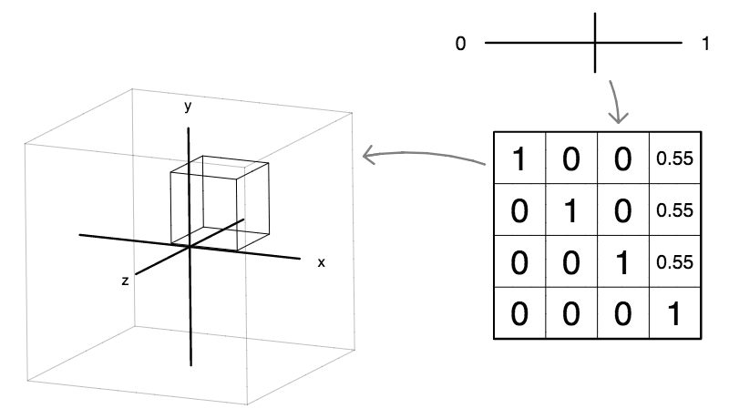
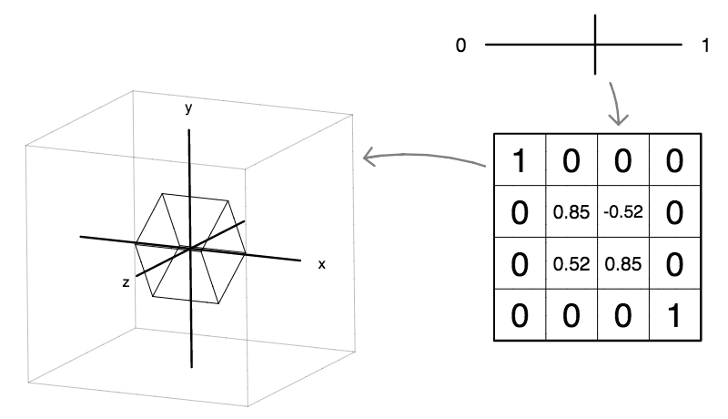
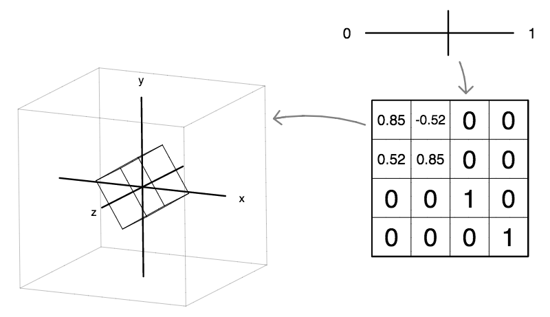
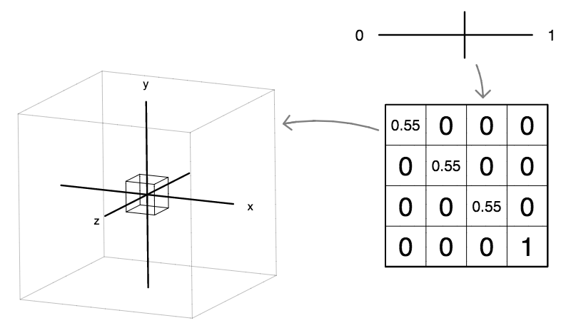

# 10 月 7 日课程笔记 -- 矩阵简介

**齐次坐标**

> 我们可以通过添加额外的坐标来处理场景中的点和方向（本质上是无穷远处的点），我们称之为*齐次坐标*。
> 
> 例如，在二维中，我们会写成 [x,y,w] 来表示 (x/w, y/w)。
> 
> 在右侧的示例中，我们既有点也有方向。点 (1,0) 由 [1,0,1] 表示，而方向向量 (1,0)（**红色**显示）由 [1,0,0] 表示。
> 
> 按照约定，我们将所有点放在 w=1 平面上（灰色显示），尽管任意缩放到 [cx,cy,cz] 仍描述相同的点 (x/w, y/w)，如图中向上倾斜的箭头所示。



**坐标变换**

> 三维空间中的默认坐标系具有坐标轴 [1,0,0,0]、[0,1,0,0] 和 [0,0,1,0]（分别为 x、y 和 z 全局方向向量）。
> 
> 其原点是 [0,0,0,1]（点 (0,0,0)），如右侧图中**黑色**所示。
> 
> 我们可以通过重新定义每个 x、y 和 z 轴，并将原点平移到点 t，来描述一个*转换后*的坐标系，如右侧图中**蓝色**所示。
> 
> 请注意，这是一个非常通用的表示。例如，新的 x、y 和 z 方向不需要彼此垂直。它们也不需要单位长度。对于



**变换矩阵**

> 所有坐标变换的信息都可以放在一个 4×4 矩阵中，如右侧图所示。
> 
> x、y 和 z 轴形成矩阵的前三列。
> 
> 原点 t 形成矩阵的最右侧列。
> 
> 在这个课程中，我们将遵循将 16 个矩阵值按*行主序*存储的约定。
> 
> > [ x[0], x[1], x[2], x[3],   y[0], y[1], y[2], y[3],   z[0], z[1], z[2], z[3],   t[0], t[1], t[2], t[3] ]



**转换点**

> 我们可以使用 4×4 矩阵来变换一个向量。
> 
> 按照约定，我们将输入表示为列向量，并将其放在矩阵的右侧。
> 
> 同样，按照约定，如果我们省略输入的第四个（齐次）坐标，我们假定其齐次坐标的值为 1.0，除非另有说明。
> 
> 变换的结果是另一个列向量，我们通过将矩阵的每一行与输入向量进行内积来获得。
> 
> 在这种情况下，矩阵正在围绕 z 轴旋转点 (1,0,0)。


**单位变换**

> 单位矩阵是“不做任何事情”的变换。
> 
> 它将任何点或方向转换为其自身。通常，您希望在矩阵对象上调用 identity() 方法来初始化该矩阵。



**平移变换**

> 要平移一个点，我们只使用矩阵的最右列。矩阵的其余部分与单位矩阵相同。
> 
> 请注意，平移只影响点，不影响方向。因为方向的齐次坐标为零，其值不会受到矩阵最右列的影响。



**围绕 x 轴旋转**

> 围绕 x 轴旋转只影响 y 和 z 轴。
> 
> 从正 x 方向看，"正" 旋转是逆时针的。



**围绕 y 轴旋转**

> 围绕 y 轴旋转只影响 z 和 x 轴。
> 
> 从正 y 方向看，"正" 旋转是逆时针的。


**围绕 z 轴旋转**

> 围绕 z 轴旋转只影响 x 和 y 轴。
> 
> 从正 z 方向看，"正" 旋转是逆时针的。



**缩放变换**

> 像旋转一样，缩放变换（使形状变大或变小）只使用 4#215;4 矩阵的左上 3×3 部分。
> 
> 在这种情况下，我们通过在矩阵的对角线上使用相同的值来执行*均匀*缩放。
> 
> 如果我们在这三个位置使用不同的值，那么我们将执行非均匀缩放，这将导致形状被挤压或拉伸。



**对于本周的任务，我们将定义一个形状为：**

+   一组顶点

+   一组边缘

**示例：一个正方形**

+   ***顶点：***

    > 作为一个数组的数组：
    > 
    > 1.  [-1,-1, 0],
    > 1.  
    > 1.  [ 1,-1, 0],
    > 1.  
    > 1.  [-1, 1, 0],
    > 1.  
    > 1.  [ 1, 1, 0]
    > 1.  
    > 或作为对象数组（更灵活）：
    > 
    > 1.  new Vector3(-1,-1,0);
    > 1.  
    > 1.  new Vector3( 1,-1,0);
    > 1.  
    > 1.  new Vector3(-1, 1,0);
    > 1.  
    > 1.  new Vector3( 1, 1,0);

+   ***边缘（一对顶点索引的数组）：***

    > [0,1], [1,3], [3,2], [2,0]

**示例：一个立方体**

+   ***顶点***：

    > 1.  new Vector3(-1,-1,-1);
    > 1.  
    > 1.  new Vector3( 1,-1,-1);
    > 1.  
    > 1.  new Vector3(-1, 1,-1);
    > 1.  
    > 1.  new Vector3( 1, 1,-1);
    > 1.  
    > 1.  new Vector3(-1,-1, 1);
    > 1.  
    > 1.  new Vector3( 1,-1, 1);
    > 1.  
    > 1.  new Vector3(-1, 1, 1);
    > 1.  
    > 1.  new Vector3( 1, 1, 1);

+   ***边缘***：

> > 留给读者作为练习。☺

**视口变换：**

> ***你将需要在"模型空间"中进行所有的 3D 建模和矩阵运算：***
> 
> > 值在 x 和 y 方向上从 -1 到 +1。
> > 
> ***但你需要在"图像空间"中以像素形式绘制：***
> 
> > 值从 0 到 canvas.width 在 x 轴上（从左到右）。
> > 
> > 值在 y 轴上从 0 到 canvas.height（从上到下）。
> > 
> ***从 3D 建模空间转换到图像空间中的像素：***
> 
> > ```
> > px = (width  / 2) + x * (width / 2);
> > py = (height / 2) - y * (width / 2);
> > 
> > ```

**HTML5 画布对象：**

> 对于这个任务，你只需要了解以下几个 Canvas 方法：
> 
> > `beginPath(), moveTo(x,y), lineTo(x,y), stroke()`
> > 
> 但你可能对探索 Canvas 对象的全部功能感兴趣。
> 
> 通过点击此链接，你可以找到一个关于在 HTML5 Canvas 上绘制可用方法的 [全面参考](http://www.w3schools.com/tags/ref_canvas.asp)。

**我们在课堂上开始的示例：**

以下两个交互式图表都使用了我的小便利库 drawlib1.js。

要了解图表本身是如何实现的，你可以查看此页面的 Javascript 源代码：

> 在 **Chrome** 中：视图 → 开发者 → 查看源代码
> 
> 在 **Firefox** 中：工具 → 网页开发者 → 页面源代码
> 
> 在 **Safari** 中：开发 → 显示页面源代码

<canvas id="canvas1" width="300" height="200">这里是你会放置对这个动画图解的解释的地方。</canvas>

例如，在这种情况下，我展示了如何使用 **`cursor.x`** 和 **`cursor.y`** 定位一个正方形，同时使用 **`cursor.z`**（鼠标按钮是否被按下的指示器）来改变正方形的颜色。

<canvas id="canvas2" width="300" height="200">这里是你会放置对这个动画图解的解释的地方。

例如，在这里我展示了如何使用变量 **`time`** 来制作动画。

上述示例也可以通过这个 zip 文件 获得。

**作业（截止日期为 10 月 14 日星期三课前）**

> 在 Javascript 中创建一个矩阵对象类。对于该类，实现以下方法：
> 
> > ```
> >  identity()
> > translate(x, y, z)
> > rotateX(theta)
> > rotateY(theta)
> > rotateZ(theta)
> > scale(x, y, z)
> > transform(src, dst) // arguments are vectors 
> > ```
> > 
> 通过创建一些酷炫形状或一组形状的顶点和边缘，并在每个动画帧上对它们应用矩阵变换，通过在 Canvas 上绘制来显示结果，以创建一个动画图解，来展示你已经做到了这些。
> 
> 如果你创建了一些真正美丽或有趣的交互式内容，也许讲述一个故事或形成一个有趣的游戏或谜题，你将获得额外的学分。

</canvas>
