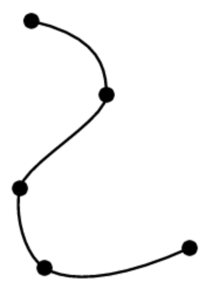
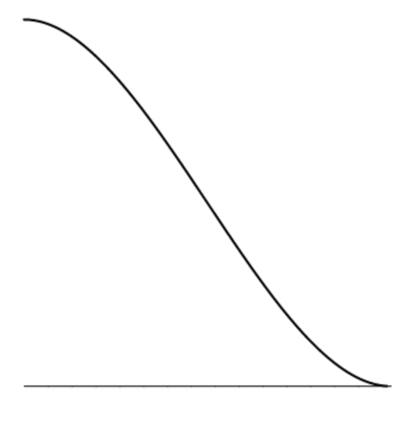
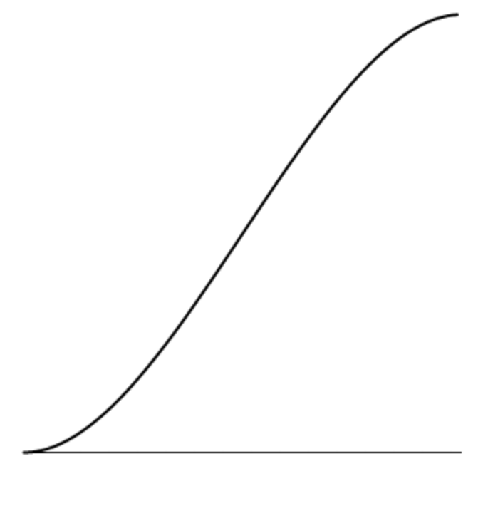
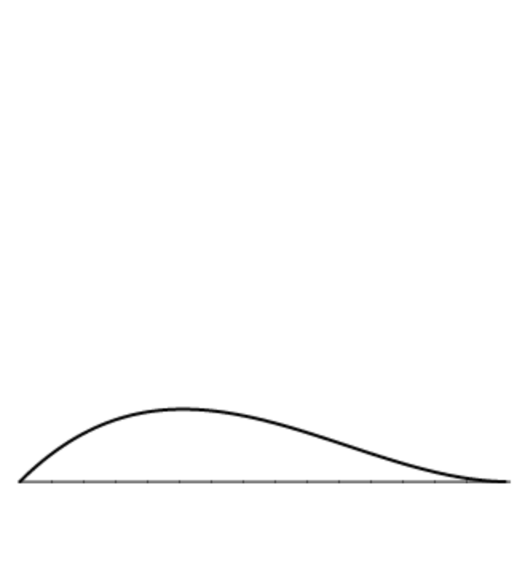
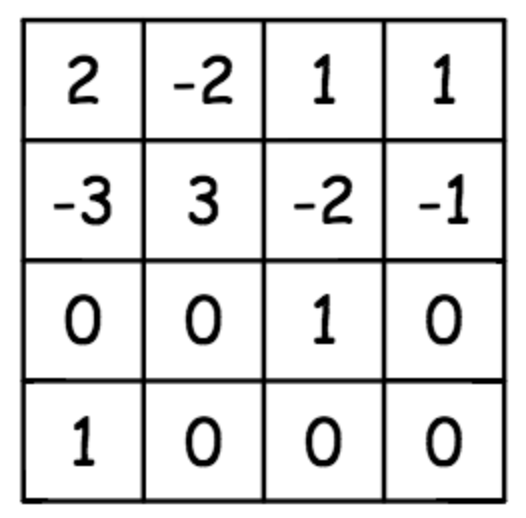
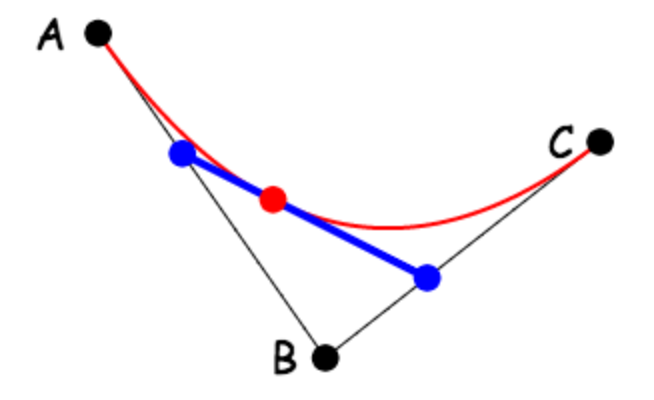
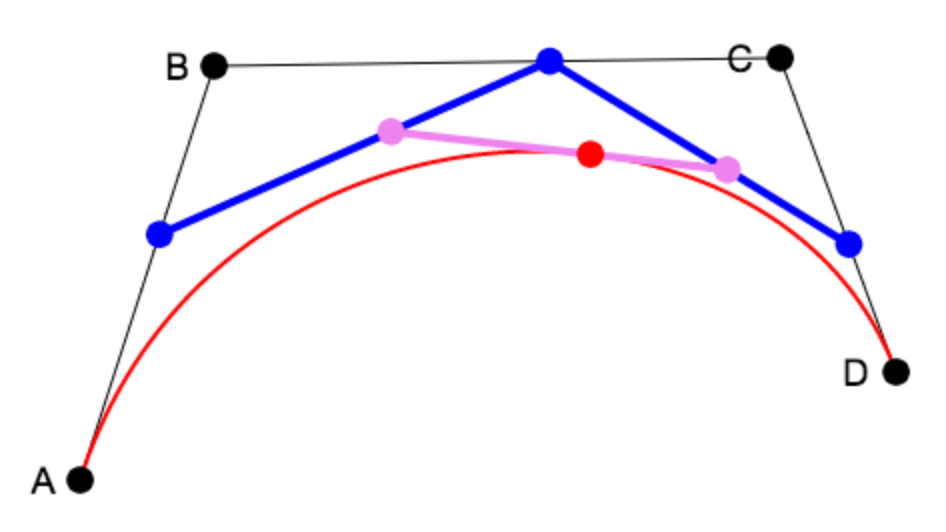

# 10 月 28 日课程笔记 -- 样条介绍

**样条**

> 在计算机图形学中，我们可能有很多原因要创建平滑可控的曲线。也许我们想创建一个有机形状，或者沿着连续路径动画某物。
> 
> 如右侧所示，我们可以通过将我们的光滑曲线分解为更简单的片段来实现这一点。
> 
> 如果我们将样条曲线看作是运动路径，那么每个片段都必须与其邻居匹配，无论是位置还是速率，这意味着对于每个坐标 x 和 y，我们需要四个值：开始和结束时的位置，以及开始和结束时的速率（或导数）。
> 
> 可以满足四个约束条件的最低阶多项式是立方多项式。因此，我们用参数 t 中的*参数立方*多项式来描述每个片段的 x 和 y 坐标：
> 
> > x = a[x]t³ + b[x]t² + c[x]t + d[x]
> > 
> > y = a[y]t³ + b[y]t² + c[y]t + d[y]
> > 
> 其中 (a[x]、b[x]、c[x]、d[x]) 和 (a[y]、b[y]、c[y]、d[y]) 是常值多项式系数，t 在曲线上沿着 t = 0 到 t = 1 变化。



**立方样条**

> 尽管从技术上讲，可以通过调整它们的多项式系数来设计立方样条，但实际上这通常不太有效。
> 
> 如右侧示例所示，立方多项式的形状与其四个系数的值之间没有直观的联系 -- 在这种情况下分别为 7.7、-11.7、5.0 和 -0.6，分别对应 t³、t²、t 和常数项。
> 
> 出于这个原因，我们需要一种更好的方式来指定立方样条曲线。与其使用 t³、t²、t 和 1 作为我们的四个*基础函数*，不如使用四个具有更直观几何意义的不同基础函数。
> 
> 在接下来的几节中，我们将看到两个不同的示例，展示这种替代基函数的用法。


**Hermite 样条，第 1 部分**

> 我们可以选择四个基函数，使我们能够独立控制在 t = 0 和 t = 1 时的位置，以及在 t = 0 和 t = 1 时的变化率。这被称为*Hermite*基础，以法国数学家的名字命名，他设计了它。
> 
> 如果我们希望在 t = 0 时位置为 A，在 t = 1 时位置为 B，在 t = 0 时率为 C，在 t = 1 时率为 D，我们可以使用右侧的四个函数来计算我们正在寻找的立方多项式。

**位置**



2t³ - 3t² + 1



-2t³ + 3t²

**变化率**



t³ - 2t² + t


t³ - t²

**Hermite 样条，第 2 部分**

> 由于这四个 Hermite 基多项式永远不会改变，而我们想要的立方多项式只是这四个多项式的加权和，因此我们可以将这个加权和表示为权重乘以一个矩阵的乘积，我们称之为*Hermite 矩阵*。
> 
> 换句话说，表达式：
> 
> > A (2t³ - 3t² + 1) + B (-2t³ + 3t²) + C (t³ - 3t² + t) + D (t³ - t²)
> > 
> 可以表示为矩阵向量乘积：
> 
> > a
> > 
> > b
> > 
> > c
> > 
> > d
> > 
> > = 
> > 
> > A
> > 
> > B
> > 
> > C
> > 
> > D
> > 
> > 将两端的位置和速率转换为所需的立方多项式：
> > 
> > > at³ + bt² + ct + d.
> > > 
> > **贝塞尔样条，第 1 部分**
> > 
> > > 艺术家和设计师通常发现通过移动点来创建样条比处理导数更方便。*贝塞尔*样条使得样条曲线的设计者可以这样工作。
> > > 
> > > 贝塞尔样条通过重复的线性插值来工作。例如，右侧的图像显示了贝塞尔样条的简化版本，使用三个关键点来指定一个参数化二次样条。
> > > 
> > > 请注意，曲线上的点是通过线性插值线性插值得到的。我们首先通过线性插值找到边界 AB 和 BC 上的点（以蓝点表示的点）：
> > > 
> > > > (1-t) A + t B
> > > > 
> > > > (1-t) B + t C
> > > > 
> > > 然后我们再次进行插值（以红点表示的点）：
> > > 
> > > > P = (1-t) ( (1-t) A + t B ) + t ( (1-t) B + t C )
> > > > 
> > > 如果我们将所有项相乘，我们得到：
> > > 
> > > > A (1-t)² + 2 B (1-t) t + C t²
> > > > 
> > > 注意，系数的权重（1 2 1）遵循帕斯卡三角形。
> > > 
> > 
> > 
> > **贝塞尔样条，第 2 部分**
> > 
> > > 现在更容易看出使用四个关键点的完整参数化立方贝塞尔样条的情况是什么：基本设置是线性插值的线性插值的线性插值。
> > > 
> > > 所以我们从蓝色的点开始：
> > > 
> > > > P = (1-t) A + t B
> > > > 
> > > > Q = (1-t) B + t C
> > > > 
> > > > R = (1-t) C + t D
> > > > 
> > > 当第一和第二项进行线性插值时，我们得到两个紫色的点：
> > > 
> > > > S = (1-t) P + t Q
> > > > 
> > > > T = (1-t) Q + t R
> > > > 
> > > 最后我们线性插值这两点：(1-t) S + t T
> > > 
> > > 当我们将方程写成关于我们原来的四个关键点 A、B、C 和 D 的形式时，权重形成了帕斯卡三角形的下一级（1 3 3 1）：
> > > 
> > > > A (1-t)³ + 3 B (1-t)² t + 3 C (1-t) t² + D t³
> > > > 
> > 
> > 
> > **贝塞尔样条，第 3 部分**
> > 
> > > 我们可以将上述多项式的项相乘，并按 t 的幂重新分组，得到：
> > > 
> > > > (-A + 3B - 3C + D) t³ + (3A - 6B + 3C) t² + (-3A + 3B) t + D
> > > > 
> > > 这使得很容易看出，就像埃尔米特样条的情况一样，贝塞尔样条具有一个特征矩阵，可以用来将上述多项式平移到标准的立方多项式，其中系数为 (a,b,c,d)：
> > > 
> > > > a
> > > > 
> > > > b
> > > > 
> > > > c
> > > > 
> > > > d
> > > > 
> > > > =  A
> > > > 
> > > > B
> > > > 
> > > > C
> > > > 
> > > > D
> > > > 
> > > 贝塞尔样条的一个强大特性是，A 和 B 之间的方向决定了 t=0 时样条曲线的方向，而 C 和 D 之间的方向决定了 t=1 时样条曲线的方向。
> > > 
> > > 这使得将样条端对端匹配起来变得很容易，从而得到的复合曲线具有连续的导数。
> > > 
> > **透视**
> > 
> > > 正如我们在课堂上提到的，您可以通过在执行视口变换之前执行以下操作来实现透视：
> > > 
> > > 1.  将所有顶点平移至(0,0,-f)，使得您的场景位于 z=-f 处，其中 f 是虚拟摄像机的“焦距”。
> > > 1.  
> > > 1.  对每个顶点应用以下变换：
> > > 1.  
> > >     > x → fx/z
> > >     > 
> > >     > y → fy/z
> > >     > 
> > >     > z → f/z
> > >     > 
> > > 正如我在课堂上提到的，我们知道上述第 2 步是一个线性变换，因为它等价于以下矩阵变换：
> > > 
> > > > 1 0 0 0 0 1 0 0 0 0 0 1 0 0 1/f 0
> > > > 
> > **对象层次结构**
> > 
> > > 本周的作业中，我不会要求您对对象层次结构做任何事情，但我希望您了解它。基本上，我们可以将整个可渲染场景描述为对象树，每个对象具有以下结构：
> > > 
> > > ```
> > >    Object3D
> > >       Geometry
> > >          vertices
> > > 	 edges or faces
> > >       Material
> > >       Matrix
> > >       Object3D children[...]
> > > 
> > > ```
> > > 
> > **作业，截止日期为 11 月 4 日星期三上课前**
> > 
> > > +   通过使用时间变化的样条曲线对您已经制作的形状进行动画处理，同时使用 Hermite 和 Bezier 技术。您可以使用样条曲线的值来输入到您已经实现的平移、旋转和缩放基元的参数中。
> > > +   
> > >     使用基于样条曲线的动画软件制作有趣和引人入胜的动画。进行透视。
> > >     
> > > +   创建您自己的曲线编辑器，以创建基于 Hermite 或 Bezier 的曲线。您的编辑器应允许用户添加、移动和删除关键点，并应允许用户指定两个相邻样条曲线是否具有匹配的导数。
> > > +   
> > >     使用您的编辑器创建有趣的形状，例如动物轮廓，字体字母，或者您认为很酷和有趣的东西。
