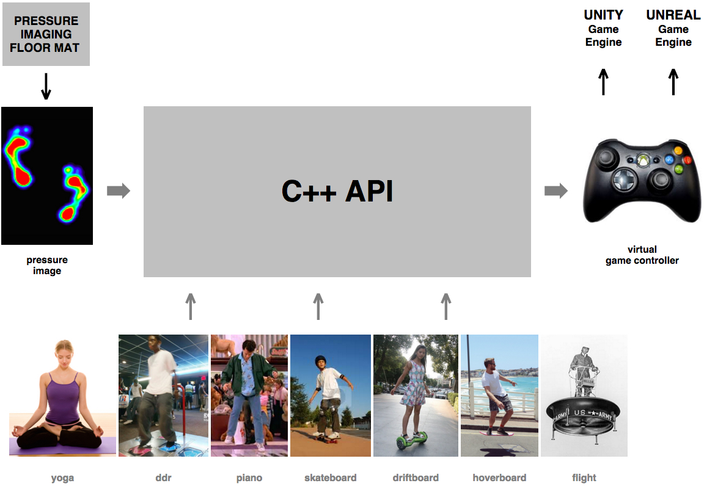

# 11 月 4 日课堂笔记--WebGL 简介

**WebGL 的简单示例**

> 如果你解压这个文件，并在浏览器中启动其 index.html 文件，你会看到我在课堂上展示的 webgl 示例的进展。
> 
> 这个例子没有相关的作业。我真的只是希望你学习它，这样你就能为我们下周要讲的内容做好准备。

**使用地垫 VR 控制器**

> 任何想要研究我在课堂最后描述的 VR 地垫导航界面的人，请给我发送电子邮件。
> 
> 这是我们正在努力做的事情的大致概念。你可能对额外的应用程序有一些很酷的想法：
> 
> 

**作业，截止到 11 月 11 日星期三课堂开始前**

> 这是一个“赶上进度”的周。如果你的作业还没有完成，请专注于在下周课程开始前赶上进度。
> 
> 如果你对材料有任何问题，请给我发送电子邮件，我会帮助你解决。
