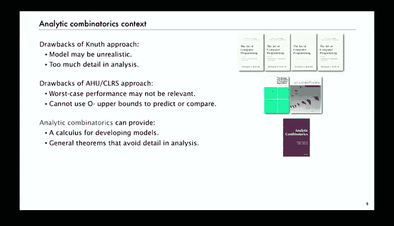

# 001：历史与动机 📜

在本节课中，我们将要学习算法分析的历史背景与核心动机。我们将了解为何需要分析算法，回顾该领域的发展历程，并探讨不同分析方法的优缺点，为后续深入学习奠定基础。

## 概述

算法分析是对大规模离散结构性质的定量研究。其主要应用之一便是分析算法本身。本节课程将首先探讨分析算法的原因，回顾其历史发展，并比较不同分析方法的优劣。

## 为何分析算法？

分析算法有多个明确的目的。

以下是其主要原因：

*   **问题与算法分类**：根据难度级别对问题和算法进行分类。
*   **性能预测与比较**：预测算法运行时间，并比较不同算法在特定任务上的优劣。
*   **深入理解与改进**：通过细致研究算法，更好地理解并改进其性能。
*   **智力挑战**：对许多人而言，算法分析比编程本身更具趣味性和挑战性。

## 历史背景

算法分析领域源远流长。早在19世纪，巴贝奇就预见到需要理解计算方法。他关心的是其机械分析引擎完成计算需要“转动曲柄”多少次，这与今天我们关心手机电量等稀缺资源消耗的问题本质相同。

图灵在20世纪40年代也指出，需要一种衡量计算过程工作量的方法，即使是很粗略的方法，例如统计各种基本操作的应用次数。

然而，该领域真正在20世纪60年代由高德纳奠定科学基础。他提出了一套相对直接的分析步骤，克服了人们此前认为程序资源消耗过于复杂而无法计算的观念。

## 高德纳的分析方法

高德纳的方法为算法分析提供了科学基础，使我们能够建立数学模型、提出性能假设并进行科学验证。

以下是其分析步骤：

1.  **实现与实验**：实现算法，通过运行实验理解其性能。
2.  **抽象与定义**：定义代表基本操作的未知量。
3.  **确定操作成本**：确定每个基本操作的成本。
4.  **建立输入模型**：为输入建立某种模型。
5.  **分析执行频率**：分析未知量的执行频率。
6.  **计算总运行时间**：将每个量的执行频率乘以其成本并求和，得到总运行时间。

这种方法优点显著，但也存在缺点。输入模型可能不切实际，且分析可能包含过多细节。后者正是解析组合数学试图解决的问题，即如何在保持结果准确的同时抑制细节。

## 理论算法分析的方法

为了应对高德纳方法的缺点，20世纪70年代至今，以《算法导论》等经典教材为代表的理论算法分析采用了不同策略。

以下是其核心思路：

*   **分析最坏情况成本**：这几乎将输入模型排除在考虑之外，旨在获得算法运行时间的**最坏情况保证**。
*   **使用大O记法**：仅寻求最坏情况成本的**上界**，以此简化分析细节。

这种方法非常成功，催生了一个算法设计的时代。其最终目标是开发**最优算法**，即最坏情况成本达到理论最低值。

然而，这种方法也有一个严重的缺点：通常**无法用于预测性能或比较算法**。这是一个常被忽视的基本事实。

## 方法比较：以排序为例

上一节我们介绍了理论算法分析的方法，本节我们来看看它的局限性在实际中的体现。

以下是快速排序和归并排序的对比：

*   **快速排序**：最坏情况比较次数为**二次方** `O(n²)`。
*   **归并排序**：最坏情况比较次数为**线性对数** `O(n log n)`，且被证明是**最优**的。

根据理论分类，归并排序优于快速排序。但问题在于，**实践中快速排序通常比归并排序快一倍，且仅使用一半空间**。哈希表与平衡二叉搜索树等也存在类似情况。

因此，结论是：**不能使用大O上界来预测性能或比较算法**。算法分析的意义正在于使我们能够做出精确的定量陈述，并能在实际实现中进行检验。

## 解析组合数学的定位

有了以上背景，我们现在可以将解析组合数学置于上下文中。

以下是不同方法的总结：

*   **高德纳方法缺点**：模型可能不现实；分析可能过于详细。
*   **理论算法分析方法缺点**：最坏情况性能可能不具相关性；无法用大O上界预测或比较性能。
*   **解析组合数学的贡献**：
    1.  提供建立模型的**演算工具**，帮助使用更复杂的模型来理解算法性能。
    2.  提供**通用定理**，使我们能在分析中避免过多细节。

在本课程的第一部分，我们将从基础数学开始，阐述解析组合数学是什么，并回顾算法分析与组合数学中的许多经典结果，为第二部分介绍该领域真正前沿的研究与发展做好准备。

## 总结

本节课中我们一起学习了算法分析的历史与动机。我们了解了分析算法的目的，回顾了从巴贝奇、图灵到高德纳的发展历程，比较了高德纳的详细分析方法与理论算法分析中关注最坏情况上界的方法各自的优缺点，并通过排序算法的例子指出了后者的局限性。最后，我们明确了解析组合数学在提供更精细建模工具和简化分析细节方面的定位，为后续课程内容做好了铺垫。