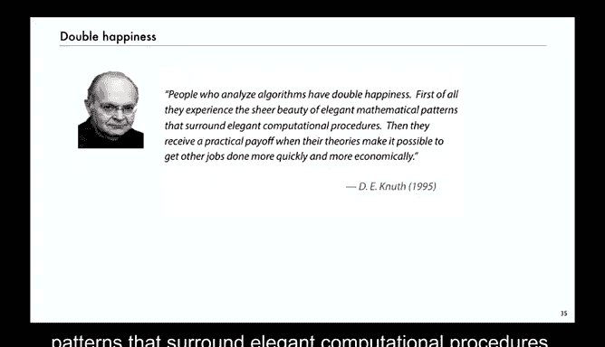

# 003：快速排序 🧮


在本节课中，我们将通过一个完整的例子来学习算法分析。我们将分析一个经典且应用广泛的排序算法——快速排序。我们将从代码出发，建立数学模型，推导其性能公式，并最终通过实验验证我们的理论。

## 概述

快速排序是一种基于“分治”思想的递归排序算法。其核心步骤是“分区”：选取一个基准元素，将数组划分为两部分，使得左侧所有元素小于等于基准，右侧所有元素大于等于基准。然后递归地对左右两部分进行排序。

以下是快速排序的核心代码框架（基于《算法》第4版）：
```java
public class Quick {
    private static int partition(Comparable[] a, int lo, int hi) {
        // 分区操作，返回基准元素的最终位置 j
        // 使得 a[lo..j-1] <= a[j] <= a[j+1..hi]
        // ...
    }

    private static void sort(Comparable[] a, int lo, int hi) {
        if (hi <= lo) return;
        int j = partition(a, lo, hi); // 分区
        sort(a, lo, j-1);             // 递归排序左半部分
        sort(a, j+1, hi);             // 递归排序右半部分
    }
}
```

## 建立分析模型

在分析算法之前，我们需要做出一些关键决策，以简化问题并聚焦于核心性能指标。

### 成本模型

我们选择**比较次数**作为成本模型。排序算法最频繁的操作就是比较两个元素。通过统计比较次数，我们可以得到一个与具体机器性能无关的抽象度量。我们假设比较次数 **C** 与运行时间 **T** 成正比，即 **T ~ aC**，其中 **a** 是依赖于机器和系统的常数。

### 输入模型

我们假设输入数组满足以下两个条件：
1.  **随机顺序**：数组元素的初始顺序是随机的。
2.  **键值互异**：所有元素的键值各不相同（为简化初始数学推导）。

## 分析快速排序

基于上述模型，我们来分析快速排序的性能。设数组有 **N** 个互异且随机排列的元素。令 **C(N)** 为快速排序对 **N** 个元素排序所需的**期望比较次数**。

### 分区操作的比较次数

首先，分析单次分区操作的比较次数。分区过程会扫描整个子数组，每个元素都会与基准元素比较一次。此外，当左右扫描指针交叉时，还会进行一次额外的比较。因此，对于一个大小为 **M** 的子数组，分区操作需要 **M+1** 次比较。

### 递归关系推导

快速排序是递归的。分区后，基准元素会落在某个位置 **k**（1 ≤ k ≤ N）。由于输入是随机顺序，基准元素是第 **k** 小的概率是 **1/N**。

*   如果基准是第 **k** 小的元素，则左子数组大小为 **k-1**，右子数组大小为 **N-k**。
*   排序总成本 = 分区成本 + 左子数组排序成本 + 右子数组排序成本。

由此，我们可以写出 **C(N)** 的递归关系式（又称递推关系）：
**C(N) = (N+1) + (1/N) * Σ [C(k-1) + C(N-k)]**，其中求和 **k** 从 1 到 N。
对于 **N=0** 或 **N=1**，我们定义 **C(0)=C(1)=0**。

这个公式将程序逻辑转化为了一个纯粹的数学问题。

## 求解递推关系

上一节我们得到了快速排序比较次数的递推关系。本节中，我们来看看如何求解这个数学问题。

### 简化递推式

首先，注意到公式中的两个和式 **C(k-1)** 和 **C(N-k)** 是对称的，它们遍历了相同的值 **C(0), C(1), ..., C(N-1)**。因此，我们可以将公式简化为：
**C(N) = (N+1) + (2/N) * Σ C(k)**，其中求和 **k** 从 0 到 N-1。

为了消除分母中的 **N**，我们将等式两边同时乘以 **N**：
**N C(N) = N(N+1) + 2 Σ C(k)**，求和 **k** 从 0 到 N-1。

### 消除求和项

接下来，我们设法消除求和符号。写出 **N-1** 时的对应等式：
**(N-1) C(N-1) = (N-1)N + 2 Σ C(k)**，求和 **k** 从 0 到 N-2。

用第一个等式减去第二个等式：
**N C(N) - (N-1) C(N-1) = [N(N+1) - (N-1)N] + 2 C(N-1)**

化简右边：
**N C(N) - (N-1) C(N-1) = 2N + 2 C(N-1)**

整理后得到一个更简洁的递推关系：
**N C(N) = (N+1) C(N-1) + 2N**

### 求解闭合形式

现在，我们求解这个递推关系的闭合形式（即用初等函数表示）。将等式两边同时除以 **N(N+1)**：
**C(N)/(N+1) = C(N-1)/N + 2/(N+1)**

这是一个关键步骤。现在等式右边第一项的形式与左边相同，只是 **N** 减少了1。我们可以反复应用这个关系，将其展开：
**C(N)/(N+1) = C(N-1)/N + 2/(N+1)**
**= [C(N-2)/(N-1) + 2/N] + 2/(N+1)**
**= ...**
**= C(0)/1 + 2 * Σ (1/(k+1))**，其中求和 **k** 从 1 到 N。

由于 **C(0)=0**，我们得到：
**C(N) = 2 (N+1) * Σ (1/(k+1))**，求和 **k** 从 1 到 N。
这等价于：
**C(N) = 2 (N+1) * (H_{N+1} - 1)**，其中 **H_M** 是第 **M** 个调和数：**H_M = 1 + 1/2 + 1/3 + ... + 1/M**。

### 近似解

调和数 **H_N** 可以用自然对数来近似：**H_N ~ ln N + γ**，其中 **γ ≈ 0.57721** 是欧拉常数。
将此近似代入公式，并忽略低阶项，我们得到快速排序期望比较次数的渐近表达式：
**C(N) ~ 2 N ln N ≈ 1.39 N log₂ N**

这意味着，快速排序的平均比较次数与 **N log N** 成正比，这是基于比较的排序算法最优的渐近复杂度。

## 验证与讨论

上一节我们通过数学推导得到了快速排序性能的公式。本节中，我们来看看如何验证这个模型，并探讨其实际意义。

### 数学验证

我们可以编写一个简单的程序，分别通过以下两种方式计算 **C(N)**：
1.  直接根据原始递推关系或简化后的递推关系进行计算。
2.  使用我们推导出的近似公式 **2 N ln N** 进行计算。

对于较大的 **N**（例如一百万），比较两者的结果，可以发现它们非常接近。这验证了我们数学推导的正确性。

### 实验验证

更重要的是，我们需要验证**输入模型**是否合理。我们可以实际运行快速排序程序数百万次，记录每次排序的比较次数，并计算平均值。
实验结果表明，当输入是随机且互异的数组时，实际测量的平均比较次数与我们的理论公式 **C(N) ~ 2 N ln N** 高度吻合。这证明了我们的模型是有效的。

### 性能预测

拥有一个准确的数学模型，使我们能够进行强大的性能预测。假设我们在某台机器上运行快速排序，处理一个大小为 **N** 的随机数组，测得时间为 **T**。
根据模型 **T ~ a * (2 N ln N)**，我们可以估算出常数 **a**。
进而，我们可以预测处理一个 **10N** 大小数组所需的时间大约为 **T * (10 ln(10N) / ln N) ≈ T * 10 * (1 + 1/ln N)**。随着 **N** 增大，这个因子趋近于10。
这种预测能力对于系统设计和资源规划至关重要。

### 模型局限性与改进

我们的初始模型假设键值互异。在实际应用中，经常会出现大量重复键的情况。原始的快速排序算法在处理重复键时性能会下降。
为此，研究者们（如 Jon Bentley）提出了改进方案，例如“三向切分”的快速排序。这种算法将数组分为“小于基准”、“等于基准”、“大于基准”三部分，能高效处理重复键。
分析这种变体算法需要更复杂的模型，但原理是相同的：建立成本模型和输入模型，推导递推关系，求解并验证。这体现了算法分析是一个迭代和深入的过程。



## 总结


本节课中，我们一起学习了算法分析的一个完整示例——快速排序。
我们从算法代码出发，建立了以**比较次数**为成本、以**随机互异数组**为输入的模型。
通过数学推导，我们将递归程序转化为递推关系 **C(N) = (N+1) + (2/N) Σ C(k)**，并成功求解出其渐近解 **C(N) ~ 2 N ln N**。
我们通过编程计算和实际运行实验两种方式验证了数学模型的正确性。
最后，我们探讨了该模型在性能预测方面的强大能力，以及面对实际数据（如重复键）时模型的局限性与改进方向。
这个例子充分展示了算法分析的双重魅力：它既包含优雅的数学模式，又能产生巨大的实际效用，指导我们编写出更高效、更可靠的程序。